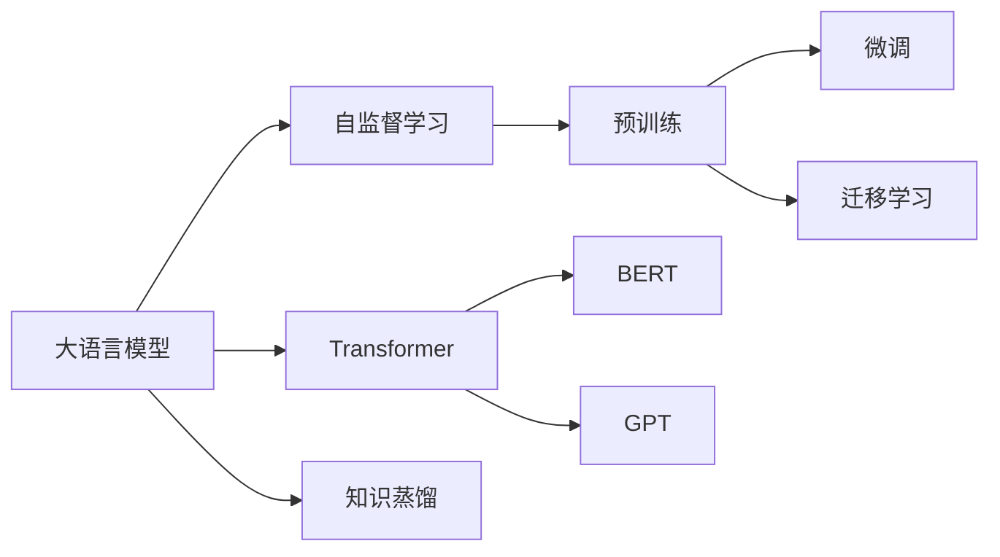

# 大语言模型应用指南：神经网络中的自监督学习

关键词：大语言模型、自监督学习、神经网络、预训练、迁移学习、transformer、BERT、GPT、ChatGPT

## 1. 背景介绍
### 1.1 问题的由来
随着人工智能技术的飞速发展,自然语言处理(NLP)领域取得了突破性的进展。传统的 NLP 任务如文本分类、命名实体识别、机器翻译等,都需要大量的人工标注数据来训练模型。但是人工标注数据不仅耗时耗力,而且难以获取,这极大地限制了 NLP 技术的应用。近年来,大语言模型(Large Language Model,LLM)的出现为 NLP 领域带来了革命性的变化。LLM 通过在海量无标注文本数据上进行自监督学习(Self-supervised Learning),无需人工标注就可以学习到语言的内在规律和表示,为下游任务提供了更好的初始化参数。这种"预训练+微调"的范式极大地提升了 NLP 任务的性能,同时降低了对标注数据的依赖。

### 1.2 研究现状 
目前,以 BERT、GPT、T5 等为代表的大语言模型已经在学术界和工业界得到了广泛应用。谷歌的 BERT 模型通过双向 Transformer 编码器学习上下文表示,在 11 项 NLP 任务上取得了 SOTA 的成绩。OpenAI 的 GPT 系列模型采用单向 Transformer 解码器生成文本,展现了惊人的写作和对话能力。特别是 GPT-3 模型,其参数量高达 1750 亿,在零样本和少样本学习上表现出色。最新的 ChatGPT 更是一举成为爆款应用,掀起了 AIGC 的热潮。

### 1.3 研究意义
大语言模型的研究对于推动人工智能的发展具有重要意义:

(1) 提升 NLP 任务性能。预训练的语言模型可以作为下游任务的特征提取器或初始化参数,显著提升模型性能,降低对标注数据的需求。

(2) 拓展 NLP 应用场景。基于大语言模型的文本生成、对话、问答等应用大大拓宽了 NLP 技术的应用边界,催生了 AIGC 等新兴领域。

(3) 探索通用人工智能。大语言模型展现了一定的常识推理、多任务学习的能力,为实现通用人工智能(AGI)提供了新的思路。

(4) 促进人机交互。自然流畅的语言交互是实现高效人机协作的关键,大语言模型为构建更加智能化的人机交互系统奠定了基础。

### 1.4 本文结构
本文将全面介绍大语言模型的基本原理和应用实践。第2部分阐述大语言模型涉及的核心概念。第3部分详细讲解大语言模型的训练算法。第4部分介绍大语言模型常用的数学模型和公式。第5部分通过代码实例演示如何开发基于大语言模型的应用。第6部分总结大语言模型的典型应用场景。第7部分推荐相关的学习资源和开发工具。第8部分展望大语言模型的未来发展方向和挑战。第9部分为常见问题解答。

## 2. 核心概念与联系

- 大语言模型(Large Language Model,LLM):指参数量巨大(一般在数亿到千亿量级)的深度学习语言模型,通过在大规模无标注文本语料上进行自监督学习得到。代表模型有 BERT、GPT、T5、PaLM 等。

- 自监督学习(Self-supervised Learning):一种不需要人工标注数据的机器学习范式。通过设计辅助任务(pretext task),让模型在原始数据上自己构建监督信号进行训练。在 CV 领域的代表方法有图像着色、拼图还原等,在 NLP 领域的代表方法有语言模型、掩码语言模型等。

- 预训练(Pre-training):指在大规模无标注数据上进行自监督学习,得到初步的模型参数。预训练阶段通常使用通用的 Transformer 结构,可以充分利用无标注数据学习语言的基本规律。预训练得到的模型可以作为下游任务的初始化参数,大大加速收敛和提升性能。

- 微调(Fine-tuning):指在预训练模型的基础上,使用少量标注数据对模型进行针对性训练,使其适应特定任务。微调阶段通常只更新模型的部分参数,以防止过拟合。微调可以显著提升模型在下游任务上的表现,是迁移学习的重要手段。

- 迁移学习(Transfer Learning):指在源任务上学习到的知识迁移到目标任务,提升目标任务的学习效率和性能。大语言模型通过两阶段的"预训练+微调"实现了从通用语言知识到特定任务知识的迁移。

- Transformer:一种基于自注意力机制(Self-attention)的神经网络结构,广泛应用于大语言模型。Transformer 通过 Self-attention 建模任意长度的序列依赖,并行计算效率高,易于 GPU 加速。Transformer 的编码器和解码器结构灵活,可以支持各种 NLP 任务。

- BERT(Bidirectional Encoder Representations from Transformers):谷歌提出的基于 Transformer 编码器的大语言模型,通过掩码语言模型(Masked Language Model,MLM)和句子连贯性判别(Next Sentence Prediction,NSP)两个自监督任务进行预训练。BERT 在多个 NLP 任务上取得了 SOTA 的成绩,奠定了预训练语言模型的典范。

- GPT(Generative Pre-trained Transformer):OpenAI 提出的基于 Transformer 解码器的大语言模型,通过自回归语言模型(Auto-regressive Language Model)进行预训练。GPT 擅长文本生成和对话,代表了语言模型在生成式任务上的巨大潜力。GPT-3 更是实现了令人惊叹的零样本和少样本学习能力。

- 知识蒸馏(Knowledge Distillation):一种将大模型的知识压缩到小模型的技术。通过让小模型学习大模型的软目标(soft target),可以在保持性能的同时大幅减小模型体积,便于工程落地。

大语言模型涉及的核心概念之间有着紧密的联系。自监督学习是大语言模型得以训练的关键,Transformer 是构建大语言模型的基础架构,预训练使大语言模型学习到通用语言知识,微调使大语言模型适应特定任务,迁移学习是大语言模型实现知识迁移的机制,BERT 和 GPT 是大语言模型的代表范式,知识蒸馏则是大语言模型走向工程应用的重要手段。这些概念共同构成了大语言模型的理论和实践体系。

## 3. 核心算法原理 & 具体操作步骤
### 3.1 算法原理概述
大语言模型的核心是通过自监督学习从无标注文本数据中学习语言知识。具体来说,主要采用以下两类自监督任务:

(1) 自回归语言模型(Auto-regressive Language Model)。给定前面的词,预测下一个词的概率。这可以用条件概率公式表示:

$P(w_1, w_2, ..., w_n) = \prod_{i=1}^n P(w_i|w_1, w_2, ..., w_{i-1})$

其中 $w_i$ 表示句子中的第 $i$ 个词。通过最大化这一条件概率,语言模型可以学习到词与词之间的依赖关系。GPT 系列模型主要采用这种自回归任务。

(2) 掩码语言模型(Masked Language Model,MLM)。随机掩盖句子中的部分词,让模型根据上下文预测被掩盖的词。这可以用如下公式表示:

$P(w_t|w_1, ..., w_{t-1}, w_{t+1}, ..., w_n) = softmax(h_t W_e + b_e)$

其中 $w_t$ 为被掩盖的词,$h_t$ 为 $w_t$ 位置的隐层状态,$W_e$ 和 $b_e$ 为输出层参数。通过这种双向建模,MLM 可以学习到更丰富的上下文信息。BERT 模型主要采用这种掩码语言模型任务。

除了语言建模任务外,有的大语言模型还会引入句子级别的自监督任务,如 BERT 中的 NSP。通过联合多个任务训练,可以进一步提升模型性能。

在预训练阶段,大语言模型使用 Transformer 编码器或解码器作为骨干网络。前者主要用于自然语言理解任务,后者主要用于自然语言生成任务。Transformer 的核心是自注意力机制(Self-attention),可以建模任意长度的序列依赖。自注意力的计算公式为:

$Attention(Q,K,V) = softmax(\frac{QK^T}{\sqrt{d_k}})V$

其中 $Q$,$K$,$V$ 分别为查询向量、键向量、值向量,$d_k$ 为 $K$ 的维度。通过自注意力,每个位置的表示都会融合其他位置的信息,从而实现全局建模。

在微调阶段,预训练好的大语言模型被应用于下游任务。根据任务的不同,可以采取不同的微调策略:

(1) 特征提取。将预训练模型作为特征提取器,固定其参数,在其输出上接新的任务层进行训练。这种方式计算效率高,但特征可能与任务不够匹配。

(2) 全参数微调。将预训练模型所有参数与任务层一起进行端到端的微调。这种方式可以最大限度地利用预训练知识,但计算开销大,容易过拟合。

(3) 部分参数微调。只微调预训练模型的部分参数(如最后几层),其余参数保持固定。这是特征提取和全参微调之间的折中。

(4) Prompt 微调。将任务转化为预训练阶段的语言建模任务,通过设计输入模板(prompt)来引导模型进行预测。这种零样本/少样本学习方式不需要重新训练模型参数。

总之,大语言模型通过自监督学习、Transformer 结构、预训练微调等关键技术,在 NLP 领域取得了广泛成功。

### 3.2 算法步骤详解
下面以 BERT 为例,详细介绍大语言模型的训练和应用步骤。

(1) 数据准备
- 收集大规模无标注文本语料,如维基百科、图书语料等。
- 对文本进行清洗和预处理,如去除特殊符号、分词、 Tokenization 等。
- 将词转化为词典中的 id,构建成模型可以直接使用的数据格式。

(2) 模型构建
- 根据 Transformer 编码器结构搭建 BERT 模型。主要包括词嵌入层、位置嵌入层、多层 Transformer Block、 Pooling 层、 MLM 和 NSP 任务层等。
- 词嵌入层将词 id 映射为稠密向量。位置嵌入层编码词的位置信息。Transformer Block 通过自注意力和前馈网络学习上下文表示。Pooling 层获取句子级别的表示用于下游任务。
- MLM 任务层通过 Softmax 预测被掩码词的概率分布。NSP 任务层通过 Sigmoid 预测两个句子是否连贯。

(3) 预训练
- 根据掩码概率(如15%)随机掩盖词,并替换为 [MASK] 符号或其他词。
- 以一定概率(如50%)随机组合或交换句子对,构建 NSP 任务的正负样本。
- 使用大规模语料进行多轮(如40轮)预训练。每次迭代随机采样一批样本,前向计算 MLM 和 NSP 的损失,反向传播更新模型参数。
- 预训练结束后,保存模型参数用于下游任务微调。

(4) 微调
- 根据下游任务的输入输出格式,在 BERT 的基础上添加任务特定