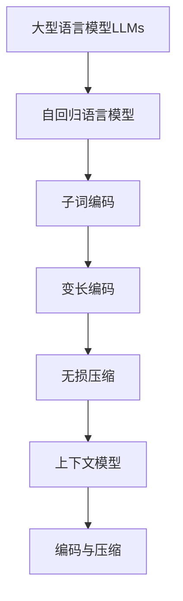

以下是《大语言模型应用指南：编码与无损压缩》的正文部分：

# 大语言模型应用指南：编码与无损压缩

## 1. 背景介绍

### 1.1 问题的由来

随着人工智能技术的不断发展,大型语言模型(Large Language Models, LLMs)在自然语言处理领域取得了令人瞩目的成就。这些模型能够通过训练海量的文本数据,学习语言的语义和上下文关系,从而生成看似人类水平的自然语言输出。然而,训练和部署这些庞大的语言模型需要耗费大量的计算资源,并且生成的文本输出通常存在一定的冗余和重复。因此,如何高效地编码和压缩这些大型语言模型及其输出,成为了一个亟待解决的问题。

### 1.2 研究现状

目前,编码和压缩大型语言模型及其输出的研究主要集中在以下几个方面:

1. **模型压缩技术**:通过剪枝、量化、知识蒸馏等方法压缩模型参数,降低模型的存储和计算开销。
2. **上下文压缩**:利用上下文信息,对生成的文本进行无损压缩,减小输出文件的体积。
3. **子词编码**:将词语拆分为子词单元,降低词表大小,提高编码效率。
4. **基于transformer的编码器-解码器架构**:利用transformer的自注意力机制,对输入和输出进行并行编码和解码,提高处理效率。

### 1.3 研究意义

高效的编码和压缩技术对于大型语言模型的实际应用至关重要,具有以下重要意义:

1. **降低计算和存储开销**:压缩后的模型参数和输出文件体积更小,可以减少计算资源的消耗,降低部署和传输的成本。
2. **提高处理效率**:合理的编码方式可以加快模型的推理速度,提高语言生成的实时性。
3. **促进模型的普及应用**:压缩和高效编码技术有助于将大型语言模型应用于更多的场景,如移动设备、嵌入式系统等。

### 1.4 本文结构

本文将全面介绍大型语言模型编码与无损压缩的核心概念、算法原理、数学模型、项目实践、应用场景等内容。文章结构如下:

```
1. 背景介绍
2. 核心概念与联系
3. 核心算法原理与具体操作步骤
4. 数学模型和公式详细讲解与举例说明
5. 项目实践:代码实例和详细解释说明
6. 实际应用场景
7. 工具和资源推荐
8. 总结:未来发展趋势与挑战
9. 附录:常见问题与解答
```

## 2. 核心概念与联系

在介绍大型语言模型编码与无损压缩的核心算法之前,我们先来了解一些重要的相关概念:

1. **大型语言模型(LLMs)**:通过训练大量文本数据而构建的庞大神经网络模型,能够生成看似人类水平的自然语言输出。常见的LLMs包括GPT、BERT、XLNet等。

2. **自回归语言模型**:一种特殊的语言模型,它根据之前生成的单词序列来预测下一个单词,常用于文本生成任务。GPT就是一种自回归语言模型。

3. **子词编码**:将单词拆分为更小的子词单元,用于构建词汇表。这种方法可以降低词汇表的大小,提高编码效率。常用的子词算法包括BPE、WordPiece等。

4. **变长编码**:一种熵编码方法,根据符号出现的概率分配更短或更长的编码,从而达到压缩的目的。常见的变长编码算法有霍夫曼编码、算术编码等。

5. **无损压缩**:一种数据压缩方法,能够在解压缩后完全恢复原始数据,不会导致任何信息损失。常用于文本、程序等数据的压缩。

6. **上下文模型**:利用上下文信息对数据进行建模和压缩。在文本压缩中,可以利用单词之间的上下文关系来提高压缩比。

这些概念相互关联,共同构建了大型语言模型编码与无损压缩的理论基础。下面我们将详细介绍其核心算法原理。



## 3. 核心算法原理与具体操作步骤

### 3.1 算法原理概述

大型语言模型编码与无损压缩的核心算法主要包括以下几个部分:

1. **子词分词算法**:将原始文本拆分为子词序列,降低词汇表大小,提高编码效率。
2. **子词编码算法**:将子词序列编码为一个个数字ID,作为语言模型的输入。
3. **自回归语言模型**:基于transformer的编码器-解码器架构,对输入的子词ID序列进行建模和生成。
4. **变长熵编码算法**:对语言模型生成的输出进行无损压缩编码,降低存储和传输开销。
5. **上下文模型**:利用上下文信息对压缩数据进行建模,进一步提高压缩比。

这些算法环环相扣,共同实现了大型语言模型高效的编码和无损压缩。下面我们将详细介绍每个部分的具体操作步骤。

### 3.2 算法步骤详解

#### 3.2.1 子词分词算法

常用的子词分词算法包括BPE(Byte Pair Encoding)和WordPiece。以BPE算法为例,其步骤如下:

1. 统计语料库中所有字符的出现频率。
2. 将所有字符视为单个子词,构建初始子词表。
3. 遍历语料库,找到频率最高的两个相邻字符对,将它们合并为一个新的子词,加入子词表。
4. 重复步骤3,直到达到期望的子词表大小或满足其他终止条件。
5. 使用最终的子词表对原始文本进行分词。

通过这种方式,BPE算法能够有效地将单词拆分为子词序列,降低词汇表的大小。

#### 3.2.2 子词编码算法

将子词序列映射为数字ID的过程称为子词编码。常用的编码方法包括:

1. **索引编码**:为每个子词分配一个唯一的数字ID,构建子词到ID的映射表。
2. **One-Hot编码**:将每个子词表示为一个高维稀疏向量,向量的维度等于子词表大小。
3. **词嵌入编码**:将每个子词映射为一个固定长度的密集向量,作为语言模型的输入。

其中,索引编码是最常用和高效的编码方法。

#### 3.2.3 自回归语言模型

自回归语言模型的核心是transformer的编码器-解码器架构,如下图所示:


1. **编码器**:接收编码后的子词ID序列作为输入,利用多头自注意力机制捕获输入序列的上下文信息,生成编码向量。
2. **解码器**:基于编码向量和前一个时间步的输出,通过自注意力和交叉注意力机制预测下一个子词的概率分布。
3. **输出序列**:根据概率分布对子词进行采样,生成最终的输出序列。

通过这种自回归的方式,语言模型能够有条不紊地生成上下文相关的自然语言输出。

#### 3.2.4 变长熵编码算法

对于语言模型生成的子词ID序列,我们可以使用变长熵编码算法(如霍夫曼编码、算术编码等)进行无损压缩,从而降低存储和传输开销。以霍夫曼编码为例,其步骤如下:

1. 统计子词ID序列中每个符号的出现频率。
2. 根据符号频率构建霍夫曼树,为每个符号分配一个前缀码。
3. 遍历子词ID序列,将每个符号替换为其对应的前缀码。
4. 将编码后的比特流输出为压缩文件。

通过这种变长编码方式,出现频率高的符号将被分配更短的编码,从而达到压缩的目的。

#### 3.2.5 上下文模型

上下文模型利用上下文信息对压缩数据进行建模,从而进一步提高压缩比。常用的上下文模型包括:

1. **n-gram模型**:基于n个相邻符号的组合来预测下一个符号的概率。
2. **有限状态熵编码器(FSE)**:将数据流视为一个有限状态机,根据当前状态和输入符号来确定编码。
3. **上下文混合模型**:将多个上下文模型的预测结果进行加权融合。

通过上下文建模,压缩算法能够更好地利用数据中的冗余信息,从而获得更高的压缩比。

### 3.3 算法优缺点

上述编码与无损压缩算法具有以下优缺点:

**优点**:

1. 高效编码:子词分词和编码算法能够降低词汇表大小,提高编码效率。
2. 高质量生成:自回归语言模型能够生成上下文相关、质量较高的自然语言输出。
3. 高压缩比:变长熵编码和上下文模型能够实现较高的无损压缩比。
4. 通用性强:这些算法可以应用于不同类型的大型语言模型和自然语言生成任务。

**缺点**:

1. 计算开销大:训练大型语言模型需要耗费大量的计算资源。
2. 延迟较高:自回归生成方式导致了一定的延迟,不适合对实时性要求很高的场景。
3. 上下文长度限制:transformer模型的自注意力机制对输入序列长度有一定限制。
4. 压缩时间开销:压缩过程需要一定的时间开销,不适合对时间要求很高的实时压缩场景。

### 3.4 算法应用领域

大型语言模型编码与无损压缩算法可以应用于以下领域:

1. **自然语言生成**:用于生成高质量的文本内容,如新闻报道、小说创作、对话系统等。
2. **机器翻译**:将一种语言的文本翻译成另一种语言。
3. **文本摘要**:自动生成文本的摘要或概括。
4. **问答系统**:根据问题生成相关的答复。
5. **代码生成**:自动生成计算机程序代码。
6. **语音识别**:将语音转录为文本。

除了自然语言处理领域,这些算法也可以应用于其他需要高效编码和压缩的领域,如多媒体数据压缩、基因组数据压缩等。

## 4. 数学模型和公式详细讲解与举例说明

### 4.1 数学模型构建

在介绍具体的数学模型之前,我们先来了解一下自回归语言模型的基本概念。

自回归语言模型旨在学习一个条件概率分布 $P(x_t|x_{<t})$,其中 $x_t$ 表示当前时间步的输出符号,而 $x_{<t}$ 表示之前的输出序列。通过最大化该条件概率的对数似然,模型可以生成与训练数据相似的序列。

对于长度为 $T$ 的序列 $\boldsymbol{x}=(x_1,x_2,\dots,x_T)$,其对数似然可以表示为:

$$\log P(\boldsymbol{x})=\sum_{t=1}^T\log P(x_t|x_{<t})$$

我们的目标是最大化这个对数似然,从而获得能够很好地拟合训练数据的模型参数。

### 4.2 公式推导过程

#### 4.2.1 自注意力机制

transformer模型中的自注意力机制是计算输入序列元素之间的相关性的关键。给定一个长度为 $n$ 的序列 $\boldsymbol{x}=(x_1,x_2,\dots,x_n)$,其中每个 $x_i