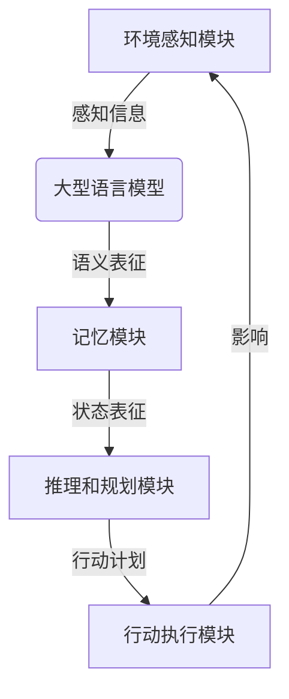

# 大语言模型应用指南：自主Agent系统

## 1. 背景介绍

### 1.1 问题的由来

在过去几年中,大型语言模型(Large Language Models, LLMs)取得了令人瞩目的进展,展现出惊人的语言理解和生成能力。这些模型通过在海量文本数据上进行预训练,学习到了丰富的语义知识和上下文信息,使它们能够在各种自然语言处理任务中取得出色表现。

然而,尽管 LLMs 拥有强大的语言能力,但它们在很大程度上仍然是被动的、无意识的系统,缺乏主动性和自主决策能力。它们无法根据自身的目标和偏好进行推理和决策,也无法与外部世界进行有意义的交互。这种局限性严重阻碍了 LLMs 在更广泛的应用场景中的应用,特别是在需要自主智能体(Autonomous Agents)的领域。

为了克服这一挑战,研究人员提出了将 LLMs 与其他模块(如记忆模块、规划模块等)相结合,构建具有自主性和交互能力的智能Agent系统。这种系统不仅能够理解和生成自然语言,还能够根据自身的目标和知识库进行决策和规划,并与外部环境进行交互。

### 1.2 研究现状

目前,将 LLMs 应用于自主 Agent 系统的研究仍处于起步阶段。一些先驱性的工作探索了将 LLMs 与记忆模块、规划模块等组件相结合的方法,以赋予 LLMs 一定程度的自主性和交互能力。然而,这些初步尝试仍然存在诸多局限性,例如:

1. 模块之间的交互和协调机制尚不成熟,导致系统行为缺乏一致性和连贯性。
2. 现有的记忆模块和规划模块往往过于简单,无法支持复杂的推理和决策过程。
3. 系统缺乏对外部环境的感知和理解能力,无法与现实世界进行有效交互。
4. 缺乏明确的评估标准和测试框架,难以客观评估系统的自主性和智能程度。

### 1.3 研究意义

构建自主的 Agent 系统对于实现通用人工智能(Artificial General Intelligence, AGI)至关重要。相比于专门的任务系统,自主 Agent 能够根据自身的目标和偏好进行推理和决策,并与外部环境进行灵活的交互,这种能力更加接近于人类智能。

此外,自主 Agent 系统在诸多实际应用领域也具有巨大的潜力,例如:

1. **智能助手**: 能够根据用户的需求和偏好提供个性化的服务和建议。
2. **决策支持系统**: 在复杂的决策场景中,能够根据多种因素进行综合分析和决策。
3. **自动化系统**: 在制造、物流等领域,能够自主规划和执行任务流程。
4. **智能机器人**: 能够感知环境、规划路径并执行相应的动作。
5. **游戏 AI**: 能够根据游戏规则和状态做出合理的策略决策。

因此,研究如何将大型语言模型应用于自主 Agent 系统,不仅具有重要的理论意义,也蕴含着广阔的应用前景。

### 1.4 本文结构

本文将系统地介绍如何将大型语言模型应用于自主 Agent 系统的构建。全文共分为八个部分:

1. **背景介绍**: 阐述问题的由来、研究现状和意义,并概述本文的结构安排。
2. **核心概念与联系**: 介绍自主 Agent 系统的核心概念,并探讨大型语言模型在其中的作用和联系。
3. **核心算法原理与具体操作步骤**: 详细阐述自主 Agent 系统中的核心算法原理,并给出具体的操作步骤。
4. **数学模型和公式详细讲解与举例说明**: 构建自主 Agent 系统所需的数学模型,并推导相关公式,辅以案例分析加深理解。
5. **项目实践:代码实例和详细解释说明**: 提供一个自主 Agent 系统的实现案例,包括开发环境搭建、源代码解读和运行结果展示。
6. **实际应用场景**: 探讨自主 Agent 系统在智能助手、决策支持、自动化、机器人和游戏 AI 等领域的应用前景。
7. **工具和资源推荐**: 推荐相关的学习资源、开发工具、论文文献等,方便读者进一步学习和实践。
8. **总结:未来发展趋势与挑战**: 总结研究成果,并展望自主 Agent 系统的发展趋势和面临的挑战。

## 2. 核心概念与联系

在探讨如何将大型语言模型应用于自主 Agent 系统之前,我们需要先了解一些核心概念。

### 2.1 自主智能体(Autonomous Agent)

自主智能体是一种能够感知环境、持有目标驱动、做出决策并在环境中采取行动的系统。一个理想的自主智能体应当具备以下几个关键能力:

1. **感知能力(Perception)**: 从环境中获取信息,构建对环境的表征。
2. **表征和推理能力(Representation and Reasoning)**: 基于感知信息和内部知识,对环境状态进行建模和推理。
3. **规划和决策能力(Planning and Decision Making)**: 根据目标和推理结果,制定行动计划并做出决策。
4. **行动能力(Action)**: 在环境中执行规划的行动,并影响环境的演化。
5. **学习能力(Learning)**: 从过往经验中积累知识,不断优化自身的表征、推理和决策过程。

### 2.2 大型语言模型(Large Language Models, LLMs)

大型语言模型是一种通过在大规模文本数据上进行预训练而获得通用语言理解和生成能力的深度学习模型。这些模型通常采用 Transformer 等注意力机制架构,能够有效捕获文本中的长程依赖关系和语义信息。

目前,一些广为人知的大型语言模型包括 GPT-3、BERT、XLNet、ALBERT 等。这些模型展现出了惊人的语言能力,在自然语言处理的各种任务中取得了卓越的表现,如文本生成、机器翻译、问答系统等。

### 2.3 大型语言模型在自主Agent系统中的作用

虽然大型语言模型本身无法直接作为一个完整的自主智能体,但它们在构建自主 Agent 系统中扮演着至关重要的角色。具体来说,LLMs 可以为自主 Agent 系统提供以下核心能力:

1. **自然语言理解(Natural Language Understanding, NLU)**: 将环境中的文本信息转换为结构化的语义表征,为推理和决策过程提供基础。
2. **自然语言生成(Natural Language Generation, NLG)**: 将推理和决策的结果转换为自然语言形式,用于与人类或其他智能体进行交互和指令输出。
3. **知识库(Knowledge Base)**: 大型语言模型在预训练过程中获得了丰富的语义知识和常识信息,可以为推理和决策过程提供有力支持。
4. **推理和决策(Reasoning and Decision Making)**: 通过对话式交互,LLMs 可以进行一定程度的推理和决策,为更复杂的规划模块提供有价值的输入。

因此,将大型语言模型与其他模块(如感知模块、记忆模块、规划模块等)相结合,可以构建出具有感知、推理、规划和交互能力的自主 Agent 系统。

### 2.4 自主Agent系统的典型架构

一个典型的自主 Agent 系统通常由以下几个核心模块组成:

1. **环境感知模块(Environment Perception Module)**: 从环境中获取原始数据(如图像、文本等),并进行预处理和特征提取。
2. **大型语言模型(Large Language Model)**: 对文本信息进行自然语言理解,将其转换为语义表征,并与其他模态信息进行融合。
3. **记忆模块(Memory Module)**: 维护 Agent 的内部状态表征,包括当前环境状态、历史交互记录、目标等。
4. **推理和规划模块(Reasoning and Planning Module)**: 基于状态表征,进行逻辑推理和行动规划,输出行动计划。
5. **行动执行模块(Action Execution Module)**: 根据行动计划,在环境中执行相应的操作,并影响环境的演化。

各个模块通过紧密协作,实现了 Agent 系统的感知、推理、规划和行动的闭环过程。其中,大型语言模型作为关键的语义理解和生成模块,为整个系统提供了有力的语言能力支持。

## 3. 核心算法原理与具体操作步骤

在自主 Agent 系统中,核心算法主要包括以下几个方面:

1. 基于大型语言模型的自然语言理解算法
2. 记忆模块的设计与更新算法
3. 推理和规划算法
4. 行动执行与环境交互算法

### 3.1 算法原理概述

#### 3.1.1 基于大型语言模型的自然语言理解

自然语言理解是自主 Agent 系统的基础,它将环境中的文本信息转换为结构化的语义表征,为后续的推理和决策过程提供支持。

大型语言模型由于其强大的语言建模能力,可以有效地捕获文本中的语义信息和上下文依赖关系。常见的自然语言理解算法包括:

1. **基于 Transformer 的编码器模型(如 BERT)**: 对输入文本进行双向编码,产生上下文敏感的词向量表征。
2. **基于 Transformer 的编码器-解码器模型(如 GPT)**: 在编码器的基础上,添加解码器模块,可以生成与输入相关的文本输出。
3. **多模态融合模型(如 VisualBERT)**: 将视觉和文本信息融合到统一的表征空间中,实现跨模态的理解和推理。

这些算法通过注意力机制和自回归建模,能够有效地捕获长程依赖关系和上下文信息,从而产生高质量的语义表征。

#### 3.1.2 记忆模块的设计与更新

记忆模块是自主 Agent 系统的核心部分,它维护了 Agent 的内部状态表征,包括当前环境状态、历史交互记录、目标等。一个好的记忆模块应当具备以下几个特性:

1. **容量大**: 能够存储大量的状态信息和历史记录。
2. **高效读写**: 快速地存取和更新记忆内容。
3. **关联性强**: 能够建立丰富的关联关系,支持复杂的推理和规划。
4. **持久性**: 能够长期保存重要的记忆,避免遗忘。

常见的记忆模块设计包括:

1. **基于注意力的记忆模块(如 NTM、DPGM)**: 利用注意力机制实现高效的内容寻址和更新。
2. **基于图神经网络的记忆模块(如 GNN Memory)**: 将记忆表征为一个图结构,支持复杂的关系建模。
3. **基于生成模型的记忆模块(如 MemGAN)**: 将记忆内容看作一个生成过程,通过生成模型进行编码和解码。

记忆模块的更新算法需要根据当前的环境感知、语义理解结果和内部状态,决定如何修改记忆内容。这通常涉及到注意力寻址、关联建立、内容写入等操作。

#### 3.1.3 推理和规划算法

推理和规划是自主 Agent 系统的核心环节,它根据记忆模块中的状态表征,进行逻辑推理和行动规划,输出行动计划。常见的推理和规划算法包括:

1. **基于规则的推理系统**: 利用预定义的规则和知识库进行符号推理,得出行动计划。
2. **基于案例的推理系统**: 通过检索相似案例的解决方案,并进行适当的修改