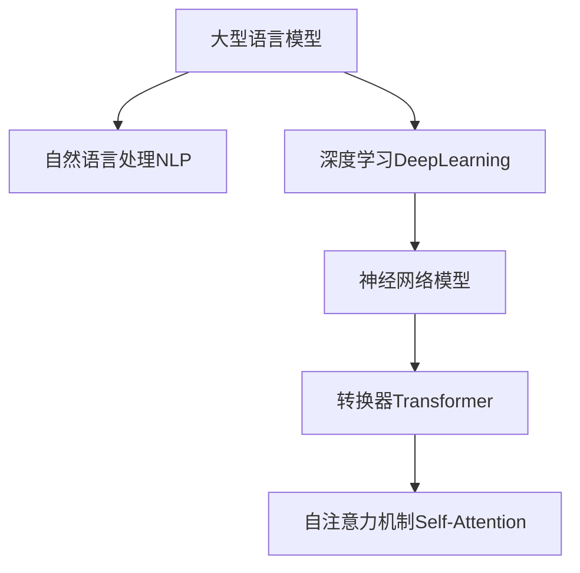
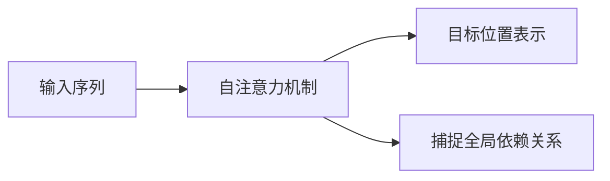

以下是根据您提供的要求和约束条件，为主题《大语言模型应用指南：还原论与涌现性》撰写的技术博客文章正文内容：

# 大语言模型应用指南：还原论与涌现性

## 1. 背景介绍

### 1.1 问题的由来

随着深度学习和人工智能技术的不断发展，大型语言模型(Large Language Models, LLMs)已经成为自然语言处理领域的关键突破。这些模型通过在海量文本数据上进行预训练,展现出惊人的语言理解和生成能力,在诸多自然语言处理任务中取得了令人瞩目的成绩。

然而,尽管大型语言模型已经被广泛应用,但它们内在的工作机制仍然是一个未解之谜。这些模型是如何从大量无标注数据中习得语言知识?它们是否真正"理解"语言的内在结构和语义,还是仅仅在模仿人类的语言模式?这些问题引发了人们对大型语言模型本质的深入思考和探究。

### 1.2 研究现状  

目前,围绕大型语言模型的内在机制,存在两种主要的理论流派:还原论(reductionism)和涌现论(emergentism)。

**还原论**认为,大型语言模型的语言能力可以被还原为底层的统计模式和局部特征的组合。根据这一观点,模型并没有真正"理解"语言,而是通过捕捉数据中的统计规律来模拟语言行为。支持者认为,通过分析模型参数和注意力机制等,可以解释和理解模型的决策过程。

另一方面,**涌现论**则主张,大型语言模型在预训练过程中展现出了"超越其部件之和"的语言理解能力。这种能力不能被简单地还原为已知的统计模式或局部特征,而是通过模型内部复杂的交互作用而涌现出来的。涌现论者认为,模型已经获得了某种程度的"语言概念"和"语义理解",尽管这种理解的本质和机制仍未完全清楚。

这两种理论流派为探索大型语言模型的本质奠定了基础,但仍存在诸多争议和未解之谜,需要通过更深入的研究来厘清。

### 1.3 研究意义

深入理解大型语言模型的内在机制,对于更好地利用和发展这一革命性技术至关重要。只有透彻理解了模型的工作原理,我们才能:

1. **提高模型的可解释性和可信赖性**,确保其在关键应用中的安全和可靠。
2. **优化模型结构和训练过程**,提高其性能和效率。
3. **发现模型的局限性和缺陷**,为进一步发展提供方向。
4. **深化对人类语言认知的理解**,将人工智能研究与认知科学、语言学等学科相结合。

因此,探索大型语言模型的本质机制不仅具有重要的理论价值,也将为实践应用带来深远的影响。

### 1.4 本文结构

本文将深入探讨大型语言模型的还原论与涌现性问题。我们将从以下几个方面展开讨论:

1. 阐述大型语言模型的核心概念和基本原理。
2. 分析还原论和涌现论的理论基础和观点分歧。
3. 介绍相关的算法原理、数学模型和实现细节。
4. 通过实际案例,评估两种理论在解释模型行为方面的优缺点。
5. 探讨大型语言模型在实际应用中的挑战和未来发展趋势。
6. 总结研究进展,并对未来的研究方向提出展望。

通过全面、深入的分析和讨论,我们将努力为读者呈现一个清晰的理解大型语言模型本质的视角。

## 2. 核心概念与联系

在深入探讨还原论与涌现性之前,我们需要先了解大型语言模型的核心概念和基本原理。这将为后续的讨论奠定基础。

大型语言模型通常是一种基于**自然语言处理(Natural Language Processing, NLP)**和**深度学习(Deep Learning)**技术的人工智能模型。它们旨在从大量文本数据中学习语言的统计模式和语义关系,从而获得语言理解和生成的能力。

最常见的大型语言模型架构是**转换器(Transformer)**,它是一种基于**自注意力机制(Self-Attention Mechanism)**的神经网络模型。自注意力机制允许模型捕捉输入序列中任意两个位置之间的依赖关系,从而更好地学习长距离的语义关联。

训练大型语言模型的关键是**预训练(Pre-training)**。在预训练阶段,模型会在大量无标注文本数据上进行训练,目标是最小化一个特定的损失函数(如掩码语言模型损失),从而学习到文本中隐含的语言模式和语义知识。

经过预训练后,大型语言模型可以在下游的自然语言处理任务中进行**微调(Fine-tuning)**,以适应特定的任务需求。这种"预训练+微调"的范式已被广泛应用,并取得了卓越的效果。

大型语言模型的核心优势在于其**泛化能力(Generalization Capability)**。通过在大量数据上的预训练,模型可以捕捉到丰富的语言知识,并将其应用到看不见的数据和新的任务场景中。这种泛化能力使得大型语言模型在许多自然语言处理任务中表现出色,包括机器翻译、问答系统、文本摘要等。

然而,正是这种出色的泛化能力,也引发了人们对大型语言模型内在机制的质疑和探讨。模型是如何从海量数据中习得语言知识的?它们是否真正"理解"语言,还是仅仅在模仿统计模式?这就引出了我们今天要探讨的还原论与涌现性的核心问题。

## 3. 核心算法原理 & 具体操作步骤

### 3.1 算法原理概述

要深入理解大型语言模型的还原论与涌现性问题,我们需要先了解其核心算法原理和工作机制。

大型语言模型的核心算法是**自注意力机制(Self-Attention Mechanism)**,它是转换器(Transformer)架构的关键创新。自注意力机制允许模型在计算目标位置的表示时,直接捕捉输入序列中所有其他位置的信息,而不需要严格按序列顺序进行计算。

自注意力机制的核心思想是通过计算查询(Query)、键(Key)和值(Value)之间的相似性分数,来确定不同位置对目标位置的注意力权重。具体来说,给定一个输入序列 $X = (x_1, x_2, \ldots, x_n)$,自注意力机制会计算目标位置 $i$ 的表示 $y_i$ 如下:

$$y_i = \sum_{j=1}^n \alpha_{ij}(x_j W^V)$$

其中,$ \alpha_{ij} $是位置 $j$ 对位置 $i$ 的注意力权重,由查询 $q_i$、键 $k_j$ 和缩放因子 $\sqrt{d_k}$ 决定:

$$\alpha_{ij} = \frac{(q_i k_j^T)}{\sqrt{d_k}}$$

查询 $q_i$、键 $k_j$ 和值 $v_j$ 都是通过线性映射从输入序列 $X$ 中获得:

$$q_i = x_i W^Q, k_j = x_j W^K, v_j = x_j W^V$$

通过这种机制,自注意力模型可以同时关注输入序列中的所有位置,捕捉长距离的依赖关系,从而更好地建模语言的结构和语义。

### 3.2 算法步骤详解

自注意力机制的具体计算过程可以分为以下几个步骤:

1. **线性映射**:将输入序列 $X$ 通过三个不同的线性映射 $W^Q$、$W^K$ 和 $W^V$ 分别映射为查询(Query)、键(Key)和值(Value)向量。

2. **计算注意力分数**:对于目标位置 $i$,计算它与所有其他位置 $j$ 的注意力分数 $\alpha_{ij}$。注意力分数由查询 $q_i$ 和键 $k_j$ 的点积除以缩放因子 $\sqrt{d_k}$ 得到,其中 $d_k$ 是键向量的维度。

   $$\alpha_{ij} = \frac{(q_i k_j^T)}{\sqrt{d_k}}$$

3. **应用软最大化(Softmax)**:对注意力分数 $\alpha_{ij}$ 应用 Softmax 函数,得到注意力权重 $\alpha'_{ij}$,确保权重之和为 1。

   $$\alpha'_{ij} = \frac{e^{\alpha_{ij}}}{\sum_{k=1}^n e^{\alpha_{ik}}}$$

4. **加权求和**:使用注意力权重 $\alpha'_{ij}$ 对值向量 $v_j$ 进行加权求和,得到目标位置 $i$ 的表示 $y_i$。

   $$y_i = \sum_{j=1}^n \alpha'_{ij}(x_j W^V)$$

5. **残差连接和层归一化**:将自注意力的输出 $Y = (y_1, y_2, \ldots, y_n)$ 与输入 $X$ 相加,并应用层归一化(Layer Normalization),得到最终的自注意力输出。

通过重复上述步骤,自注意力机制可以在不同的层次上捕捉输入序列的依赖关系,从而学习到丰富的语言表示。

### 3.3 算法优缺点

自注意力机制为大型语言模型带来了显著的性能提升,但也存在一些优缺点:

**优点**:

1. **长距离依赖建模**:与传统的递归神经网络相比,自注意力机制可以直接捕捉输入序列中任意两个位置之间的依赖关系,更好地建模长距离的语言结构和语义关联。

2. **并行计算**:自注意力机制的计算过程可以高度并行化,从而提高模型的计算效率和训练速度。

3. **可解释性**:通过分析注意力权重矩阵,我们可以直观地了解模型在做出预测时关注的是输入序列的哪些部分,提高了模型的可解释性。

**缺点**:

1. **计算复杂度**:自注意力机制的计算复杂度为 $O(n^2 \cdot d)$,其中 $n$ 是序列长度, $d$ 是特征维度。当序列长度增加时,计算量会迅速增长,对硬件资源的要求也会提高。

2. **长距离偏移**:尽管自注意力机制理论上可以捕捉任意长距离的依赖关系,但在实践中,对于极长的序列,注意力权重可能会过度集中在局部区域,导致长距离信息被忽视。

3. **缺乏位置信息**:原始的自注意力机制本身不包含位置信息,需要额外的位置编码(Positional Encoding)机制来提供序列的位置信息。

尽管存在一些缺点,自注意力机制仍然是大型语言模型中的核心算法,为模型的出色性能做出了重要贡献。研究人员也在不断探索改进的方法,以提高自注意力机制的效率和性能。

### 3.4 算法应用领域

自注意力机制及其在大型语言模型中的应用,已经在多个自然语言处理领域取得了卓越的成绩,包括但不限于:

1. **机器翻译(Machine Translation)**:大型语言模型可以捕捉源语言和目标语言之间的复杂语义对应关系,显著提高了机器翻译的质量和流畅度。

2. **文本摘要(Text Summarization)**:通过学习文本的关键信息和语义结构,大型语言模型可以生成高质量的文本摘要,广