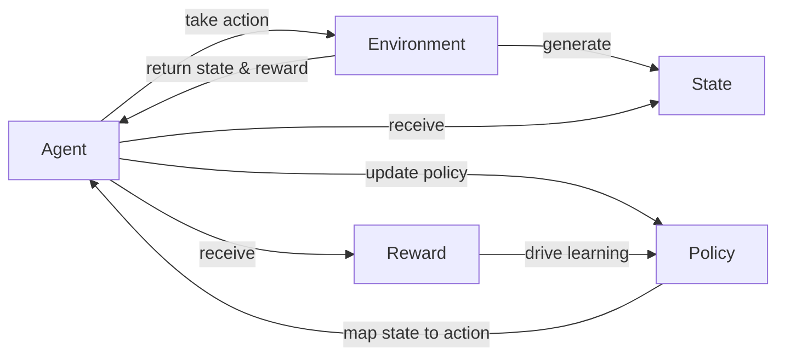

# 奖励 (Reward)

## 1. 背景介绍
### 1.1  问题的由来
在人工智能和机器学习领域,奖励(Reward)是一个非常重要和基础的概念。它是强化学习(Reinforcement Learning)算法的核心组成部分之一。在强化学习中,智能体(Agent)通过与环境(Environment)的交互,根据环境的反馈不断调整和优化自己的策略(Policy),以获得最大的累积奖励。奖励信号指引着智能体朝着正确的方向学习和进化。因此,奖励函数的设计在很大程度上决定了强化学习算法的性能表现。

### 1.2  研究现状
目前,奖励函数的设计仍然是强化学习领域的一大挑战。传统的做法通常是由人工设计一个固定不变的奖励函数。但在实际应用中,很多问题的最优奖励函数往往难以准确定义。比如在自动驾驶中,我们很难用一个精确的数学公式来描述安全、舒适、高效等多个目标之间的权衡。近年来,inverse reinforcement learning、reward shaping、intrinsic reward等先进的奖励建模方法受到了广泛关注。这些方法试图从专家示范、辅助任务、内在动机等角度对奖励进行建模优化,取得了不错的效果。

### 1.3  研究意义 
奖励作为强化学习的核心,其研究意义重大:

1. 高质量的奖励函数是训练出高性能智能体的基础。
2. 奖励建模的突破有望大幅提升强化学习算法在复杂现实任务中的应用效果。
3. 奖励机制的研究有助于我们更好地理解智能体的学习行为模式,探索类人的学习智能。
4. 多智能体场景下的奖励分配机制是多智能体协作的关键。

总的来说,奖励的研究对于推动强化学习的发展、开拓智能系统的应用边界至关重要。

### 1.4  本文结构
本文将重点介绍奖励的基本概念、常见的奖励建模方法,以及在强化学习中的应用实践。全文分为以下几个部分:

1. 背景介绍  
2. 核心概念与联系
3. 核心算法原理与具体步骤
4. 数学模型与公式详解
5. 代码实例与详细解释
6. 实际应用场景
7. 工具和资源推荐
8. 总结与展望
9. 附录:常见问题解答

## 2. 核心概念与联系

在强化学习中,核心概念包括:
- 智能体(Agent):可以感知环境状态、采取行动并从环境获得奖励反馈的决策主体。
- 环境(Environment):智能体所处的交互对象,接收智能体的动作,返回下一时刻的状态和奖励。 
- 状态(State):环境在某一时刻的完整描述,是智能体的观测。
- 动作(Action):智能体施加于环境的控制信号。
- 策略(Policy):智能体的行为决策函数,将状态映射为动作的概率分布。
- 轨迹(Trajectory):智能体与环境交互过程中产生的一系列状态-动作序列。
- 回报(Return):一个状态下所能获得的累积奖励的期望。
- 价值函数(Value Function):估计某一状态或状态-动作对的长期回报。

在所有概念中,奖励起着至关重要的作用。它作为学习的唯一导向,驱动着智能体的策略优化。奖励信号需要合理设置,既要能够准确评判行为的好坏,又要易于从环境中获取。同时,奖励函数要具备一定的可塑性,以适应不同的任务需求。

下图展示了强化学习中各个核心概念之间的关系:

## 3. 核心算法原理 & 具体操作步骤
### 3.1 算法原理概述
强化学习的目标是找到一个最优策略,使得智能体能够获得最大化的累积奖励。一般采用值迭代(Value Iteration)或策略梯度(Policy Gradient)的优化方法来更新价值函数或策略网络的参数。

值迭代的核心思想是通过贝尔曼方程(Bellman Equation)来迭代更新状态价值函数:

$$
V(s) = \max_a \sum_{s',r} p(s',r|s,a)[r + \gamma V(s')]
$$

其中 $p(s',r|s,a)$ 表示在状态 $s$ 下采取动作 $a$ 后,环境转移到状态 $s'$ 并获得奖励 $r$ 的概率。$\gamma$ 是折扣因子。

而策略梯度方法则是基于策略函数 $\pi_\theta(a|s)$ 关于目标函数 $J(\theta)$ 的梯度来更新策略网络的参数 $\theta$:

$$
\nabla_\theta J(\theta) = \mathbb{E}_{\tau \sim \pi_\theta} [\sum_{t=0}^T \nabla_\theta \log \pi_\theta(a_t|s_t) A^{\pi_\theta}(s_t,a_t)]
$$

其中 $\tau$ 表示一条轨迹,A 表示优势函数。

### 3.2 算法步骤详解
基于值迭代的 Q-learning 算法的一般步骤如下:

1. 随机初始化 Q 表格 $Q(s,a)$
2. 重复:
   1. 根据 $\epsilon$-greedy 策略选择动作 $a_t$
   2. 执行动作 $a_t$,观测奖励 $r_{t+1}$ 和新状态 $s_{t+1}$  
   3. 更新 Q 值:
      $Q(s_t,a_t) \leftarrow Q(s_t,a_t) + \alpha [r_{t+1} + \gamma \max_a Q(s_{t+1},a) - Q(s_t,a_t)]$
   4. $s_t \leftarrow s_{t+1}$
3. 直到终止状态

而 REINFORCE 等策略梯度算法的一般步骤为:

1. 随机初始化策略网络参数 $\theta$
2. 重复:
   1. 根据 $\pi_\theta$ 采样一条轨迹 $\tau = (s_0,a_0,r_1,s_1,a_1,...)$
   2. 对于轨迹中的每个时间步 t:
      1. 计算当前时间步的回报 $G_t$
      2. 计算策略梯度 $\nabla_\theta \log \pi_\theta(a_t|s_t) G_t$
   3. 累加每个时间步的梯度,更新策略网络参数:
      $\theta \leftarrow \theta + \alpha \nabla_\theta J(\theta)$
3. 直到策略收敛

### 3.3 算法优缺点

Q-learning 的优点是简单易实现,通过值函数可以很方便地选择最优动作。但其缺点是难以处理连续状态空间,且在状态空间很大时 Q 表难以存储。

策略梯度的优点是可以直接优化策略函数,适用于高维连续动作空间。但其缺点是方差较大,样本利用率低,且不适合 off-policy 学习。

此外,像 DQN、DDPG、PPO、SAC 等多种改进算法被提出,以进一步提升强化学习算法的稳定性和样本效率。

### 3.4 算法应用领域
强化学习算法被广泛应用于以下领域:

- 游戏(如 Atari、Go、StarCraft 等)
- 机器人控制
- 自动驾驶
- 推荐系统
- 网络优化
- 智能电网调度
- 金融投资决策

## 4. 数学模型和公式 & 详细讲解 & 举例说明
### 4.1 数学模型构建
马尔可夫决策过程(Markov Decision Process, MDP)是强化学习问题的标准数学模型。一个 MDP 由以下元素组成:

- 状态空间 $\mathcal{S}$
- 动作空间 $\mathcal{A}$ 
- 转移概率 $\mathcal{P}_{ss'}^a = P[S_{t+1}=s'|S_t=s, A_t=a]$
- 奖励函数 $\mathcal{R}_s^a = \mathbb{E}[R_{t+1}|S_t=s, A_t=a]$
- 折扣因子 $\gamma \in [0,1]$

在 MDP 中,环境的动态特性由状态转移概率 $\mathcal{P}$ 刻画,而奖励函数 $\mathcal{R}$ 则定义了每个状态-动作对的即时奖赏。

强化学习的目标是寻找一个最优策略 $\pi^*(a|s)$,使得智能体采取该策略时能获得最大的期望累积奖励,即最大化目标函数:

$$
J(\pi) = \mathbb{E}_{\pi}[\sum_{t=0}^{\infty} \gamma^t R_{t+1}]
$$

### 4.2 公式推导过程
为了推导出最优策略,我们首先定义状态价值函数 $V^{\pi}(s)$ 和动作价值函数 $Q^{\pi}(s,a)$:

$$
V^{\pi}(s) = \mathbb{E}_{\pi}[\sum_{k=0}^{\infty} \gamma^k R_{t+k+1} | S_t = s] \\
Q^{\pi}(s,a) = \mathbb{E}_{\pi}[\sum_{k=0}^{\infty} \gamma^k R_{t+k+1} | S_t = s, A_t = a]
$$

然后利用贝尔曼期望方程,我们可以得到价值函数的递归形式:

$$
V^{\pi}(s) = \sum_a \pi(a|s) \sum_{s',r} p(s',r|s,a) [r + \gamma V^{\pi}(s')] \\
Q^{\pi}(s,a) = \sum_{s',r} p(s',r|s,a) [r + \gamma \sum_{a'} \pi(a'|s') Q^{\pi}(s',a')]
$$

进一步地,最优价值函数 $V^*(s)$ 和 $Q^*(s,a)$ 满足贝尔曼最优方程:

$$
V^*(s) = \max_a \sum_{s',r} p(s',r|s,a) [r + \gamma V^*(s')] \\
Q^*(s,a) = \sum_{s',r} p(s',r|s,a) [r + \gamma \max_{a'} Q^*(s',a')]
$$

最终,我们可以利用 Q 值来得到最优策略:

$$
\pi^*(a|s) = \arg\max_a Q^*(s,a)
$$

### 4.3 案例分析与讲解
我们以一个简单的网格世界导航任务为例来说明强化学习中的奖励机制。

假设一个智能体处在一个 4x4 的网格环境中,目标是从起点出发尽快到达终点。每一步可以选择上下左右四个方向移动,撞墙或走出边界的动作无效。

我们可以设计如下的奖励函数:
- 到达终点的奖励为 +1
- 其他每一步的奖励为 -0.01 (引入负奖励以鼓励智能体尽快到达目标)
- 在起点或终点停留的奖励为 0

这样设置的奖励函数可以引导智能体学习出一条最短路径。在训练过程中,只要智能体往终点方向移动,虽然每一步都会得到-0.01的负奖励,但当最终到达终点时,+1的正奖励会超过累积的负奖励,使得 Q 值更新为正值。因此经过多轮迭代,智能体能够学习到正确的策略。

而如果我们把每一步的负奖励去掉,只保留终点的+1奖励,智能体学到的策略可能会是在起点附近随机游走,直到恰好走到终点。这显然不是我们希望的最优行为。

因此,奖励函数需要设计得恰到好处,才能有效指导智能体的学习。

### 4.4 常见问题解答

1. 如何设计一个好的奖励函数?
   - 奖励应可以定量评判任务的完成情况,引导智能体朝着目标行为方向优化。
   - 应尽量提供密集正负奖励,避免稀疏奖励。必要时可引入辅助奖励。
   - 奖励数值要合理,