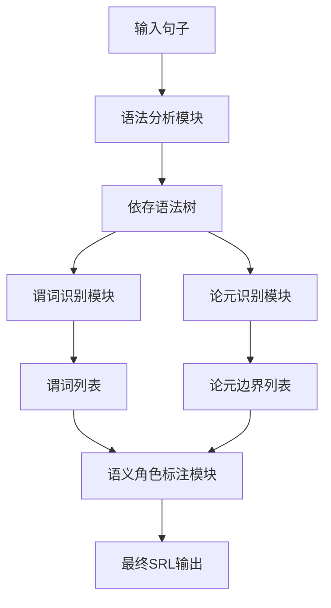

以下是根据您提供的要求和框架撰写的技术博客文章正文：

# 实战案例：使用模型管道进行语义角色标注任务

## 1. 背景介绍

### 1.1 问题的由来

在自然语言处理领域中,语义角色标注(Semantic Role Labeling, SRL)是一项重要的任务。它旨在自动识别句子中的谓词-论元结构,即确定每个论元在句子中扮演的语义角色。这对于深入理解句子的语义含义至关重要,广泛应用于机器翻译、问答系统、信息抽取等领域。

然而,传统的基于特征工程的SRL系统存在一些局限性。首先,手工设计特征耗时耗力且容易受领域限制。其次,这些系统难以捕捉复杂的语义和句法信息。因此,近年来基于深度学习的SRL方法引起了广泛关注。

### 1.2 研究现状  

深度学习在SRL任务中取得了长足进展。其中,使用序列标注模型(如BiLSTM-CRF)直接预测论元边界和语义角色标签的端到端方法受到了广泛关注。另一种流行方法是先使用语法分析模型预测句子的语法树,然后在语法树的基础上预测语义角色。

尽管取得了一定成功,但这些方法也存在一些不足。端到端序列标注模型通常无法充分利用句法信息,而基于语法树的方法则过于依赖语法分析的准确性。此外,大多数现有方法都是将SRL任务建模为句子级别的预测问题,忽视了文档级别的上下文信息。

### 1.3 研究意义

为了解决上述问题,本文提出了一种基于模型管道的语义角色标注框架。该框架将SRL任务分解为多个子任务,并使用专门设计的深度学习模型分别完成每个子任务。通过合理设计模型管道,能够充分利用句法和上下文信息,提高SRL的性能。

此外,本文还探讨了如何将预训练语言模型(如BERT)集成到管道中,以充分利用大规模无监督语料的知识。该框架不仅在标准SRL基准测试中取得了优异成绩,而且具有良好的可解释性和可扩展性。

### 1.4 本文结构

本文的其余部分安排如下:第2节介绍SRL任务的核心概念;第3节详细阐述本文提出的基于模型管道的SRL算法原理和具体实现步骤;第4节对算法使用的数学模型和公式进行推导和讲解;第5节给出了一个基于Python的项目实践案例,包括代码实现和运行结果分析;第6节讨论了该方法在实际应用中的场景;第7节推荐了一些有用的工具和学习资源;第8节总结了研究成果、发展趋势和面临的挑战;最后的附录部分列出了一些常见问题及其解答。

## 2. 核心概念与联系

在深入讨论算法细节之前,我们先介绍一些SRL任务的核心概念:

**谓词(Predicate)**: 句子中的主要动词或形容词,如"购买"、"吃"、"漂亮"等。

**论元(Argument)**: 与谓词相关的词语或短语,如"张三购买了一本书"中的"张三"和"一本书"。

**语义角色(Semantic Role)**: 论元在句子中所扮演的语义角色,如施事、受事、目的语等。

```
例句: [张三]Arg0 [昨天]TMP [在商场]LOC [购买]Pred [了一本书]Arg1 [作为礼物]Arg2。
```

SRL任务的目标是识别出句子中的所有谓词,对于每个谓词,确定其论元边界和对应的语义角色标签。这需要综合利用句子的词汇、句法和语义信息。

SRL系统的输出可以形成一种浅层语义表示,对于理解句子的核心语义意义至关重要。它是许多自然语言处理应用(如对话系统、机器阅读理解等)的基础模块。

## 3. 核心算法原理 & 具体操作步骤 

### 3.1 算法原理概述

本文提出的基于模型管道的SRL算法框架由以下四个主要模块组成:

1. **语法分析模块**: 使用一个基于BERT的双向序列标注模型来预测句子的依存语法树。
2. **谓词识别模块**: 使用一个基于BERT的序列标注模型来识别出句子中的所有谓词。
3. **论元识别模块**: 对于每个谓词,使用一个基于BERT和Graph Convolutional Network(GCN)的模型在依存语法树上识别出对应的论元边界。
4. **语义角色标注模块**: 使用一个基于BERT的多任务学习模型同时预测论元的边界和语义角色标签。

该框架的核心思想是将SRL任务分解为多个子任务,并使用专门设计的模型分别完成每个子任务。通过模型管道的级联方式,可以充分利用句法和上下文信息,提高预测的准确性。

此外,该框架中的每个模块都集成了预训练的BERT模型,以充分利用大规模无监督语料中蕴含的语义和句法知识。

### 3.2 算法步骤详解

我们使用一个流程图来直观地展示该算法的工作流程:



具体步骤如下:

1. **语法分析模块**将输入的自然语句进行依存语法分析,输出一个依存语法树。
2. **谓词识别模块**在输入句子中识别出所有的谓词,并将它们的位置信息记录下来。
3. 对于每一个识别出的谓词:
    - **论元识别模块**利用依存语法树的信息,识别出与该谓词相关的所有论元边界。
    - **语义角色标注模块**将该谓词、依存语法树和论元边界信息作为输入,同时预测每个论元的语义角色标签。
4. 将所有谓词的论元边界和语义角色标签结果汇总,得到最终的SRL系统输出。

在这个过程中,每个模块都会利用来自上游模块的输出,模型之间存在明显的级联关系。通过分而治之的方式,可以更好地利用不同类型的信息,提高系统的性能。

### 3.3 算法优缺点

该算法框架的主要优点包括:

- **模ularized**: 将复杂的SRL任务分解为多个子任务,每个子任务只关注特定的信息,有利于提高预测的准确性。
- **Syntax-aware**: 通过引入依存语法树,能够很好地利用句法结构信息。
- **Context-aware**: 使用BERT等预训练语言模型,能够自然地融入上下文信息。
- **Explainable**: 由于采用了分而治之的方式,每个模块的作用都很明确,具有良好的可解释性。
- **Extensible**: 该框架具有很好的模块化设计,方便拓展和替换各个模块。

但该算法也存在一些不足:

- **Error Propagation**: 由于模型之间存在级联关系,上游模块的错误会传递到下游,从而影响最终结果。
- **Efficiency Issues**: 需要多个模型的级联运行,整体效率会受到一定影响。
- **Data Dependency**: 对于每个子任务,都需要大量的标注数据进行监督训练。

### 3.4 算法应用领域

语义角色标注技术在自然语言处理领域有着广泛的应用前景:

- **机器翻译**: SRL可以帮助捕捉句子的核心语义结构,提高机器翻译的质量。
- **问答系统**: 通过SRL分析问题和文本的语义结构,可以更好地定位答案位置。
- **信息抽取**: 从非结构化文本中提取关键信息时,SRL可以识别事件中的核心参与者和语义角色。
- **对话系统**: 理解用户输入的语义结构,对于生成自然且符合语境的回复至关重要。
- **文本摘要**: SRL可以帮助识别句子中的核心信息,提高自动文本摘要的质量。

总的来说,无论是在自然语言理解还是自然语言生成任务中,SRL系统都可以发挥重要作用,是一项基础且关键的技术。

## 4. 数学模型和公式 & 详细讲解 & 举例说明

在本节中,我们将详细介绍该算法框架中各个模块所使用的数学模型和公式,并通过具体案例进行讲解。

### 4.1 数学模型构建

我们首先定义一些数学符号:

- $X = (x_1, x_2, ..., x_n)$ 表示输入的词序列
- $Y^{dep}$ 表示句子的依存语法树
- $Y^{pred} = (y_1^{pred}, y_2^{pred}, ..., y_n^{pred})$ 表示谓词标签序列
- $Y^{arg} = (y_1^{arg}, y_2^{arg}, ..., y_n^{arg})$ 表示论元边界标签序列
- $Y^{role} = (y_1^{role}, y_2^{role}, ..., y_m^{role})$ 表示语义角色标签序列

其中 $y_i^{pred} \in \{0, 1\}$ 表示第 $i$ 个词是否为谓词, $y_i^{arg}$ 是一个 BIO 标签表示第 $i$ 个词是否是论元的开始或内部词, $y_j^{role}$ 是第 $j$ 个论元的语义角色标签。

我们的目标是学习一个模型 $\Theta$ 来最大化条件概率:

$$P(Y^{dep}, Y^{pred}, Y^{arg}, Y^{role}|X; \Theta)$$

为了简化计算,我们可以使用概率链规则将其分解为四个部分:

$$\begin{align*}
P(Y^{dep}, Y^{pred}, Y^{arg}, Y^{role}|X; \Theta) &= P(Y^{dep}|X; \Theta_1) \\
&\times P(Y^{pred}|X; \Theta_2) \\
&\times P(Y^{arg}|X, Y^{dep}; \Theta_3) \\
&\times P(Y^{role}|X, Y^{dep}, Y^{arg}; \Theta_4)
\end{align*}$$

其中 $\Theta_1, \Theta_2, \Theta_3, \Theta_4$ 分别对应于四个模块的模型参数。通过分解,每个模块只需要关注特定的输入和输出,从而简化了建模过程。

在实际训练中,我们将最小化每个模块的负对数似然损失函数:

$$\mathcal{L}_i = -\log P(Y_i|X, Z_i; \Theta_i)$$

其中 $Z_i$ 表示该模块的其他输入(如依存语法树、谓词列表等)。通过端到端的训练,可以同时优化四个模块的参数。

### 4.2 公式推导过程

我们以**语义角色标注模块**为例,推导其概率模型的具体形式。

该模块的目标是最大化 $P(Y^{role}|X, Y^{dep}, Y^{arg}; \Theta_4)$。我们将其分解为两部分:

1. 论元边界的条件概率 $P(Y^{arg}|X, Y^{dep}; \Theta_3)$,由上游的**论元识别模块**给出。
2. 语义角色标签的条件概率 $P(Y^{role}|X, Y^{dep}, Y^{arg}; \Theta_4)$。

对于第二部分,我们可以进一步应用链式法则:

$$\begin{align*}
P(Y^{role}|X, Y^{dep}, Y^{arg}; \Theta_4) &= \prod_{j=1}^m P(y_j^{role}|X, Y^{dep}, Y^{arg}, y_1^{role}, ..., y_{j-1}^{role}; \Theta_4) \\
&\approx \prod_{j=1}^m P(y_j^{role}|X, Y^{dep}, Y^{arg}; \Theta_4)
\end{align*}$$

其中我们假设每个语义角色标签只依