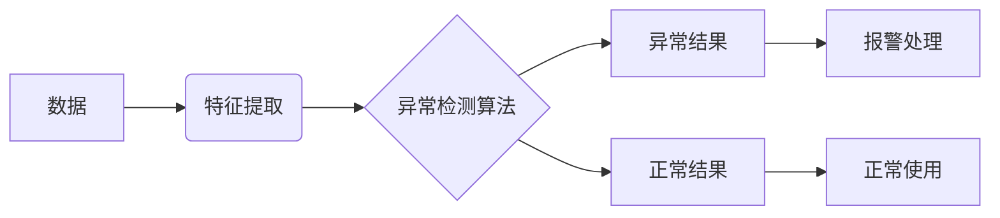

# 异常检测 原理与代码实例讲解

## 1. 背景介绍

### 1.1 问题的由来

随着信息技术的飞速发展,海量数据在各行各业中不断产生和积累。然而,这些数据中往往存在一些异常值或离群点,它们偏离了数据的整体分布规律。异常值可能由多种原因引起,例如:数据采集过程中的误差、系统故障、恶意攻击等。如果不能及时发现和处理这些异常,可能会对后续的数据分析和决策产生严重干扰,甚至导致灾难性后果。因此,异常检测已经成为数据挖掘领域的一个重要研究课题。

### 1.2 研究现状

异常检测技术经过多年的发展,已形成了多种类型的算法。主要可分为:

1. 基于统计学的方法:假设数据服从某种概率分布,利用统计模型找出低概率区域作为异常。代表算法有高斯模型、箱线图等。

2. 基于距离的方法:异常点通常远离其他数据点。该类方法计算每个点与其他点的距离,距离超过阈值的为异常。代表算法有 K 近邻、基于密度的局部离群因子(LOF)等。  

3. 基于聚类的方法:正常数据通常聚集成簇,而异常点无法归入任何一个簇或自成小簇。代表算法有 DBSCAN、ROCK 等。

4. 基于分类的方法:将异常检测看作一个二分类问题,用已知的正常和异常数据训练分类器。代表算法有支持向量机(SVM)、隔离森林等。

5. 基于集成学习的方法:结合多个异常检测器的判断结果,提高检测的鲁棒性。代表算法有 Feature Bagging、Boosting 等。

目前,异常检测已广泛应用于网络安全、金融风控、设备监控、医疗诊断等领域,取得了显著成效。但仍面临着高维数据、异常类型多样、实时性要求高等挑战。未来需要在算法的精度、效率、可解释性等方面进一步优化和创新。

### 1.3 研究意义

异常检测的研究意义主要体现在以下几个方面:

1. 保障系统安全:及时发现网络入侵、欺诈交易等异常行为,避免造成重大损失。

2. 提升产品质量:通过对生产数据的异常检测,可以发现和预防产品缺陷。

3. 优化运营效率:异常检测有助于实现设备的预测性维护,减少停机时间和维修成本。 

4. 辅助科学决策:去除异常值的干扰,可以提高数据分析的准确性,为决策提供可靠依据。

5. 拓展认知边界:对异常现象的深入研究,有可能发现新的规律和知识。

因此,异常检测不仅具有重要的理论价值,更有广阔的应用前景。它已成为大数据时代不可或缺的关键技术之一。

### 1.4 本文结构

本文将全面系统地介绍异常检测的相关知识。内容安排如下:

第2部分介绍异常检测的核心概念及其内在联系。

第3部分重点讲解几种主要的异常检测算法原理和具体操作步骤。

第4部分给出算法所依赖的数学模型和公式,并辅以案例详细说明。

第5部分通过代码实例,演示算法的实现细节。

第6部分总结异常检测的典型应用场景和未来趋势。

第7部分推荐一些学习异常检测的资源和工具。

第8部分对全文进行总结,并展望异常检测未来的机遇与挑战。

第9部分的附录,解答了一些常见问题。

## 2. 核心概念与联系

异常检测涉及的核心概念包括:

- 异常(Anomaly):偏离大多数数据的个体,也称为离群点(Outlier)、例外(Exception)等。
- 正常(Normal):符合数据整体分布规律的个体,占据数据的主体部分。  
- 特征(Feature):描述数据属性的变量,是异常检测算法的基本输入。
- 阈值(Threshold):判定异常的临界值。超过阈值的个体被认为是异常。
- 标签(Label):指示一个数据是否为异常的二元变量。大多数数据没有标签。

这些概念之间的联系可用下图表示:



如图所示,异常检测的基本流程是:从原始数据中提取特征,输入异常检测算法,根据设定的阈值判定每个个体是异常还是正常,进而采取相应的处置措施。

需要注意的是,异常检测是一个非平衡的二分类问题。异常数据非常稀少,大部分数据都是正常的。因此,异常检测算法需要能够从少量甚至没有异常样本中学习异常的特征。这是异常检测区别于一般分类问题的独特之处。

## 3. 核心算法原理 & 具体操作步骤

### 3.1 算法原理概述

异常检测的核心是建立数据正常行为的参考模型,偏离该模型的个体即可判定为异常。下面分别介绍统计学、距离、聚类、分类四类主要算法的基本原理。

1. 统计学方法的基本思想是:假设正常数据服从某种概率分布(如高斯分布),位于分布拐点以外的小概率区域即为异常。该方法简单直观,但局限于特定的分布假设,对异常类型的适应性有限。

2. 距离法利用了异常点距离其他点较远的特性。它计算每个点与其他点的距离,距离超过阈值的即为异常。该方法不依赖数据分布,适用范围更广。但距离计算开销大,且难以刻画局部异常。

3. 聚类法基于正常点多聚集、异常点少而分散的假设。它用聚类算法将数据点分组,不属于任何簇或自成小簇的点即为异常。该方法能够发现任意形状的异常,但聚类结果易受算法参数影响。

4. 分类法将异常检测视为二分类任务,用已知的正常异常样本训练分类器。分类器学习到区分两类数据的边界,可用于之后的异常判定。该方法充分利用已有标签,但异常样本获取往往很困难。

### 3.2 算法步骤详解

下面以经典的基于高斯分布模型的异常检测算法为例,详细说明其操作步骤。

输入:$n$个$d$维数据点$\{x^{(1)},\ldots,x^{(n)}\}$

输出:每个数据点的异常概率$p(x)$和判定结果(0为正常,1为异常)

参数:异常判定阈值$\epsilon$

步骤:

1. 拟合高斯模型

- 分别估计每一维特征的均值:

$$
\mu_j=\frac{1}{n}\sum_{i=1}^n x_j^{(i)}
$$

- 分别估计每一维特征的标准差:

$$
\sigma_j^2=\frac{1}{n}\sum_{i=1}^n(x_j^{(i)}-\mu_j)^2
$$

2. 计算异常概率

对每个数据点$x^{(i)}=(x_1^{(i)},\ldots,x_d^{(i)})$,计算其异常概率:

$$
p(x^{(i)})=\prod_{j=1}^d \frac{1}{\sqrt{2\pi}\sigma_j}\exp\left(-\frac{(x_j^{(i)}-\mu_j)^2}{2\sigma_j^2}\right)
$$

3. 异常判定

若$p(x^{(i)})<\epsilon$,则$x^{(i)}$为异常,输出1;否则为正常,输出0。

可以看出,该算法的核心是用高斯分布拟合正常数据,位于拟合曲线尾部的点即被判定为异常。

### 3.3 算法优缺点

基于高斯模型的异常检测算法的主要优点是:

- 思路简单明了,易于实现。只需估计均值和方差两个参数。
- 计算高效,时间复杂度为$O(nd)$。
- 输出异常概率,可解释性强。
- 在低维数据上效果不错。

其缺点包括:

- 依赖数据服从高斯分布的假设,现实中并不总是成立。
- 各维度独立同分布,忽略了特征间的相关性。
- 不适合高维数据,因为高维空间中几乎所有点都趋向异常。
- 无法发现局部异常,如一簇中的异常点。

### 3.4 算法应用领域

尽管存在局限性,该算法仍在多个领域得到应用,例如:

- 硬件监控:服务器的 CPU 利用率、内存占用等指标通常服从高斯分布,可用该算法及时发现异常。
- 网络安全:某些网络流量特征(如包大小、持续时间等)也近似高斯分布,可用于检测 DDoS 等攻击。
- 金融风控:交易金额、频率等变量的异常可能意味着欺诈风险。

总之,对于低维、近高斯分布的数据,该算法可作为基线模型,快速实现异常检测功能。

## 4. 数学模型和公式 & 详细讲解 & 举例说明

### 4.1 数学模型构建

异常检测的数学模型,实质上是用数学语言对正常数据的分布特征进行抽象刻画。以高斯分布为例,它的概率密度函数为:

$$
f(x|\mu,\sigma^2)=\frac{1}{\sqrt{2\pi}\sigma}\exp\left(-\frac{(x-\mu)^2}{2\sigma^2}\right)
$$

其中$\mu$为均值,$\sigma^2$为方差,刻画了数据的集中趋势和离散程度。

假设$d$维数据$x=(x_1,\ldots,x_d)$的每一维都独立地服从高斯分布,则其联合概率密度为:

$$
f(x|\mu,\Sigma)=\prod_{j=1}^d \frac{1}{\sqrt{2\pi}\sigma_j}\exp\left(-\frac{(x_j-\mu_j)^2}{2\sigma_j^2}\right)
$$

其中$\mu=(\mu_1,\ldots,\mu_d)$为均值向量,$\Sigma=\text{diag}(\sigma_1^2,\ldots,\sigma_d^2)$为对角协方差矩阵。

该模型虽然简单,但能够较好地拟合具有类椭球形状的数据分布。位于分布中心的数据被视为正常,而位于分布边缘的低概率区域的数据则被视为异常。

### 4.2 公式推导过程

模型的参数$\mu$和$\Sigma$可通过极大似然估计得到。给定$n$个独立同分布的样本$\{x^{(1)},\ldots,x^{(n)}\}$,对数似然函数为:

$$
\begin{aligned}
\mathcal{L}(\mu,\Sigma) &= \log\prod_{i=1}^n f(x^{(i)}|\mu,\Sigma) \\
&= \sum_{i=1}^n\log f(x^{(i)}|\mu,\Sigma) \\
&= -\frac{nd}{2}\log(2\pi)-\frac{n}{2}\sum_{j=1}^d\log\sigma_j^2-\frac{1}{2}\sum_{i=1}^n\sum_{j=1}^d\frac{(x_j^{(i)}-\mu_j)^2}{\sigma_j^2}
\end{aligned}
$$

分别对$\mu_j$和$\sigma_j^2$求偏导数并令其为0,解得:

$$
\hat{\mu}_j=\frac{1}{n}\sum_{i=1}^n x_j^{(i)}
$$

$$
\hat{\sigma}_j^2=\frac{1}{n}\sum_{i=1}^n(x_j^{(i)}-\hat{\mu}_j)^2
$$

将估计得到的参数代入概率密度函数,即得到判定新样本是否异常的概率模型。

### 4.3 案例分析与讲解

下面以一个简单的二维数据集为例,直观展示该算法的效果。

假设有以下10个数据点:

```
x1  x2
1.1 2.