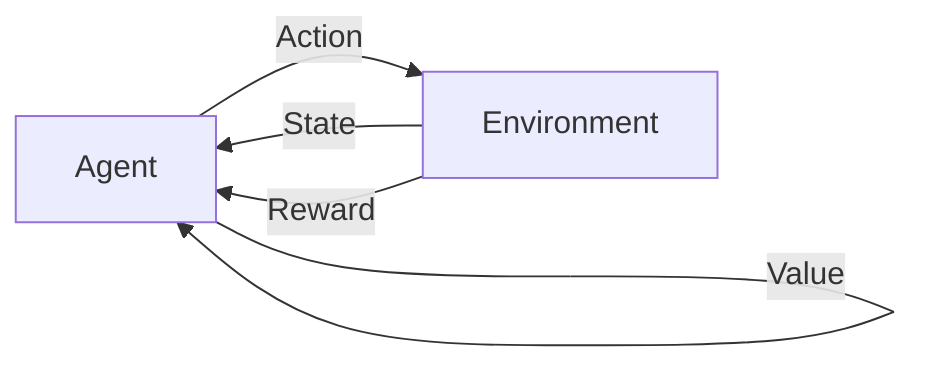

# 强化学习 原理与代码实例讲解

## 1. 背景介绍
### 1.1 问题的由来
强化学习(Reinforcement Learning, RL)是机器学习的一个重要分支,其灵感来源于心理学中的行为主义理论。在现实世界中,很多问题都可以抽象成智能体(Agent)通过与环境(Environment)交互来获得最大化的累积奖励(Reward)。例如自动驾驶、智能推荐、游戏AI等,这些问题用监督学习和非监督学习都难以很好地建模和求解,而强化学习为这些问题提供了一种新的解决思路。

### 1.2 研究现状 
近年来,随着深度学习的发展,深度强化学习(Deep Reinforcement Learning, DRL)取得了很大的进展。DeepMind提出的DQN在Atari游戏上达到了超人的水平[1]；AlphaGo战胜了人类顶尖围棋选手[2]；OpenAI Five在Dota2上击败了人类职业选手[3]。这些里程碑式的成果极大地推动了强化学习的发展与应用。目前,强化学习已经在自动驾驶、机器人控制、智能推荐、对话系统等领域取得了很多突破性的进展。

### 1.3 研究意义
强化学习作为通用人工智能的一个重要方向,对于实现智能体的自主学习和决策具有重要意义。通过研究强化学习的基本原理和算法,可以让我们对智能体如何通过试错来学习最优策略有更深入的理解。同时,强化学习也为很多现实世界问题,如自动驾驶、智能推荐等提供了新的解决思路。因此,深入研究强化学习对于人工智能的发展具有重要的理论和实践意义。

### 1.4 本文结构
本文将全面介绍强化学习的基本原理和代码实现。第2节介绍强化学习的核心概念；第3节介绍几种经典的强化学习算法；第4节介绍强化学习涉及的数学模型和公式；第5节给出算法的代码实现；第6节讨论强化学习的应用场景；第7节推荐相关学习资源；第8节总结全文并展望强化学习的发展趋势与挑战。

## 2. 核心概念与联系
强化学习涉及几个核心概念：
- 智能体(Agent):可以感知环境并采取行动的实体,如机器人、自动驾驶汽车等。
- 环境(Environment):智能体所处的环境,环境的状态(State)会随着智能体的行动而改变。
- 行动(Action):智能体根据策略(Policy)采取的动作,如向左走、向右走等。
- 奖励(Reward):环境根据智能体的行动给出的即时反馈,引导智能体学习最优策略。
- 策略(Policy):智能体的行为准则,即在给定状态下应该采取什么样的行动。
- 价值(Value):衡量状态的好坏,是对未来累积奖励的预期。
- 状态转移(State Transition):环境状态根据智能体的行动发生的变化。

下图展示了强化学习中各个核心概念之间的关系:

智能体根据当前环境状态,使用策略选择行动,环境根据行动给出新的状态和即时奖励,智能体根据状态和奖励更新价值函数和策略,通过这样的交互循环,智能体逐步学习到最优策略。强化学习的目标就是找到一个最优策略使得智能体获得的累积奖励最大化。

## 3. 核心算法原理 & 具体操作步骤
### 3.1 算法原理概述
强化学习有很多经典算法,主要分为基于价值(Value-based)、基于策略(Policy-based)和基于模型(Model-based)三大类。基于价值的方法通过学习价值函数来选择动作；基于策略的方法直接学习最优策略；基于模型的方法通过学习环境模型来规划动作。下面重点介绍几种常用算法。

### 3.2 算法步骤详解
#### 3.2.1 Q-learning 
Q-learning是一种经典的基于价值的无模型算法[4]。其核心思想是学习动作-价值函数(Q函数),Q(s,a)表示在状态s下采取行动a的价值。Q-learning的更新公式为:
$$
Q(s_t,a_t) \leftarrow Q(s_t,a_t) + \alpha[r_{t+1} + \gamma \max_a Q(s_{t+1},a) - Q(s_t,a_t)]
$$

其中$\alpha$是学习率,$\gamma$是折扣因子。算法流程如下:
1. 初始化Q函数(一般用表格或神经网络)
2. 状态初始化为s
3. 重复:
    - 根据$\epsilon-greedy$策略选择行动a
    - 执行行动a,观察奖励r和新状态s'
    - 根据公式更新Q(s,a)
    - s = s'
直到收敛或达到最大步数。

#### 3.2.2 SARSA
SARSA也是一种基于价值的无模型算法,与Q-learning的区别在于更新公式:
$$
Q(s_t,a_t) \leftarrow Q(s_t,a_t) + \alpha[r_{t+1} + \gamma Q(s_{t+1},a_{t+1}) - Q(s_t,a_t)]
$$

SARSA使用下一步实际采取的动作$a_{t+1}$来更新,而Q-learning使用下一状态的最大Q值动作。算法流程与Q-learning类似,区别在于步骤3中要再次根据策略选择$a_{t+1}$。

#### 3.2.3 DQN
DQN(Deep Q Network)将深度神经网络引入Q-learning,用于处理高维状态空间[1]。DQN有两个关键创新点:
1. 经验回放(Experience Replay):用一个经验池(replay buffer)存储转移(s,a,r,s'),之后从中随机抽取小批量转移来更新参数,打破了数据的相关性。
2. 目标网络(Target Network):每隔一段时间将当前Q网络参数复制给目标Q网络,用于计算目标Q值,提高训练稳定性。

DQN的损失函数为:
$$
L(\theta) = \mathbb{E}_{(s,a,r,s')\sim D}[(r + \gamma \max_{a'}Q(s',a';\theta^-) - Q(s,a;\theta))^2]
$$

其中$\theta$是当前Q网络参数,$\theta^-$是目标网络参数,D是经验池。算法流程为:
1. 初始化当前Q网络和目标Q网络
2. 状态初始化为s
3. 重复:
    - 根据$\epsilon-greedy$策略选择行动a
    - 执行行动a,观察奖励r和新状态s'
    - 将(s,a,r,s')存入经验池D
    - 从D中随机抽取小批量转移
    - 计算目标Q值$y=r+\gamma \max_{a'}Q(s',a';\theta^-)$
    - 最小化损失函数$L(\theta)$,更新当前Q网络参数$\theta$
    - 每隔C步将$\theta$复制给$\theta^-$
    - s = s'
直到收敛或达到最大步数。

#### 3.2.4 Policy Gradient
Policy Gradient是一类基于策略的算法,直接学习参数化的策略函数$\pi_\theta(a|s)$。其目标是最大化期望累积奖励:
$$
J(\theta) = \mathbb{E}_{\tau\sim \pi_\theta}[R(\tau)] = \mathbb{E}_{\tau\sim \pi_\theta}[\sum_{t=0}^T \gamma^t r_t]
$$

其中$\tau$表示一条轨迹,即状态-行动序列。根据策略梯度定理[5],策略梯度为:
$$
\nabla_\theta J(\theta) = \mathbb{E}_{\tau\sim \pi_\theta}[\sum_{t=0}^T \nabla_\theta \log \pi_\theta(a_t|s_t) R_t]
$$

其中$R_t=\sum_{t'=t}^T \gamma^{t'-t} r_{t'}$是从t时刻开始的累积折扣奖励。算法流程为:
1. 初始化策略网络参数$\theta$
2. 重复:
    - 根据$\pi_\theta$采样一批轨迹$\{\tau_i\}$
    - 对每条轨迹估计累积奖励$\hat{R}_t$
    - 计算策略梯度$\hat{g} = \frac{1}{N} \sum_i \sum_t \nabla_\theta \log \pi_\theta(a_{i,t}|s_{i,t}) \hat{R}_{i,t}$
    - 更新策略参数$\theta \leftarrow \theta + \alpha \hat{g}$
直到收敛。

### 3.3 算法优缺点
- Q-learning:
    - 优点:收敛性有理论保证,简单易实现。
    - 缺点:不适合连续动作空间,需要探索所有状态-行动对。
- DQN:
    - 优点:可以处理高维状态,在Atari游戏等任务上表现出色。
    - 缺点:不适合连续动作空间,对超参数敏感。
- Policy Gradient:
    - 优点:适合连续动作空间,可以学习随机性策略。
    - 缺点:方差大,样本效率低,不适合稀疏奖励环境。

### 3.4 算法应用领域
- 游戏AI:如Atari游戏、围棋、星际争霸等
- 机器人控制:如机械臂操纵、四足机器人等  
- 自动驾驶:端到端学习驾驶策略
- 推荐系统:将推荐问题建模成序贯决策过程
- 对话系统:将对话建模成互动的过程,通过奖励来引导对话

## 4. 数学模型和公式 & 详细讲解 & 举例说明
### 4.1 数学模型构建
强化学习可以用马尔可夫决策过程(Markov Decision Process, MDP)来建模,一个MDP由以下元素组成:
- 状态空间S:环境所有可能的状态集合
- 行动空间A:智能体所有可能的行动集合 
- 状态转移概率$P(s'|s,a)$:在状态s下采取行动a转移到状态s'的概率
- 奖励函数$R(s,a)$:在状态s下采取行动a获得的即时奖励
- 折扣因子$\gamma \in [0,1]$:未来奖励的折扣率

MDP的目标是寻找一个最优策略$\pi^*$使得期望累积奖励最大化:
$$
\pi^* = \arg\max_\pi \mathbb{E}[\sum_{t=0}^\infty \gamma^t R(s_t,a_t)|\pi]
$$

为了评估一个MDP中状态或状态-行动对的价值,定义价值函数:
- 状态价值函数$V^\pi(s)$:策略$\pi$下状态s的期望回报
$$
V^\pi(s) = \mathbb{E}[\sum_{k=0}^\infty \gamma^k r_{t+k}|s_t=s,\pi]
$$
- 动作价值函数$Q^\pi(s,a)$:策略$\pi$下在状态s采取行动a的期望回报
$$
Q^\pi(s,a) = \mathbb{E}[\sum_{k=0}^\infty \gamma^k r_{t+k}|s_t=s,a_t=a,\pi]
$$

最优价值函数满足贝尔曼最优方程:
$$
V^*(s) = \max_a \sum_{s'} P(s'|s,a)[R(s,a) + \gamma V^*(s')]
$$
$$
Q^*(s,a) = \sum_{s'} P(s'|s,a)[R(s,a) + \gamma \max_{a'} Q^*(s',a')]
$$

求解最优价值函数就可以得到最优策略。

### 4.2 公式推导过程
以Q-learning为例,推导其更新公式。Q-learning的目标是学习最优动作价值函数$Q^*$,根据贝尔曼最优方程,可以得到:
$$
Q^*(s,a) = \mathbb{E}_{s'\sim P}[R(s,a) + \gamma \max_{a'} Q^*(s',a')]
$$

定义t时刻的TD误差为:
$$
\delta_t = R(s_t,a_t) + \gamma \max_{a'} Q(s_{t+1},a') - Q(s_t,a_t)
$$

根据随机梯度下降法,Q函数的更新公