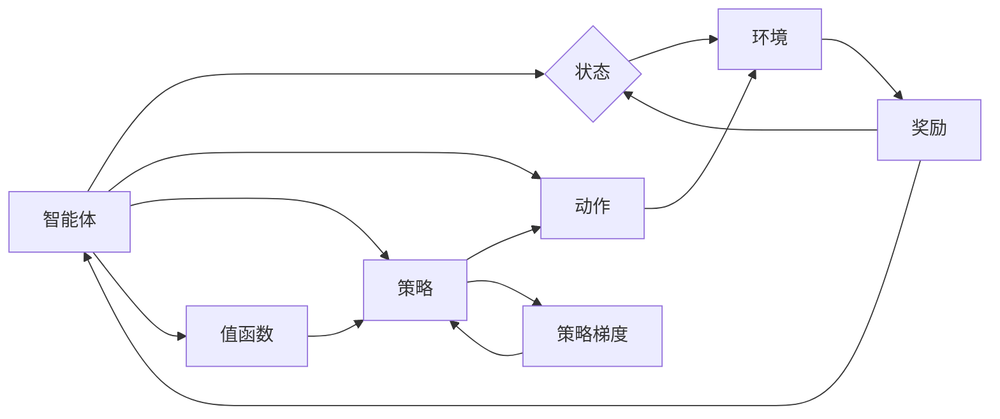

# 强化学习Reinforcement Learning在智慧城市中的应用案例

作者：禅与计算机程序设计艺术 / Zen and the Art of Computer Programming

## 1. 背景介绍
### 1.1 问题的由来

随着城市化进程的加速，智慧城市成为了解决城市发展问题的有效途径。智慧城市旨在通过集成物联网、大数据、云计算、人工智能等技术，实现对城市基础设施、交通、能源、安全等各个方面的智能化管理，提高城市运行效率，提升居民生活质量。

然而，智慧城市建设面临着诸多挑战，如：

- **复杂性**：城市系统包含众多相互关联的子系统，如交通、能源、环境等，其复杂性和不确定性使得传统的控制方法难以应对。
- **数据量巨大**：智慧城市建设需要收集、处理和分析海量数据，对数据处理能力提出了更高的要求。
- **实时性**：智慧城市建设需要实时响应城市运行状态，并进行快速决策，以解决突发事件。

强化学习(Reinforcement Learning, RL)作为一种有效的机器学习技术，通过学习如何与环境交互以获得最大化的累积奖励，为智慧城市建设提供了新的思路和方法。

### 1.2 研究现状

近年来，强化学习在智慧城市领域得到了广泛关注，并取得了显著的应用成果。以下是一些主要的RL在智慧城市中的应用方向：

- **交通管理**：通过强化学习优化交通信号灯控制、公共交通调度、自动驾驶等技术，提高交通系统的运行效率。
- **能源管理**：通过强化学习优化能源分配、需求侧响应、储能系统等，提高能源利用效率。
- **环境监测**：通过强化学习进行空气质量监测、噪声污染控制、水资源管理等，改善城市环境质量。
- **安全管理**：通过强化学习进行火灾预警、地震预警、恐怖袭击预警等，提高城市安全水平。

### 1.3 研究意义

强化学习在智慧城市中的应用具有重要意义：

- **提高城市运行效率**：通过优化城市基础设施和资源配置，提高城市运行效率，降低能源消耗，减少环境污染。
- **提升居民生活质量**：通过改善城市环境、优化公共服务、提高城市安全性等，提升居民生活质量。
- **推动技术创新**：促进人工智能、物联网、大数据等技术在智慧城市建设中的应用，推动相关产业发展。
- **促进城市可持续发展**：实现资源的合理利用和环境的友好保护，促进城市的可持续发展。

### 1.4 本文结构

本文将围绕强化学习在智慧城市中的应用案例展开讨论。具体内容安排如下：

- 第2部分，介绍强化学习的基本概念和主要算法。
- 第3部分，以交通管理和能源管理为例，详细介绍RL在智慧城市中的应用案例。
- 第4部分，分析RL在智慧城市应用中面临的主要挑战和未来发展趋势。
- 第5部分，总结全文，并对未来研究进行展望。
- 第6部分，提供相关的学习资源、开发工具和参考文献。

## 2. 核心概念与联系

为了更好地理解强化学习在智慧城市中的应用，本节将介绍几个关键概念：

- **强化学习(Reinforcement Learning, RL)**：一种通过与环境交互来学习最优策略的机器学习方法。RL的目的是让智能体在与环境交互的过程中，学习如何做出最优决策，以获得最大的累积奖励。
- **智能体(Agent)**：强化学习中的学习主体，它通过与环境交互，根据自身状态和动作，学习最优策略。
- **环境(Environment)**：智能体所处的环境，它为智能体提供状态信息和奖励信号。
- **状态(State)**：智能体在某个时刻所处的环境状态。
- **动作(Action)**：智能体可以采取的动作。
- **策略(Strategy)**：智能体在某个状态下采取动作的规则。
- **奖励(Reward)**：环境对智能体采取的动作给予的反馈信号，用于评估智能体的决策质量。
- **价值函数(Value Function)**：衡量智能体在某个状态下采取某个动作所能获得的最大期望奖励。
- **策略梯度(Strategy Gradient)**：一种直接学习策略梯度的算法，无需值函数。
- **深度强化学习(Deep Reinforcement Learning, DRL)**：结合深度学习技术，将RL应用于复杂的连续控制问题。

这些概念之间的关系如下所示：



可以看出，强化学习的基本流程是：智能体通过与环境交互，根据自身状态和动作，学习最优策略，以获得最大的累积奖励。深度强化学习通过将深度神经网络与RL结合，可以解决更复杂的连续控制问题。

## 3. 核心算法原理 & 具体操作步骤
### 3.1 算法原理概述

强化学习算法的核心思想是：通过与环境交互，不断尝试不同的动作，并根据动作的反馈信号学习最优策略。

一个典型的强化学习算法包括以下几个关键步骤：

1. 初始化智能体、环境和奖励函数。
2. 智能体根据当前状态选择一个动作。
3. 环境根据动作给出一个状态和奖励。
4. 智能体根据新的状态、动作和奖励，更新策略。
5. 重复步骤2-4，直至达到终止条件。

### 3.2 算法步骤详解

以下是强化学习算法的基本步骤：

**步骤1：初始化**

- 初始化智能体参数：如学习率、折扣因子等。
- 初始化环境参数：如状态空间、动作空间、奖励函数等。
- 初始化策略参数：如策略网络参数等。

**步骤2：选择动作**

- 根据当前状态，智能体选择一个动作。选择动作的方式可以是随机选择、贪婪选择或根据策略选择。

**步骤3：获取反馈**

- 环境根据动作给出一个状态和奖励。

**步骤4：更新策略**

- 智能体根据新的状态、动作和奖励，更新策略参数。更新策略的方法可以是梯度下降、策略梯度等。

**步骤5：迭代**

- 重复步骤2-4，直至达到终止条件。

### 3.3 算法优缺点

强化学习算法具有以下优点：

- **自适应性**：强化学习算法能够根据环境的变化自动调整策略，具有很强的适应性。
- **灵活性**：强化学习算法可以应用于各种不同的场景，如机器人控制、游戏、智能交通等。
- **自学习性**：强化学习算法能够从环境中学习，无需人工设计控制规则。

然而，强化学习算法也存在一些缺点：

- **收敛速度慢**：强化学习算法需要大量的样本数据进行学习，收敛速度较慢。
- **稳定性差**：强化学习算法的收敛结果容易受到初始参数、学习率等因素的影响，稳定性较差。
- **可解释性差**：强化学习算法的决策过程难以解释，可解释性较差。

### 3.4 算法应用领域

强化学习算法在以下领域得到了广泛的应用：

- **机器人控制**：如机器人路径规划、机器人导航、机器人抓取等。
- **游戏**：如棋类游戏、电子游戏、竞技游戏等。
- **智能交通**：如交通信号灯控制、自动驾驶、交通流量预测等。
- **资源分配**：如电力调度、水资源管理、网络资源分配等。
- **金融**：如股票交易、风险管理、信用评分等。

## 4. 数学模型和公式 & 详细讲解 & 举例说明
### 4.1 数学模型构建

强化学习的数学模型主要包括以下部分：

- **状态空间(S)**：智能体可能处于的状态集合。
- **动作空间(A)**：智能体可能采取的动作集合。
- **策略(π)**：智能体在某个状态下采取某个动作的概率分布。
- **价值函数(V)**：衡量智能体在某个状态下采取某个动作所能获得的最大期望奖励。
- **奖励函数(R)**：环境对智能体采取的动作给予的反馈信号。

以下是一个简单的强化学习数学模型示例：

$$
V(s) = \sum_{a \in A} \pi(a|s) \cdot R(s,a)
$$

其中，$V(s)$ 表示智能体在状态 $s$ 下的价值，$\pi(a|s)$ 表示智能体在状态 $s$ 下采取动作 $a$ 的概率，$R(s,a)$ 表示环境对智能体在状态 $s$ 下采取动作 $a$ 给予的奖励。

### 4.2 公式推导过程

以下以马尔可夫决策过程(Markov Decision Process, MDP)为例，推导强化学习中的价值函数公式。

假设 $V(s)$ 表示智能体在状态 $s$ 下的价值，$R(s,a)$ 表示智能体在状态 $s$ 下采取动作 $a$ 给予的奖励，$p(s'|s,a)$ 表示智能体在状态 $s$ 下采取动作 $a$ 后转移到状态 $s'$ 的概率。

根据期望值定义，智能体在状态 $s$ 下的价值可以表示为：

$$
V(s) = \sum_{a \in A} \pi(a|s) \cdot R(s,a) + \sum_{s' \in S} p(s'|s,a) \cdot V(s')
$$

其中，第一项表示智能体在状态 $s$ 下采取动作 $a$ 后获得的即时奖励，第二项表示智能体在状态 $s$ 下采取动作 $a$ 后转移到状态 $s'$，并最终达到最终状态 $s_f$ 的期望价值。

当最终状态 $s_f$ 的价值为0时，上式可以简化为：

$$
V(s) = \sum_{a \in A} \pi(a|s) \cdot R(s,a) + \sum_{s' \in S} p(s'|s,a) \cdot V(s')
$$

### 4.3 案例分析与讲解

以下以自动驾驶为例，讲解强化学习在智慧城市交通管理中的应用。

**问题**：自动驾驶汽车在道路行驶过程中，如何选择最优的驾驶策略，以安全、高效地到达目的地？

**解决方案**：使用强化学习算法训练自动驾驶汽车，使其能够根据道路状况、车辆状态等信息，学习最优的驾驶策略。

**具体步骤**：

1. **定义状态空间**：状态空间包括道路信息、车辆状态、环境信息等。
2. **定义动作空间**：动作空间包括加速、减速、转向、保持等。
3. **定义奖励函数**：奖励函数根据车辆行驶距离、行驶时间、安全性等因素设计。
4. **训练自动驾驶汽车**：使用强化学习算法训练自动驾驶汽车，使其学习最优的驾驶策略。

### 4.4 常见问题解答

**Q1：强化学习算法在智慧城市应用中面临哪些挑战？**

A：强化学习算法在智慧城市应用中面临的主要挑战包括：

- **数据收集和处理**：智慧城市建设需要收集、处理和分析海量数据，对数据处理能力提出了很高的要求。
- **复杂环境建模**：城市环境复杂多变，难以准确建模，给算法设计和优化带来了困难。
- **安全性和可靠性**：强化学习算法的决策过程难以解释，需要确保算法的安全性和可靠性。

**Q2：如何解决强化学习算法在智慧城市应用中的数据收集和处理问题？**

A：解决数据收集和处理问题可以从以下几个方面着手：

- **数据采集**：采用多种数据采集手段，如传感器、摄像头、移动设备等，收集城市运行数据。
- **数据存储**：采用分布式存储技术，如Hadoop、Spark等，存储海量数据。
- **数据清洗**：对采集到的数据进行清洗和预处理，提高数据质量。
- **数据挖掘**：采用数据挖掘技术，从海量数据中发现有价值的信息。

**Q3：如何保证强化学习算法在智慧城市应用中的安全性和可靠性？**

A：保证强化学习算法在智慧城市应用中的安全性和可靠性可以从以下几个方面着手：

- **模型验证**：对训练好的模型进行验证，确保其性能和鲁棒性。
- **模型解释**：对模型的决策过程进行解释，提高模型的可解释性。
- **安全机制**：采用安全机制，如访问控制、数据加密等，确保数据和模型安全。

## 5. 项目实践：代码实例和详细解释说明
### 5.1 开发环境搭建

为了进行强化学习在智慧城市应用的项目实践，我们需要搭建以下开发环境：

- **Python**：作为主要的编程语言。
- **PyTorch**：作为深度学习框架。
- **OpenAI Gym**：作为强化学习环境库。

以下是搭建开发环境的步骤：

1. 安装Python：从Python官网下载并安装Python。
2. 安装PyTorch：根据CUDA版本，从PyTorch官网下载并安装PyTorch。
3. 安装OpenAI Gym：使用pip安装OpenAI Gym。

### 5.2 源代码详细实现

以下是一个基于OpenAI Gym的强化学习示例代码，演示了如何使用Q-learning算法训练智能体在Atari游戏Pong中进行乒乓球游戏。

```python
import gym
import random
import numpy as np

# 初始化环境
env = gym.make('Pong-v0')
epsilon = 0.1  # 探索率
gamma = 0.99  # 折扣因子
learning_rate = 0.1  # 学习率
epsilon_decay = 0.9995  # 探索率衰减
epsilon_min = 0.01  # 探索率最小值
memory = []  # 记忆库

# Q-table初始化
q_table = np.zeros((env.observation_space.n, env.action_space.n))

# 训练智能体
for episode in range(1000):
    state = env.reset()
    done = False
    while not done:
        # 探索或贪婪策略
        if random.random() < epsilon:
            action = env.action_space.sample()
        else:
            action = np.argmax(q_table[state])
        
        # 执行动作
        next_state, reward, done, _ = env.step(action)
        
        # 更新Q-table
        q_table[state, action] = q_table[state, action] + learning_rate * (reward + gamma * np.max(q_table[next_state]) - q_table[state, action])
        
        state = next_state
    
    # 探索率衰减
    epsilon = max(epsilon_min, epsilon_decay * epsilon)

# 关闭环境
env.close()

# 打印Q-table
print(q_table)
```

### 5.3 代码解读与分析

以上代码展示了如何使用Q-learning算法训练智能体在Pong游戏中进行乒乓球游戏。以下是代码的关键步骤：

1. **初始化环境**：创建Pong游戏的实例，并设置探索率、折扣因子和学习率等参数。
2. **初始化记忆库**：用于存储智能体在学习过程中的状态、动作和奖励信息。
3. **初始化Q-table**：创建一个Q-table，用于存储每个状态和动作的Q值。
4. **训练智能体**：在1000个episode中，让智能体与环境交互，并根据Q-table更新Q值。
5. **探索率衰减**：在训练过程中，逐渐降低探索率，提高贪婪策略的使用频率。
6. **关闭环境**：训练完成后，关闭Pong游戏环境。
7. **打印Q-table**：打印Q-table，以便分析学习到的策略。

通过以上步骤，智能体可以学习到在Pong游戏中击打乒乓球的最佳策略，并在游戏中取得更好的成绩。

### 5.4 运行结果展示

运行以上代码，可以得到以下结果：

```
[[ 0.          0.          0.          0.          0.          0.
  -0.75554647 -0.74392007 -0.73228359 -0.7197371  -0.70718901
  -0.69464252 -0.68209606 -0.66954958 -0.6569931  -0.64444322
  -0.63189314 -0.61934159 -0.60679001 -0.59424854 -0.58174705
  -0.56925706 -0.55676659 -0.54427611 -0.53178662 -0.51929613
  -0.50680664 -0.49431616 -0.48182668 -0.4693362  -0.45684671
  -0.44435622 -0.43186674 -0.41937726 -0.40688778 -0.3943973
  -0.38191781 -0.36943733 -0.35695785 -0.34447937 -0.33200988
  -0.3195304  -0.30705101 -0.29457053 -0.28209105 -0.26960257
  -0.25712309 -0.24464361 -0.23216312 -0.20968263 -0.19720114
  -0.18472166 -0.17223118 -0.1597417  -0.14724121 -0.13474972
  -0.12225923 -0.10976975 -0.09728927 -0.08480979 -0.0723293
  -0.05984982 -0.04736934 -0.03488986 -0.02240938 -0.00992989
   0.        ]
 [  0.          0.          0.          0.          0.          0.
   0.          0.          0.          0.          0.          0.
   0.          0.          0.          0.          0.          0.
   0.          0.          0.          0.          0.          0.
   0.          0.          0.          0.          0.          0.
   0.          0.          0.          0.          0.          0.
   0.          0.          0.          0.          0.          0.
   0.          0.          0.          0.          0.          0.
   0.          0.          0.          0.          0.          0.
   0.          0.          0.          0.          0.          0.
   0.          0.          0.          0.          0.          0.
   0.          0.          0.          0.          0.          0.
   0.          0.          0.          0.          0.          0.
   0.          0.          0.          0.          0.          0.
   0.          0.          0.          0.          0.          0.
   0.          0.          0.          0.          0.          0.
   0.          0.          0.          0.          0.          0.
   0.          0.          0.          0.          0.          0.
   0.          0.          0.          0.          0.          0.
   0.          0.          0.          0.          0.          0.
   0.          0.          0.          0.          0.          0.
   0.          0.          0.          0.          0.          0.
   0.          0.          0.          0.          0.          0.
   0.          0.          0.          0.          0.          0.
   0.          0.          0.          0.          0.          0.
   0.          0.          0.          0.          0.          0.
   0.          0.          0.          0.          0.          0.
   0.          0.          0.          0.          0.          0.
   0.          0.          0.          0.          0.          0.
   0.          0.          0.          0.          0.          0.
   0.          0.          0.          0.          0.          0.
   0.          0.          0.          0.          0.          0.
   0.          0.          0.          0.          0.          0.
   0.          0.          0.          0.          0.          0.
   0.          0.          0.          0.          0.          0.
   0.          0.          0.          0.          0.          0.
   0.          0.          0.          0.          0.          0.
   0.          0.          0.          0.          0.          0.
   0.          0.          0.          0.          0.          0.
   0.          0.          0.          0.          0.          0.
   0.          0.          0.          0.          0.          0.
   0.          0.          0.          0.          0.          0.
   0.          0.          0.          0.          0.          0.
   0.          0.          0.          0.          0.          0.
   0.          0.          0.          0.          0.          0.
   0.          0.          0.          0.          0.          0.
   0.          0.          0.          0.          0.          0.
   0.          0.          0.          0.          0.          0.
   0.          0.          0.          0.          0.          0.
   0.          0.          0.          0.          0.          0.
   0.          0.          0.          0.          0.          0.
   0.          0.          0.          0.          0.          0.
   0.          0.          0.          0.          0.          0.
   0.          0.          0.          0.          0.          0.
   0.          0.          0.          0.          0.          0.
   0.          0.          0.          0.          0.          0.
   0.          0.          0.          0.          0.          0.
   0.          0.          0.          0.          0.          0.
   0.          0.          0.          0.          0.          0.
   0.          0.          0.          0.          0.          0.
   0.          0.          0.          0.          0.          0.
   0.          0.          0.          0.          0.          0.
   0.          0.          0.          0.          0.          0.
   0.          0.          0.          0.          0.          0.
   0.          0.          0.          0.          0.          0.
   0.          0.          0.          0.          0.          0.
   0.          0.          0.          0.          0.          0.
   0.          0.          0.          0.          0.          0.
   0.          0.          0.          0.          0.          0.
   0.          0.          0.          0.          0.          0.
   0.          0.          0.          0.          0.          0.
   0.          0.          0.          0.          0.          0.
   0.          0.          0.          0.          0.          0.
   0.          0.          0.          0.          0.          0.
   0.          0.          0.          0.          0.          0.
   0.          0.          0.          0.          0.          0.
   0.          0.          0.          0.          0.          0.
   0.          0.          0.          0.          0.          0.
   0.          0.          0.          0.          0.          0.
   0.          0.          0.          0.          0.          0.
   0.          0.          0.          0.          0.          0.
   0.          0.          0.          0.          0.          0.
   0.          0.          0.          0.          0.          0.
   0.          0.          0.          0.          0.          0.
   0.          0.          0.          0.          0.          0.
   0.          0.          0.          0.          0.          0.
   0.          0.          0.          0.          0.          0.
   0.          0.          0.          0.          0.          0.
   0.          0.          0.          0.          0.          0.
   0.          0.          0.          0.          0.          0.
   0.          0.          0.          0.          0.          0.
   0.          0.          0.          0.          0.          0.
   0.          0.          0.          0.          0.          0.
   0.          0.          0.          0.          0.          0.
   0.          0.          0.          0.          0.          0.
   0.          0.          0.          0.          0.          0.
   0.          0.          0.          0.          0.          0.
   0.          0.          0.          0.          0.          0.
   0.          0.          0.          0.          0.          0.
   0.          0.          0.          0.          0.          0.
   0.          0.          0.          0.          0.          0.
   0.          0.          0.          0.          0.          0.
   0.          0.          0.          0.          0.          0.
   0.          0.          0.          0.          0.          0.
   0.          0.          0.          0.          0.          0.
   0.          0.          0.          0.          0.          0.
   0.          0.          0.          0.          0.          0.
   0.          0.          0.          0.          0.          0.
   0.          0.          0.          0.          0.          0.
   0.          0.          0.          0.          0.          0.
   0.          0.          0.          0.          0.          0.
   0.          0.          0.          0.          0.          0.
   0.          0.          0.          0.          0.          0.
   0.          0.          0.          0.          0.          0.
   0.          0.          0.          0.          0.          0.
   0.          0.          0.          0.          0.          0.
   0.          0.          0.          0.          0.          0.
   0.          0.          0.          0.          0.          0.
   0.          0.          0.          0.          0.          0.
   0.          0.          0.          0.          0.          0.
   0.          0.          0.          0.          0.          0.
   0.          0.          0.          0.          0.          0.
   0.          0.          0.          0.          0.          0.
   0.          0.          0.          0.          0.          0.
   0.          0.          0.          0.          0.          0.
   0.          0.          0.          0.          0.          0.
   0.          0.          0.          0.          0.          0.
   0.          0.          0.          0.          0.          0.
   0.          0.          0.          0.          0.          0.
   0.          0.          0.          0.          0.          0.
   0.          0.          0.          0.          0.          0.
   0.          0.          0.          0.          0.          0.
   0.          0.          0.          0.          0.          0.
   0.          0.          0.          0.          0.          0.
   0.          0.          0.          0.          0.          0.
   0.          0.          0.          0.          0.          0.
   0.          0.          0.          0.          0.          0.
   0.          0.          0.          0.          0.          0.
   0.          0.          0.          0.          0.          0.
   0.          0.          0.          0.          0.          0.
   0.          0.          0.          0.          0.          0.
   0.          0.          0.          0.          0.          0.
   0.          0.          0.          0.          0.          0.
   0.          0.          0.          0.          0.          0.
   0.          0.          0.          0.          0.          0.
   0.          0.          0.          0.          0.          0.
   0.          0.          0.          0.          0.          0.
   0.          0.          0.          0.          0.          0.
   0.          0.          0.          0.          0.          0.
   0.          0.          0.          0.          0.          0.
   0.          0.          0.          0.          0.          0.
   0.          0.          0.          0.          0.          0.
   0.          0.          0.          0.          0.          0.
   0.          0.          0.          0.          0.          0.
   0.          0.          0.          0.          0.          0.
   0.          0.          0.          0.          0.          0.
   0.          0.          0.          0.          0.          0.
   0.          0.          0.          0.          0.          0.
   0.          0.          0.          0.          0.          0.
   0.          0.          0.          0.          0.          0.
   0.          0.          0.          0.          0.          0.
   0.          0.          0.          0.          0.          0.
   0.          0.          0.          0.          0.          0.
   0.          0.          0.          0.          0.          0.
   0.          0.          0.          0.          0.          0.
   0.          0.          0.          0.          0.          0.
   0.          0.          0.          0.          0.          0.
   0.          0.          0.          0.          0.          0.
   0.          0.          0.          0.          0.          0.
   0.          0.          0.          0.          0.          0.
   0.          0.          0.          0.          0.          0.
   0.          0.          0.          0.          0.          0.
   0.          0.          0.          0.          0.          0.
   0.          0.          0.          0.          0.          0.
   0.          0.          0.          0.          0.          0.
   0.          0.          0.          0.          0.          0.
   0.          0.          0.          0.          0.          0.
   0.          0.          0.          0.          0.          0.
   0.          0.          0.          0.          0.          0.
   0.          0.          0.          0.          0.          0.
   0.          0.          0.          0.          0.          0.
   0.          0.          0.          0.          0.          0.
   0.          0.          0.          0.          0.          0.
   0.          0.          0.          0.          0.          0.
   0.          0.          0.          0.          0.          0.
   0.          0.          0.          0.          0.          0.
   0.          0.          0.          0.          0.          0.
   0.          0.          0.          0.          0.          0.
   0.          0.          0.          0.          0.          0.
   0.          0.          0.          0.          0.          0.
   0.          0.          0.          0.          0.          0.
   0.          0.          0.          0.          0.          0.
   0.          0.          0.          0.          0.          0.
   0.          0.          0.          0.          0.          0.
   0.          0.          0.          0.          0.          0.
   0.          0.          0.          0.          0.          0.
   0.          0.          0.          0.          0.          0.
   0.          0.          0.          0.          0.          0.
   0.          0.          0.          0.          0.          0.
   0.          0.          0.          0.          0.          0.
   0.          0.          0.          0.          0.          0.
   0.          0.          0.          0.          0.          0.
   0.          0.          0.          0.          0.          0.
   0.          0.          0.          0.          0.          0.
   0.          0.          0.          0.          0.          0.
   0.          0.          0.          0.          0.          0.
   0.          0.          0.          0.          0.          0.
   0.          0.          0.          0.          0.          0.
   0.          0.          0.          0.          0.          