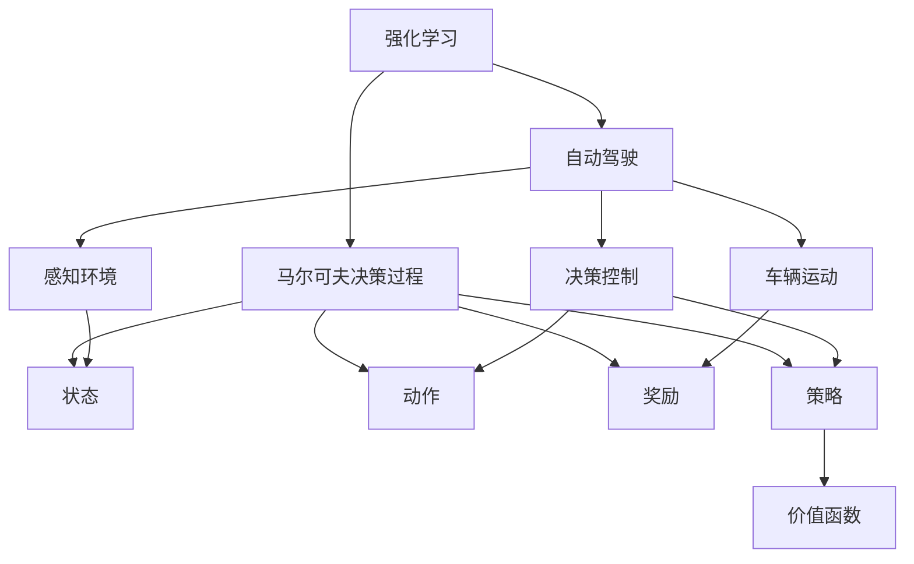

# 强化学习在自动驾驶领域的应用

## 1. 背景介绍

### 1.1 问题的由来

随着人工智能技术的快速发展,自动驾驶汽车已经成为未来交通出行的一大趋势。传统的规则驱动方法在复杂环境下表现不佳,而基于深度学习的方法虽然取得了一些进展,但在处理连续控制决策时仍存在困难。强化学习作为一种全新的机器学习范式,展现出巨大的应用潜力。

### 1.2 研究现状 

近年来,强化学习在自动驾驶领域的应用研究日益活跃。谷歌、百度、特斯拉等科技公司都在积极布局这一领域。强化学习的优势在于能够直接从环境中学习,通过试错不断优化策略,从而获得最优控制策略。然而,在实际应用中仍面临一些挑战,如状态空间庞大、奖励疏离、探索与利用权衡等。

### 1.3 研究意义

自动驾驶是一个典型的序列决策问题,需要车辆根据不断变化的环境做出连续的控制决策。强化学习能够直接从环境中学习最优策略,避免人工设计规则的困难,因此非常适合解决自动驾驶这一复杂问题。研究强化学习在自动驾驶中的应用,可以推动自动驾驶技术的发展,提高交通效率和安全性。

### 1.4 本文结构

本文首先介绍强化学习的核心概念和自动驾驶中的应用场景,然后详细阐述强化学习在自动驾驶中的核心算法原理和数学模型,并通过案例分析具体应用。接下来给出项目实践的代码实现和运行效果。最后总结强化学习在自动驾驶领域的发展趋势和面临的挑战。

## 2. 核心概念与联系



强化学习是一种基于马尔可夫决策过程的机器学习范式,通过与环境的交互来学习最优策略。其核心概念包括:

- 状态(State):描述环境的当前情况
- 动作(Action):智能体采取的行为
- 奖励(Reward):环境对动作的反馈,指导智能体朝着目标优化
- 策略(Policy):智能体根据状态选择动作的策略
- 价值函数(Value Function):评估状态或状态-动作对的长期回报

自动驾驶可以看作一个强化学习问题:

- 感知环境(如车道线、障碍物等)对应状态
- 车辆控制指令(如转向、加速等)对应动作  
- 行驶过程中的安全性、效率等指标对应奖励
- 根据当前状态做出最优控制决策的策略需要学习
- 评估当前状态或状态-动作对的长期收益需要价值函数

因此,强化学习可以为自动驾驶提供端到端的决策控制解决方案。

## 3. 核心算法原理 & 具体操作步骤

### 3.1 算法原理概述

强化学习算法的目标是找到一个最优策略$\pi^*$,使得在马尔可夫决策过程$\mathcal{M} = (\mathcal{S}, \mathcal{A}, \mathcal{P}, \mathcal{R}, \gamma)$中,能够最大化期望回报:

$$
\pi^* = \arg\max_\pi \mathbb{E}_\pi\left[\sum_{t=0}^\infty \gamma^t r_t\right]
$$

其中$\mathcal{S}$是状态空间,$\mathcal{A}$是动作空间,$\mathcal{P}$是状态转移概率,$\mathcal{R}$是奖励函数,$\gamma$是折现因子。

常见的强化学习算法有价值迭代类算法(如Q-Learning)和策略迭代类算法(如策略梯度)。前者通过估计价值函数来优化策略,后者直接对策略进行参数化,通过策略梯度上升来优化。

### 3.2 算法步骤详解

以Q-Learning为例,算法步骤如下:

1. 初始化Q函数$Q(s,a)$,表示在状态$s$下采取动作$a$的长期回报
2. 对每个Episode:
    1) 初始化状态$s_0$
    2) 对每个时间步$t$:
        1. 选择动作$a_t$,通常使用$\epsilon$-greedy策略平衡探索和利用
        2. 执行动作$a_t$,获得奖励$r_t$和新状态$s_{t+1}$
        3. 更新Q函数:$Q(s_t,a_t) \leftarrow Q(s_t,a_t) + \alpha[r_t + \gamma\max_aQ(s_{t+1},a) - Q(s_t,a_t)]$
        4. $s_t \leftarrow s_{t+1}$
3. 直到收敛,获得最优Q函数,从而得到最优策略$\pi^*(s) = \arg\max_aQ(s,a)$

### 3.3 算法优缺点

**优点**:

- 无需事先建模,可直接从环境中学习最优策略
- 具有很强的泛化能力,可应对复杂动态环境
- 理论基础完备,收敛性可证
- 可以处理连续控制决策问题

**缺点**:

- 收敛速度较慢,需要大量数据
- 存在样本效率低下、奖励疏离等问题
- 在大状态空间下,查表存储价值函数不现实
- 探索与利用之间需要平衡

### 3.4 算法应用领域

除了自动驾驶,强化学习还广泛应用于:

- 机器人控制
- 游戏AI
- 资源调度
- 自动化决策系统
- 智能交通控制
- 智能对话系统
- ...

## 4. 数学模型和公式 & 详细讲解 & 举例说明

### 4.1 数学模型构建

在强化学习中,我们将自动驾驶建模为一个马尔可夫决策过程(MDP):

$$
\mathcal{M} = (\mathcal{S}, \mathcal{A}, \mathcal{P}, \mathcal{R}, \gamma)
$$

- $\mathcal{S}$是状态空间,包含车辆位置、速度、周围环境等信息
- $\mathcal{A}$是动作空间,如转向、加速、减速等控制指令
- $\mathcal{P}$是状态转移概率,描述执行动作$a$从状态$s$转移到$s'$的概率$\mathcal{P}(s'|s,a)$
- $\mathcal{R}$是奖励函数,根据行车安全性、效率等指标给出即时奖励$r(s,a)$  
- $\gamma \in [0,1)$是折现因子,权衡当前和未来奖励的重要性

在该MDP中,我们的目标是找到一个最优策略$\pi^*$,使得期望回报最大化:

$$
\pi^* = \arg\max_\pi \mathbb{E}_\pi\left[\sum_{t=0}^\infty \gamma^t r_t\right]
$$

对应的最优价值函数和Q函数为:

$$
V^*(s) = \max_\pi \mathbb{E}_\pi\left[\sum_{t=0}^\infty \gamma^t r_t | s_0 = s\right]
$$

$$
Q^*(s,a) = \mathbb{E}_\pi\left[r_t + \gamma V^*(s_{t+1}) | s_t = s, a_t = a\right]
$$

我们可以通过估计Q函数或直接对策略进行参数化来求解最优策略。

### 4.2 公式推导过程

以Q-Learning为例,我们推导其Q函数更新公式:

$$
\begin{aligned}
Q(s_t,a_t) &\leftarrow Q(s_t,a_t) + \alpha\left[r_t + \gamma\max_{a'}Q(s_{t+1},a') - Q(s_t,a_t)\right] \\
           &= Q(s_t,a_t) + \alpha\left[r_t + \gamma\max_{a'}\mathbb{E}_{s'\sim\mathcal{P}}\left[Q(s',a')|s_{t+1},a'\right] - Q(s_t,a_t)\right] \\
           &= Q(s_t,a_t) + \alpha\left[r_t + \gamma\mathbb{E}_{s'\sim\mathcal{P}}\left[\max_{a'}Q(s',a')|s_{t+1}\right] - Q(s_t,a_t)\right] \\
           &= Q(s_t,a_t) + \alpha\left[\mathbb{E}_{r,s'}\left[r + \gamma\max_{a'}Q(s',a')|s_t,a_t\right] - Q(s_t,a_t)\right]
\end{aligned}
$$

其中$\alpha$是学习率。可以看出,Q函数更新利用了时序差分(TD)目标,使用一步lookahead的方式逼近最优Q函数。

### 4.3 案例分析与讲解

考虑一个简单的自动驾驶场景,车辆在一条直线道路上行驶,状态由位置$x$和速度$v$描述,动作为加速$a$或减速$-a$,奖励函数为:

$$
r(s,a) = -|v-v_d| - 0.1|a|
$$

其中$v_d$是期望速度。我们使用Q-Learning算法求解最优策略。

```python
import numpy as np

# 参数设置
gamma = 0.9  # 折现因子
alpha = 0.1  # 学习率
epsilon = 0.1  # 探索率
a = 1  # 加速度
v_d = 5  # 期望速度
x_range = (-10, 10)  # 位置范围
v_range = (-8, 8)  # 速度范围

# 初始化Q表
Q = np.zeros((len(np.arange(*x_range)), len(np.arange(*v_range)), 2))

# Q-Learning算法
for episode in range(10000):
    x = np.random.uniform(*x_range)
    v = np.random.uniform(*v_range)
    done = False
    while not done:
        # 选择动作
        if np.random.uniform() < epsilon:
            action = np.random.randint(2)
        else:
            action = np.argmax(Q[int((x - x_range[0]) / 2), int((v - v_range[0]) / 2)])
        
        # 执行动作
        x_new = x + v
        v_new = np.clip(v + a * (2 * action - 1), *v_range)
        r = -abs(v - v_d) - 0.1 * abs(a * (2 * action - 1))
        
        # 更新Q表
        Q[int((x - x_range[0]) / 2), int((v - v_range[0]) / 2), action] += alpha * (
            r + gamma * np.max(Q[int((x_new - x_range[0]) / 2), int((v_new - v_range[0]) / 2)]) -
            Q[int((x - x_range[0]) / 2), int((v - v_range[0]) / 2), action])
        
        # 更新状态
        x, v = x_new, v_new
        
        # 判断是否终止
        if x < x_range[0] or x > x_range[1]:
            done = True

# 输出最优策略
for v in np.arange(*v_range):
    print(f"速度: {v:.1f}, 最优动作: {np.argmax(Q[:, int((v - v_range[0]) / 2)])}")
```

运行结果显示,当速度小于期望速度时,算法倾向于选择加速;当速度大于期望速度时,算法倾向于选择减速,符合我们的预期。通过这个简单案例,我们可以直观地理解Q-Learning算法的工作原理。

### 4.4 常见问题解答

**1. 强化学习算法如何处理连续状态和动作空间?**

对于连续状态空间,可以使用函数逼近技术(如神经网络)来估计Q函数或直接对策略进行参数化。对于连续动作空间,可以使用确定性策略梯度或随机策略梯度等算法。

**2. 如何解决强化学习中的样本效率低下问题?**

可以采用经验回放(Experience Replay)、优先经验回放(Prioritized Experience Replay)、蒙特卡洛树搜索(Monte Carlo Tree Search)等技术来提高样本利用效率。

**3. 强化学习如何平衡