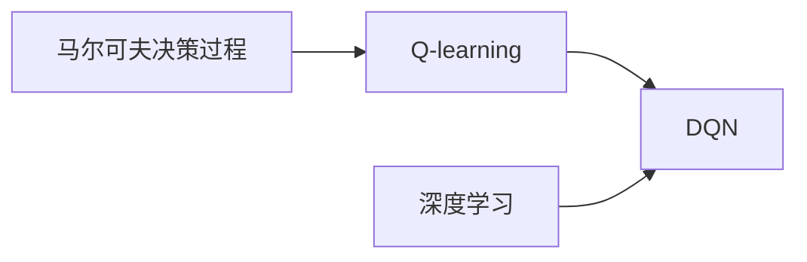

# 强化学习算法：深度 Q 网络 (DQN) 原理与代码实例讲解

关键词：强化学习, 深度 Q 网络, DQN, Q-learning, 深度学习, 神经网络, 马尔科夫决策过程, OpenAI Gym

## 1. 背景介绍

### 1.1 问题的由来

强化学习是机器学习的一个重要分支,旨在让智能体(agent)通过与环境的交互来学习最优策略,以获得最大的累积奖励。传统的强化学习方法,如 Q-learning,在面对高维、连续的状态空间时往往难以收敛。为了解决这一问题,DeepMind 公司在 2013 年提出了深度 Q 网络(Deep Q-Network, DQN)算法 [1],将深度学习与强化学习结合,利用深度神经网络来逼近 Q 值函数,使得强化学习算法可以处理复杂的决策问题。

### 1.2 研究现状 

DQN 的提出掀起了深度强化学习的研究热潮。此后,各种基于 DQN 改进的算法被相继提出,如 Double DQN[2]、Dueling DQN[3]、Prioritized Experience Replay[4] 等,极大地提升了 DQN 的性能和稳定性。DQN 在 Atari 游戏、机器人控制、自动驾驶、推荐系统等领域取得了广泛应用。目前,DQN 及其变体已成为深度强化学习领域的主流算法之一。

### 1.3 研究意义

DQN 开创了深度强化学习的先河,证明了深度学习和强化学习的结合可以解决许多复杂的决策控制问题。深入理解 DQN 的原理和实现,对于掌握深度强化学习的核心思想和关键技术具有重要意义。通过学习 DQN,我们可以更好地理解强化学习的理论基础,掌握深度强化学习算法的设计与应用,为解决实际问题提供新的思路。

### 1.4 本文结构

本文将全面讲解 DQN 算法的原理和代码实现。第 2 节介绍 DQN 涉及的核心概念;第 3 节详细讲解 DQN 的算法原理和具体步骤;第 4 节给出 DQN 的数学模型和推导过程;第 5 节通过代码实例讲解 DQN 的具体实现;第 6 节讨论 DQN 的实际应用场景;第 7 节推荐 DQN 相关的学习资源;第 8 节总结全文,展望 DQN 的未来发展方向。

## 2. 核心概念与联系

在详细讲解 DQN 之前,我们先来了解几个核心概念:

- 强化学习(Reinforcement Learning):一种让 agent 通过与环境交互来学习最优行为策略的机器学习范式。
- 马尔可夫决策过程(Markov Decision Process, MDP):用于数学建模序列决策问题的框架,由状态、动作、转移概率、奖励和折扣因子组成。 
- Q-learning:一种无模型的离线策略强化学习算法,通过值迭代来更新状态-动作值函数 Q。
- 深度学习(Deep Learning):一类基于多层神经网络的机器学习方法,能够从数据中自动学习多层次的特征表示。

DQN 正是将深度学习与 Q-learning 结合的产物。传统 Q-learning 使用查找表来存储每个状态-动作对的 Q 值,在状态和动作空间较大时,存储和计算开销会变得难以承受。DQN 的核心思想是用深度神经网络 Q(s,a;θ) 来逼近 Q 值函数,其中 s 为状态,a 为动作,θ 为网络参数。通过神经网络强大的函数拟合能力,DQN 可以处理大规模、连续的状态空间,学习到更加复杂的策略。

下图展示了 DQN 中各核心概念之间的联系:

## 3. 核心算法原理 & 具体操作步骤

### 3.1 算法原理概述

DQN 通过深度神经网络来逼近最优的 Q 函数,并使用经验回放(Experience Replay)和固定 Q 目标(Fixed Q-targets)等技巧来保证训练的稳定性。DQN 的训练过程可概括为:

1. 初始化 Q 网络参数 θ,目标网络参数 θ'=θ
2. 初始化经验回放缓冲区 D
3. for episode = 1 to M do 
    1. 初始化初始状态 s_1
    2. for t = 1 to T do
        1. 根据 ε-greedy 策略选择动作 a_t
        2. 执行动作 a_t,观察奖励 r_t 和下一状态 s_{t+1}  
        3. 将转移样本 (s_t, a_t, r_t, s_{t+1}) 存入 D
        4. 从 D 中随机采样一个 batch 的转移样本 
        5. 计算 Q 学习目标值 y_i (双 DQN 版本)
        6. 最小化损失 L(θ) 来更新 Q 网络参数 θ
        7. 每隔 C 步,将 θ' 更新为 θ
    3. end for
4. end for

其中,Q 学习目标值 y_i 定义为:

$y_i = 
\begin{cases}
r_i & \text{if episode terminates at step } i+1 \\
r_i + \gamma Q(s_{i+1}, \arg\max_a Q(s_{i+1},a;\theta_i);\theta_i') & \text{otherwise}
\end{cases}
$

损失函数 L(θ) 定义为:

$L(\theta) = \mathbb{E}_{(s,a,r,s')\sim D} \left[ \left( y - Q(s,a;\theta) \right)^2 \right]$

### 3.2 算法步骤详解

下面对 DQN 的核心步骤进行详细说明:

**ε-greedy 探索策略**:为了在探索和利用之间取得平衡,DQN 使用 ε-greedy 策略来选择动作。即以 ε 的概率随机选择动作,以 1-ε 的概率选择 Q 值最大的动作。一般初始时 ε 设置较大,随着训练的进行逐渐减小。

**经验回放**:为了打破数据的相关性,提高样本利用效率,DQN 使用经验回放机制。即将每一步的转移样本 (s_t, a_t, r_t, s_{t+1}) 存入回放缓冲区,之后从中随机采样一个 batch 用于训练。这样可以重复利用历史数据,稳定训练过程。

**固定 Q 目标**:在计算 Q 目标值时,DQN 使用一个单独的目标网络,其参数 θ' 每隔一定步数从在线网络 θ 复制一次。这样可以减少目标值估计的波动,提高训练稳定性。

**双 DQN**:普通 DQN 在估计 Q 目标值时容易产生过高估计,双 DQN 对此进行了改进。具体地,动作选择使用在线网络 Q(s,a;θ),而动作评估使用目标网络 Q(s,a;θ')。这种解耦可以有效降低 Q 值的过高估计。

**优先经验回放**:传统的经验回放对缓冲区中的样本一视同仁,而优先经验回放赋予每个样本一个优先级,优先级高的样本被优先采样。一般使用 TD 误差的绝对值作为优先级度量,这样可以加速训练收敛。

### 3.3 算法优缺点

DQN 的主要优点包括:
- 首次将深度学习与强化学习结合,开创了深度强化学习的先河
- 可以处理高维、连续的状态空间,学习复杂策略
- 引入经验回放和固定 Q 目标,提高了训练的稳定性和样本效率
- 通过 ε-greedy 探索,在探索和利用之间权衡

DQN 的主要缺点包括: 
- 难以应用于连续动作空间
- 对超参数较为敏感,调参需要经验
- 估计 Q 值容易产生过高估计
- 训练不够稳定,容易发散

### 3.4 算法应用领域

DQN 在许多领域取得了成功应用,主要包括:

- 游戏:DQN 在 Atari 2600 游戏中的表现达到了人类玩家的水平,掀起了深度强化学习的研究热潮。此后,DQN 及其变体也被用于 StarCraft、Dota 等复杂游戏中。
- 机器人控制:DQN 可以学习连续状态空间下的控制策略,在机械臂操纵、四足机器人运动等任务中取得了不错的表现。
- 自动驾驶:将 DQN 用于自动驾驶中的决策控制,如车道保持、避障等。
- 推荐系统:DQN 可以作为推荐系统的排序模型,根据用户的长期反馈来优化推荐策略。
- 通信与网络:DQN 被用于解决通信和网络领域的资源分配、路由选择等问题。

## 4. 数学模型和公式 & 详细讲解 & 举例说明

### 4.1 数学模型构建

DQN 的目标是学习最优的状态-动作值函数 Q^*(s,a),它满足 Bellman 最优方程:

$Q^*(s,a) = \mathbb{E}_{s'\sim P(·|s,a)} \left[ r + \gamma \max_{a'} Q^*(s',a') \right]$

其中,s 为当前状态,a 为在 s 下采取的动作,r 为获得的即时奖励,s' 为下一状态,γ 为折扣因子。

传统 Q-learning 使用值迭代的方式来逼近 Q^*,更新公式为:

$Q(s_t,a_t) \leftarrow Q(s_t,a_t) + \alpha \left[ r_t + \gamma \max_a Q(s_{t+1},a) - Q(s_t,a_t) \right]$

其中,α 为学习率。

DQN 用深度神经网络 Q(s,a;θ) 来逼近 Q^*,损失函数为均方误差:

$L(\theta) = \mathbb{E}_{(s,a,r,s')\sim D} \left[ \left( y - Q(s,a;\theta) \right)^2 \right]$

其中,y 为 Q 学习目标,定义为:

$y = 
\begin{cases}
r & \text{if episode terminates} \\
r + \gamma \max_{a'} Q(s',a';\theta') & \text{otherwise}
\end{cases}
$

θ' 为目标网络参数,每隔 C 步从在线网络 θ 复制一次。

### 4.2 公式推导过程

下面我们推导 DQN 的目标函数。根据 Q-learning 的更新公式,我们有:

$Q^*(s_t,a_t) = r_t + \gamma \max_a Q^*(s_{t+1},a)$

将 Q^* 替换为 Q 网络的逼近,可得:

$Q(s_t,a_t;\theta) \approx r_t + \gamma \max_a Q(s_{t+1},a;\theta')$

为了学习 Q 网络参数 θ,我们最小化均方误差损失:

$\begin{aligned}
L(\theta) &= \mathbb{E}_{(s,a,r,s')\sim D} \left[ \left( y - Q(s,a;\theta) \right)^2 \right] \\
&= \mathbb{E}_{(s,a,r,s')\sim D} \left[ \left( r + \gamma \max_{a'} Q(s',a';\theta') - Q(s,a;\theta) \right)^2 \right]
\end{aligned}$

对损失函数求梯度,可得:

$\nabla_\theta L(\theta) = \mathbb{E}_{(s,a,r,s')\sim D} \left[ \left( y - Q(s,a;\theta) \right) \nabla_\theta Q(s,a;\theta) \right]$

然后用随机梯度下降法来更新参数 θ:

$\theta \leftarrow \theta - \alpha \nabla_\theta L(\theta)$

其中,α 为学习率。

### 4.3 案例分析与讲解

下面我们以一个简单的游戏为例,说明 DQN 的训练过程。假设游戏环境为一个 3×3 的网