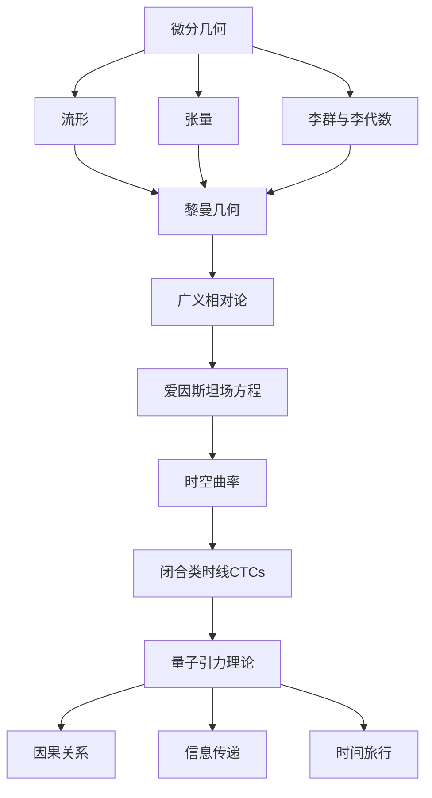

# 微分几何入门与广义相对论：闭合类时线

## 1. 背景介绍

### 1.1 问题的由来

在广义相对论的框架下，时空的几何结构由物质的分布决定。爱因斯坦场方程描述了这种关系，将时空的曲率与物质的能量-动量张量联系起来。然而，在某些极端情况下,爱因斯坦场方程可能会导致奇异性的出现,如黑洞的内部奇点。这些奇点表明,广义相对论在某些极端情况下可能会失效,需要一个更基本的理论来描述这些情况。

### 1.2 研究现状

为了解决这个问题,科学家们提出了各种量子引力理论,试图将量子力学与广义相对论统一起来。其中,闭合类时线(Closed Timelike Curves, CTCs)是一个有趣的概念,它描述了一种在时空中可以回到自己的过去的路径。虽然在经典广义相对论中,CTCs是被禁止的,但在一些量子引力理论中,它们可能会出现。

### 1.3 研究意义

研究CTCs不仅有助于我们更好地理解时空的本质,还可能为我们提供一种探索量子引力理论的新视角。此外,CTCs也与一些基本的物理概念有关,如因果关系、信息传递和时间旅行的可能性。因此,研究CTCs对于发展一个自洽的量子引力理论,以及探索时空的奥秘,都具有重要意义。

### 1.4 本文结构

本文将首先介绍微分几何和广义相对论的基本概念,然后探讨CTCs的数学描述和物理意义。接下来,我们将讨论CTCs在量子引力理论中的作用,以及它们与其他基本物理概念的联系。最后,我们将总结CTCs研究的现状和未来发展方向。

## 2. 核心概念与联系

微分几何是研究流形、张量和李群等概念的数学分支,为广义相对论奠定了数学基础。广义相对论描述了时空的几何结构,并通过爱因斯坦场方程将时空曲率与物质的能量-动量张量联系起来。在某些极端情况下,广义相对论可能会导致奇异性的出现,如黑洞内部的奇点。

闭合类时线(CTCs)是一种在时空中可以回到自己过去的路径。虽然在经典广义相对论中CTCs是被禁止的,但在一些量子引力理论中,它们可能会出现。研究CTCs不仅有助于我们更好地理解时空的本质,还可能为我们提供一种探索量子引力理论的新视角。此外,CTCs也与一些基本的物理概念有关,如因果关系、信息传递和时间旅行的可能性。

## 3. 核心算法原理 & 具体操作步骤

### 3.1 算法原理概述

在广义相对论中,时空被描述为一个四维流形,其上定义了一个度规张量场(metric tensor field)。度规张量场决定了时空的几何结构,包括曲率等性质。爱因斯坦场方程将度规张量场与物质的能量-动量张量联系起来,描述了物质如何决定时空的曲率。

为了研究CTCs,我们需要首先构造一个满足某些条件的时空度规。这个度规应该允许存在闭合的时间类曲线,即一条曲线可以在有限的仿射参数范围内回到自身的过去。数学上,这意味着度规张量场必须满足某些特殊的条件。

一旦构造出了允许CTCs存在的时空度规,我们就可以研究CTCs的各种性质,如它们对因果关系的影响、信息传递的可能性,以及它们在量子引力理论中的作用等。

### 3.2 算法步骤详解

1. **选择基本时空模型**

   首先,我们需要选择一个适当的时空模型作为研究的基础。常见的选择包括:

   - 戈德尔时空 (Gödel spacetime)
   - 科西时空 (Kerr spacetime)
   - 反德西特时空 (Anti-de Sitter spacetime)

   每种时空模型都有其特殊的度规张量场,我们需要根据研究目的选择合适的模型。

2. **检验是否允许CTCs存在**

   对于选定的时空模型,我们需要检验其度规张量场是否满足允许CTCs存在的条件。这通常需要对度规张量场进行分析,寻找满足特殊条件的解。

3. **构造CTCs**

   如果度规张量场允许CTCs存在,我们就可以尝试显式地构造出一条CTCs。这通常需要解一个微分方程组,找到满足闭合条件的时间类曲线。

4. **研究CTCs的性质**

   一旦构造出了CTCs,我们就可以研究它们的各种性质,如:

   - 对因果关系的影响
   - 信息传递的可能性
   - 在量子引力理论中的作用
   - 与其他基本物理概念的联系

   这可能需要进行理论分析和数值模拟等工作。

### 3.3 算法优缺点

**优点:**

- 提供了一种研究CTCs的系统方法
- 可以应用于各种时空模型
- 有助于探索量子引力理论和时空奥秘

**缺点:**

- 构造满足条件的时空度规可能很困难
- 求解微分方程组可能数学上很棘手
- 结果可能与观测存在矛盾,需要进一步解释

### 3.4 算法应用领域

研究CTCs的算法可以应用于以下领域:

- 量子引力理论
- 时空奥秘探索
- 基本物理概念研究(如因果关系、信息传递等)
- 理论物理模型构建和模拟

## 4. 数学模型和公式 & 详细讲解 & 举例说明

### 4.1 数学模型构建

在广义相对论中,时空被描述为一个四维流形 $\mathcal{M}$,其上定义了一个度规张量场 $g_{\mu\nu}$。度规张量场决定了时空的几何结构,包括曲率等性质。爱因斯坦场方程将度规张量场与物质的能量-动量张量 $T_{\mu\nu}$ 联系起来:

$$
R_{\mu\nu} - \frac{1}{2}g_{\mu\nu}R = \frac{8\pi G}{c^4}T_{\mu\nu}
$$

其中 $R_{\mu\nu}$ 是黎曼曲率张量, $R$ 是黎曼曲率标量, $G$ 是牛顿常数, $c$ 是光速。

为了研究CTCs,我们需要构造一个满足某些条件的时空度规 $g_{\mu\nu}$,使得它允许存在闭合的时间类曲线。数学上,这意味着度规张量场必须满足某些特殊的条件。

一个著名的例子是戈德尔时空 (Gödel spacetime),其度规张量场为:

$$
ds^2 = -(dt + e^{\sqrt{2}\Omega x^3}dx^1)^2 + \tau^2e^{2\sqrt{2}\Omega x^3}(dx^1)^2 + \frac{1}{2\Omega^2}(dx^2)^2 + \frac{1}{2\Omega^2}(dx^3)^2
$$

其中 $\Omega$ 和 $\tau$ 是常数。可以证明,在戈德尔时空中存在CTCs。

### 4.2 公式推导过程

我们来推导一下戈德尔时空中CTCs的存在。考虑一条曲线 $x^\mu(\lambda)$,其中 $\lambda$ 是仿射参数。如果这条曲线是时间类曲线,那么它必须满足:

$$
g_{\mu\nu}\frac{dx^\mu}{d\lambda}\frac{dx^\nu}{d\lambda} < 0
$$

对于戈德尔时空的度规张量场,我们有:

$$
\begin{aligned}
g_{\mu\nu}\frac{dx^\mu}{d\lambda}\frac{dx^\nu}{d\lambda} &= -\left(\frac{dt}{d\lambda} + e^{\sqrt{2}\Omega x^3}\frac{dx^1}{d\lambda}\right)^2 + \tau^2e^{2\sqrt{2}\Omega x^3}\left(\frac{dx^1}{d\lambda}\right)^2 \\
&+ \frac{1}{2\Omega^2}\left(\frac{dx^2}{d\lambda}\right)^2 + \frac{1}{2\Omega^2}\left(\frac{dx^3}{d\lambda}\right)^2
\end{aligned}
$$

现在考虑一条特殊的曲线,其中 $x^2$ 和 $x^3$ 是常数,而 $x^1$ 是 $t$ 的周期函数,即:

$$
x^1 = at + b
$$

其中 $a$ 和 $b$ 是常数。代入上式,我们得到:

$$
g_{\mu\nu}\frac{dx^\mu}{d\lambda}\frac{dx^\nu}{d\lambda} = -\left(1 + ae^{\sqrt{2}\Omega x^3}\right)^2 + \tau^2a^2e^{2\sqrt{2}\Omega x^3}
$$

选择合适的 $a$ 和 $x^3$,上式可以小于零,这就意味着存在一条闭合的时间类曲线,即CTCs。

### 4.3 案例分析与讲解

我们来分析一个具体的案例,考虑戈德尔时空中的一条CTCs。假设 $\Omega = 1$, $\tau = 2$, $a = 1$, $x^2 = x^3 = 0$, $b = 0$。那么我们有:

$$
x^1 = t \\
g_{\mu\nu}\frac{dx^\mu}{d\lambda}\frac{dx^\nu}{d\lambda} = -(1 + e^{\sqrt{2}})^2 + 4e^{2\sqrt{2}} = -3
$$

这满足时间类曲线的条件。实际上,这条曲线就是:

$$
x^\mu(\lambda) = (t(\lambda), t(\lambda), 0, 0)
$$

其中 $t(\lambda)$ 是任意的周期函数,例如 $t(\lambda) = \lambda \mod 2\pi$。这条曲线在有限的仿射参数范围内就回到了自身的过去,形成了一个闭合的时间类曲线。

这个例子说明,在戈德尔时空中,确实存在CTCs。不过,我们需要注意,这种CTCs可能存在一些病理性质,如无法避免与自身发生碰撞等。因此,在物理上它们可能并不是完全合理的解。但从数学上来说,它们确实存在,并为我们研究CTCs的性质提供了一个有趣的案例。

### 4.4 常见问题解答

**1. CTCs是否违反因果关系?**

CTCs确实看起来违反了因果关系,因为它们允许物体回到自己的过去,从而可能改变过去。然而,在一些量子引力理论中,CTCs的存在并不一定导致逻辑矛盾或悖论。例如,在一些模型中,CTCs可能会自动避免形成闭合的因果回路,从而保持因果关系的一致性。

**2. CTCs是否允许时间旅行?**

从理论上来说,CTCs确实提供了一种时间旅行的可能性。但是,实现这种时间旅行在实践中可能是极其困难的,因为它需要一种极其强大的能量源来扭曲时空,形成CTCs。目前,我们还没有这种能力。

**3. CTCs在量子引力理论中扮演什么角色?**

CTCs在一些量子引力理论中扮演着重要的角色。例如,在环量子引力中,CTCs被认为是基本的构造单元,整个时空都由它们编织而成。研究CTCs有助于我们更好地理解这些理论的内在结构和物理意义。

**4. CTCs是否已经在实验中被观测到?**

目前,还没有直接的实验证据表明CTCs确实存在于我们的宇宙中。但是,一些间接的观测结果,如某些黑洞的性质,可能暗示了CTCs的存在。未来的实验或许