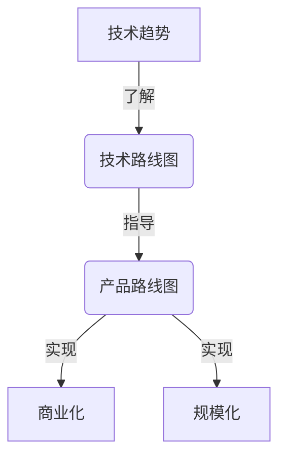

# 怎样具体规划并实施软件产品技术路线图，紧跟前沿技术趋势，实现产品商业化和规模化

## 1. 背景介绍

### 1.1 问题的由来

在当今瞬息万变的科技领域，软件产品公司面临着巨大的挑战——如何保持产品的竞争力并实现可持续发展。技术的快速迭代和用户需求的不断变化,要求公司必须紧跟前沿技术趋势,并将其融入产品路线图中。同时,成功的产品商业化和规模化也是公司发展的关键目标。

因此,制定明智的软件产品技术路线图,融合创新技术,满足用户需求,实现产品商业化和规模化,成为公司发展的当务之急。然而,这并非一蹴而就的过程,需要系统的规划和审慎的实施。

### 1.2 研究现状

许多公司都意识到了技术路线图的重要性,但在实际执行过程中却面临诸多挑战。一些公司过于追逐短期利益,忽视了长期技术发展的重要性;另一些公司则盲目跟风,缺乏对技术趋势的深入理解和审慎评估。

此外,产品商业化和规模化也是一个错综复杂的过程,需要考虑市场需求、竞争格局、运营模式等多方面因素。许多公司在这一过程中举步维艰,难以取得理想的成果。

### 1.3 研究意义

制定并实施合理的软件产品技术路线图,对于公司的可持续发展至关重要。通过深入研究这一领域,我们可以帮助公司:

1. 洞察技术发展趋势,把握创新机遇
2. 优化产品技术架构,提高产品竞争力
3. 规避技术风险,降低研发成本
4. 实现产品商业化和规模化,获得可观收益

因此,本文对于指导公司制定和实施软件产品技术路线图具有重要的理论和实践意义。

### 1.4 本文结构

本文将从以下几个方面深入探讨软件产品技术路线图的规划和实施:

1. 核心概念与联系
2. 核心算法原理与具体操作步骤
3. 数学模型和公式详细讲解与案例分析
4. 项目实践:代码实例和详细解释
5. 实际应用场景和未来展望
6. 工具和资源推荐
7. 总结:未来发展趋势与挑战
8. 附录:常见问题与解答

## 2. 核心概念与联系

在探讨软件产品技术路线图之前,我们需要了解一些核心概念及其相互关系:

1. **技术路线图(Technology Roadmap)**: 一种规划和可视化技术发展方向的工具,用于指导公司的技术决策和资源分配。它通常包括当前技术状况、未来技术目标和实现这些目标所需的行动计划。

2. **产品路线图(Product Roadmap)**: 一种规划和可视化产品发展方向的工具,用于指导产品功能、版本和发布计划。它通常包括产品愿景、目标、功能列表和里程碑。

3. **技术趋势(Technology Trend)**: 描述技术发展的总体方向和模式,包括新兴技术、颠覆性创新和行业实践的变化。了解技术趋势有助于公司做出明智的技术决策。

4. **商业化(Commercialization)**: 将技术或产品转化为可销售的商品或服务的过程,包括市场调研、定价策略、营销推广等活动。

5. **规模化(Scaling)**: 扩大产品或服务的规模,以满足不断增长的市场需求,包括扩展基础设施、优化运营流程等活动。

这些概念相互关联、相辅相成。技术路线图为产品路线图提供技术支持,产品路线图则反映了公司的商业目标。了解技术趋势有助于制定合理的技术路线图,而成功的商业化和规模化则需要依赖于优秀的产品和技术。

下面是这些核心概念及其关系的Mermaid流程图:

## 3. 核心算法原理 & 具体操作步骤

### 3.1 算法原理概述

制定和实施软件产品技术路线图是一个系统的过程,需要遵循一定的原理和步骤。我们将介绍一种通用的算法,它包括以下几个关键步骤:

1. **趋势分析(Trend Analysis)**: 持续关注技术发展趋势,识别关键技术和创新机会。
2. **需求评估(Requirement Assessment)**: 评估用户需求和市场需求,确定产品的功能和性能目标。
3. **技术评估(Technology Evaluation)**: 评估现有技术架构和能力,识别技术差距和风险。
4. **路线图规划(Roadmap Planning)**: 根据趋势分析、需求评估和技术评估的结果,制定技术路线图和产品路线图。
5. **实施与迭代(Implementation and Iteration)**: 按照路线图执行研发活动,持续评估和调整路线图。

这种算法强调了持续的分析、评估和迭代,以确保技术路线图与产品需求、市场趋势和公司战略保持一致。

### 3.2 算法步骤详解

接下来,我们将详细解释每个步骤的具体操作方法:

#### 3.2.1 趋势分析

趋势分析是制定技术路线图的基础,它包括以下几个关键活动:

1. **技术监控(Technology Monitoring)**: 持续关注技术领域的最新进展,包括新兴技术、研究成果、行业实践等。可以通过阅读技术文献、参加会议、关注行业领袖等方式获取信息。

2. **趋势识别(Trend Identification)**: 从大量技术信息中识别出真正的趋势,区分短期热点和长期趋势。可以使用定性和定量方法,如专家评估、统计分析等。

3. **影响评估(Impact Assessment)**: 评估识别出的技术趋势对公司产品和业务的潜在影响,包括机遇和风险。这需要结合公司的战略目标和产品特点进行分析。

4. **优先排序(Prioritization)**: 根据影响评估的结果,对技术趋势进行优先排序,确定需要重点关注和投资的领域。

#### 3.2.2 需求评估

需求评估旨在确定产品的功能和性能目标,以满足用户和市场需求。它包括以下几个关键活动:

1. **用户需求收集(User Requirement Gathering)**: 通过用户访谈、调查、反馈分析等方式,收集用户对产品的需求和期望。

2. **市场需求分析(Market Requirement Analysis)**: 分析目标市场的规模、增长趋势、竞争格局等,识别市场需求和机会。

3. **需求优先排序(Requirement Prioritization)**: 根据用户需求、市场需求和公司战略,对需求进行优先排序,确定产品的关键功能和性能目标。

4. **可行性评估(Feasibility Assessment)**: 评估实现这些需求的技术可行性、成本和风险,为路线图规划提供依据。

#### 3.2.3 技术评估

技术评估旨在评估现有技术架构和能力,识别技术差距和风险,为制定技术路线图奠定基础。它包括以下几个关键活动:

1. **架构评审(Architecture Review)**: 对现有产品的技术架构进行全面评审,包括架构设计、代码质量、性能、可扩展性等方面。

2. **能力评估(Capability Assessment)**: 评估公司在关键技术领域的研发能力,包括人员、工具、流程等方面。

3. **差距分析(Gap Analysis)**: 将需求评估的结果与现有技术架构和能力进行对比,识别技术差距和风险。

4. **风险缓解策略(Risk Mitigation Strategy)**: 针对识别出的技术风险,制定缓解策略,如技术升级、人员培训、外包等。

#### 3.2.4 路线图规划

路线图规划是将前面的分析和评估结果整合起来,制定技术路线图和产品路线图。它包括以下几个关键活动:

1. **目标设定(Goal Setting)**: 根据公司战略、趋势分析、需求评估和技术评估的结果,设定技术路线图和产品路线图的总体目标。

2. **里程碑规划(Milestone Planning)**: 将总体目标分解为一系列具体的里程碑,包括技术里程碑和产品里程碑,并确定每个里程碑的时间计划。

3. **资源规划(Resource Planning)**: 根据里程碑计划,规划所需的人力、财力和其他资源,确保路线图的顺利实施。

4. **风险管理(Risk Management)**: 识别路线图实施过程中可能面临的风险,制定风险缓解和应对策略。

5. **路线图可视化(Roadmap Visualization)**: 将技术路线图和产品路线图以直观的方式呈现出来,方便沟通和管理。

#### 3.2.5 实施与迭代

路线图规划完成后,就需要按照计划执行研发活动,并持续评估和调整路线图。这一步骤包括以下几个关键活动:

1. **研发执行(Development Execution)**: 按照技术路线图和产品路线图的里程碑计划,执行相应的研发活动,包括技术研究、架构设计、代码实现等。

2. **进度跟踪(Progress Tracking)**: 持续跟踪研发进度,确保按计划推进,并及时发现和解决问题。

3. **路线图评审(Roadmap Review)**: 定期评审技术路线图和产品路线图,根据新的技术趋势、需求变化和实施进展进行调整。

4. **持续改进(Continuous Improvement)**: 基于路线图评审的结果,持续优化技术架构、研发流程和管理方式,提高效率和质量。

### 3.3 算法优缺点

上述算法具有以下优点:

1. **系统性**: 算法将技术路线图的制定和实施过程分解为多个环节,体现了系统性和全面性。

2. **灵活性**: 算法强调持续评估和迭代,能够适应技术趋势和需求的变化。

3. **可视化**: 算法强调路线图的可视化,有助于沟通和管理。

4. **风险管控**: 算法重视风险识别和缓解,有助于降低技术风险和实施风险。

然而,该算法也存在一些缺点和挑战:

1. **复杂性**: 算法涉及多个环节和活动,对公司的管理能力和资源投入要求较高。

2. **数据依赖**: 算法的有效性依赖于准确的数据输入,如趋势信息、需求信息和技术评估结果。

3. **人员素质**: 算法的实施需要高素质的人员,包括技术专家、产品经理和项目经理。

4. **组织文化**: 算法的顺利实施需要公司具有开放、创新和协作的组织文化。

### 3.4 算法应用领域

该算法可以广泛应用于不同类型的软件产品公司,包括:

1. **互联网公司**: 互联网行业技术迭代快,用户需求变化频繁,需要制定明确的技术路线图来保持竞争力。

2. **企业软件公司**: 企业软件需要满足复杂的业务需求,技术架构的选择和演进至关重要。

3. **嵌入式系统公司**: 嵌入式系统面临硬件平台的更迭,需要及时升级技术架构以适应新平台。

4. **游戏公司**: 游戏引擎和图形渲染技术快速发展,游戏公司需要紧跟技术趋势以保持竞争力。

5. **人工智能公司**: 人工智能技术日新月异,公司需要制定清晰的技术路线图来把握创新机遇。

总之,任何需要持续创新和技术演进的软件产品公司,都可以借鉴该算法来规划和实施技术路线图。

## 4. 数学模型和公式 & 详细讲解 & 举例说明

在制定和实施软件产品技术路线图的过程中,我们可以借助一些数学模型和公式来量化和