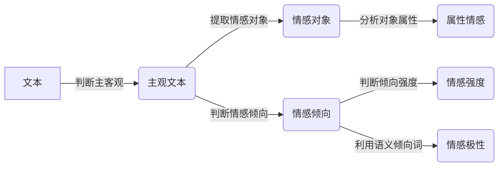

# 情感分析(Sentiment Analysis)原理与代码实战案例讲解

## 1. 背景介绍
### 1.1 问题的由来
随着互联网的快速发展,社交媒体、电商平台、新闻网站等渠道产生了海量的用户评论、反馈等文本数据。这些数据蕴含着丰富的情感倾向信息,如用户对产品、服务、热点事件的态度等。然而,海量的文本数据也给信息处理和分析带来了巨大挑战。人工阅读和判断每一条评论的情感显然是不现实的。因此,自动、高效、准确地分析文本情感,挖掘有价值的信息,成为了自然语言处理领域的重要课题,具有广阔的应用前景。

### 1.2 研究现状
情感分析作为自然语言处理和文本挖掘的重要分支,经过多年的发展已经取得了长足的进步。目前主要有以下几类主流方法:

(1)基于情感词典的方法。该方法需要构建情感词典,包含各类情感词汇(如"喜欢"、"讨厌"等)及其对应的情感极性和强度。然后对文本中出现的情感词进行统计,综合得出文本的情感倾向。优点是简单直观,缺点是难以处理语义较复杂的句子。

(2)基于机器学习的方法。将情感分析看作一个分类问题,从标注数据中学习文本特征与情感类别之间的映射关系。常用的机器学习模型有朴素贝叶斯、支持向量机、逻辑回归等。优点是可以构建更加复杂的特征,提高分类准确率。缺点是需要大量标注数据,特征工程复杂。

(3)基于深度学习的方法。利用深度神经网络自动学习文本的层次化特征表示,避免了繁琐的特征工程。常见的模型有 CNN、RNN、Transformer 等。优点是特征学习能力强,准确率高,缺点是需要海量训练数据和算力。

### 1.3 研究意义
情感分析在舆情监测、个性化推荐、客户服务等领域有广泛应用,主要体现在:

(1)了解用户口碑和评价。通过分析用户在社交媒体、电商网站的评论,可以洞察用户对产品、服务的真实看法,发现优缺点,为产品改进提供依据。

(2)监测舆情动向。对网络舆论进行情感分析,可以第一时间发现负面信息,预警潜在的声誉危机,助力企业公关管理。

(3)个性化推荐。分析用户历史评论的情感倾向,可以推断其喜好,实现个性化的信息和商品推荐,提升用户体验。

(4)提升客户服务。自动对用户反馈进行情感判断,对负面评论及时预警和处理,对正面评价表示感谢,提高客户满意度。

### 1.4 本文结构
本文将重点介绍情感分析的核心概念、常用算法、数学模型,并通过实战案例演示情感分析的代码实现。内容安排如下:

第2部分介绍情感分析的核心概念。
第3部分讲解几种主流的情感分析算法原理和步骤。 
第4部分介绍情感分析常用的数学模型和公式。
第5部分通过代码实战案例,演示情感分析的具体实现。
第6部分总结情感分析的应用场景。
第7部分推荐情感分析的学习资源和工具。
第8部分对情感分析的研究现状和未来趋势进行总结展望。

## 2. 核心概念与联系
情感分析的目标是自动判断文本的情感倾向,核心概念包括:

(1)情感倾向(Sentiment Polarity):指文本所表达的情感是积极(Positive)、消极(Negative)还是中性(Neutral)。 

(2)情感强度(Sentiment Intensity):指情感倾向的程度,如非常积极、较为积极、较为消极、非常消极等。

(3)情感对象(Opinion Target):指文本评论针对的对象,可以是产品、人物、事件等。

(4)主观性(Subjectivity):指文本是客观陈述还是主观评价。情感分析一般针对主观文本。

(5)语义倾向(Semantic Orientation):指词语和短语所隐含的情感倾向。

这些概念之间的联系可以用下图表示:

可以看出,对文本进行主客观判断后,提取主观文本针对的情感对象,分析对象的属性情感。同时判断主观文本的整体情感倾向,并进一步分析情感倾向的强度。其中情感倾向和强度的判断可以利用语义倾向词。

## 3. 核心算法原理 & 具体操作步骤
### 3.1 算法原理概述
情感分析的核心是文本分类,将文本映射到离散的情感类别。下面介绍几种常用算法:

(1)基于词典的方法。构建情感词典,统计文本中情感词的出现频次和极性,综合得出文本情感倾向。优点是简单直观,缺点是覆盖面有限,对复杂语义处理能力弱。

(2)朴素贝叶斯算法。基于贝叶斯定理和特征独立性假设,学习先验概率和条件概率,对新文本进行后验概率预测。优点是原理简单,训练和预测速度快,缺点是特征独立性假设过于理想化。

(3)支持向量机。将文本映射到高维特征空间,寻找最优分类超平面。引入核函数可以处理非线性问题。优点是分类效果好,可解释性强,缺点是训练速度慢,参数调优复杂。

(4)神经网络。通过多层神经元连接,自动学习文本深层特征。如 CNN 可以提取局部特征,RNN 可以建模序列依赖,Transformer 可以并行学习全局语义。优点是特征学习能力强,缺点是需要大量训练数据,训练成本高。

### 3.2 算法步骤详解
以朴素贝叶斯为例,详细说明实现步骤:

输入:训练文本集 $D=\{(d_1,c_1),...,(d_n,c_n)\}$,其中 $d_i$ 为文本, $c_i$ 为情感类别。
输出:朴素贝叶斯分类器 $f:d \rightarrow c$。

(1)文本预处理:对文本进行分词、去停用词、词形还原等操作,得到特征词集合。

(2)特征选择:过滤低频词和无信息词,降维并提高分类效率。常用 DF、MI、IG 等指标。

(3)计算先验概率:$P(c)=\frac{|D_c|}{|D|}$,其中 $|D_c|$ 为类别 $c$ 的文本数。

(4)计算条件概率:$P(w|c)=\frac{count(w,c)+1}{count(c)+|V|}$,其中 $count(w,c)$ 为词 $w$ 在 $c$ 类文本中出现的次数,$|V|$ 为词汇表大小。

(5)对新文本 $d$ 进行预测:$c^*=\mathop{\arg\max}_{c \in C} P(c|d)=\mathop{\arg\max}_{c \in C} P(c)\prod_{i=1}^{n}P(w_i|c)$。

(6)返回所得类别 $c^*$ 作为文本 $d$ 的情感倾向。

### 3.3 算法优缺点
朴素贝叶斯的优点是:
- 原理简单,易于实现。
- 训练和预测速度快,适合大规模文本分类。
- 对缺失数据不敏感,泛化能力强。

缺点是:
- 特征独立性假设过于理想,实际文本中词之间存在依赖。
- 需要大量训练数据,小规模数据容易欠拟合。
- 对词序和语义结构缺乏建模,语义理解能力有限。

### 3.4 算法应用领域
基于机器学习的情感分析在很多领域有应用,如:
- 舆情监控:分析社交媒体用户对热点事件的情感反应,实时掌握网民观点。
- 产品评论分析:挖掘用户对产品的评价倾向,发现产品优势和不足。
- 客户服务:自动对用户反馈进行情感分类,优先处理负面评价。
- 金融市场:分析财经新闻、股评的情感倾向,预测市场趋势。

## 4. 数学模型和公式 & 详细讲解 & 举例说明
### 4.1 数学模型构建
情感分析可以形式化为一个文本分类问题。给定文本集合 $D=\{d_1,...,d_n\}$ 和情感类别集合 $C=\{c_1,...,c_m\}$,目标是学习一个分类器 $f:D \rightarrow C$,对新文本 $d$ 预测其情感倾向 $c$。

常见的分类器包括朴素贝叶斯、逻辑回归、支持向量机等。以二分类问题为例,记情感类别 $c \in \{0,1\}$,文本 $d$ 表示为词袋向量 $\vec{d}=(x_1,...,x_n)$。

### 4.2 公式推导过程
#### 朴素贝叶斯
基于贝叶斯公式,有 $P(c|\vec{d})=\frac{P(\vec{d}|c)P(c)}{P(\vec{d})}$。
朴素贝叶斯假设文本中词之间相互独立,因此:

$$P(\vec{d}|c)=\prod_{i=1}^{n}P(x_i|c)$$

$P(c)$ 为先验概率,表示类别 $c$ 出现的概率。$P(x_i|c)$ 为条件概率,表示类别 $c$ 下词 $x_i$ 出现的概率,可通过极大似然估计得到:

$$P(c)=\frac{|D_c|}{|D|}$$

$$P(x_i|c)=\frac{count(x_i,c)+1}{count(c)+|V|}$$

其中 $|D_c|$ 为类别 $c$ 的文本数,$count(x_i,c)$ 为词 $x_i$ 在 $c$ 类文本中出现的次数,$|V|$ 为词汇表大小。

对新文本 $\vec{d}$ 进行预测时,比较两个类别的后验概率,取较大者:

$$c^*=\mathop{\arg\max}_{c \in \{0,1\}} P(c|\vec{d})=\mathop{\arg\max}_{c \in \{0,1\}} P(c)\prod_{i=1}^{n}P(x_i|c)$$

#### 逻辑回归
逻辑回归将后验概率 $P(c|\vec{d})$ 建模为 $\vec{d}$ 的线性函数,并用 Sigmoid 函数将其映射到 [0,1] 区间:

$$P(c=1|\vec{d})=\frac{1}{1+e^{-(\vec{w} \cdot \vec{d}+b)}}$$

其中 $\vec{w},b$ 为待学习的参数。用极大似然估计学习参数,损失函数为:

$$J(\vec{w},b)=-\sum_{i=1}^{m}[y_i \log P(c=1|\vec{d_i})+(1-y_i) \log (1-P(c=1|\vec{d_i}))]$$

其中 $y_i$ 为文本 $d_i$ 的真实标签。用梯度下降法最小化损失函数求解参数。

对新文本进行预测时,根据后验概率与阈值(通常取0.5)的大小关系确定其类别:

$$c^*=\begin{cases} 1, & P(c=1|\vec{d}) \geq 0.5 \\ 0, & P(c=1|\vec{d}) < 0.5 \end{cases}$$

### 4.3 案例分析与讲解
下面用一个简单例子说明朴素贝叶斯的计算过程。

假设训练集 $D$ 包含6个文本,其中正类文本 $D_1$:
- $d_1$: "这部电影真