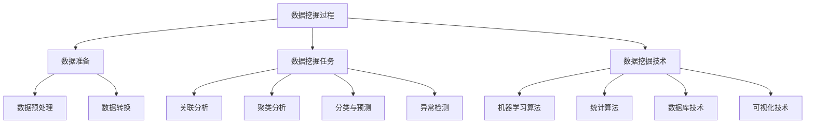

# 数据挖掘 原理与代码实例讲解

## 1. 背景介绍

### 1.1 问题的由来

在当今信息时代,数据正以前所未有的规模和速度呈爆炸式增长。无论是个人、企业还是政府机构,都在日常运营中产生大量结构化和非结构化数据。这些数据蕴藏着宝贵的信息和知识,如果能够有效地从中提取有价值的模式和规律,将为决策制定、商业智能、科学发现等领域带来巨大的价值。然而,由于数据量的剧增和数据形式的多样性,利用传统的数据分析方法很难从海量数据中发现有价值的知识。因此,数据挖掘(Data Mining)应运而生。

数据挖掘是一门跨学科的研究领域,涉及数据库技术、统计学、机器学习、模式识别、人工智能等多个领域。它利用智能算法从大规模数据中自动发现有趣的模式、规律和知识,为决策分析提供有价值的支持。数据挖掘的出现,为企业和组织从庞大的数据资产中挖掘知识,发现隐藏的机会和威胁,提供了强大的工具和方法。

### 1.2 研究现状

近年来,随着大数据、人工智能等热门技术的兴起,数据挖掘在学术界和工业界都受到了广泛的关注和研究。在学术领域,数据挖掘理论和算法不断得到深入研究和创新,涌现出了许多新的挖掘任务、算法模型和评估指标。同时,数据挖掘也与机器学习、深度学习等相关领域进行了紧密的融合,相互借鉴和促进。

在工业界,数据挖掘技术已经广泛应用于各个领域,如金融风险控制、电子商务推荐系统、社交网络分析、生物信息学等,为企业和组织带来了巨大的商业价值。随着5G、物联网、人工智能等新兴技术的发展,数据挖掘在大数据环境下的应用前景将更加广阔。

### 1.3 研究意义

数据挖掘技术的研究和应用具有重要的理论意义和现实意义:

1. **理论意义**:数据挖掘融合了多个学科领域的理论和方法,是一门交叉学科。它不仅推动了相关领域的理论发展,也促进了不同领域之间的相互渗透和融合。同时,数据挖掘算法和模型的创新,为解决复杂的现实问题提供了新的思路和方法。

2. **现实意义**:数据挖掘技术可以帮助企业和组织从庞大的数据资产中发现隐藏的知识,提高决策的科学性和前瞻性。它在商业智能、风险管理、欺诈检测、推荐系统等领域发挥着不可替代的作用,为企业创造巨大的经济价值。此外,数据挖掘在生物信息学、天文学、气象学等科学领域也有广泛的应用前景。

### 1.4 本文结构

本文将全面介绍数据挖掘的核心概念、算法原理、数学模型、代码实现和实际应用场景。文章结构安排如下:

- 第2章介绍数据挖掘的核心概念,包括挖掘任务、过程、常用技术等,并阐述它们之间的联系。
- 第3章详细讲解数据挖掘中常用的算法原理及具体操作步骤,包括关联规则挖掘、聚类分析、分类预测等。
- 第4章重点阐述数据挖掘算法的数学模型和公式推导,并结合案例进行讲解和分析。
- 第5章提供数据挖掘算法的代码实例,包括开发环境搭建、源代码实现、代码解读和运行结果展示。
- 第6章介绍数据挖掘在实际应用中的场景,如电商推荐、金融风控、社交网络分析等,并展望未来发展趋势。
- 第7章为读者推荐数据挖掘的学习资源、开发工具、相关论文和其他资源。
- 第8章总结数据挖掘的研究成果,分析未来发展趋势和面临的挑战,并对研究展望进行讨论。
- 第9章列出数据挖掘领域的常见问题及解答,帮助读者更好地理解和掌握相关知识。

## 2. 核心概念与联系

数据挖掘是一个复杂的过程,涉及多个核心概念和技术,它们之间存在紧密的联系和依赖关系。本章将介绍数据挖掘的核心概念,并阐述它们之间的关系。

1. **数据挖掘过程**:数据挖掘是一个循环迭代的过程,主要包括数据准备、任务定义、算法选择、模型构建、模型评估和部署应用等步骤。

2. **数据准备**:数据准备是数据挖掘过程中最关键也最耗时的环节,包括数据预处理和数据转换两个主要步骤。
   - **数据预处理**:处理缺失值、噪声数据、异常值等,以提高数据质量。
   - **数据转换**:将原始数据转换为适合挖掘算法处理的格式,如归一化、编码等。

3. **数据挖掘任务**:数据挖掘可以解决多种类型的任务,主要包括:
   - **关联分析**:发现数据对象之间的关联规则或相关性。
   - **聚类分析**:根据相似性将数据对象划分为多个簇。
   - **分类与预测**:基于已知数据建立模型,对新数据进行分类或预测。
   - **异常检测**:识别数据集中与众不同的异常对象或模式。

4. **数据挖掘技术**:数据挖掘技术涵盖了多个领域的理论和方法,主要包括:
   - **机器学习算法**:决策树、支持向量机、神经网络等。
   - **统计算法**:回归分析、贝叶斯分类、聚类分析等。
   - **数据库技术**:SQL查询、数据仓库、OLAP等。
   - **可视化技术**:用于数据表示和模式展示。

上述核心概念之间存在紧密的联系和依赖关系。数据挖掘过程贯穿了整个流程,数据准备为挖掘算法提供高质量的数据输入,不同的挖掘任务需要选择合适的算法和技术,而算法和技术又来自于不同的理论基础。只有将这些概念有机结合,才能完成高质量的数据挖掘项目。

## 3. 核心算法原理 & 具体操作步骤

数据挖掘涉及多种算法和模型,本章将重点介绍三种常用的挖掘任务:关联规则挖掘、聚类分析和分类预测,并详细阐述它们的算法原理和具体操作步骤。

### 3.1 算法原理概述

1. **关联规则挖掘**
   - 算法原理:基于频繁模式挖掘,发现数据对象之间的关联关系。
   - 典型算法:Apriori算法、FP-Growth算法等。

2. **聚类分析**
   - 算法原理:根据数据对象之间的相似性,将它们划分为多个簇。
   - 典型算法:K-Means算法、层次聚类算法等。

3. **分类与预测**
   - 算法原理:基于已知数据构建分类或预测模型,对新数据进行分类或预测。
   - 典型算法:决策树、逻辑回归、支持向量机、神经网络等。

### 3.2 算法步骤详解

#### 3.2.1 关联规则挖掘算法

以Apriori算法为例,其主要步骤如下:

1. **寻找频繁项集**
   - 扫描数据集,统计每个项的出现频率。
   - 根据最小支持度阈值,过滤掉非频繁项。
   - 利用频繁项生成候选频繁项集。
   - 扫描数据集,统计候选频繁项集的支持度。
   - 保留满足最小支持度的频繁项集。
   - 重复上述步骤,直到无法生成新的频繁项集。

2. **生成关联规则**
   - 对每个频繁项集,计算其所有非空子集的置信度。
   - 保留置信度大于最小置信度阈值的规则。

#### 3.2.2 聚类分析算法

以K-Means算法为例,其主要步骤如下:

1. **初始化**
   - 随机选择K个数据对象作为初始质心。

2. **迭代聚类**
   - 对每个数据对象,计算其与各质心的距离,将其划分到最近的簇。
   - 对每个簇,重新计算质心(簇内所有对象的均值)。
   - 重复上述步骤,直到质心不再发生变化。

3. **输出结果**
   - 输出每个数据对象所属的簇。

#### 3.2.3 分类与预测算法

以决策树算法为例,其主要步骤如下:

1. **构建决策树**
   - 选择最优特征作为根节点。
   - 根据特征值,将数据集划分为多个子集。
   - 对每个子集,重复上述步骤,构建子树。
   - 直到满足停止条件(如纯度足够高或无剩余特征)。

2. **剪枝决策树**
   - 通过预剪枝或后剪枝,避免过拟合。

3. **使用决策树进行分类或预测**
   - 对新数据,从根节点开始,根据特征值遍历决策树。
   - 到达叶节点,输出该节点的类别或预测值。

### 3.3 算法优缺点

#### 3.3.1 关联规则挖掘算法

**优点**:
- 易于理解和实现。
- 可以发现有价值的关联模式。
- 适用于各种数据类型和应用场景。

**缺点**:
- 当项集或规则数量很大时,计算效率较低。
- 存在大量冗余和无用的规则。
- 难以处理高维数据和连续属性。

#### 3.3.2 聚类分析算法

**优点**:
- 无需事先标记数据,属于无监督学习。
- 可以发现数据的自然分组结构。
- 算法简单,易于理解和实现。

**缺点**:
- 需要事先指定簇的数量K。
- 对噪声和异常值敏感。
- 无法处理非球形或任意形状的簇。
- 簇质量评估困难。

#### 3.3.3 分类与预测算法

**优点**:
- 模型可解释性强,便于理解。
- 能够处理高维和缺失数据。
- 训练速度快,可扩展性好。

**缺点**:
- 存在过拟合和欠拟合问题。
- 对数据的分布敏感。
- 难以处理非线性和复杂决策边界。
- 树结构复杂时可解释性降低。

### 3.4 算法应用领域

1. **关联规则挖掘**
   - 购物篮分析:发现商品之间的关联关系,用于促销策略制定。
   - 网页挖掘:发现网页之间的链接关系,用于网页排名和推荐。
   - 基因分析:发现基因之间的关联模式,用于疾病诊断和药物开发。

2. **聚类分析**
   - 客户细分:根据客户特征将其划分为不同群组,用于精准营销。
   - 图像分割:将图像像素划分为不同簇,用于图像压缩和目标识别。
   - 基因表达分析:将基因表达数据聚类,用于发现功能相关的基因簇。

3. **分类与预测**
   -