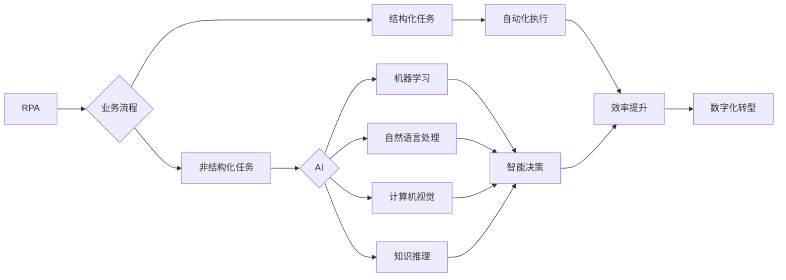

# 机器人进程自动化(RPA)与AI代理工作流的融合

关键词：RPA、人工智能、AI代理、工作流、自动化

## 1. 背景介绍
### 1.1 问题的由来
随着人工智能技术的快速发展,越来越多的企业开始关注如何利用AI来提升业务效率和竞争力。机器人流程自动化(RPA)作为一种新兴的自动化技术,通过模拟人类操作来自动执行重复性、规则驱动的业务流程,在降低人力成本、提高工作效率方面展现出巨大潜力。然而,传统RPA技术仍然存在一些局限性,如缺乏智能化、难以应对复杂多变的业务场景等。因此,如何将RPA与AI技术相结合,实现更加智能化、灵活的业务流程自动化,成为当前业界关注的热点问题。

### 1.2 研究现状
目前,国内外学术界和工业界已经开始探索RPA与AI技术的融合。一些研究者提出了智能RPA(Intelligent RPA)的概念,通过引入机器学习、自然语言处理等AI技术,增强RPA的感知、认知和决策能力。例如,利用计算机视觉实现屏幕内容理解,使RPA能够适应UI变化;利用知识图谱实现业务规则的智能提取和管理;利用强化学习优化RPA的执行策略等。一些RPA厂商也推出了融合AI的产品,如UiPath的AI Fabric、Blue Prism的Digital Exchange等。这些研究和实践表明,RPA与AI的结合具有广阔的应用前景。

### 1.3 研究意义
RPA与AI的融合研究具有重要的理论和实践意义:

(1)推动RPA技术的智能化发展。引入AI技术可以弥补传统RPA在感知、认知和决策方面的不足,实现更加灵活智能的自动化。这将推动RPA从单纯的"软件机器人"向"智能助手"演进。

(2)拓展RPA的应用场景。智能RPA能够应对更加复杂多变的业务流程,在客户服务、金融、医疗等领域得到更广泛应用。同时,AI驱动的RPA也将催生出新的应用模式和商业模式。

(3)提升企业数字化转型的效果。RPA与AI的融合,可以加速企业业务流程的自动化和智能化,从而提升运营效率,改善客户体验,增强市场竞争力,为企业数字化转型赋能。

### 1.4 本文结构
本文将围绕RPA与AI融合这一主题,重点探讨以下内容:第2部分介绍RPA与AI的核心概念;第3部分阐述融合的关键技术原理;第4部分给出RPA与AI融合的参考架构;第5部分通过案例分析融合的实现路径;第6部分总结全文,展望未来的研究方向。

## 2. 核心概念与联系
### 2.1 RPA的定义与特点
RPA指利用软件机器人模拟人类在计算机上的操作,按照预先设定的规则自动执行业务流程的一种技术。其特点包括:
- 以规则为驱动,通过图形化配置实现流程自动化,无需修改原有系统;
- 可以跨多个系统执行端到端的流程,将分散的任务连接起来;  
- 7*24小时不间断运行,提高效率的同时避免人为错误;
- 可以快速部署和扩展,灵活应对业务变化。

### 2.2 AI的定义与分支
AI即人工智能,是研究、开发用于模拟、延伸和扩展人的智能的理论、方法、技术及应用系统的一门新的技术科学。AI主要包括以下分支:
- 机器学习:让机器从数据中自主学习,获得感知、预测等能力;
- 自然语言处理:让机器能够处理、"理解"人类语言,实现人机交互;
- 计算机视觉:让机器能够"看懂"图像和视频,获得感知和理解能力;
- 知识表示与推理:让机器能够表示和推理复杂的知识,具备决策和问题解决能力。

### 2.3 RPA与AI的关系  
RPA与AI具有互补的优势,二者结合可以实现"1+1>2"的效果:
- RPA负责自动化执行重复性、规则驱动的任务,AI负责处理非结构化数据、复杂决策等需要智能的任务,形成"自动+智能"的完整解决方案;
- RPA为AI提供了一个应用场景和价值变现路径,AI为RPA注入了智能的内核,使其具备感知、认知、决策、学习的能力;
- RPA与AI融合,可以在更大范围内提升自动化水平,应对更加复杂多变的业务场景,推动企业的数字化、智能化转型。

下图展示了RPA与AI在融合中的关键作用:

## 3. 核心算法原理 & 具体操作步骤
### 3.1 算法原理概述
RPA与AI融合的核心是利用AI算法增强RPA的感知、认知和决策能力。主要涉及以下几类算法:

(1)机器学习算法:通过对历史数据的学习,训练出预测模型,用于支持RPA的智能决策。常用的算法包括:
- 监督学习:如决策树、SVM、逻辑回归等,用于分类、回归预测。
- 无监督学习:如K-means、Apriori等,用于聚类、关联分析。
- 强化学习:通过智能体与环境的交互,学习最优策略,用于动态优化RPA的执行路径。

(2)自然语言处理算法:通过对文本数据的分析和理解,实现RPA与人的自然交互。常用的算法包括:
- 分词和词性标注:将文本拆分成词,判断每个词的词性。
- 命名实体识别:识别文本中的人名、地名、机构名等特定实体。 
- 句法分析:分析文本的语法结构,理解其语义。
- 文本分类:将文本划分到预定义的类别。

(3)计算机视觉算法:通过对图像和视频内容的分析,使RPA具备感知界面的能力。常用的算法包括:
- 图像分类:将图像划分到预定义的类别。
- 目标检测:检测图像中感兴趣的目标,如按钮、表格等。
- 语义分割:对图像中的每个像素进行分类,描绘出目标的轮廓。
- OCR:提取图像中的文字信息。

(4)知识图谱算法:通过构建领域知识图谱,赋予RPA逻辑推理和决策的能力。常用的算法包括:
- 知识表示:定义描述领域概念、实体、关系的本体和词汇表。
- 知识抽取:从结构化或非结构化数据中提炼知识要素。
- 知识推理:基于图谱进行语义查询、逻辑推理,支持RPA的智能决策。

### 3.2 算法步骤详解
下面以机器学习算法为例,详细说明其在RPA中的应用步骤。

(1)定义业务目标:明确需要用机器学习解决的业务问题,如预测客户流失、优化流程路径等。

(2)数据准备:识别和收集与业务目标相关的历史数据,通过数据集成将其汇总到统一的数据源。

(3)数据理解:对数据进行探索性分析,理解数据的质量和特征,为后续建模提供指导。

(4)数据预处理:对原始数据进行清洗、集成、变换和归约,提升数据质量,生成建模数据集。

(5)特征工程:基于业务理解和数据分析,构建、选择对预测结果有影响的特征变量。

(6)模型开发:选择合适的机器学习算法,如决策树、神经网络等,在训练集上进行模型训练和调优。

(7)模型评估:使用测试集对训练好的模型进行评估,分析模型的准确率、召回率、F1等指标,选出最优模型。

(8)模型部署:将训练好的模型封装成标准的接口,供RPA系统调用,对新数据进行实时预测。

(9)模型监控:在模型上线后,持续监控其性能,根据业务变化情况进行重训练和优化。

### 3.3 算法优缺点
机器学习算法在RPA中的优缺点包括:

优点:
- 通过对历史数据的学习,挖掘隐藏的规律和模式,弥补了规则引擎的不足。
- 可以处理非结构化、不完整的数据,具有较强的泛化能力。
- 能够根据新数据不断自我完善和优化,使RPA具备持续学习能力。

缺点:  
- 需要大量高质量的训练数据,数据的标注成本较高。
- 算法模型通常是"黑盒",缺乏可解释性,不易被业务人员理解和信任。
- 针对不同业务场景,需要进行算法选型和调优,对数据科学家的要求较高。

### 3.4 算法应用领域
机器学习算法在RPA中的主要应用领域包括:

(1)智能决策:通过预测模型,RPA可以在多个可选的业务路径中,自主选择最优路径,或者在特定条件下触发相应的操作,减少人工干预。

(2)异常检测:通过对业务数据的实时监控和分析,及时发现异常情况,自动采取预定义的处理措施,提高业务运转的稳定性。

(3)流程挖掘:通过对业务日志数据的分析,发现业务流程中的瓶颈和改进机会,优化RPA流程的设计。

(4)智能数据提取:通过文本挖掘、图像识别等技术,从非结构化数据中提取结构化信息,扩展RPA处理的数据类型。

## 4. 数学模型和公式 & 详细讲解 & 举例说明
### 4.1 数学模型构建
以客户流失预测为例,说明机器学习算法在RPA中的数学模型构建过程。

假设有m个客户,每个客户有n个特征变量,如下表所示:

| 客户ID | 特征1  | 特征2  | ... | 特征n  | 是否流失 |
|--------|--------|--------|-----|--------|----------|
| 1      | $x_11$ | $x_12$ | ... | $x_1n$ | $y_1$    |
| 2      | $x_21$ | $x_22$ | ... | $x_2n$ | $y_2$    |
| ...    | ...    | ...    | ... | ...    | ...      |
| m      | $x_m1$ | $x_m2$ | ... | $x_mn$ | $y_m$    |

其中,$x_ij$表示第i个客户的第j个特征值,$y_i$表示第i个客户是否流失,取值为0或1。

我们的目标是建立一个预测模型,根据客户的特征预测其是否会流失。常用的模型有逻辑回归和决策树。

(1)逻辑回归模型:

$$P(y_i=1|x_i)=\frac{1}{1+e^{-(\beta_0+\beta_1x_{i1}+...+\beta_nx_{in})}}$$

其中,$\beta_0,\beta_1,...,\beta_n$为模型参数,需要通过极大似然估计或梯度下降等方法求解。

(2)决策树模型:

决策树通过递归地选择最优特征进行分支,构建一棵树形结构。常用的特征选择准则有信息增益、增益率等。

假设选择特征$x_j$进行分支,令$D_v$表示特征$x_j=v$的样本子集,则分支后的信息增益为:

$$Gain(D,x_j) = Ent(D) - \sum_{v=1}^{V}\frac{|D_v|}{|D|}Ent(D_v)$$

其中,信息熵$Ent(D)$表示数据集D的不确定性:

$$Ent(D)=-\sum_{k=1}^{K