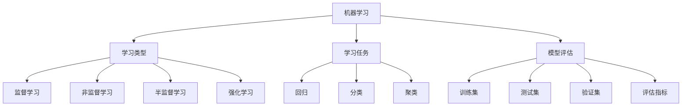

好的，我会按照您提供的要求和文章结构模板，撰写一篇关于"机器学习原理与代码实例讲解"的专业技术博客文章。

# 机器学习 原理与代码实例讲解

## 1. 背景介绍

### 1.1 问题的由来

在当今的数字时代,数据正以前所未有的速度和规模积累。无论是社交媒体上的用户行为数据、物联网设备采集的传感器数据,还是金融交易、医疗健康等领域的海量数据,都为发现隐藏其中的有价值模式和规律提供了丰富的素材。然而,由于数据量的爆炸式增长,传统的基于规则的数据分析方法已经无法满足需求,亟需一种能够自动从数据中学习并做出智能决策的新型分析方法。

在这种背景下,机器学习(Machine Learning)作为一种基于数据而非规则的智能分析方法应运而生。机器学习算法能够从大量数据样本中自动学习,捕捉数据中隐藏的模式和规律,并对未知数据进行预测或决策。这种数据驱动的方法极大地扩展了人工智能系统的能力边界,使其能够处理复杂的、动态变化的问题,并在众多领域发挥着不可或缺的作用。

### 1.2 研究现状

机器学习是当前人工智能领域最活跃、发展最快的研究方向之一。从20世纪90年代开始,机器学习理论和算法取得了长足的进步,诞生了诸如支持向量机、决策树、贝叶斯方法、神经网络等一系列成熟的学习框架和模型。

同时,计算能力的飞速提升、大数据时代的到来以及开源框架的普及,为机器学习算法的训练和应用提供了强有力的支撑。如今,机器学习已经广泛应用于计算机视觉、自然语言处理、推荐系统、金融风控、医疗诊断等诸多领域,展现出巨大的应用潜力和商业价值。

### 1.3 研究意义

机器学习作为数据科学和人工智能的核心,其理论和实践研究对于推动智能时代的到来具有重要意义:

1. **提高数据利用效率**:机器学习能够自动从海量数据中发现隐藏的模式和规律,充分挖掘数据的价值,提高数据资源的利用效率。

2. **增强系统智能能力**:借助机器学习,人工智能系统能够自主学习,不断优化和提升自身的决策和预测能力,使系统具备类似于人类的学习和推理能力。

3. **推动智能化发展**:机器学习是实现人工通用智能(AGI)的关键一步,对于构建智能化系统、自动化决策和智能优化等具有重要意义。

4. **创造新的应用场景**:机器学习为众多传统领域注入了新的活力,催生了大量创新性应用,为解决复杂问题提供了新的思路和方法。

综上所述,机器学习理论和技术的深入研究与创新,将为人工智能的发展注入新的动力,推动智能时代的到来。

### 1.4 本文结构

本文将全面介绍机器学习的核心概念、算法原理、数学模型以及实际应用。具体来说,第2部分将阐述机器学习的核心概念及其内在联系;第3部分将重点讲解几种经典机器学习算法的原理和实现步骤;第4部分将深入探讨机器学习中的数学基础和建模方法;第5部分将通过实例代码讲解机器学习算法在实践中的应用;第6部分将介绍机器学习在不同领域的应用场景;第7部分将推荐相关的学习资源和开发工具;最后第8部分将总结机器学习的发展趋势和面临的挑战。

## 2. 核心概念与联系

机器学习包含了多个相互关联的核心概念,理解这些概念及其内在联系是掌握机器学习理论和实践的基础。本节将介绍机器学习中最为核心的几个概念。

1. **学习类型**:根据是否利用了已标注的训练数据,机器学习可分为监督学习(Supervised Learning)、非监督学习(Unsupervised Learning)、半监督学习(Semi-Supervised Learning)和强化学习(Reinforcement Learning)四种主要类型。

2. **学习任务**:机器学习算法可以解决的任务主要有回归(Regression)、分类(Classification)和聚类(Clustering)三种。回归任务预测连续的数值输出,分类任务预测离散的类别标签,而聚类则是发现数据内在的分组结构。

3. **模型评估**:为了评价机器学习模型的性能并进行模型选择,需要将数据划分为训练集(Training Set)、测试集(Test Set)和验证集(Validation Set),并使用适当的评估指标(Evaluation Metrics)来衡量模型在测试数据上的表现。

4. **其他概念**:除上述核心概念外,机器学习还涉及特征工程(Feature Engineering)、模型选择(Model Selection)、偏差与方差权衡(Bias-Variance Tradeoff)、过拟合与欠拟合(Overfitting & Underfitting)等重要概念。

上述概念相互关联、环环相扣。例如,对于一个分类任务,我们可以选择监督学习的方法,将数据划分为训练集和测试集,使用分类准确率作为评估指标,并通过调整模型复杂度来权衡偏差和方差。因此,理解这些概念及其内在联系,对于掌握机器学习的本质至关重要。

## 3. 核心算法原理 & 具体操作步骤

机器学习领域存在众多优秀的算法模型,本节将重点介绍几种经典且实用的机器学习算法,阐述其原理思想和具体实现步骤。

### 3.1 算法原理概述

1. **线性回归(Linear Regression)**:线性回归是最简单、最基础的回归算法,其基本思想是在已知数据的基础上,通过最小化均方误差来拟合出一条最佳拟合直线(或平面),从而对新的数据进行预测。

2. **逻辑回归(Logistic Regression)**:逻辑回归是一种广义线性模型,通常应用于二分类问题。它将输入特征的线性组合通过Sigmoid函数映射到(0,1)区间,从而得到样本属于正类的概率估计值。

3. **决策树(Decision Tree)**:决策树是一种树形结构的监督学习模型,通过不断将样本空间进行划分,构建一个类似于流程图的决策树模型。它易于理解和解释,并可用于回归和分类任务。

4. **支持向量机(Support Vector Machine, SVM)**:支持向量机是一种基于核技巧(Kernel Trick)的有监督学习模型,其目标是在高维空间中构建一个最大间隔超平面,将不同类别的样本分开。

5. **K-Means聚类(K-Means Clustering)**:K-Means是一种经典的无监督学习算法,通过迭代优化将样本划分为K个簇,使得簇内样本相似度高、簇间相似度低。

6. **主成分分析(Principal Component Analysis, PCA)**:PCA是一种常用的无监督降维技术,通过线性变换将高维数据映射到低维空间,同时尽可能保留数据的主要信息。

上述算法均具有一定的局限性和适用场景,在实际应用中需要根据具体问题特点选择合适的算法模型。下面将对其中几种算法的原理和实现步骤进行详细阐述。

### 3.2 算法步骤详解

#### 3.2.1 线性回归

线性回归的目标是找到一个最佳拟合直线(或平面),使得训练数据到直线(平面)的残差平方和最小。具体实现步骤如下:

1. **数据准备**:收集包含自变量(特征)$X$和因变量(标签)$y$的训练数据。

2. **定义模型**:线性回归模型可表示为$y = \theta_0 + \theta_1x_1 + \theta_2x_2 + ... + \theta_nx_n$,其中$\theta_i$为模型参数。

3. **损失函数**:使用均方误差(Mean Squared Error, MSE)作为损失函数,即$J(\theta) = \frac{1}{2m}\sum_{i=1}^m(h_\theta(x^{(i)}) - y^{(i)})^2$,其中$m$为样本数量。

4. **优化算法**:采用梯度下降(Gradient Descent)等优化算法,通过迭代更新参数$\theta$,使损失函数$J(\theta)$最小化。

5. **模型评估**:在测试集上评估模型性能,常用指标包括均方根误差(RMSE)、决定系数$R^2$等。

6. **预测新样本**:利用训练得到的模型参数$\theta$,对新的数据样本进行预测。

线性回归虽然简单,但在许多实际问题中表现良好,是机器学习入门的经典算法之一。

#### 3.2.2 逻辑回归

逻辑回归用于解决二分类问题,其核心思想是通过Sigmoid函数将线性回归的输出映射到(0,1)区间,从而得到样本属于正类的概率估计值。具体实现步骤如下:

1. **数据准备**:收集包含特征向量$X$和二元类别标签$y \in \{0, 1\}$的训练数据。

2. **定义模型**:逻辑回归模型可表示为$h_\theta(x) = g(\theta^Tx) = \frac{1}{1 + e^{-\theta^Tx}}$,其中$g(z)$为Sigmoid函数。

3. **损失函数**:使用交叉熵损失函数(Cross Entropy Loss),即$J(\theta) = -\frac{1}{m}\sum_{i=1}^m[y^{(i)}\log(h_\theta(x^{(i)})) + (1 - y^{(i)})\log(1 - h_\theta(x^{(i)}))]$。

4. **优化算法**:同样采用梯度下降等优化算法,迭代更新参数$\theta$,使损失函数$J(\theta)$最小化。

5. **模型评估**:在测试集上评估模型性能,常用指标包括准确率(Accuracy)、精确率(Precision)、召回率(Recall)、F1分数等。

6. **预测新样本**:利用训练得到的模型参数$\theta$,对新的数据样本$x$进行预测,若$h_\theta(x) \geq 0.5$,则预测为正类,否则为负类。

逻辑回归模型简单且高效,在诸多领域的二分类问题中有着广泛应用。

### 3.3 算法优缺点

每种算法都有其适用场景和局限性,了解算法的优缺点有助于正确选择和使用算法模型。

1. **线性回归**
   - 优点:模型简单,易于理解和解释;训练速度快,可以方便地应用于大规模数据集;对异常值不太敏感。
   - 缺点:只能学习线性模式,无法拟合复杂的非线性数据;对异常值虽不太敏感,但仍会受到一定影响;需要进行特征缩放等预处理。

2. **逻辑回归**
   - 优点:计算代价小,训练速度快;易于理解和解释;对异常值不太敏感;可以直接给出样本的概率估计。
   - 缺点:仍属于线性模型,无法学习复杂的非线性模式;容易过拟合;对于非线性特征需要进行特征工程。

3. **决策树**
   - 优点:可视化直观,模型可解释性强;无需特征缩放;可以自动处理缺失值;能够学习非线性模式。
   - 缺点:容易过拟合,需要进行剪枝;对数据的微小变化敏感;在高维空间表现不佳。

4. **