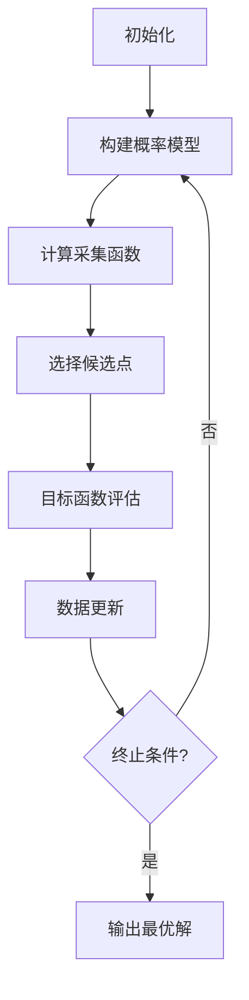

# 机器学习参数的贝叶斯优化

## 1. 背景介绍

### 1.1 问题的由来

在机器学习的实践中，模型的性能往往受到参数设置的巨大影响。传统的参数调优方法通常是网格搜索或者随机搜索,这种方式效率低下,尤其是在高维参数空间中表现更加糟糕。因此,如何高效地找到最优参数组合一直是机器学习领域的一个重要挑战。

贝叶斯优化(Bayesian Optimization)作为一种序列模型优化方法,可以在少量的迭代次数内高效地找到目标函数的最优解,被广泛应用于机器学习的参数优化问题中。

### 1.2 研究现状

目前,贝叶斯优化已经在机器学习的多个领域得到了广泛应用,包括:

- **神经网络架构搜索**:使用贝叶斯优化可以自动搜索出高性能的神经网络架构。
- **超参数优化**:贝叶斯优化可以高效地找到机器学习模型的最优超参数组合。
- **机器学习流水线优化**:贝叶斯优化可以同时优化数据预处理、特征工程和模型选择等多个环节。

### 1.3 研究意义

贝叶斯优化在机器学习参数优化中具有以下重要意义:

1. **高效性**:相比传统的网格搜索和随机搜索,贝叶斯优化可以在较少的迭代次数内找到优化目标的最优解。
2. **全局优化**:贝叶斯优化能够有效避免陷入局部最优,从而找到全局最优解。
3. **可解释性**:贝叶斯优化建模了目标函数的先验分布和后验分布,有助于理解优化过程。

### 1.4 本文结构

本文将全面介绍机器学习参数的贝叶斯优化方法,内容安排如下:

- 第2部分介绍贝叶斯优化的核心概念及其与其他优化方法的联系。
- 第3部分详细阐述贝叶斯优化的核心算法原理和具体操作步骤。
- 第4部分构建贝叶斯优化的数学模型,推导公式并结合案例进行讲解。
- 第5部分提供一个完整的代码实例,并对实现细节进行解读和分析。
- 第6部分总结贝叶斯优化在机器学习中的实际应用场景。
- 第7部分推荐相关的学习资源、开发工具和论文。
- 第8部分总结研究成果,展望未来发展趋势和面临的挑战。
- 第9部分附录列出常见问题及解答。

## 2. 核心概念与联系

贝叶斯优化(Bayesian Optimization)是一种基于序列模型的全局优化方法,旨在有效地解决目标函数为黑箱、非凸、非线性、高维等复杂优化问题。它将先验信念与通过观测获得的证据相结合,不断更新对目标函数的认知,从而指导后续的搜索过程。

贝叶斯优化的核心思想是在每一次迭代中,利用已有的观测数据构建一个概率模型(代理模型)来近似目标函数,然后在该代理模型的基础上,通过一个采集函数(Acquisition Function)来平衡探索(Exploration)和利用(Exploitation),选择下一个最有希望改善目标函数的候选点进行评估。

贝叶斯优化与其他优化方法的主要区别和联系如下:

- **梯度下降法**:梯度下降法需要目标函数可导,而贝叶斯优化可以处理黑箱函数。
- **启发式算法**:贝叶斯优化相比启发式算法(如遗传算法、模拟退火等)具有更好的收敛性和效率。
- **高斯过程回归**:高斯过程回归是贝叶斯优化中常用的概率模型构建方法。
- **多臂老虎机问题**:贝叶斯优化可视为一种解决连续多臂老虎机问题的方法。

## 3. 核心算法原理 & 具体操作步骤

### 3.1 算法原理概述

贝叶斯优化算法的核心思想是在每一次迭代中,利用已有的观测数据构建一个概率模型(代理模型)来近似目标函数,然后在该代理模型的基础上,通过一个采集函数(Acquisition Function)来平衡探索(Exploration)和利用(Exploitation),选择下一个最有希望改善目标函数的候选点进行评估。具体步骤如下:

1. **初始化**:选择一个初始的数据集 $D_0$,通常是在参数空间内随机采样获得。
2. **构建概率模型**:基于当前的数据集 $D_t$,利用高斯过程回归等方法构建概率模型 $M_t$ 来近似目标函数 $f$。
3. **计算采集函数**:在概率模型 $M_t$ 的基础上,计算采集函数 $\alpha(x|M_t)$,该函数用于平衡探索和利用。
4. **选择候选点**:通过优化采集函数 $\alpha(x|M_t)$,选择下一个最有希望改善目标函数的候选点 $x_{t+1}$。
5. **目标函数评估**:在候选点 $x_{t+1}$ 处评估目标函数 $f(x_{t+1})$,获得新的观测数据。
6. **数据更新**:将新的观测数据 $(x_{t+1}, f(x_{t+1}))$ 加入数据集 $D_{t+1} = D_t \cup \{(x_{t+1}, f(x_{t+1}))\}$。
7. **迭代优化**:重复步骤2-6,直至满足终止条件(如最大迭代次数或目标函数值收敛等)。

### 3.2 算法步骤详解

接下来,我们将详细介绍贝叶斯优化算法的每一个步骤。

#### 3.2.1 初始化

在贝叶斯优化的初始化阶段,我们需要选择一个初始的数据集 $D_0$。通常情况下,我们会在参数空间内随机采样一些点作为初始数据集。初始数据集的大小通常取决于问题的维度和复杂度,一般在5-20个点之间。

#### 3.2.2 构建概率模型

在每一次迭代中,我们需要基于当前的数据集 $D_t$ 构建一个概率模型 $M_t$ 来近似目标函数 $f$。概率模型的作用是为了捕捉目标函数的行为,从而指导后续的搜索过程。

在贝叶斯优化中,最常用的概率模型是高斯过程回归(Gaussian Process Regression, GPR)。高斯过程是一种非参数的贝叶斯机器学习方法,它可以为任意有限集合的点定义一个联合高斯分布,从而对函数进行建模和推断。

具体来说,高斯过程回归假设目标函数 $f$ 服从一个高斯过程先验:

$$
f(x) \sim \mathcal{GP}(m(x), k(x, x'))
$$

其中,

- $m(x)$ 是均值函数,通常设置为0。
- $k(x, x')$ 是核函数(协方差函数),用于描述不同输入点之间的相关性。常用的核函数包括高斯核(Gaussian Kernel)、马尔科夫核(Matern Kernel)等。

给定观测数据 $D_t = \{(x_i, y_i)\}_{i=1}^t$,我们可以通过高斯过程回归得到目标函数 $f$ 在任意点 $x$ 处的后验分布:

$$
f(x) | D_t \sim \mathcal{N}(\mu(x), \sigma^2(x))
$$

其中,

- $\mu(x)$ 是均值函数,描述了目标函数在点 $x$ 处的预测值。
- $\sigma^2(x)$ 是方差函数,描述了预测值的不确定性。

通过构建概率模型,我们可以捕捉目标函数的行为,为后续的搜索过程提供指导。

#### 3.2.3 计算采集函数

在获得概率模型 $M_t$ 之后,我们需要计算采集函数 $\alpha(x|M_t)$,该函数用于平衡探索(Exploration)和利用(Exploitation)。

采集函数的作用是根据概率模型 $M_t$ 和已观测的最优值 $f^+$,为每个候选点 $x$ 分配一个分数,分数越高表示该点被选中的可能性越大。一个好的采集函数应该能够在探索未知区域和利用已知信息之间达到一个平衡。

常用的采集函数包括:

1. **期望改善函数(Expected Improvement, EI)**:

   $$
   \alpha_\text{EI}(x) = \mathbb{E}\left[\max(0, f(x) - f^+)\right]
   $$

   期望改善函数衡量了在点 $x$ 处评估目标函数,相对于当前最优值 $f^+$ 的期望改善量。

2. **概率改善函数(Probability of Improvement, PI)**:

   $$
   \alpha_\text{PI}(x) = \Phi\left(\frac{\mu(x) - f^+ - \xi}{\sigma(x)}\right)
   $$

   概率改善函数衡量了在点 $x$ 处评估目标函数,相对于当前最优值 $f^+$ 改善的概率。其中 $\xi$ 是一个Trade-off参数,用于控制探索和利用之间的平衡。

3. **期望改善函数(Upper Confidence Bound, UCB)**:

   $$
   \alpha_\text{UCB}(x) = \mu(x) + \kappa \sigma(x)
   $$

   上置信界采集函数直接利用了均值 $\mu(x)$ 和方差 $\sigma(x)$,其中 $\kappa$ 是一个Trade-off参数,用于控制探索和利用之间的平衡。

不同的采集函数对应着不同的探索和利用策略,在实践中需要根据具体问题进行选择。

#### 3.2.4 选择候选点

在计算出采集函数 $\alpha(x|M_t)$ 之后,我们需要通过优化该函数来选择下一个最有希望改善目标函数的候选点 $x_{t+1}$:

$$
x_{t+1} = \arg\max_{x \in \mathcal{X}} \alpha(x|M_t)
$$

由于采集函数通常是非凸的,因此我们需要使用一些全局优化算法(如遗传算法、模拟退火等)来求解上述优化问题。

#### 3.2.5 目标函数评估

在选择出候选点 $x_{t+1}$ 之后,我们需要在该点处评估目标函数 $f(x_{t+1})$,获得新的观测数据 $(x_{t+1}, f(x_{t+1}))$。

#### 3.2.6 数据更新

将新的观测数据 $(x_{t+1}, f(x_{t+1}))$ 加入数据集 $D_{t+1} = D_t \cup \{(x_{t+1}, f(x_{t+1}))\}$,为下一次迭代做准备。

#### 3.2.7 迭代优化

重复步骤3.2.2-3.2.6,直至满足终止条件(如最大迭代次数或目标函数值收敛等)。在最后,输出迄今为止找到的最优解作为算法的结果。

### 3.3 算法优缺点

贝叶斯优化算法具有以下优点:

1. **高效性**:相比传统的网格搜索和随机搜索,贝叶斯优化可以在较少的迭代次数内找到优化目标的最优解。
2. **全局优化**:贝叶斯优化能够有效避免陷入局部最优,从而找到全局最优解。
3. **可解释性**:贝