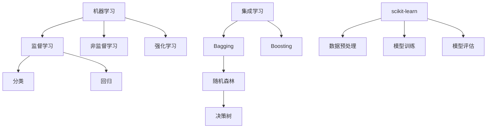

# 机器学习实例:使用RandomForest分类iris数据集

关键词：机器学习, RandomForest, 随机森林, iris数据集, 分类, Python, scikit-learn

## 1. 背景介绍

### 1.1 问题的由来
在机器学习领域,分类问题是一个非常基础且重要的任务。如何利用已有的数据集,通过机器学习算法训练出一个高效准确的分类器,是每个机器学习工程师都需要掌握的基本技能。而iris数据集作为机器学习领域的经典数据集之一,通过它来实践和学习分类算法,可以帮助我们快速入门和掌握机器学习的基本流程。

### 1.2 研究现状
目前,针对iris数据集的分类研究已经非常成熟。各种经典的机器学习分类算法如决策树、支持向量机、K近邻、朴素贝叶斯等都可以很好地完成分类任务,而随机森林作为集成学习的代表算法之一,通过集成多个决策树的方式,可以进一步提升分类的准确率。在scikit-learn等机器学习库的帮助下,使用随机森林进行iris数据集的分类已经成为一个非常简单高效的案例。

### 1.3 研究意义
通过使用随机森林对iris数据集进行分类,我们可以更加深入地理解机器学习尤其是集成学习的思想和原理。同时,这个实例也可以帮助我们快速上手和实践Python机器学习库scikit-learn的使用方法。对于机器学习的初学者而言,这将是一个非常好的学习案例。

### 1.4 本文结构
本文将按照以下结构展开:
- 第2部分介绍机器学习分类和随机森林的基本概念;
- 第3部分详细讲解随机森林的算法原理和具体实现步骤;
- 第4部分从数学角度对随机森林的模型和公式进行推导和讲解;
- 第5部分给出基于scikit-learn的Python代码实现,并解释关键代码;
- 第6部分讨论随机森林在实际中的应用场景,并展望未来;
- 第7部分推荐随机森林的学习资源、工具和相关论文;
- 第8部分对全文进行总结,讨论随机森林的发展趋势和挑战;
- 第9部分的附录给出一些常见问题解答。

## 2. 核心概念与联系

在使用随机森林进行iris数据集分类之前,我们需要先了解几个核心概念:

- 机器学习: 一种通过数据来学习规律,并利用学习到的规律对新数据进行预测的方法。它可以分为监督学习、非监督学习和强化学习。
- 监督学习: 一种机器学习的任务,它的目标是学习一个模型,使模型能够对任意给定的输入,对其相应的输出做出一个好的预测。监督学习需要训练数据包含输入和预期输出。分类和回归都是监督学习的任务。
- 分类: 一种监督学习任务,它的目标是将实例数据划分到合适的类别中。常见的分类算法包括决策树、朴素贝叶斯、支持向量机等。
- 集成学习: 通过构建并结合多个学习器来完成学习任务,常见的集成学习方法包括Bagging和Boosting。
- 随机森林: 一种Bagging的集成学习算法,它通过集成多个决策树来完成分类或回归任务。
- scikit-learn: 基于Python的机器学习库,它提供了丰富的机器学习算法实现,可以方便地进行数据预处理、模型训练和评估等任务。

下图展示了这些概念之间的关系:



从图中可以看出,随机森林是一种基于决策树的Bagging集成学习算法,它处在机器学习的监督学习分支下。而scikit-learn提供了随机森林等算法的具体实现。

## 3. 核心算法原理 & 具体操作步骤

### 3.1 算法原理概述
随机森林的基本思想是集成多个决策树分类器。通过Bagging的思想,随机森林随机选择样本和特征来构建多个决策树,然后将这些决策树的分类结果进行组合,得到最终的分类结果。由于每个决策树的训练数据和选用的特征都不完全相同,因此集成后的分类器可以有效地降低过拟合风险,提高模型的泛化能力。

### 3.2 算法步骤详解
随机森林的具体步骤如下:
1. 从原始训练集中采用Bootstrap方法随机选择n个样本,共进行k轮采样,得到k个子数据集。
2. 从所有特征中随机选择m个特征子集,每个子数据集使用这m个特征训练一个决策树,共生成k个决策树。
3. 对于新的数据,让k个决策树分别进行分类,并采用投票的方式得到最终的分类结果。

其中,参数n控制子采样的数据量,m控制子特征集的大小,k控制决策树的数量。一般情况下,n和原始数据集大小相同,m取特征数的开方,k取几十到几百。

### 3.3 算法优缺点
随机森林的主要优点有:
- 可以处理高维数据,且不需要降维
- 在训练完后,可以给出哪些特征比较重要
- 训练速度快,可以高效处理大数据
- 由于可以并行训练,因此可以处理很高维度的数据
- 对部分特征缺失不敏感

随机森林的主要缺点是:
- 当数据不平衡时,比如某个类别的样本过多,会导致训练出的模型更偏向于这个类别
- 训练后的模型不太容易解释,不像决策树那样有明确的规则路径

### 3.4 算法应用领域
由于随机森林具有很高的分类准确率,鲁棒性好,能处理高维数据等优点,因此在工业界得到了广泛应用,主要应用领域包括:
- 金融领域:用于银行贷款违约预测、金融欺诈检测等
- 医疗领域:用于疾病诊断、药物疗效预测等  
- 互联网领域:用于垃圾邮件识别、用户画像等
- 工业领域:用于工业产品质量检测、设备故障预测等
- 其他领域如生物信息学、天文学等领域也有广泛应用

## 4. 数学模型和公式 & 详细讲解 & 举例说明

### 4.1 数学模型构建
设训练数据集为$D=\{(x_1,y_1),(x_2,y_2),...,(x_N,y_N)\}$,其中$x_i$为特征向量,$y_i$为类别标签。随机森林通过Bagging的方式,从D中随机抽取k个样本子集$D_1,D_2,...,D_k$,每个子集用于训练一个决策树分类器$h_i(x)$。这k个决策树的集成即构成了随机森林分类器:

$$H(x)=\mathop{argmax}_{y \in Y} \sum_{i=1}^k I(h_i(x)=y)$$

其中,$Y$为所有类别标签的集合,$I$为指示函数,当$h_i(x)=y$时取1,否则取0。即随机森林使用投票的方式决定最终的分类结果。

### 4.2 公式推导过程
下面我们推导随机森林的泛化误差上界。根据Hoeffding不等式,对于任意的函数序列$h_1,h_2,...,h_k$,如果它们满足:
$$P(h(x)\neq y) \leq \epsilon$$
即每个分类器的分类误差不超过$\epsilon$,则这k个分类器的集成$H(x)$的分类误差可以表示为:

$$P(H(x) \neq y) \leq exp(-2k\epsilon^2)$$

这个上界表明,随着决策树数量k的增大,集成的分类误差将指数衰减,这就是Bagging集成的奥秘所在。

### 4.3 案例分析与讲解
下面我们以一个简单的二分类问题来说明随机森林的分类过程。假设有一个二维特征空间,数据点的分布和真实分类边界如下图所示:

```
  ^
  |     o
  |   o   o
  | o   x  o
  | o x   x o
  | o  x x  o
  | o  x    o
  |   x   x
  | x  o o
  | x     x
  +----------->
```

其中,o表示第一类,x表示第二类。现在我们从中随机选取一些样本,构建3个决策树,其分类边界如下图所示:

```
  ^           ^           ^
  |     o     |     o     |     o
  |   o | o   |   o   o   |   o   o
  | o  \|  o  | o---|  o  | o---|  o
  | o x | x o | o x |  o  | o x |  o
  | o  x|x  o | o  x| o   | o  x| o
  | o  x|   o | o  x|   o | o  x|  o
  |   x |  x  |   x |  x  |   x |  x
  | x  o|o    | x  o|     | x  o|   
  | x   | x   | x   | x   | x   | x
  +----------->+----------->+----------->
      (1)          (2)          (3)
```

可以看出,每个决策树的分类边界都有所不同,这是由于子采样和随机选择特征造成的。现在对于一个新样本,如果它的特征为(4,5),则三个决策树都将其划分为o,因此随机森林的最终分类结果也为o。但如果新样本的特征为(4,2),则决策树(1)(3)将其划为o,决策树(2)将其划为x,由于投票结果是2:1,所以随机森林依然会将其划为o。这说明随机森林比单一决策树的分类结果更加鲁棒。

### 4.4 常见问题解答
问:随机森林中的决策树是否需要剪枝?
答:不需要,因为随机森林本身就是通过集成多个决策树来降低过拟合风险,所以一般不对子决策树进行剪枝。

问:随机森林的决策树是否需要生成到最大深度?
答:对于分类问题,一般决策树生长到最大深度,直到叶子节点的样本都属于同一类别。但对于回归问题,为了防止过拟合,一般需要限制决策树的最大深度。

问:随机森林的训练效率如何?
答:由于随机森林的子决策树可以并行训练,因此训练效率很高。如果采用现代的分布式计算框架如Spark,可以处理数百万甚至上亿级的高维数据。

## 5. 项目实践:代码实例和详细解释说明

下面我们使用scikit-learn库,通过Python代码来实现随机森林对iris数据集的分类。

### 5.1 开发环境搭建
首先需要安装scikit-learn库,使用pip安装命令如下:
```
pip install scikit-learn
```

安装完成后,在Python中导入所需的库:

```python
from sklearn.datasets import load_iris
from sklearn.ensemble import RandomForestClassifier
from sklearn.model_selection import train_test_split
from sklearn.metrics import accuracy_score
```

### 5.2 源代码详细实现
完整的Python代码实现如下:

```python
# 加载iris数据集
iris = load_iris()
X = iris.data
y = iris.target

# 划分训练集和测试集
X_train, X_test, y_train, y_test = train_test_split(X, y, test_size=0.3)

# 创建随机森林分类器
rf = RandomForestClassifier(n_estimators=100)

# 在训练集上训练
rf.fit(X_train, y_train)

# 在测试集上预测
y_pred = rf.predict(X_test)

# 计算分类准确率
accuracy = accuracy_score(y_test, y_pred)
print('Accuracy:',accuracy)
```

### 5.3 代码解读与分析
第一步是加