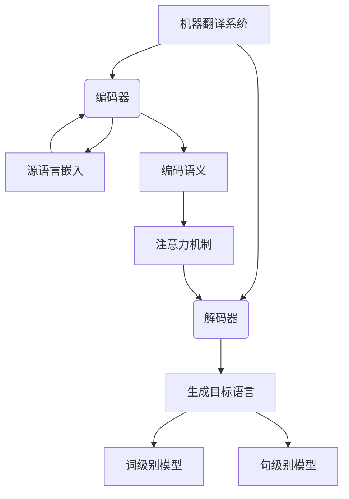

以下是标题为《机器翻译(Machine Translation) - 原理与代码实例讲解》的技术博客文章正文内容：

# 机器翻译(Machine Translation) - 原理与代码实例讲解

## 1. 背景介绍

### 1.1 问题的由来

在当今全球化时代,跨语言交流成为了一个日益重要的课题。无论是商业、科研还是个人交流,都存在着语言障碍的问题。为了克服这一障碍,机器翻译(Machine Translation)应运而生。

机器翻译旨在利用计算机自动完成不同语言之间的相互转换,从而实现无障碍的跨语言交流。这一领域自20世纪中叶兴起以来,经历了多个发展阶段,取得了长足的进步。

### 1.2 研究现状  

早期的机器翻译系统主要基于规则(Rule-based)和统计模型(Statistical Model),通过构建语法规则库和双语语料库进行翻译。但这些传统方法在处理复杂语义和长句时存在明显缺陷。

近年来,随着深度学习(Deep Learning)技术的兴起,神经网络机器翻译(Neural Machine Translation, NMT)成为研究的新热点。NMT 系统能够自主学习语言模式,并在语义理解和生成流畅译文方面展现出优异的能力。

目前,谷歌(Google)、微软(Microsoft)、Facebook 等科技巨头均在机器翻译领域投入了大量资源,推动了该领域的快速发展。

### 1.3 研究意义

机器翻译技术的突破不仅能够促进不同语言文化之间的交流与融合,也将为政府、企业和个人节省大量的翻译成本,对经济和社会发展产生深远影响。

此外,机器翻译在诸如跨语言信息检索、多语种内容生成、会议同传等应用场景中也大有可为。因此,机器翻译研究具有重要的理论价值和应用前景。

### 1.4 本文结构

本文将首先介绍机器翻译的核心概念和算法原理,包括编码器-解码器(Encoder-Decoder)框架、注意力机制(Attention Mechanism)、transformer 模型等。

接下来,将详细讲解机器翻译系统的数学模型,包括词嵌入(Word Embedding)、序列到序列(Sequence-to-Sequence)建模、注意力计算等。

在此基础上,通过开源项目实践,展示机器翻译系统的代码实现细节,并分析运行结果。

最后,探讨机器翻译的应用场景、发展趋势和面临的挑战,为读者提供全面的理解。

## 2. 核心概念与联系

机器翻译系统通常由编码器(Encoder)和解码器(Decoder)两个核心模块组成:

- **编码器(Encoder)**: 将源语言文本序列映射为语义表示,包括两个关键步骤:
  1. **源语言嵌入(Source Language Embedding)**: 将源语言词元(如单词或子词)映射为语义向量表示。
  2. **编码语义(Encoding Semantics)**: 捕获源语言序列的上下文语义信息。

- **解码器(Decoder)**: 根据编码器的语义表示,生成目标语言的翻译文本,包括两个关键步骤:
  1. **生成目标语言(Generating Target Language)**: 预测每个时间步的目标语言词元概率分布。
  2. **词级别/句级别模型(Word/Sentence-Level Model)**: 对生成的目标语言序列进行调整和改善。

在编码器和解码器之间,通常使用**注意力机制(Attention Mechanism)**来增强源语言和生成目标语言之间的相关性建模,提高翻译质量。

## 3. 核心算法原理与具体操作步骤

### 3.1 算法原理概述

机器翻译系统的核心算法原理可以概括为**序列到序列(Sequence-to-Sequence)学习**。给定一个源语言文本序列 $X=(x_1, x_2, ..., x_n)$,目标是生成一个与之对应的目标语言序列 $Y=(y_1, y_2, ..., y_m)$。

该问题可以形式化为最大化条件概率:

$$P(Y|X) = \prod_{t=1}^m P(y_t|y_1, ..., y_{t-1}, X)$$

即在给定源语言序列 $X$ 的条件下,生成目标语言序列 $Y$ 的联合概率的最大化。

### 3.2 算法步骤详解

1. **编码器(Encoder)**: 将源语言序列 $X$ 编码为语义表示 $C$。
   - 源语言嵌入: 将每个源语言词元 $x_i$ 映射为语义向量 $e(x_i)$。
   - 编码语义: 使用递归神经网络(RNN)或transformer等模型,捕获源语言序列的上下文语义,得到语义表示 $C$。

2. **解码器(Decoder)**: 基于语义表示 $C$,生成目标语言序列 $Y$。
   - 解码初始状态: 利用 $C$ 初始化解码器的初始状态 $s_0$。
   - 生成过程: 对于每个时间步 $t$,根据先前生成的词元 $y_1, ..., y_{t-1}$ 和当前解码器状态 $s_t$,预测下一个词元 $y_t$ 的概率分布 $P(y_t|y_1, ..., y_{t-1}, C)$。
   - 注意力机制: 在生成过程中,解码器通过注意力机制关注源语言序列中的不同部分,以获取与当前生成的目标语言更相关的信息。

3. **训练**:给定大量的源语言-目标语言语料对 $(X^{(i)}, Y^{(i)})$,通过最小化损失函数(如交叉熵损失)的方式,使用算法(如梯度下降)优化模型参数,提高翻译质量。

4. **预测**:对于新的源语言序列 $X^{(new)}$,利用训练好的模型,执行编码和解码过程,生成对应的目标语言序列 $Y^{(new)}$。

### 3.3 算法优缺点

**优点**:

- 端到端学习,无需人工设计复杂的规则和特征。
- 利用注意力机制,能够更好地捕获长距离依赖关系。
- 可以处理可变长度的输入和输出序列。
- 具有很强的泛化能力,可以应用于多种语言对。

**缺点**:

- 需要大量的双语语料数据进行训练。
- 训练过程计算复杂,需要大量的计算资源。
- 生成的译文可能存在不自然、缺乏语境的情况。
- 对于低资源语言,性能可能受到限制。

### 3.4 算法应用领域

机器翻译算法可以应用于以下领域:

- 网站/软件本地化: 将网站、软件等内容翻译成多种语言。
- 在线翻译服务: 提供实时的跨语言翻译服务。
- 多语种内容生成: 自动生成多语种的新闻、文档等内容。
- 会议同传: 实时翻译会议发言内容。
- 跨语言信息检索: 支持跨语言搜索和理解信息。

## 4. 数学模型和公式详细讲解与举例说明

### 4.1 数学模型构建

机器翻译系统的数学模型主要包括以下几个核心部分:

1. **词嵌入(Word Embedding)**
   
   将源语言和目标语言的词元映射为语义向量表示,通常使用查找表(Lookup Table)或预训练的词向量(如Word2Vec、GloVe等)。
   
   设源语言词表 $V_X$,目标语言词表 $V_Y$,源语言嵌入矩阵 $E_X \in \mathbb{R}^{|V_X| \times d}$,目标语言嵌入矩阵 $E_Y \in \mathbb{R}^{|V_Y| \times d}$,其中 $d$ 为嵌入维度。对于源语言词元 $x_i$,其嵌入向量为 $e(x_i) = E_X[i]$;对于目标语言词元 $y_j$,其嵌入向量为 $e(y_j) = E_Y[j]$。

2. **编码器(Encoder)**

   将源语言序列 $X=(x_1, x_2, ..., x_n)$ 编码为语义表示 $C$。常用的编码器模型包括:
   
   - **RNN 编码器**:使用递归神经网络(如 LSTM 或 GRU)捕获序列的上下文信息,最终隐状态作为语义表示 $C$。
   - **Transformer 编码器**:利用多头注意力机制和位置编码,捕获全局依赖关系,输出的最后一层表示作为语义表示 $C$。

3. **解码器(Decoder)**

   根据语义表示 $C$,生成目标语言序列 $Y=(y_1, y_2, ..., y_m)$。常用的解码器模型包括:
   
   - **RNN 解码器**:在每个时间步,根据上一步生成的词元 $y_{t-1}$、当前隐状态 $s_t$ 和语义表示 $C$,预测下一个词元 $y_t$ 的概率分布。
   - **Transformer 解码器**:利用掩码多头注意力机制,结合编码器的语义表示 $C$,预测目标语言序列。

4. **注意力机制(Attention Mechanism)**

   在解码过程中,注意力机制能够自适应地选择源语言序列中与当前生成的目标语言更相关的部分,提高翻译质量。

   设解码器的当前隐状态为 $s_t$,源语言序列的隐状态为 $\{h_1, h_2, ..., h_n\}$,注意力分数为:

   $$\alpha_{t,i} = \text{score}(s_t, h_i) = \frac{\exp(f(s_t, h_i))}{\sum_{j=1}^n \exp(f(s_t, h_j))}$$

   其中 $f$ 为注意力打分函数,可以是简单的内积、加性或其他更复杂的函数。

   注意力上下文向量为:

   $$c_t = \sum_{i=1}^n \alpha_{t,i} h_i$$

   解码器可以利用注意力上下文向量 $c_t$ 和当前隐状态 $s_t$,更好地预测下一个目标语言词元。

### 4.2 公式推导过程

以 Transformer 模型为例,介绍注意力机制的公式推导过程:

1. **缩放点积注意力(Scaled Dot-Product Attention)**

   设查询向量(Query) $Q \in \mathbb{R}^{n_q \times d_q}$,键向量(Key) $K \in \mathbb{R}^{n_k \times d_k}$,值向量(Value) $V \in \mathbb{R}^{n_v \times d_v}$,注意力分数计算如下:

   $$\text{Attention}(Q, K, V) = \text{softmax}(\frac{QK^T}{\sqrt{d_k}})V$$

   其中 $\sqrt{d_k}$ 是为了防止点积值过大导致梯度消失。

2. **多头注意力(Multi-Head Attention)**

   为了捕获不同子空间的信息,引入多头注意力机制,包含 $h$ 个平行的注意力头:
   
   $$\begin{aligned}
   \text{MultiHead}(Q, K, V) &= \text{Concat}(\text{head}_1, ..., \text{head}_h)W^O\\
   \text{where } \text{head}_i &= \text{Attention}(QW_i^Q, KW_i^K, VW_i^V)
   \end{aligned}$$
   
   其中 $W_i^Q \in \mathbb{R}^{d_\text{model} \times d_q}, W_i^K \in \mathbb{R}^{d_\text{model} \times d_k}, W_i^V \in \mathbb{R}^{d_\text{model} \times d_v}$ 是可学习的线性映射,用于将查询、键、值投影到不同的子空间;$W^O \in \mathbb{R}^{hd_v \times d_\text{