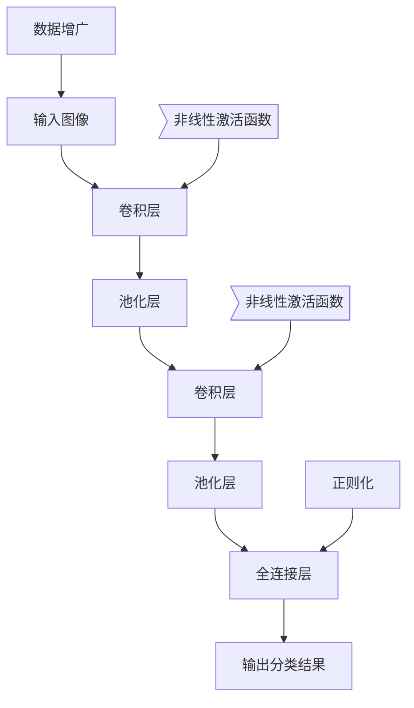

# 李飞飞与ImageNet的贡献

## 1. 背景介绍

### 1.1 问题的由来

在计算机视觉和模式识别领域,图像分类一直是一个具有挑战性的问题。传统的机器学习方法在处理复杂图像数据时往往表现不佳,因为它们无法有效地捕捉图像中丰富的语义信息和视觉特征。随着深度学习技术的兴起,基于深层神经网络的方法展现出了强大的图像表示能力,极大地推动了图像分类等计算机视觉任务的发展。

### 1.2 研究现状

在2012年之前,基于手工设计特征的传统方法在图像分类任务中占据主导地位。这些方法需要人工设计特征提取器,并将提取的特征输入传统的机器学习算法(如支持向量机)进行分类。然而,手工设计的特征往往无法很好地捕捉图像的语义信息,导致分类性能受到限制。

2012年,由李飞飞(Fei-Fei Li)教授领导的斯坦福大学人工智能实验室团队在ImageNet大规模视觉识别挑战赛(ILSVRC)中取得了突破性的成绩,他们提出的基于深度卷积神经网络(CNN)的模型AlexNet在图像分类任务中大幅度超越了传统方法,引发了深度学习在计算机视觉领域的热潮。

### 1.3 研究意义

ImageNet数据集和ILSVRC竞赛的建立,为推动计算机视觉和模式识别领域的发展做出了重大贡献。李飞飞教授及其团队在该竞赛中取得的突破性成绩,不仅展示了深度学习在图像分类任务中的强大能力,更重要的是,它开启了深度学习在计算机视觉领域的广泛应用,推动了该领域的快速发展。

### 1.4 本文结构

本文将首先介绍ImageNet数据集和ILSVRC竞赛的背景,以及李飞飞团队提出的AlexNet模型。接下来,将详细阐述AlexNet的核心概念、算法原理和数学模型,并通过代码实例和案例分析进行深入探讨。此外,还将探讨AlexNet在实际应用中的场景,以及未来的发展趋势和挑战。最后,本文将提供相关的学习资源和工具推荐,以及常见问题解答。

## 2. 核心概念与联系

AlexNet是一种基于深度卷积神经网络(CNN)的图像分类模型,它的核心概念包括:

1. **卷积层(Convolutional Layer)**: 通过滑动卷积核在输入图像上进行卷积操作,提取不同层次的特征。

2. **池化层(Pooling Layer)**: 对卷积层的输出进行下采样,减小特征图的尺寸,降低计算复杂度。

3. **全连接层(Fully Connected Layer)**: 将前面卷积层和池化层提取的特征进行整合,并输出分类结果。

4. **非线性激活函数(Non-linear Activation Function)**: 引入非线性激活函数(如ReLU),增强网络的表达能力。

5. **正则化(Regularization)**: 采用Dropout等正则化技术,防止过拟合。

6. **数据增广(Data Augmentation)**: 通过翻转、裁剪等方式对训练数据进行增广,提高模型的泛化能力。

这些核心概念相互关联,共同构建了AlexNet的深度神经网络架构,使其能够有效地从原始图像中提取语义特征,并进行准确的图像分类。

## 3. 核心算法原理 & 具体操作步骤

### 3.1 算法原理概述

AlexNet采用了深度卷积神经网络的架构,主要包括以下几个关键步骤:

1. **卷积操作**: 通过滑动卷积核在输入图像上进行卷积操作,提取不同层次的特征。

2. **池化操作**: 对卷积层的输出进行下采样,减小特征图的尺寸,降低计算复杂度。

3. **非线性激活**: 引入非线性激活函数(如ReLU),增强网络的表达能力。

4. **全连接层**: 将前面卷积层和池化层提取的特征进行整合,并输出分类结果。

5. **正则化**: 采用Dropout等正则化技术,防止过拟合。

6. **反向传播**: 通过反向传播算法,计算梯度并更新网络权重,实现模型的训练。

### 3.2 算法步骤详解

1. **输入层**: 接收原始图像数据作为输入。

2. **卷积层**:
   - 滑动卷积核在输入图像上进行卷积操作,提取不同层次的特征。
   - 卷积核的权重通过反向传播算法进行学习和更新。

3. **池化层**:
   - 对卷积层的输出进行下采样,减小特征图的尺寸。
   - 常用的池化操作包括最大池化和平均池化。

4. **非线性激活层**:
   - 引入非线性激活函数(如ReLU),增强网络的表达能力。
   - ReLU函数可以加速训练收敛,并有效缓解梯度消失问题。

5. **全连接层**:
   - 将前面卷积层和池化层提取的特征进行整合。
   - 通过全连接层的权重矩阵,将特征映射到最终的分类结果。

6. **输出层**:
   - 输出分类结果,通常采用Softmax函数将输出转换为概率分布。

7. **正则化**:
   - 采用Dropout等正则化技术,防止过拟合。
   - Dropout通过随机丢弃一部分神经元,增加网络的鲁棒性。

8. **反向传播**:
   - 计算损失函数,并通过反向传播算法计算梯度。
   - 根据梯度更新网络权重,实现模型的训练。

9. **数据增广**:
   - 通过翻转、裁剪等方式对训练数据进行增广。
   - 提高模型的泛化能力,防止过拟合。

### 3.3 算法优缺点

**优点**:

1. 深度卷积神经网络能够有效地从原始图像中提取丰富的语义特征,提高了图像分类的准确性。

2. 通过非线性激活函数(如ReLU)和正则化技术(如Dropout),提高了网络的表达能力和泛化性能。

3. 数据增广技术增加了训练数据的多样性,进一步提高了模型的泛化能力。

4. 利用GPU并行计算,加速了模型的训练过程。

**缺点**:

1. 深度神经网络结构复杂,需要大量的计算资源和训练数据。

2. 存在梯度消失和梯度爆炸问题,需要谨慎设计网络结构和超参数。

3. 对于小数据集或特定领域的任务,可能需要进行迁移学习或模型微调。

4. 深度神经网络的决策过程存在"黑箱"问题,缺乏可解释性。

### 3.4 算法应用领域

AlexNet及其后续的深度卷积神经网络模型在计算机视觉领域有着广泛的应用,包括但不限于:

1. **图像分类**: 将图像分类到预定义的类别中,如物体识别、场景分类等。

2. **目标检测**: 在图像中定位并识别出感兴趣的目标物体。

3. **语义分割**: 对图像中的每个像素进行分类,实现像素级别的目标分割。

4. **视频分析**: 应用于视频流中的目标跟踪、行为识别等任务。

5. **医学影像分析**: 用于医学图像的诊断和分析,如肺部CT图像分析、病理切片分析等。

6. **自动驾驶**: 用于路况识别、障碍物检测、交通标志识别等任务。

7. **人脸识别**: 通过学习人脸特征,实现人脸验证和识别。

8. **机器人视觉**: 为机器人提供视觉感知能力,辅助机器人完成各种任务。

总的来说,深度卷积神经网络在各种涉及图像、视频等视觉数据的任务中发挥着重要作用,推动了人工智能技术在多个领域的应用和发展。

## 4. 数学模型和公式 & 详细讲解 & 举例说明

### 4.1 数学模型构建

AlexNet的数学模型主要基于卷积神经网络(CNN)的原理构建。卷积神经网络通过卷积操作和池化操作来提取输入数据(如图像)的特征,然后将提取的特征输入全连接层进行分类或回归任务。

卷积操作的数学表达式如下:

$$
y_{ij}^l = f\left(\sum_{m}\sum_{n}w_{mn}^{l-1}x_{i+m,j+n}^{l-1} + b^{l-1}\right)
$$

其中:

- $y_{ij}^l$表示第$l$层特征图上的$(i,j)$位置的输出值
- $x_{i+m,j+n}^{l-1}$表示第$l-1$层特征图上的$(i+m,j+n)$位置的输入值
- $w_{mn}^{l-1}$表示第$l-1$层到第$l$层的卷积核权重
- $b^{l-1}$表示第$l-1$层的偏置项
- $f$表示非线性激活函数,如ReLU函数

池化操作通常采用最大池化或平均池化,用于降低特征图的分辨率,减少计算量和参数数量。最大池化的数学表达式如下:

$$
y_{ij}^l = \max\limits_{(m,n)\in R_{ij}}x_{i+m,j+n}^{l-1}
$$

其中:

- $y_{ij}^l$表示第$l$层特征图上的$(i,j)$位置的输出值
- $x_{i+m,j+n}^{l-1}$表示第$l-1$层特征图上的$(i+m,j+n)$位置的输入值
- $R_{ij}$表示以$(i,j)$为中心的池化区域

在全连接层中,输入特征向量与权重矩阵相乘,再加上偏置项,即可得到输出向量。全连接层的数学表达式如下:

$$
y = f(W^Tx + b)
$$

其中:

- $y$表示全连接层的输出向量
- $x$表示输入特征向量
- $W$表示权重矩阵
- $b$表示偏置向量
- $f$表示非线性激活函数

通过上述数学模型,AlexNet能够从原始图像中提取有效的特征表示,并将这些特征输入全连接层进行分类或回归任务。在训练过程中,通过反向传播算法优化网络参数,使得模型在训练数据上的损失函数最小化,从而提高模型在测试数据上的泛化能力。

### 4.2 公式推导过程

**卷积操作公式推导**:

假设输入特征图的大小为$W_1 \times H_1$,卷积核的大小为$F \times F$,步长为$S$,填充大小为$P$,则输出特征图的大小为$W_2 \times H_2$,其中:

$$
W_2 = \frac{W_1 - F + 2P}{S} + 1
$$

$$
H_2 = \frac{H_1 - F + 2P}{S} + 1
$$

对于输出特征图上的每个位置$(i,j)$,其值由输入特征图上对应位置的一个$F \times F$区域的值与卷积核的元素相乘求和,再加上偏置项得到,即:

$$
y_{ij} = \sum_{m=0}^{F-1}\sum_{n=0}^{F-1}w_{mn}x_{i\cdot S+m,j\cdot S+n} + b
$$

其中$w_{mn}$表示卷积核在$(m,n)$位置的权重值,$x_{i\cdot S+m,j\cdot S+n}$表示输入特征图在$(i\cdot S+