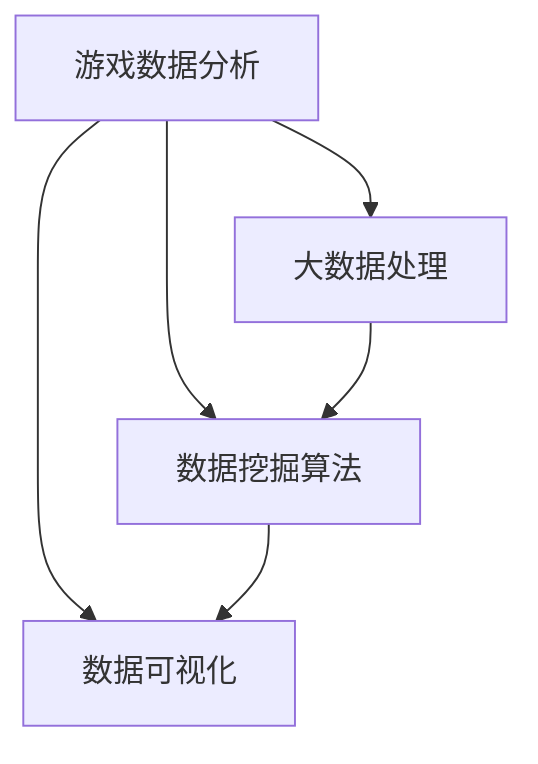

# 楼王争霸劳动竞赛数据处理分析

## 1. 背景介绍

### 1.1 问题的由来

在当前的互联网时代,随着移动互联网的飞速发展,各种App应用程序层出不穷。其中,一款名为"楼王争霸"的手机游戏App在近期异军突起,迅速占领了手游市场的一席之地。该游戏的核心玩法是,玩家需要通过不断地点击屏幕来获取积分,而获得最高积分的玩家将被冠以"楼王"的称号。为了吸引更多的玩家,游戏方不定期地会举办"劳动竞赛"活动,鼓励玩家在一定时间内疯狂点击以获取高分。

随着游戏的火爆,每次活动期间都会产生大量的玩家行为数据。这些数据不仅反映了玩家的游戏体验,也蕴含着丰富的商业价值。然而,如何高效地处理和分析这些海量的游戏数据,从中发现有价值的信息和规律,成为了游戏公司亟待解决的问题。

### 1.2 研究现状

目前,游戏数据处理和分析主要集中在以下几个方面:

1. **玩家行为分析**:通过分析玩家的游戏时长、点击次数、在线时间等数据,了解玩家的游戏习惯和偏好,为游戏优化和个性化推荐提供依据。

2. **营收分析**:对玩家的消费数据进行分析,包括购买虚拟商品的频率、金额等,以优化游戏的盈利模式。

3. **留存分析**:研究影响玩家留存的关键因素,如游戏体验、社交互动等,从而制定相应的策略提高玩家黏性。

4. **游戏平衡性分析**:评估游戏系统的公平性和可玩性,确保游戏规则合理,避免出现过于困难或过于简单的情况。

然而,现有的研究大多集中在通用的游戏数据分析领域,缺乏针对特定游戏类型的深入研究。对于"楼王争霸"这种基于点击积分的手游,如何高效地处理和分析海量的点击数据,并从中发现有价值的信息和规律,仍然是一个亟待解决的问题。

### 1.3 研究意义

对"楼王争霸"劳动竞赛数据进行深入分析,具有重要的理论和实践意义:

1. **理论意义**:可以丰富游戏数据分析的理论和方法,为未来的相关研究提供借鉴和参考。同时,也有助于深入理解玩家的游戏行为模式,为游戏设计和优化提供理论支持。

2. **实践意义**:通过对数据的分析,可以发现玩家的游戏偏好和潜在需求,为游戏公司制定更有针对性的运营策略提供依据。同时,也有助于优化游戏体验,提高玩家的满意度和黏性。

3. **商业价值**:准确分析玩家数据,有助于游戏公司更好地把握市场动向,制定精准的营销策略和盈利模式,从而获得更大的商业回报。

### 1.4 本文结构

本文将围绕"楼王争霸"劳动竞赛数据处理和分析展开讨论,内容结构安排如下:

1. 首先介绍相关的核心概念和理论基础,为后续的分析奠定理论基础。

2. 阐述核心算法的原理和具体操作步骤,并对算法的优缺点和应用领域进行分析。

3. 构建数学模型,推导相关公式,并通过案例分析加深理解。

4. 提供一个实践项目,包括开发环境搭建、源代码实现、代码解读和运行结果展示。

5. 探讨"楼王争霸"数据分析在实际应用场景中的作用和前景。

6. 推荐相关的学习资源、开发工具和论文,为读者提供进一步学习的途径。

7. 总结研究成果,展望未来发展趋势和面临的挑战。

8. 附录部分列出常见问题及解答,帮助读者更好地理解和掌握相关知识。

## 2. 核心概念与联系

在深入探讨"楼王争霸"劳动竞赛数据处理和分析之前,我们需要先了解一些核心概念和理论基础。这些概念不仅是本文分析的理论支撑,也是游戏数据分析领域的基石。

### 2.1 游戏数据分析

游戏数据分析(Game Data Analysis)是一门研究如何从游戏中产生的大量数据中提取有价值信息的学科。它涉及多个领域的知识,包括数据挖掘、统计学、机器学习等。游戏数据分析的主要目标是:

1. 了解玩家行为模式
2. 优化游戏体验
3. 制定精准营销策略
4. 提高游戏的可玩性和公平性

### 2.2 大数据处理

"楼王争霸"这款游戏的火爆,必然会产生大量的玩家行为数据。如何高效地处理这些海量数据,是数据分析的前提和基础。大数据处理技术为我们提供了解决方案,主要包括:

1. **分布式存储**:使用分布式文件系统(如HDFS)存储海量数据。
2. **分布式计算**:利用分布式计算框架(如Apache Spark)进行并行计算。
3. **流式计算**:采用流式计算框架(如Apache Flink)实时处理数据流。

### 2.3 数据挖掘算法

数据挖掘算法是从海量数据中发现隐藏模式和规律的利器。在"楼王争霸"数据分析中,我们可以应用多种算法,例如:

1. **聚类算法**:将具有相似特征的玩家分组,发现潜在的用户群体。
2. **关联规则挖掘**:发现玩家行为之间的关联模式,如"购买A虚拟商品的玩家往往也会购买B虚拟商品"。
3. **时序模式挖掘**:发现玩家行为的时序规律,如"在特定时间段内,玩家的点击频率会显著增加"。

### 2.4 数据可视化

数据可视化技术能够将复杂的数据以直观的形式呈现,有助于我们更好地理解和解释分析结果。在"楼王争霸"数据分析中,常用的可视化方法包括:

1. **统计图表**:柱状图、折线图、饼图等,用于展示数据的分布和趋势。
2. **地理信息可视化**:将数据与地理位置相关联,在地图上进行可视化展示。
3. **交互式可视化**:允许用户与可视化结果进行交互,探索数据的不同维度和细节。

### 2.5 核心概念关系

上述核心概念相互关联,共同构建了"楼王争霸"劳动竞赛数据处理和分析的理论基础。它们的关系可以用下图概括:

1. 游戏数据分析是核心目标,需要借助大数据处理、数据挖掘算法和数据可视化等技术手段。
2. 大数据处理为数据分析提供了高效的数据存储和计算能力。
3. 数据挖掘算法用于从海量数据中发现隐藏的模式和规律。
4. 数据可视化技术将分析结果以直观的形式呈现,便于理解和解释。

## 3. 核心算法原理 & 具体操作步骤

在"楼王争霸"劳动竞赛数据处理和分析中,我们需要应用多种算法和技术手段。本节将重点介绍其中的核心算法——基于点击频率的玩家聚类算法。

### 3.1 算法原理概述

基于点击频率的玩家聚类算法的核心思想是:将具有相似点击频率模式的玩家划分到同一个群集中。这种聚类方式能够帮助我们发现不同类型的玩家群体,为后续的个性化运营和精准营销提供依据。

该算法的工作流程如下:

1. 提取每个玩家在一定时间段内的点击频率数据,构建玩家的点击频率向量。
2. 计算任意两个玩家点击频率向量之间的相似度,作为聚类的距离度量。
3. 基于距离度量,采用特定的聚类算法(如K-Means、DBSCAN等)将玩家划分到不同的群集中。
4. 对每个群集进行分析,总结该群集玩家的共同特征和行为模式。

### 3.2 算法步骤详解

下面我们将详细阐述该算法的具体实现步骤:

1. **数据预处理**

   - 从原始游戏日志中提取每个玩家的点击记录,包括点击时间和点击次数。
   - 将点击记录按照时间戳进行排序,并划分为固定的时间窗口(如每小时为一个窗口)。
   - 在每个时间窗口内,计算每个玩家的点击频率(点击次数/时间窗口长度)。

2. **构建点击频率向量**

   - 将每个玩家在所有时间窗口内的点击频率组成一个向量,作为该玩家的点击频率向量。
   - 对点击频率向量进行归一化处理,使其分量值在[0,1]范围内。

3. **计算相似度**

   - 选择合适的相似度度量方法,如欧几里得距离、余弦相似度等。
   - 计算任意两个玩家点击频率向量之间的相似度,作为聚类的距离度量。

4. **聚类算法**

   - 根据距离度量,采用特定的聚类算法(如K-Means、DBSCAN等)将玩家划分到不同的群集中。
   - K-Means算法需要预先指定群集数量K,通过迭代优化将玩家划分到K个群集中。
   - DBSCAN算法无需指定群集数量,能够自动发现任意形状的密集区域作为群集。

5. **结果分析**

   - 对每个群集进行分析,总结该群集玩家的共同特征和行为模式。
   - 可以分析每个群集的平均点击频率、活跃时间段、地理分布等特征。
   - 根据分析结果,为不同类型的玩家群体制定个性化的运营策略和营销方案。

### 3.3 算法优缺点

基于点击频率的玩家聚类算法具有以下优点:

1. **直观性强**:点击频率是反映玩家活跃程度的直观指标,聚类结果易于理解和解释。
2. **个性化运营**:能够发现不同类型的玩家群体,为个性化运营和精准营销提供依据。
3. **可扩展性好**:算法原理简单,易于扩展到其他游戏类型和数据集。

但该算法也存在一些缺点:

1. **信息损失**:仅考虑点击频率,忽略了其他重要特征(如消费水平、社交互动等),可能导致信息损失。
2. **参数敏感**:聚类算法的效果往往受到参数设置(如K值、密度阈值等)的影响,需要进行调优。
3. **噪声敏感**:存在异常值或噪声数据时,聚类结果可能会受到影响。

### 3.4 算法应用领域

基于点击频率的玩家聚类算法不仅适用于"楼王争霸"这款游戏,也可以推广应用于其他类型的游戏和应用场景,例如:

1. **其他基于点击的手机游戏**:如弹珠游戏、消除游戏等,都可以采用类似的算法进行玩家聚类分析。

2. **网页点击流分析**:分析用户在网站上的点击行为,发现不同类型的用户群体,优化网页设计和广告投放。

3. **物联网设备使用分析**:分析物联网设备(如可穿戴设备)的使用频率,发现不同类型的用户群体,为产品优化提供建议。

4. **社交媒体用户分析**:根据用户在社