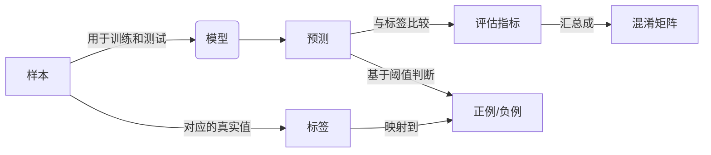

# 模型评估与性能度量原理与代码实战案例讲解

关键词：模型评估、性能度量、评估指标、评估方法、代码实战

## 1. 背景介绍
### 1.1 问题的由来
在机器学习和深度学习领域,模型评估与性能度量是一个非常重要而且必不可少的环节。构建出一个模型后,我们需要用合适的评估指标和方法来衡量模型的性能,以判断模型是否达到预期效果,是否需要进一步优化改进。只有通过严谨的评估流程,才能确保模型能够在实际应用场景中稳定高效地工作。

### 1.2 研究现状
目前业界已经提出了许多不同的模型评估指标和方法,针对不同类型的机器学习任务,如分类、回归、聚类、排序等,都有相应的评估体系。传统的评估指标如准确率、召回率、F1值等仍然被广泛使用。近年来,一些新的评估思路也不断涌现,如对抗性评估、鲁棒性评估等。同时,大量的开源工具和框架也集成了模型评估模块,使得开发者可以方便地进行性能评测。

### 1.3 研究意义
系统全面地掌握模型评估与性能度量的原理和方法,对于提升机器学习从业者的实践能力具有重要意义。通过深入理解各种评估指标的内涵和计算方式,了解不同任务的评估侧重点,熟练运用主流的评估工具和代码库,可以帮助我们规范模型开发流程,快速发现和解决模型存在的问题,不断迭代优化模型性能,进而开发出高质量的机器学习应用。

### 1.4 本文结构
本文将全面介绍模型评估与性能度量的相关知识,内容涵盖评估的基本概念、常用指标、评估方法、代码实践等多个方面。全文组织结构如下:

- 第2部分：介绍评估的核心概念与各概念之间的联系
- 第3部分：重点介绍几种主要的评估指标及其计算原理
- 第4部分：系统讲解评估指标背后的数学模型和公式推导
- 第5部分：通过代码实例演示如何用Python/PyTorch实现各评估指标的计算
- 第6部分：总结评估方法在实际场景中的应用情况
- 第7部分：推荐一些优秀的评估工具和学习资源
- 第8部分：讨论评估领域的研究趋势与面临的挑战
- 第9部分：归纳一些评估相关的常见问题与解答

## 2. 核心概念与联系

在正式介绍各种评估指标之前,我们先来了解一下模型评估的几个核心概念：

- 样本(Sample):训练集/验证集/测试集中的每个数据点都称为一个样本。
- 标签(Label):样本的真实类别或取值。
- 预测(Prediction):模型对样本的输出结果。
- 正例(Positive)/负例(Negative):二分类任务中的两种类别。
- 混淆矩阵(Confusion Matrix):总结模型预测结果与真实标签的矩阵。
- 阈值(Threshold):将连续值预测结果映射为离散类别标签的分界点。

这些概念之间的关系可以用下面的Mermaid图来表示:



可以看出,样本经过模型后得到预测值,预测值与标签的差异可以用各种评估指标来衡量。对于二分类问题,预测值和标签都对应着正例或负例。评估指标的计算可以基于混淆矩阵。

理解了这些概念,我们就可以开始系统学习各类评估指标了。

## 3. 核心算法原理 & 具体操作步骤
### 3.1 算法原理概述
本节我们重点介绍机器学习和深度学习中最常用的几类评估指标,包括:

1. 分类指标:准确率、精确率、召回率、F1值、AUC等
2. 回归指标:MSE、MAE、RMSE、R2等
3. 排序指标:MAP、NDCG等

不同类型的任务需要使用不同的评估指标。分类指标主要用于评估模型对样本类别的判别能力,回归指标用于评估模型预测值与真实值的偏离程度,排序指标用于评估模型对样本相关性大小排序的准确性。

### 3.2 算法步骤详解
下面我们详细介绍几种常见评估指标的定义和计算方法。

#### 3.2.1 准确率(Accuracy)

准确率是最简单直观的分类评估指标,表示模型预测正确的样本数占总样本数的比例。计算公式为:

$$Accuracy = \frac{TP+TN}{TP+FP+TN+FN}$$

其中TP、FP、TN、FN分别表示混淆矩阵中的真正例、假正例、真负例、假负例的数量。

#### 3.2.2 精确率(Precision)和召回率(Recall)

精确率和召回率是一对相互制约的指标。精确率表示预测为正例的样本中真正例占的比例,召回率表示真实的正例样本中被预测正确的比例。计算公式为:

$$Precision=\frac{TP}{TP+FP}$$

$$Recall=\frac{TP}{TP+FN}$$

一般来说,提高精确率会降低召回率,提高召回率会降低精确率。两者的调和平均F1值通常被用来综合评估模型性能:

$$F1=\frac{2}{\frac{1}{Precision}+\frac{1}{Recall}}=\frac{2TP}{2TP+FP+FN}$$

#### 3.2.3 AUC

AUC(Area Under ROC Curve)是评估二分类模型排序性能的常用指标。ROC曲线描述了不同阈值下模型的TPR(真正例率)和FPR(假正例率)的变化情况,AUC则表示ROC曲线下的面积。AUC越大,说明模型对正负例的区分能力越强。

AUC的计算可以用下面的Python代码实现:

```python
from sklearn.metrics import roc_auc_score

y_true = [0, 0, 1, 1]  # 真实标签
y_score = [0.1, 0.4, 0.35, 0.8]  # 预测概率值
print('AUC:', roc_auc_score(y_true, y_score))
# AUC: 0.75
```

#### 3.2.4 均方误差(MSE)

MSE(Mean Squared Error)是回归问题中最常用的评估指标,表示预测值与真实值差值的平方和的均值。计算公式为:

$$MSE=\frac{1}{n}\sum_{i=1}^n(y_i-\hat{y}_i)^2$$

其中$y_i$表示第$i$个样本的真实值,$\hat{y}_i$表示预测值,$n$为样本总数。MSE越小说明模型预测越准确。

PyTorch代码实现如下:

```python
import torch

y_true = torch.tensor([1.0, 2.0, 3.0])
y_pred = torch.tensor([1.2, 2.3, 2.8])
mse_loss = torch.nn.MSELoss()(y_pred, y_true)
print('MSE:', mse_loss.item())
# MSE: 0.0667 
```

#### 3.2.5 平均精确率(MAP)

MAP(Mean Average Precision)是信息检索和推荐系统常用的排序评估指标。对每个Query,计算前K个结果的平均准确率(AP),再对所有Query的AP值求平均得到MAP。AP和MAP的计算公式为:

$$AP@K=\frac{1}{m}\sum_{i=1}^K P(i) \times rel(i)$$

$$MAP@K=\frac{1}{Q}\sum_{q=1}^Q AP(q)$$

其中$m$表示每个Query的相关文档总数,$P(i)$表示前$i$个结果的准确率,$rel(i)$表示第$i$个结果的相关性(0或1),$Q$为Query总数。

下面是用Python实现MAP计算的代码:

```python
def average_precision(y_true, y_pred, k):
    """单个Query的AP计算"""
    y_true = np.array(y_true)[:k]
    y_pred = np.array(y_pred)[:k]
    
    precision = (y_pred == y_true).astype(int)
    cumsum_precision = np.cumsum(precision)
    
    m = min(k, y_true.sum()) 
    ap = (precision * cumsum_precision / (1 + np.arange(k))).sum() / m
    return ap

def mean_average_precision(y_trues, y_preds, k):
    """多个Query的MAP计算"""
    aps = [average_precision(y_true, y_pred, k) 
           for y_true, y_pred in zip(y_trues, y_preds)]
    return np.mean(aps)
```

### 3.3 算法优缺点
以上介绍的评估指标各有优缺点:

- 准确率简单直观,但对分类任务的不平衡问题不敏感
- 精确率、召回率、F1值能够评估正负例的预测情况,但无法兼顾模型输出的概率值
- AUC对概率值的排序质量更敏感,但无法直接度量分类错误的样本比例
- MSE等回归指标能衡量预测值与真实值的偏差大小,但容易受到异常值的影响
- MAP能够评估排序结果的优劣,但计算复杂度较高

因此在实践中,我们需要根据任务的类型和需求,灵活选择合适的评估指标。通常建议使用多个互补的指标来全面评估模型性能。

### 3.4 算法应用领域
不同的评估指标在不同领域有广泛应用:

- 准确率、精确率、召回率、F1值、AUC常用于图像分类、垃圾邮件识别、医疗诊断等分类场景的评估
- MSE、MAE、RMSE、R2常用于销量预测、房价预估、股票趋势判断等回归场景的评估
- MAP、NDCG常用于搜索引擎、推荐系统、问答匹配等排序场景的评估

工业界的很多系统都内置了这些经典的评估指标,如Facebook的Prophet时序预测库、YouTube的视频推荐系统等。学术界的很多机器学习竞赛如Kaggle也广泛采用这些指标来评判参赛模型的性能排名。

## 4. 数学模型和公式 & 详细讲解 & 举例说明
### 4.1 数学模型构建
上一节我们直观地介绍了各评估指标的定义和计算方法,本节将从数学角度对它们的原理做进一步讲解。我们先构建一个统一的数学模型。

考虑一个二分类问题,假设测试集样本数为$n$,第$i$个样本的真实标签为$y_i \in {0,1}$,模型预测为正例的概率为$p_i \in [0,1]$。基于某个阈值$t$,可以将$p_i$转化为预测标签$\hat{y}_i$:

$$
\hat{y}_i = 
\begin{cases}
1, & p_i \geq t \\
0, & p_i < t
\end{cases}
$$

进一步,我们可以定义四个集合来表示样本的预测结果:

- $TP=\{i \mid y_i=1 \wedge \hat{y}_i=1 \}$
- $FP=\{i \mid y_i=0 \wedge \hat{y}_i=1 \}$
- $TN=\{i \mid y_i=0 \wedge \hat{y}_i=0 \}$
- $FN=\{i \mid y_i=1 \wedge \hat{y}_i=0 \}$

即真正例、假正例、真负例、假负例集合。它们的基数(样本数)分别记为$TP,FP,TN,FN$。显然有:

$$TP+FP+TN+FN=n$$

基于以上定义,我们就可以从数学上推导出各评估指标的计算公式。

### 4.2 公式推导过程

(1) 准确率(Accuracy)

准确率表示预测正确的样本数占总样本数的比例,即:

$$
\begin{aligned}
Accuracy 
&= \frac{|TP|+|TN|}{|TP|+|FP|+|TN|+|FN|} \\