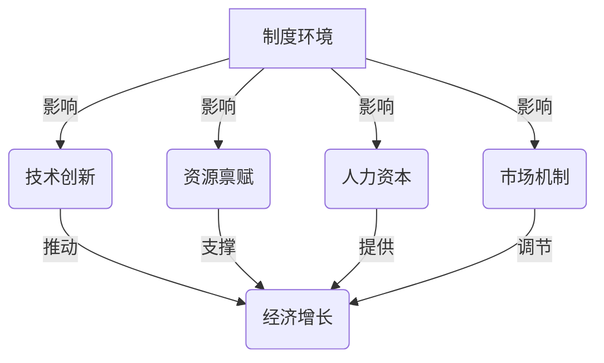

# 深层次问题与经济增长瓶颈

## 1. 背景介绍

### 1.1 问题的由来

经济增长是一个国家和地区发展的重要标志,它不仅关系到人民的生活水平,也影响着社会的稳定与进步。然而,在现实中,经济增长往往会遇到各种瓶颈,这些瓶颈往往源于深层次的结构性问题。这些深层次问题如果得不到有效解决,就会阻碍经济持续健康发展。

传统的经济理论往往将经济增长视为一个单一的过程,忽视了其复杂的内在机理。事实上,经济增长是多种因素相互作用的结果,包括资源禀赋、技术进步、制度环境等多个层面。这些因素之间存在着错综复杂的联系,如果任何一个环节出现问题,都可能导致经济增长遇阻。

### 1.2 研究现状

近年来,学术界对经济增长瓶颈问题给予了高度重视。一些著名的经济学家,如诺贝尔经济学奖得主保罗·罗默、道格拉斯·诺斯等,都对这一问题进行了深入研究。他们的研究成果为我们认识经济增长的深层次问题提供了新的视角。

然而,现有研究也存在一些不足。大多数研究仍然停留在理论层面,缺乏对具体国家和地区的实证分析。另外,研究往往集中在特定领域,缺乏全面系统的视角。因此,我们需要一种新的研究范式,来更好地理解和解决经济增长瓶颈问题。

### 1.3 研究意义

深入研究经济增长的深层次问题,对于促进经济可持续发展具有重要意义。首先,它有助于我们准确识别制约经济增长的关键因素,从而采取有针对性的政策措施。其次,它可以帮助我们预测和防范潜在的经济风险,维护经济运行的稳定性。此外,这一研究也将为构建更加科学的经济增长理论提供依据。

总的来说,探索经济增长瓶颈背后的深层次问题,不仅是学术研究的需要,也是实现高质量发展的现实需求。只有深入揭示问题的根源,才能找到真正有效的解决之道。

### 1.4 本文结构

本文将从多个层面系统地探讨经济增长瓶颈的深层次问题。首先,我们将介绍相关的核心概念,阐明它们之间的内在联系。接下来,将深入分析导致经济增长遇阻的算法原理和数学模型,并给出具体的操作步骤。然后,我们将通过实际案例,说明这些理论在现实中的应用。最后,文章将总结研究成果,并对未来的发展趋势和挑战进行展望。

## 2. 核心概念与联系

要深入理解经济增长瓶颈的深层次问题,我们需要掌握以下几个核心概念:

1. **制度环境**
2. **技术创新**
3. **资源禀赋**
4. **人力资本**
5. **市场机制**

这些概念相互关联、相互影响,共同决定了一个国家或地区的经济增长潜力和瓶颈。我们用一个简单的流程图来阐释它们之间的关系:

从上图可以看出,制度环境是影响经济增长的根本性因素。有利的制度环境可以促进技术创新、合理配置资源、提高人力资本水平、优化市场机制,从而为经济增长注入持久动力。反之,制度环境的缺陷将会阻碍这些关键因素的发挥,最终导致经济增长遇到瓶颈。

因此,我们需要着重分析制度环境对经济增长的深层次影响,并在此基础上探讨其他因素的作用机理。只有将这些核心概念有机结合,才能全面把握经济增长瓶颈问题的本质。

## 3. 核心算法原理 & 具体操作步骤

### 3.1 算法原理概述

要解决经济增长瓶颈的深层次问题,我们需要一种系统性的分析算法。这种算法的核心思想是:将经济系统视为一个复杂的网络结构,通过对网络中各个节点(代表不同的经济要素)及其相互关系的分析,来识别制约经济增长的关键环节。

该算法基于图论和网络科学的理论,借鉴了一些经典算法(如最短路径算法、最大流算法等)的思想。它的优点在于能够有效处理高度复杂的大规模数据,并给出直观的可视化结果,便于决策者制定针对性策略。

算法的具体流程如下:

1. 数据采集:收集反映经济运行状况的多源异构数据,包括统计数据、政策文件、新闻报道等。

2. 数据预处理:对原始数据进行清洗、融合和标准化,构建统一的数据集。

3. 网络建模:将经济要素抽象为节点,它们之间的关系抽象为边,从而构建一个加权有向图模型。

4. 网络分析:在构建的网络模型上,运行各种图算法,包括中心性分析、社区发现、关键路径识别等。

5. 结果可视化:将分析结果以直观的形式呈现,如网络拓扑图、热力图等。

6. 策略制定:基于分析结果,制定有针对性的政策措施,着力解决经济增长的瓶颈问题。

### 3.2 算法步骤详解

下面我们对上述算法流程进行详细阐述:

#### 3.2.1 数据采集

数据采集是算法的基础,也是最为关键的一步。我们需要从各个渠道收集与经济运行相关的数据,包括:

- 政府统计数据:如GDP、工业增加值、固定资产投资、进出口数据等宏观经济数据。
- 政策法规文件:各级政府出台的经济政策、法律法规等。
- 新闻媒体报道:反映经济运行的实际情况和社会舆论导向。
- 企业数据:上市公司年报、行业报告等微观经济数据。
- 社会调查数据:针对不同群体的经济状况的抽样调查数据。

这些数据来源多种多样,数据格式也不尽相同,给后续的处理带来了一定挑战。因此,我们需要采用自动化的数据采集工具,并对不同数据源设计相应的采集策略,以确保数据的完整性和实时性。

#### 3.2.2 数据预处理

获取原始数据后,我们需要对其进行预处理,以构建统一的、可供算法直接使用的数据集。主要的预处理步骤包括:

1. **数据清洗**:剔除数据中的异常值、重复值、缺失值等,保证数据的完整性和一致性。

2. **数据融合**:将来自不同渠道的异构数据进行融合,构建包含多种类型信息的综合数据集。

3. **数据标准化**:由于原始数据的量纲和量级存在差异,需要进行标准化处理,使得不同数据可以在同一量级上进行计算和比较。

4. **数据标注**:为每个数据实例赋予标签,如行业类别、地理位置等,为后续的分析提供元数据支持。

在预处理环节,我们可以借助大数据处理平台(如Hadoop、Spark等)的并行计算能力,来提高处理效率。同时,也需要专业的数据工程师参与,以确保数据质量。

#### 3.2.3 网络建模

经过预处理后,我们得到了一个统一的、高质量的数据集。接下来,需要将这些数据转化为算法可以识别的网络模型。

我们将经济要素抽象为网络中的节点,不同要素之间的关系则对应网络中的边。边的权重可以用来反映要素之间关系的强弱程度。通过这种抽象,整个经济系统就转化为一个加权有向图模型。

在具体建模过程中,我们可以采用以下策略:

1. **节点构建**:将经济要素按照不同的粒度划分为不同级别的节点,既可以是宏观的行业、地区等,也可以是微观的企业、产品等。

2. **边构建**:通过数据挖掘和机器学习算法,自动发现节点之间的关联关系,并赋予相应的权重。

3. **模型优化**:对初步构建的网络模型进行优化,剔除无关边、合并冗余节点,使之更加精简高效。

4. **模型评估**:设计合理的评估指标,检验网络模型的有效性和准确性,必要时进行反馈调整。

值得注意的是,由于经济系统是动态变化的,因此我们需要定期更新网络模型,以反映最新的经济形势。

#### 3.2.4 网络分析

在获得经济网络模型后,我们可以在其上运行各种图算法,发现隐藏其中的重要信息和规律。主要的分析方法包括:

1. **中心性分析**:计算每个节点在网络中的重要程度,找出影响力最大的经济要素。常用的中心性指标有度中心性、介数中心性、特征向量中心性等。

2. **社区发现**:将网络划分为若干个子社区,发现具有相似属性或紧密联系的经济要素集群。可以应用模块度最大化算法、标签传播算法等方法。

3. **关键路径识别**:在网络中寻找起点和终点之间的最短路径或最大流量路径,发现影响经济增长的关键传导路线。可以使用经典的Dijkstra算法、Ford-Fulkerson算法等。

4. **异常检测**:基于网络拓扑结构,发现异常节点或异常关联,发现可能存在的经济风险点。可以借助图核学习、子图同构等技术。

上述分析方法可以单独使用,也可以组合使用,以发掘数据中蕴含的深层次信息。分析的结果将为我们制定有针对性的政策措施提供依据。

#### 3.2.5 结果可视化

为了便于决策者理解分析结果,我们需要将其以直观的形式进行可视化呈现。常用的可视化方式包括:

1. **网络拓扑图**:将经济网络模型按照节点和边的关系绘制成图形,直观展示网络的整体结构和要素之间的联系。

2. **热力图**:使用颜色深浅来反映节点的重要性程度或异常程度,一目了然地发现网络中的热点区域。

3. **矩阵图**:将节点之间的关系用矩阵的形式表示出来,可以清晰地显示出不同要素之间的关联强度。

4. **时序图**:动态展示经济指标或网络结构随时间的变化趋势,分析其中的周期性规律。

除了静态的可视化图形,我们还可以开发交互式的可视化系统,让决策者能够自主地调整视角、钻取细节,以获取更加个性化的分析结果。

#### 3.2.6 策略制定

经过以上步骤的分析,我们已经全面了解了经济增长瓶颈的深层次成因。基于这些发现,我们可以制定有针对性的政策措施,着力解决制约经济发展的关键问题。

策略制定需要遵循以下原则:

1. **系统性**:不能只关注某一个环节,而是要全面考虑各个要素之间的相互影响。

2. **前瞻性**:除了解决当前的瓶颈问题,还要预判未来可能出现的新问题,并提前做好准备。

3. **协同性**:不同领域、不同层级的政策要相互衔接、相互协调,避免出现政策矛盾。

4. **灵活性**:要保持政策的适应性和调整空间,随着形势的变化及时进行调整。

5. **科学性**:政策制定要以数据分析结果为依据,