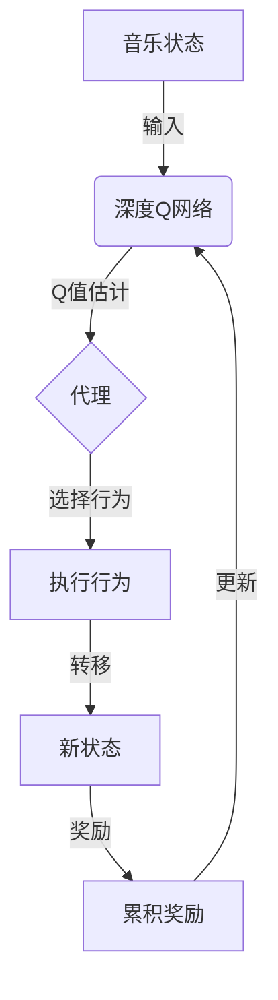

以下是题为《深度 Q-learning：在音乐生成中的应用》的技术博客文章正文：

# 深度 Q-learning：在音乐生成中的应用

## 1. 背景介绍

### 1.1 问题的由来

音乐一直是人类文化和艺术表现的重要形式之一。随着人工智能技术的不断发展,自动生成音乐已成为一个备受关注的研究领域。传统的音乐创作过程需要作曲家耗费大量时间和精力,而通过机器学习算法自动生成音乐不仅可以减轻人工创作的负担,还能为音乐创作提供新的思路和灵感。

然而,自动音乐生成面临着诸多挑战。首先,音乐作品需要保持整体的和谐性和情感表达力,这对算法的生成能力提出了很高的要求。其次,音乐作品往往具有长期的时间依赖性,算法需要能够捕捉到音乐的长期结构和发展趋势。此外,音乐还包含了节奏、旋律、和声等多个要素,算法需要能够同时处理这些不同的因素。

### 1.2 研究现状

目前,已有多种机器学习算法被应用于音乐生成任务,包括基于规则的方法、马尔可夫模型、递归神经网络等。其中,深度强化学习(Deep Reinforcement Learning)因其在序列决策问题上的优异表现,成为了音乐生成领域的一个热门方向。

深度Q学习(Deep Q-Learning)作为强化学习的一种重要算法,已在多个领域取得了卓越的成绩,如游戏AI、机器人控制等。将深度Q学习应用于音乐生成任务,可以将音乐生成过程建模为一个序列决策问题,通过不断尝试和学习,逐步优化生成的音乐序列,从而达到生成高质量音乐作品的目的。

### 1.3 研究意义

将深度Q学习应用于音乐生成领域,不仅可以推动人工智能技术在音乐创作领域的应用,还可以为音乐理论研究提供新的视角和方法。通过研究深度Q学习在音乐生成中的表现,我们可以更好地理解音乐的本质特征,揭示音乐作品背后的规律和原理。

此外,成功的音乐生成系统还可以为音乐创作者提供辅助工具,提高创作效率,激发创作灵感。在音乐教育领域,也可以将自动生成的音乐作品用于教学演示,帮助学生更好地理解音乐理论知识。

### 1.4 本文结构  

本文将首先介绍深度Q学习的核心概念和基本原理,然后详细阐述将其应用于音乐生成任务时所采用的数学模型、算法步骤和实现细节。接下来,我们将通过实际案例分析,说明深度Q学习在音乐生成中的应用效果和存在的挑战。最后,我们将总结该方法的优缺点,并对未来的发展方向进行展望。

## 2. 核心概念与联系

深度Q学习(Deep Q-Learning)是将深度神经网络应用于强化学习中的Q学习算法,用于估计给定状态下各个行为的长期回报值。其核心思想是使用一个深度神经网络来逼近最优的Q函数,即在当前状态下执行某个行为所能获得的最大期望累积回报。

在音乐生成任务中,我们可以将音乐序列看作是一个马尔可夫决策过程(Markov Decision Process, MDP),其中:

- 状态(State)表示当前已生成的音乐片段
- 行为(Action)表示在当前状态下可以执行的音乐事件(如添加一个音符)
- 奖励(Reward)衡量生成的音乐序列的质量
- 策略(Policy)定义了在给定状态下选择行为的概率分布

深度Q网络将当前音乐状态作为输入,输出各个可能行为的Q值估计,代理(Agent)根据这些Q值选择行为,执行后转移到下一个状态,获得相应的奖励。通过不断尝试和学习,Q网络可以逐步优化其参数,使得生成的音乐序列获得更高的累积奖励,从而达到生成高质量音乐作品的目的。

上图展示了深度Q学习在音乐生成中的工作流程。深度Q网络根据当前音乐状态输出各个可能行为的Q值估计,代理根据这些Q值选择一个行为执行,转移到下一个状态并获得相应的奖励。通过不断更新Q网络参数,最终可以生成获得高累积奖励的优质音乐序列。

## 3. 核心算法原理 & 具体操作步骤

### 3.1 算法原理概述

深度Q学习算法的核心是通过一个深度神经网络来逼近最优的Q函数,即在当前状态下执行某个行为所能获得的最大期望累积回报。具体来说,该算法包含以下几个关键步骤:

1. **状态表示**: 将当前音乐片段用适当的方式编码为神经网络可以处理的状态向量表示。
2. **Q网络**: 使用一个深度神经网络(通常是卷积神经网络或循环神经网络)作为Q函数的逼近器,将状态向量作为输入,输出各个可能行为的Q值估计。
3. **行为选择**: 根据Q值估计,使用某种策略(如ε-贪婪策略)选择一个行为执行。
4. **奖励计算**: 根据生成的音乐序列计算相应的奖励值,作为该行为的即时回报。
5. **经验回放**: 将(状态,行为,奖励,新状态)的转移过程存储在经验回放池中。
6. **网络训练**: 从经验回放池中采样批次数据,使用标准的Q学习算法(如DQN)来更新Q网络的参数,最小化Q值的预测误差。
7. **生成过程**: 在生成新的音乐序列时,重复执行状态表示、Q值估计和行为选择的步骤,直到达到终止条件。

通过上述过程,Q网络可以不断学习到更准确的Q值估计,从而指导代理做出更优的行为选择,最终生成出高质量的音乐作品。

### 3.2 算法步骤详解

以下是深度Q学习算法在音乐生成任务中的具体实现步骤:

1. **状态表示**
   - 将音乐片段表示为一个多维状态向量,包括已生成的音符序列、节奏信息、和声进程等要素。
   - 可以使用一维或二维卷积编码,对音符序列进行特征提取。
   - 也可以使用递归神经网络(如LSTM)来捕捉音乐的长期依赖关系。

2. **Q网络结构**
   - 输入层: 接收状态向量作为输入
   - 卷积层/LSTM层: 对状态向量进行特征提取和编码
   - 全连接层: 将编码后的特征映射到Q值空间
   - 输出层: 输出各个可能行为的Q值估计

3. **行为空间**
   - 定义可执行的音乐事件集合,如添加一个音符、调整音长、变更力度等。
   - 行为空间的大小将决定Q网络的输出维度。

4. **奖励函数**
   - 设计一个奖励函数,用于评估生成的音乐序列的质量。
   - 可以包括音乐理论规则(如和声、节奏等)、风格一致性、情感表达力等多个方面。
   - 奖励函数的设计直接影响到生成音乐的质量。

5. **经验回放**
   - 将(状态,行为,奖励,新状态)的转移过程存储在经验回放池中。
   - 训练时从经验回放池中随机采样批次数据,减小数据相关性。

6. **网络训练**
   - 使用标准的Q学习算法(如DQN)来更新Q网络的参数。
   - 最小化Q值的预测误差: $L = \mathbb{E}\left[(r + \gamma \max_{a'} Q(s', a'; \theta^-) - Q(s, a; \theta))^2\right]$
   - 其中$r$为即时奖励, $\gamma$为折现因子, $\theta^-$为目标网络参数。

7. **生成过程**
   - 初始化一个空白的音乐序列作为起始状态。
   - 重复执行以下步骤,直到满足终止条件:
     1. 将当前音乐序列编码为状态向量输入到Q网络。
     2. 根据Q值估计,使用策略(如ε-贪婪)选择一个行为执行。
     3. 将选定的行为应用到音乐序列,得到新的音乐状态。
   - 生成的音乐序列即为最终输出。

通过上述步骤,深度Q学习算法可以逐步学习到一个有效的策略,指导代理在每个状态下执行最优的音乐事件,从而生成出高质量的音乐作品。

### 3.3 算法优缺点

**优点**:

1. **序列决策能力**: 深度Q学习擅长解决序列决策问题,能够很好地捕捉音乐序列的长期依赖关系。
2. **端到端学习**: 算法可以直接从音乐数据中端到端地学习,无需人工设计复杂的规则或特征。
3. **多目标优化**: 通过设计合理的奖励函数,可以同时优化音乐作品的多个质量指标。
4. **探索与利用**: 算法在训练过程中具有探索与利用的能力,可以发现新颖的音乐模式。

**缺点**:

1. **奖励函数设计**: 奖励函数的设计对算法性能影响很大,但很难量化音乐质量的所有方面。
2. **稀疏奖励问题**: 在音乐生成任务中,算法可能需要经历很长时间才能获得有效的奖励反馈,导致训练效率低下。
3. **生成质量不稳定**: 由于算法具有一定的随机性,生成的音乐质量可能不够稳定,存在一些突兀或违反音乐理论的情况。
4. **计算资源需求高**: 训练深度Q网络通常需要大量的计算资源,对硬件要求较高。

### 3.4 算法应用领域

深度Q学习算法不仅可以应用于音乐生成领域,还可以推广到其他序列生成任务,如:

- **自然语言生成**: 将文本生成建模为序列决策过程,使用深度Q学习算法生成自然语言文本。
- **蛋白质结构预测**: 利用深度Q学习算法预测蛋白质的三维空间折叠结构。
- **机器人控制**: 将机器人运动控制问题建模为MDP,使用深度Q学习算法优化机器人的行为策略。
- **智能对话系统**: 将对话过程看作是一个序列决策问题,应用深度Q学习算法生成自然的对话响应。

总的来说,深度Q学习算法擅长解决序列决策类问题,在多个领域都有广泛的应用前景。

## 4. 数学模型和公式 & 详细讲解 & 举例说明

### 4.1 数学模型构建

在将深度Q学习应用于音乐生成任务时,我们需要首先将音乐生成过程建模为一个马尔可夫决策过程(Markov Decision Process, MDP)。一个MDP可以用一个五元组$(S, A, P, R, \gamma)$来表示,其中:

- $S$是状态空间的集合,表示所有可能的环境状态。在音乐生成中,状态可以是当前已生成的音乐片段。
- $A$是行为空间的集合,表示在每个状态下代理可以执行的行为。在音乐生成中,行为可以是添加一个音符、调整音长、变更力度等音乐事件。
- $P(s'|s, a)$是状态转移概率,表示在状态$s$下执行行为$a$后,转移到状态$s'$的概率。在音乐生成中,这对应于将某个音乐事件应用到当前