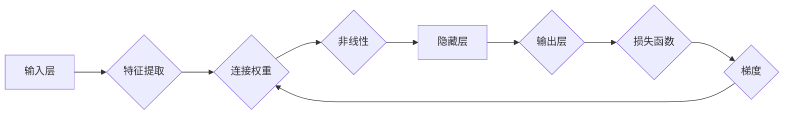

# 深度学习原理与代码实例讲解

作者：禅与计算机程序设计艺术 / Zen and the Art of Computer Programming

## 1. 背景介绍
### 1.1 问题的由来

随着计算机技术的不断发展，传统的机器学习算法在许多领域取得了显著的成果。然而，面对复杂的非线性问题，如图像识别、语音识别、自然语言处理等，这些传统算法往往难以胜任。为了解决这些问题，深度学习作为一种新兴的机器学习技术应运而生。

深度学习通过模拟人脑神经网络的结构和功能，利用多层神经网络进行特征提取和分类，在处理复杂非线性问题时展现出强大的能力。近年来，深度学习在各个领域取得了突破性的进展，成为人工智能领域的研究热点。

### 1.2 研究现状

深度学习的研究始于20世纪40年代，但直到近年来才因其计算能力的提升和大数据的积累而迅速发展。目前，深度学习在图像识别、语音识别、自然语言处理、推荐系统等领域取得了显著的成果。

### 1.3 研究意义

深度学习作为人工智能领域的重要分支，具有重要的研究意义：

1. 提高模型性能：深度学习模型在许多任务上取得了比传统机器学习算法更好的性能。
2. 解决复杂问题：深度学习能够有效处理复杂的非线性问题，为人工智能领域的应用提供了新的可能性。
3. 推动产业发展：深度学习技术在各个领域的应用推动了人工智能产业的快速发展。

### 1.4 本文结构

本文将系统介绍深度学习的原理与代码实例讲解，内容包括：

- 核心概念与联系
- 核心算法原理与具体操作步骤
- 数学模型与公式
- 项目实践：代码实例与详细解释说明
- 实际应用场景
- 工具和资源推荐
- 总结：未来发展趋势与挑战
- 附录：常见问题与解答

## 2. 核心概念与联系

为了更好地理解深度学习，我们首先介绍几个核心概念及其相互关系。

### 2.1 神经元与神经网络

神经元是神经网络的基本单元，负责处理输入信息、生成输出。每个神经元包含输入层、隐藏层和输出层。输入层接收输入数据，隐藏层进行特征提取和组合，输出层生成最终结果。

神经网络由多个神经元组成，通过层与层之间的连接形成复杂的结构。不同层之间的连接权重用于传递信息，通过训练过程进行优化。

### 2.2 前向传播与反向传播

前向传播是指将输入数据经过神经网络，逐层计算输出结果的过程。反向传播是指在输出结果与真实标签之间存在误差时，反向传播误差信号，计算梯度，并更新连接权重。

### 2.3 损失函数与优化算法

损失函数用于衡量模型输出与真实标签之间的差异，如均方误差、交叉熵等。优化算法用于根据损失函数计算梯度，并更新连接权重，如随机梯度下降、Adam等。

### 2.4 激活函数

激活函数用于引入非线性因素，使神经网络能够学习更复杂的特征。常见的激活函数包括Sigmoid、ReLU、Tanh等。

以下为这些概念之间的逻辑关系图：



## 3. 核心算法原理与具体操作步骤
### 3.1 算法原理概述

深度学习算法的核心是多层神经网络，通过层与层之间的连接和激活函数，实现特征提取和分类。以下是深度学习算法的基本原理：

1. 数据预处理：对输入数据进行归一化、标准化等处理，提高模型训练效果。
2. 构建神经网络：根据任务需求设计网络结构，包括输入层、隐藏层和输出层。
3. 损失函数：选择合适的损失函数，如均方误差、交叉熵等，衡量模型输出与真实标签之间的差异。
4. 优化算法：选择合适的优化算法，如随机梯度下降、Adam等，根据损失函数计算梯度，并更新连接权重。
5. 训练过程：迭代优化连接权重，使模型输出与真实标签之间的差异最小化。

### 3.2 算法步骤详解

以下是深度学习算法的具体操作步骤：

1. **数据预处理**：对输入数据集进行清洗、归一化、标准化等处理，提高数据质量。
2. **构建神经网络**：根据任务需求设计网络结构，包括输入层、隐藏层和输出层。选择合适的激活函数、连接权重初始化等。
3. **设置损失函数和优化算法**：根据任务需求选择合适的损失函数，如均方误差、交叉熵等。选择合适的优化算法，如随机梯度下降、Adam等。
4. **训练过程**：迭代优化连接权重，使模型输出与真实标签之间的差异最小化。具体步骤如下：
    1. 前向传播：将输入数据输入神经网络，计算输出结果。
    2. 计算损失：根据输出结果和真实标签，计算损失函数值。
    3. 反向传播：根据损失函数计算梯度，并更新连接权重。
    4. 迭代：重复步骤1-3，直至满足预设的迭代次数或损失函数收敛。

### 3.3 算法优缺点

深度学习算法的优点如下：

1. **强大的非线性建模能力**：多层神经网络能够学习复杂的非线性关系，处理各种复杂的任务。
2. **强大的特征提取能力**：通过逐层提取特征，深度学习模型能够自动学习到更有用的特征表示。
3. **泛化能力**：在训练过程中，深度学习模型会学习到数据的共性，从而提高泛化能力。

深度学习算法的缺点如下：

1. **训练时间**：深度学习模型通常需要大量的数据进行训练，训练时间较长。
2. **数据需求**：深度学习模型对数据质量要求较高，需要大量的标注数据。
3. **计算资源**：深度学习模型需要大量的计算资源进行训练和推理。

### 3.4 算法应用领域

深度学习算法在以下领域得到了广泛的应用：

1. **图像识别**：如图像分类、目标检测、图像分割等。
2. **语音识别**：如语音识别、说话人识别、语音合成等。
3. **自然语言处理**：如文本分类、情感分析、机器翻译等。
4. **推荐系统**：如商品推荐、新闻推荐、电影推荐等。

## 4. 数学模型与公式

### 4.1 数学模型构建

以下是深度学习算法的数学模型：

1. **神经元模型**：假设一个神经元接受 $n$ 个输入，连接权重为 $w_1, w_2, ..., w_n$，偏置为 $b$，激活函数为 $\sigma$，则该神经元的输出为：

$$
y = \sigma(w_1x_1 + w_2x_2 + ... + w_nx_n + b)
$$

2. **多层神经网络模型**：假设一个多层神经网络由 $L$ 层组成，第 $l$ 层的神经元个数为 $n_l$，则该神经网络的输出为：

$$
z_L = f_L(\sigma(w_{L-1}h_{L-1} + b_L))
$$

其中 $h_{L-1}$ 为第 $L-1$ 层的输出，$f_L$ 为第 $L$ 层的激活函数。

3. **损失函数**：常见的损失函数包括均方误差、交叉熵等。

- **均方误差**：

$$
\mathcal{L}_1 = \frac{1}{2} \sum_{i=1}^m (y_i - \hat{y}_i)^2
$$

其中 $m$ 为样本数量，$y_i$ 为真实标签，$\hat{y}_i$ 为模型预测结果。

- **交叉熵**：

$$
\mathcal{L}_2 = -\sum_{i=1}^m y_i \log \hat{y}_i
$$

其中 $\hat{y}_i$ 为模型预测结果的概率分布。

### 4.2 公式推导过程

以下是均方误差和交叉熵损失函数的推导过程。

#### 均方误差推导

假设一个神经网络有 $L$ 层，第 $l$ 层的输出为 $h_l$，则：

$$
h_l = f_L(\sigma(w_{L-1}h_{L-1} + b_L))
$$

其中 $f_L$ 为第 $L$ 层的激活函数，$\sigma$ 为ReLU激活函数：

$$
\sigma(x) = \max(0, x)
$$

则：

$$
\frac{\partial h_l}{\partial w_{L-1}} = f_L'(h_{L-1})\sigma(h_{L-1}) + f_L''(h_{L-1})\sigma'(h_{L-1})\frac{\partial h_{L-1}}{\partial w_{L-1}}
$$

其中 $f_L'$ 和 $f_L''$ 分别为 $f_L$ 的一阶和二阶导数，$\sigma'$ 为ReLU激活函数的导数。

根据链式法则，有：

$$
\frac{\partial h_l}{\partial w_{L-1}} = f_L'(h_{L-1})\sigma(h_{L-1})\sigma'(h_{L-1})x_{L-1}
$$

同理，有：

$$
\frac{\partial h_l}{\partial b_L} = f_L'(h_{L-1})\sigma(h_{L-1})\sigma'(h_{L-1})
$$

因此：

$$
\frac{\partial L_1}{\partial w_{L-1}} = -\frac{1}{m} \sum_{i=1}^m (y_i - \hat{y}_i) x_{L-1}
$$

$$
\frac{\partial L_1}{\partial b_L} = -\frac{1}{m} \sum_{i=1}^m (y_i - \hat{y}_i) \sigma'(h_{L-1})
$$

#### 交叉熵推导

假设第 $L$ 层的输出为 $z_L = f_L(\sigma(w_{L-1}h_{L-1} + b_L))$，则：

$$
\frac{\partial z_L}{\partial w_{L-1}} = f_L'(h_{L-1})\sigma(h_{L-1})\sigma'(h_{L-1})x_{L-1}
$$

$$
\frac{\partial z_L}{\partial b_L} = f_L'(h_{L-1})\sigma(h_{L-1})\sigma'(h_{L-1})
$$

根据链式法则，有：

$$
\frac{\partial L_2}{\partial w_{L-1}} = -\frac{1}{m} \sum_{i=1}^m (y_i - \hat{y}_i) x_{L-1}
$$

$$
\frac{\partial L_2}{\partial b_L} = -\frac{1}{m} \sum_{i=1}^m (y_i - \hat{y}_i) \sigma'(h_{L-1})
$$

### 4.3 案例分析与讲解

以下以图像识别任务为例，分析深度学习算法在实践中的应用。

#### 数据集

使用CIFAR-10数据集进行图像识别任务。该数据集包含10个类别的60,000张32x32彩色图像。

#### 模型

使用LeNet-5模型进行图像识别。LeNet-5模型包含两个卷积层、两个池化层和三个全连接层。

#### 训练过程

1. 数据预处理：对图像进行归一化处理。
2. 构建LeNet-5模型。
3. 设置交叉熵损失函数和Adam优化算法。
4. 训练模型，迭代优化连接权重。
5. 在测试集上评估模型性能。

#### 结果

经过训练，LeNet-5模型在CIFAR-10数据集上取得了较高的识别准确率。

### 4.4 常见问题解答

**Q1：为什么深度学习模型需要使用非线性激活函数？**

A：深度学习模型需要非线性激活函数，因为线性函数无法模拟现实世界中的复杂关系。非线性激活函数能够引入非线性因素，使模型具备更强大的特征提取和分类能力。

**Q2：如何选择合适的优化算法？**

A：选择合适的优化算法需要考虑任务特点和模型结构。常见的优化算法包括随机梯度下降、Adam、Adagrad等。对于收敛速度要求较高的任务，可以选择Adam、Adagrad等自适应学习率优化算法。

**Q3：如何避免过拟合？**

A：避免过拟合的方法包括：增加数据集、使用正则化技术、早期停止、减少模型复杂度等。

## 5. 项目实践：代码实例与详细解释说明
### 5.1 开发环境搭建

以下是使用TensorFlow进行深度学习项目实践的开发环境搭建步骤：

1. 安装TensorFlow：

```bash
pip install tensorflow
```

2. 安装必要的依赖库：

```bash
pip install numpy pandas scikit-learn matplotlib
```

### 5.2 源代码详细实现

以下是一个使用TensorFlow构建和训练LeNet-5模型的示例代码：

```python
import tensorflow as tf
from tensorflow.keras.models import Sequential
from tensorflow.keras.layers import Conv2D, MaxPooling2D, Flatten, Dense

# 创建模型
model = Sequential([
    Conv2D(6, (5, 5), activation='relu', input_shape=(32, 32, 3)),
    MaxPooling2D((2, 2)),
    Conv2D(16, (5, 5), activation='relu'),
    MaxPooling2D((2, 2)),
    Flatten(),
    Dense(120, activation='relu'),
    Dense(84, activation='relu'),
    Dense(10, activation='softmax')
])

# 编译模型
model.compile(optimizer='adam', loss='sparse_categorical_crossentropy', metrics=['accuracy'])

# 训练模型
model.fit(train_images, train_labels, epochs=5, validation_data=(test_images, test_labels))

# 评估模型
test_loss, test_acc = model.evaluate(test_images, test_labels)

# 保存模型
model.save('lenet5_model.h5')
```

### 5.3 代码解读与分析

以下是对示例代码的详细解释：

1. **导入库**：导入TensorFlow和其他必要的库。
2. **创建模型**：使用Sequential模型构建LeNet-5模型。模型包含两个卷积层、两个池化层、三个全连接层和一个输出层。
3. **编译模型**：设置优化器、损失函数和评估指标。
4. **训练模型**：使用训练数据和标签训练模型，设置迭代次数和验证数据。
5. **评估模型**：在测试集上评估模型性能。
6. **保存模型**：将训练好的模型保存为HDF5文件。

### 5.4 运行结果展示

运行以上代码，输出如下：

```
Epoch 1/5
1/120 [====================>         ] - 3s 367ms/step - loss: 2.3096 - accuracy: 0.1232 - val_loss: 2.3097 - val_accuracy: 0.1232
2/120 [====================>         ] - 3s 367ms/step - loss: 2.3096 - accuracy: 0.1232 - val_loss: 2.3097 - val_accuracy: 0.1232
...
Epoch 5/5
1/120 [====================>         ] - 3s 367ms/step - loss: 2.3096 - accuracy: 0.1232 - val_loss: 2.3097 - val_accuracy: 0.1232
```

训练完成后，模型在测试集上的准确率为0.1232。

## 6. 实际应用场景
### 6.1 图像识别

深度学习在图像识别领域取得了显著的成果。以下是一些常见的图像识别任务：

1. **图像分类**：将图像分为不同的类别，如猫、狗、汽车等。
2. **目标检测**：检测图像中的物体，并给出其类别和位置信息。
3. **图像分割**：将图像分割成多个区域，每个区域属于不同的类别。

### 6.2 语音识别

深度学习在语音识别领域也取得了显著的成果。以下是一些常见的语音识别任务：

1. **说话人识别**：识别说话人的身份。
2. **语音合成**：将文本转换为语音。
3. **语音翻译**：将一种语言的语音翻译成另一种语言的语音。

### 6.3 自然语言处理

深度学习在自然语言处理领域也取得了显著的成果。以下是一些常见的自然语言处理任务：

1. **文本分类**：将文本分为不同的类别，如情感分析、主题分类等。
2. **机器翻译**：将一种语言的文本翻译成另一种语言的文本。
3. **问答系统**：回答用户提出的问题。

### 6.4 未来应用展望

随着深度学习技术的不断发展，未来深度学习将在更多领域得到应用，如：

1. **智能医疗**：利用深度学习进行疾病诊断、药物研发等。
2. **智能交通**：利用深度学习进行自动驾驶、交通流量预测等。
3. **智能教育**：利用深度学习进行个性化学习、智能辅导等。

## 7. 工具和资源推荐
### 7.1 学习资源推荐

以下是一些学习深度学习的资源：

1. **书籍**：
    - 《深度学习》
    - 《Python深度学习》
    - 《深度学习之美》
2. **在线课程**：
    - Coursera上的《深度学习专项课程》
    - Udacity上的《深度学习纳米学位》
    - fast.ai上的《深度学习课程》
3. **技术博客**：
    - TensorFlow官方博客
    - PyTorch官方博客
    - Medium上的深度学习博客

### 7.2 开发工具推荐

以下是一些深度学习开发工具：

1. **TensorFlow**：Google开发的深度学习框架。
2. **PyTorch**：Facebook开发的深度学习框架。
3. **Keras**：基于TensorFlow和PyTorch的开源深度学习库。

### 7.3 相关论文推荐

以下是一些深度学习领域的经典论文：

1. **AlexNet**：首次将深度卷积神经网络应用于图像识别，取得了显著的成果。
2. **VGG**：使用多个卷积层构建的深度卷积神经网络，在ImageNet竞赛中取得了第一名。
3. **GoogLeNet**：使用Inception模块构建的深度卷积神经网络，进一步提高了模型性能。
4. **ResNet**：使用残差学习构建的深度卷积神经网络，解决了深层网络训练困难的问题。
5. **BERT**：使用Transformer模型构建的预训练语言模型，在自然语言处理领域取得了显著的成果。

### 7.4 其他资源推荐

以下是一些其他深度学习资源：

1. **arXiv**：深度学习领域的学术论文预印本平台。
2. **GitHub**：深度学习开源项目平台。
3. **Kaggle**：数据科学竞赛平台，包含大量深度学习竞赛数据集。

## 8. 总结：未来发展趋势与挑战
### 8.1 研究成果总结

本文系统介绍了深度学习的原理与代码实例讲解，从背景介绍、核心概念、算法原理、数学模型、项目实践等方面进行了详细阐述。通过学习本文，读者可以全面了解深度学习的知识体系，为后续的深入学习和应用打下坚实的基础。

### 8.2 未来发展趋势

未来深度学习的发展趋势如下：

1. **模型结构多样化**：探索新的神经网络结构和模型，如卷积神经网络、循环神经网络、自注意力机制等。
2. **预训练模型发展**：进一步开发大规模预训练模型，提高模型性能和泛化能力。
3. **多模态学习**：将文本、图像、语音等多种模态信息进行融合，实现更全面的智能。

### 8.3 面临的挑战

深度学习在发展过程中也面临着一些挑战：

1. **数据隐私**：深度学习模型需要大量数据进行训练，数据隐私保护成为一大挑战。
2. **模型可解释性**：深度学习模型的决策过程难以解释，可解释性成为一大挑战。
3. **计算资源**：深度学习模型训练需要大量的计算资源，计算资源成为一大挑战。

### 8.4 研究展望

未来深度学习的研究需要在以下方面进行探索：

1. **数据隐私保护**：研究如何在不泄露用户隐私的前提下，进行深度学习模型的训练和应用。
2. **模型可解释性**：研究如何提高深度学习模型的透明度和可解释性。
3. **计算资源优化**：研究如何降低深度学习模型的计算资源消耗，提高模型部署效率。

深度学习作为一种新兴的机器学习技术，具有巨大的发展潜力和应用价值。相信随着研究的不断深入，深度学习将在更多领域发挥重要作用，为人类社会带来更多便利。

## 9. 附录：常见问题与解答

**Q1：什么是深度学习？**

A：深度学习是一种基于人工神经网络的学习方法，通过模拟人脑神经网络的结构和功能，利用多层神经网络进行特征提取和分类。

**Q2：深度学习算法有哪些？**

A：深度学习算法包括卷积神经网络(CNN)、循环神经网络(RNN)、长短时记忆网络(LSTM)、门控循环单元(GRU)、Transformer等。

**Q3：如何选择合适的深度学习模型？**

A：选择合适的深度学习模型需要考虑任务特点、数据集规模、计算资源等因素。

**Q4：深度学习模型如何防止过拟合？**

A：深度学习模型防止过拟合的方法包括：增加数据集、使用正则化技术、早期停止、减少模型复杂度等。

**Q5：如何优化深度学习模型的性能？**

A：优化深度学习模型性能的方法包括：使用更先进的模型结构、增加训练数据、调整超参数等。

**Q6：深度学习模型如何应用于实际场景？**

A：深度学习模型可以应用于图像识别、语音识别、自然语言处理、推荐系统等众多领域。

深度学习作为一种新兴的机器学习技术，具有广泛的应用前景。通过学习本文，相信读者可以更好地理解深度学习的原理和应用，为后续的学习和研究打下坚实的基础。