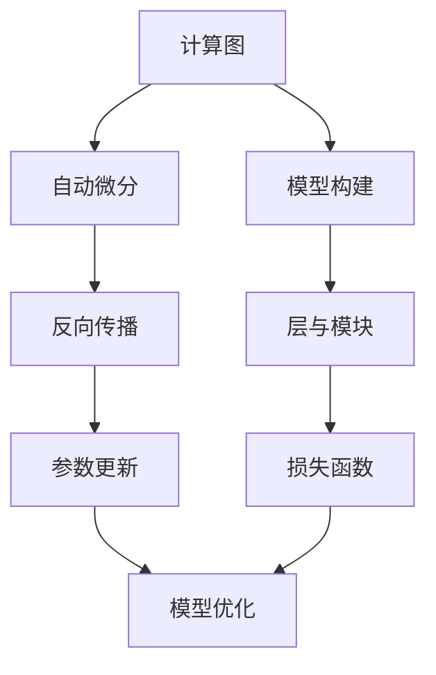
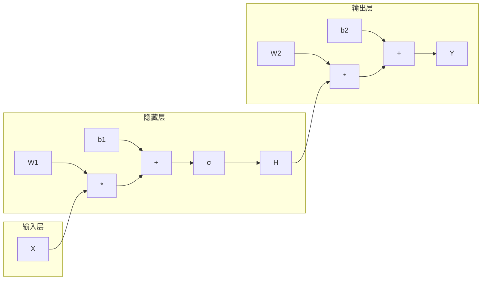

以下是根据您提供的标题和要求撰写的技术博客文章正文内容：

# 深度学习框架原理与代码实战案例讲解

## 1. 背景介绍

### 1.1 问题的由来

随着大数据时代的到来,数据量呈指数级增长,传统的机器学习算法在处理复杂高维数据时遇到了瓶颈。深度学习作为一种有效处理高维数据的技术,凭借其强大的特征表达能力和端到端的训练方式,在计算机视觉、自然语言处理、语音识别等领域取得了突破性进展。

然而,深度学习模型的训练过程通常需要大量的计算资源,并且存在过拟合、梯度消失/爆炸等问题,给模型的训练和部署带来了挑战。为了高效训练和部署深度学习模型,需要一个高性能、易用、可扩展的深度学习框架。

### 1.2 研究现状  

目前,主流的开源深度学习框架包括TensorFlow、PyTorch、MXNet、PaddlePaddle等。这些框架提供了丰富的模型构建模块、自动求导、GPU加速等功能,极大地促进了深度学习技术的发展和应用。

不同的深度学习框架在设计理念、编程范式、性能表现等方面存在差异,为满足不同场景下的需求,研究人员需要对这些框架的原理和实现细节有深入的理解。

### 1.3 研究意义

深入理解主流深度学习框架的原理和实现细节,对于高效利用框架资源、解决实际问题、提高模型性能至关重要。通过剖析框架源代码,可以洞见框架设计思路,把握核心算法,从而更好地开发和优化深度学习模型。

此外,对比分析不同框架的优缺点,可以指导框架的选型,并为框架的迭代和新框架的设计提供借鉴。

### 1.4 本文结构

本文将首先介绍深度学习框架的核心概念,包括计算图、自动微分、模型构建等,阐明不同概念之间的联系。

接下来,将重点剖析主流深度学习框架的核心算法原理,如反向传播算法、优化算法等,并详细讲解具体操作步骤。

然后,将构建数学模型并推导公式,辅以案例分析加深对原理的理解。

在此基础上,将通过实战案例展示框架的代码实现细节,并给出详尽的解释说明。

最后,将探讨深度学习框架在实际应用中的场景,介绍相关工具和学习资源,总结未来发展趋势和面临的挑战。

## 2. 核心概念与联系

深度学习框架的核心概念包括计算图、自动微分、模型构建等,它们之间存在紧密的联系:

1. **计算图(Computational Graph)**: 表示深度学习模型的数学计算过程,将复杂的计算任务分解为一系列基本操作,并描述它们之间的依赖关系。计算图是自动微分和模型构建的基础。

2. **自动微分(Automatic Differentiation)**: 基于计算图,高效计算目标函数相对于各个参数的梯度,是实现反向传播算法的关键技术。

3. **模型构建(Model Construction)**: 深度学习框架通常提供层(Layer)和模块(Module)等抽象,允许用户使用简洁的代码定义复杂的深度神经网络模型。

4. **反向传播(Backpropagation)**: 利用自动微分技术计算损失函数相对于模型参数的梯度,是训练深度神经网络的核心算法。

5. **参数更新(Parameter Update)**: 根据计算得到的梯度,结合优化算法(如SGD、Adam等)更新模型参数,从而不断优化模型性能。

6. **损失函数(Loss Function)**: 衡量模型预测输出与真实标签之间的差异,是优化模型的目标函数。

上述概念相互关联、环环相扣,共同构成了深度学习框架的核心架构。理解这些概念及其内在联系,对于灵活高效地使用深度学习框架至关重要。

## 3. 核心算法原理与具体操作步骤

### 3.1 算法原理概述

深度学习框架的核心算法是**反向传播算法(Backpropagation)**,用于根据输出和标签计算损失函数,并通过自动微分技术高效计算损失函数相对于各个参数的梯度,从而指导参数的更新,不断优化模型性能。

反向传播算法包括两个主要阶段:

1. **前向传播(Forward Propagation)**: 根据输入数据和模型参数,计算模型的输出。这个过程可以用计算图来表示。

2. **反向传播(Backward Propagation)**: 根据损失函数对输出的梯度,利用链式法则沿着计算图反向传播,计算损失函数相对于各个参数的梯度。

得到梯度后,再结合优化算法(如SGD、Adam等)更新模型参数,使损失函数的值不断减小,从而提高模型性能。

### 3.2 算法步骤详解

以下是反向传播算法的具体步骤:

1. **前向传播**:
   - 输入数据 $X$ 通过网络的第一层,计算第一层的输出 $H_1$
   - $H_1$ 作为第二层的输入,计算第二层的输出 $H_2$
   - 重复上述过程,直到计算得到网络的最终输出 $Y$

2. **计算损失函数**:
   - 将网络输出 $Y$ 和真实标签 $\hat{Y}$ 代入损失函数 $\mathcal{L}$,计算损失值 $\mathcal{L}(Y, \hat{Y})$

3. **反向传播**:
   - 计算损失函数 $\mathcal{L}$ 相对于输出 $Y$ 的梯度 $\frac{\partial \mathcal{L}}{\partial Y}$
   - 对于网络的最后一层,计算 $\frac{\partial \mathcal{L}}{\partial W_L}$ 和 $\frac{\partial \mathcal{L}}{\partial b_L}$
   - 对于网络的第 $l$ 层 $(l=L-1, L-2, \cdots, 2, 1)$:
     - 计算 $\frac{\partial \mathcal{L}}{\partial H_l}$ 
     - 计算 $\frac{\partial \mathcal{L}}{\partial W_l}$ 和 $\frac{\partial \mathcal{L}}{\partial b_l}$

4. **参数更新**:
   - 根据计算得到的梯度,结合优化算法(如SGD)更新网络参数 $W$ 和 $b$

上述过程反复迭代,直到模型收敛或达到停止条件。通过自动微分技术,可以高效地计算复杂模型的梯度,从而实现端到端的训练。

### 3.3 算法优缺点

**优点**:

- 端到端训练,无需人工设计特征
- 利用自动微分技术高效计算梯度
- 可以处理高维复杂数据
- 具有很强的特征表达能力

**缺点**:

- 需要大量标注数据进行有监督训练
- 存在梯度消失/爆炸问题
- 训练过程计算开销大,需要强大的硬件支持
- 模型可解释性较差,被视为"黑箱"

### 3.4 算法应用领域

反向传播算法广泛应用于以下领域:

- **计算机视觉**: 图像分类、目标检测、语义分割等
- **自然语言处理**: 机器翻译、文本生成、情感分析等
- **语音识别**: 自动语音识别、语音合成等
- **推荐系统**: 个性化推荐、广告推荐等
- **金融**: 金融风险预测、欺诈检测等
- **医疗健康**: 医学图像分析、疾病诊断等
- **其他**: 机器人控制、游戏AI等

## 4. 数学模型和公式详细讲解与举例说明

### 4.1 数学模型构建

在深度学习框架中,通常使用计算图(Computational Graph)来表示深度神经网络模型的数学计算过程。计算图是一种有向无环图,由节点(Node)和边(Edge)组成。

节点表示基本的数学运算(如加法、乘法、激活函数等),边则表示数据的依赖关系。通过将复杂的计算任务分解为一系列基本操作,并描述它们之间的依赖关系,可以高效地执行和自动求导。

例如,对于一个简单的两层神经网络:

$$
\begin{aligned}
H &= \sigma(XW_1 + b_1) \\
Y &= HW_2 + b_2
\end{aligned}
$$

其计算图如下所示:

通过将计算过程表示为计算图,我们可以利用自动微分技术高效地计算各个参数的梯度,从而实现反向传播算法。

### 4.2 公式推导过程

接下来,我们将推导反向传播算法中的关键公式。假设神经网络有 $L$ 层,损失函数为 $\mathcal{L}$,目标是计算 $\frac{\partial \mathcal{L}}{\partial W_l}$ 和 $\frac{\partial \mathcal{L}}{\partial b_l}$, 其中 $l=1,2,\cdots,L$。

1. **输出层**

对于输出层 $L$,我们有:

$$
\frac{\partial \mathcal{L}}{\partial W_L} = \frac{\partial \mathcal{L}}{\partial Y} \frac{\partial Y}{\partial W_L} = \frac{\partial \mathcal{L}}{\partial Y} H^T
$$

$$
\frac{\partial \mathcal{L}}{\partial b_L} = \frac{\partial \mathcal{L}}{\partial Y} \frac{\partial Y}{\partial b_L} = \frac{\partial \mathcal{L}}{\partial Y}
$$

其中 $\frac{\partial \mathcal{L}}{\partial Y}$ 是损失函数相对于输出的梯度,可以直接计算得到。

2. **隐藏层**

对于隐藏层 $l$ $(l=L-1, L-2, \cdots, 2, 1)$,我们有:

$$
\frac{\partial \mathcal{L}}{\partial W_l} = \frac{\partial \mathcal{L}}{\partial H_l} \frac{\partial H_l}{\partial W_l} = \frac{\partial \mathcal{L}}{\partial H_l} X^T
$$

$$
\frac{\partial \mathcal{L}}{\partial b_l} = \frac{\partial \mathcal{L}}{\partial H_l} \frac{\partial H_l}{\partial b_l} = \frac{\partial \mathcal{L}}{\partial H_l}
$$

其中 $\frac{\partial \mathcal{L}}{\partial H_l}$ 可以通过链式法则计算:

$$
\frac{\partial \mathcal{L}}{\partial H_l} = \frac{\partial \mathcal{L}}{\partial H_{l+1}} \frac{\partial H_{l+1}}{\partial H_l}
$$

上式即为反向传播算法的核心,通过不断向前层传播误差项 $\frac{\partial \mathcal{L}}{\partial H_l}$,可以计算得到各层参数的梯度。

通过上述公式推导,我们可以清晰地看到反向传播算法的计算过程,并在深度学习框架的实现中应用这些公式。

### 4.3 案例分析与讲解

为了更好地理解上述公式和原理,我们来分析一个具体的案例。假设我们有一个两层神经网络,用于二分类任务(如垃圾邮件分类),输入层有 5 个节点,隐藏层有 3 个节点,输出层有 1 个节点。

1. **前向传播**

输入数据 $X = [