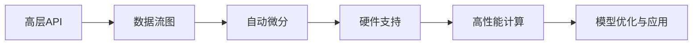

# 深度学习框架简介:TensorFlow、PyTorch、Keras等深度学习框架的基本概念

作者：禅与计算机程序设计艺术 / Zen and the Art of Computer Programming

关键词：深度学习框架, TensorFlow, PyTorch, Keras, 神经网络, 机器学习

## 1. 背景介绍
### 1.1  问题的由来
深度学习是人工智能领域近年来发展最为迅猛的分支之一。它通过构建多层神经网络,模拟人脑学习和决策的过程,在图像识别、语音识别、自然语言处理等诸多领域取得了突破性进展。然而,直接从零开始搭建深度学习模型是一项非常复杂和耗时的工作。为了降低深度学习的开发门槛,加速模型迭代优化的效率,业界涌现出一批优秀的深度学习框架,如TensorFlow、PyTorch、Keras等。这些框架提供了一系列高层API和预定义的神经网络层,大大简化了深度学习模型的开发流程。

### 1.2  研究现状
当前主流的深度学习框架包括Google的TensorFlow、Facebook的PyTorch、Keras(已并入TensorFlow)、微软的CNTK、亚马逊的MXNet等。其中,TensorFlow和PyTorch凭借其出色的性能、灵活的接口和强大的社区支持,成为了学术界和工业界应用最广泛的两大框架。Keras则以其简洁易用的高层API和快速建模的特点,深受初学者和小型项目的青睐。这些框架在架构设计、编程范式、硬件支持等方面各有特色,但在核心理念上殊途同归,即通过数据流图(Data Flow Graph)的形式来表示深度学习模型,并借助自动微分机制来训练网络参数。

### 1.3  研究意义 
深入理解主流深度学习框架的核心概念和工作原理,对于快速上手深度学习开发、设计优化深度学习系统有着重要意义:

1. 高效建模:熟练掌握深度学习框架的API和开发流程,可以大幅提升深度学习模型的开发效率,加速模型迭代优化的速度。

2. 性能优化:了解深度学习框架的内部机制和硬件支持特性,有助于开发者针对特定场景对模型进行性能调优,充分发挥硬件算力。

3. 算法创新:吃透深度学习框架的架构设计,有利于研究者基于已有框架灵活定制新的算法和网络结构,推动深度学习技术的创新发展。

4. 落地应用:结合深度学习框架的功能和生态,可以更高效地将深度学习技术与实际应用场景相结合,加速人工智能产品的落地进程。

### 1.4  本文结构
本文将围绕深度学习框架的核心概念展开,内容涵盖:

- 深度学习框架的发展历程与主流框架介绍
- 数据流图、自动微分等深度学习框架的核心概念
- TensorFlow、PyTorch、Keras三大主流框架的架构原理与特性对比
- 深度学习框架的典型应用场景与案例分析
- 主流框架的生态工具链与学习资源推荐
- 深度学习框架未来的发展趋势与挑战展望

## 2. 核心概念与联系
深度学习框架的核心理念是通过数据流图(Data Flow Graph)的形式来表示深度学习模型,并借助自动微分机制来训练网络参数。

### 数据流图
数据流图是一种用于描述算法的有向图,由一组节点(Nodes)和有向边(Edges)组成。节点表示算子操作(如矩阵乘、卷积、池化等),边表示数据在节点间的流动方向。数据流图直观地刻画了深度学习模型的拓扑结构和数据处理流程。主流深度学习框架通过Python等高级语言来构建数据流图,并将其转换为高效的底层硬件指令执行。

### 自动微分
深度学习模型通过反向传播算法来更新网络参数,而反向传播需要计算损失函数对各层参数的梯度。传统的数值微分方法(如有限差分)需要逐个计算每个参数的梯度,复杂度高且易出错。深度学习框架采用自动微分技术来自动高效地计算梯度。自动微分有两种模式:

1. 符号式(Symbolic):先定义完整的数据流图,再一次性计算所有参数的梯度。TensorFlow 1.x版本主要采用此方式。
2. 命令式(Imperative):采用即时执行的方式,在前向传播过程中记录运算轨迹,通过反向回溯来自动计算梯度。PyTorch采用此方式。

TensorFlow 2.x统一了以上两种模式,引入了Eager Execution机制,在保留数据流图优势的同时提供了命令式编程的灵活性。

### 硬件支持
深度学习对算力有极高的要求,因此深度学习框架需要能够充分利用GPU、TPU等异构硬件的并行计算能力。主流深度学习框架提供了对NVIDIA CUDA、Google TPU等加速库和硬件的支持,可实现高效的并行计算和分布式训练。此外,一些轻量级框架如TensorFlow Lite、PyTorch Mobile还支持在移动端和边缘设备上部署深度学习模型。

### 高层API
为了简化深度学习的开发流程,主流框架提供了一系列高层API,封装了神经网络层、损失函数、优化器等常用组件。用户可以利用Sequential、Module、Layer等高层接口快速搭建和训练深度学习模型,而无需手工实现底层算子和训练细节。

下图展示了深度学习框架的核心概念以及它们之间的关联:



## 3. 核心算法原理 & 具体操作步骤
### 3.1  算法原理概述
深度学习框架的核心是通过数据流图来构建和执行深度学习模型,其基本工作流程如下:

1. 定义数据流图:通过Python等高级语言的API,定义神经网络的拓扑结构,并将其表示为一个有向无环图。

2. 编译数据流图:框架后端将用户定义的高级数据流图转换为底层的计算图,进行一系列图优化(如算子融合、内存优化),最终生成高效的硬件指令。

3. 执行数据流图:将编译好的计算图交由硬件执行引擎运行,完成模型的前向传播和反向传播过程。在前向传播时,数据沿数据流图的边流动,并在节点上进行算子运算;在反向传播时,通过自动微分计算损失函数对各参数的梯度,并根据优化算法更新模型参数。

4. 迭代优化:重复步骤3,直到模型收敛或达到预设的迭代次数。

### 3.2  算法步骤详解
下面以TensorFlow和PyTorch为例,详细展示深度学习框架的典型开发流程。

#### TensorFlow (TF 2.x)

```python
import tensorflow as tf

# 1. 准备数据集
(x_train, y_train), (x_test, y_test) = tf.keras.datasets.mnist.load_data()
x_train, x_test = x_train / 255.0, x_test / 255.0

# 2. 定义模型
model = tf.keras.models.Sequential([
    tf.keras.layers.Flatten(input_shape=(28, 28)),
    tf.keras.layers.Dense(128, activation='relu'),
    tf.keras.layers.Dense(10, activation='softmax')
])

# 3. 编译模型
model.compile(optimizer='adam',
              loss='sparse_categorical_crossentropy',
              metrics=['accuracy'])

# 4. 训练模型
model.fit(x_train, y_train, epochs=5, batch_size=32, validation_data=(x_test,y_test))

# 5. 评估模型
model.evaluate(x_test,  y_test, verbose=2)
```

#### PyTorch

```python
import torch
import torch.nn as nn
import torchvision
import torchvision.transforms as transforms

# 1. 准备数据集
transform = transforms.Compose([transforms.ToTensor(),
                                transforms.Normalize((0.5,), (0.5,))])
trainset = torchvision.datasets.MNIST(root='./data', train=True, 
                                      download=True, transform=transform)
trainloader = torch.utils.data.DataLoader(trainset, batch_size=32,
                                          shuffle=True, num_workers=2)

# 2. 定义模型
class Net(nn.Module):
    def __init__(self):
        super(Net, self).__init__()
        self.fc1 = nn.Linear(28 * 28, 128)
        self.fc2 = nn.Linear(128, 10)
    
    def forward(self, x):
        x = torch.flatten(x, 1)
        x = torch.relu(self.fc1(x))
        output = self.fc2(x)
        return output

net = Net()

# 3. 定义损失函数和优化器  
criterion = nn.CrossEntropyLoss()
optimizer = torch.optim.Adam(net.parameters())

# 4. 训练模型
for epoch in range(5):
    running_loss = 0.0
    for i, data in enumerate(trainloader, 0):
        inputs, labels = data
        optimizer.zero_grad()
        outputs = net(inputs)
        loss = criterion(outputs, labels)
        loss.backward()
        optimizer.step()
        running_loss += loss.item()
    print(f'Epoch {epoch + 1}, loss: {running_loss / len(trainloader):.3f}')

# 5. 保存模型
torch.save(net.state_dict(), 'model.pth')
```

可以看到,虽然TensorFlow和PyTorch在API设计上略有差异,但总体开发流程大同小异,都包含了数据准备、模型定义、训练评估等关键步骤。

### 3.3  算法优缺点

#### 优点
1. 高度抽象:深度学习框架通过数据流图和自动微分机制,将复杂的深度学习算法抽象为简单的图结构和API调用,大幅降低了深度学习的开发门槛。

2. 自动优化:框架可以自动对数据流图进行一系列优化,如算子融合、内存复用、数据并行等,从而生成高效的硬件指令,用户无需手工优化底层实现。

3. 硬件加速:主流框架提供了对GPU、TPU等高性能硬件的支持,可充分利用异构计算资源,加速模型训练和推理。

4. 灵活扩展:用户可以基于框架提供的基础算子,灵活组合出新的网络结构和学习算法,满足不同场景的需求。

#### 缺点
1. 学习成本:尽管深度学习框架简化了开发流程,但用户仍需掌握一定的机器学习和编程知识,对新手来说上手有一定门槛。

2. 性能损失:由于引入了额外的抽象层,深度学习框架生成的代码在执行效率上可能不及手工优化的实现。

3. 调试困难:深度学习模型通常包含大量参数和复杂的数据依赖关系,出现问题时调试起来比较棘手。

4. 版本迭代:主流框架迭代升级较快,新版本可能引入breaking change,需要开发者及时跟进和适配。

### 3.4  算法应用领域
深度学习框架在学术界和工业界得到了广泛应用,典型的应用领域包括:

- 计算机视觉:图像分类、目标检测、语义分割、人脸识别等
- 语音识别:声学模型、语言模型、声纹识别、语音合成等  
- 自然语言处理:机器翻译、情感分析、命名实体识别、文本摘要等
- 推荐系统:用户画像、兴趣挖掘、CTR预估、协同过滤等
- 生物医疗:药物发现、基因组分析、医学影像分析等
- 金融科技:风险控制、反欺诈、股票预测、量化交易等

## 4. 数学模型和公式 & 详细讲解 & 举例说明
深度学习框架的数学基础是神经网络和反向传播算法。下面以一个简单的三层全连接网络为例,介绍其数学原理。

### 4.1  数学模型构建

考虑一个L层的全连接神经网络,每层$l$个神经元,第$l$层第$j$个神经元的输出为$a_j^l$,对应的偏置项为$b_j^l$。记第$l-1$层到第$l$层的