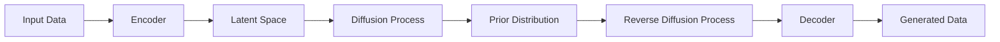

# 潜在扩散模型Latent Diffusion Model原理与代码实例讲解

关键词：潜在扩散模型、Latent Diffusion Model、生成模型、变分自编码器、马尔可夫链蒙特卡罗采样

## 1. 背景介绍
### 1.1 问题的由来
近年来，随着深度学习技术的飞速发展，生成模型已经成为人工智能领域的一个研究热点。生成模型旨在学习数据的内在分布，并能够生成与训练数据相似的新样本。其中，扩散模型(Diffusion Model)作为一种新兴的生成模型，以其优异的生成质量和多样性而受到广泛关注。然而，传统的扩散模型在高维数据如图像上的生成效果仍有待提高。最近，一种名为潜在扩散模型(Latent Diffusion Model)的改进方法被提出，通过在低维潜在空间中进行扩散过程，大幅提升了扩散模型在图像生成任务上的表现。

### 1.2 研究现状
扩散模型最初由Sohl-Dickstein等人于2015年提出，其核心思想是将数据生成过程建模为一个马尔可夫链，通过逐步向数据分布添加高斯噪声来构建一个从简单分布到复杂分布的转换过程。然而，传统扩散模型直接在像素空间进行建模，对于高维数据如图像，需要很长的马尔可夫链才能生成高质量的样本，导致训练和推理的计算开销较大。

为了解决这一问题，Rombach等人在2022年提出了潜在扩散模型。与传统扩散模型不同，潜在扩散模型先将数据编码到一个低维的潜在空间，再在潜在空间中进行扩散过程。通过引入变分自编码器(Variational Autoencoder, VAE)来学习数据到潜在空间的映射，潜在扩散模型可以显著降低扩散过程所需的步数，同时保持生成样本的高质量。

### 1.3 研究意义
潜在扩散模型的提出为扩散模型在高维数据生成任务中的应用提供了新的思路。通过在低维潜在空间中进行扩散，不仅大幅降低了计算开销，还能够生成更加清晰、多样的图像样本。这一突破性进展有望进一步推动扩散模型在计算机视觉、自然语言处理等领域的发展，为解决逼真图像生成、图像编辑、风格迁移等实际问题提供新的方案。同时，潜在扩散模型与VAE的结合，也为探索生成模型和表示学习的融合提供了新的研究方向。

### 1.4 本文结构
本文将全面介绍潜在扩散模型的原理和实现。第2部分将介绍潜在扩散模型的核心概念与模块之间的联系。第3部分将详细阐述潜在扩散模型的核心算法原理和具体操作步骤。第4部分将建立潜在扩散模型的数学模型，并通过公式推导和案例分析加以说明。第5部分将给出潜在扩散模型的代码实例，并对关键代码进行解读。第6部分将讨论潜在扩散模型的实际应用场景和未来应用前景。第7部分将推荐潜在扩散模型的学习资源、开发工具和相关文献。第8部分将总结全文，并展望潜在扩散模型的未来发展趋势与挑战。最后，附录部分将解答关于潜在扩散模型的常见问题。

## 2. 核心概念与联系

潜在扩散模型的核心概念包括：

1. 扩散模型(Diffusion Model)：一种生成模型，通过构建从数据分布到先验分布的逐步扩散过程来生成数据。
2. 潜在空间(Latent Space)：一个低维的向量空间，用于表示数据的高级特征。
3. 变分自编码器(Variational Autoencoder, VAE)：一种生成模型，由编码器和解码器组成，用于学习数据到潜在空间的映射。
4. 马尔可夫链(Markov Chain)：一种随机过程，下一状态的概率分布只依赖于当前状态，与过去状态无关。
5. 蒙特卡罗采样(Monte Carlo Sampling)：一种通过随机采样估计概率分布的方法。

潜在扩散模型的核心思想是将扩散模型和变分自编码器结合，在潜在空间中进行扩散过程。具体而言，VAE的编码器将数据映射到潜在空间，扩散模型在潜在空间中构建马尔可夫链，通过逐步添加高斯噪声来逼近先验分布。在生成阶段，先从先验分布采样潜在向量，再通过扩散模型的逆过程去除噪声，最后用VAE的解码器将潜在向量映射回原始数据空间，得到生成的样本。

下图展示了潜在扩散模型的整体架构和各模块之间的联系：

## 3. 核心算法原理 & 具体操作步骤

### 3.1 算法原理概述

潜在扩散模型的核心算法包括两个阶段：训练阶段和生成阶段。

在训练阶段，算法的目标是学习一个从数据分布到先验分布的扩散过程，以及一个从先验分布到数据分布的逆扩散过程。具体步骤如下：

1. 用VAE的编码器将数据映射到潜在空间。
2. 在潜在空间中，构建一个马尔可夫链，通过逐步添加高斯噪声将潜在向量转换为接近先验分布的噪声向量。
3. 训练一个逆扩散模型，学习如何逐步去除噪声，将噪声向量还原为干净的潜在向量。
4. 用VAE的解码器将潜在向量映射回原始数据空间，得到重构的样本。
5. 优化VAE和扩散模型的参数，最小化重构误差和先验分布的KL散度。

在生成阶段，算法从先验分布采样噪声向量，然后用训练好的逆扩散模型去除噪声，最后用VAE的解码器将潜在向量映射为生成的样本。具体步骤如下：

1. 从先验分布(通常为标准高斯分布)采样一个噪声向量。
2. 用训练好的逆扩散模型逐步去除噪声，得到干净的潜在向量。
3. 用VAE的解码器将潜在向量映射为生成的样本。

### 3.2 算法步骤详解

下面将详细介绍潜在扩散模型的关键算法步骤。

#### 3.2.1 前向扩散过程

前向扩散过程将潜在向量逐步转换为噪声向量。设$\mathbf{z}_0$为VAE编码器输出的潜在向量，$\mathbf{z}_T$为噪声向量，$T$为扩散步数。前向扩散过程可以表示为：

$$q(\mathbf{z}_t|\mathbf{z}_{t-1}) = \mathcal{N}(\mathbf{z}_t;\sqrt{1-\beta_t}\mathbf{z}_{t-1},\beta_t\mathbf{I})$$

其中，$\beta_t$是噪声系数，控制每一步添加的噪声量。噪声系数通常设置为从$\beta_1$到$\beta_T$逐渐增大的序列，以确保扩散过程能够平滑地将潜在向量转换为接近先验分布的噪声向量。

给定$\mathbf{z}_0$，可以通过重复应用上述转移概率，得到$\mathbf{z}_t$的边缘分布：

$$q(\mathbf{z}_t|\mathbf{z}_0) = \mathcal{N}(\mathbf{z}_t;\sqrt{\bar{\alpha}_t}\mathbf{z}_0,(1-\bar{\alpha}_t)\mathbf{I})$$

其中，$\alpha_t=1-\beta_t$，$\bar{\alpha}_t=\prod_{s=1}^t\alpha_s$。

#### 3.2.2 逆扩散过程

逆扩散过程将噪声向量逐步还原为干净的潜在向量。给定噪声向量$\mathbf{z}_T$，逆扩散过程可以表示为：

$$p_\theta(\mathbf{z}_{t-1}|\mathbf{z}_t) = \mathcal{N}(\mathbf{z}_{t-1};\mu_\theta(\mathbf{z}_t,t),\sigma_\theta(\mathbf{z}_t,t)^2\mathbf{I})$$

其中，$\mu_\theta(\mathbf{z}_t,t)$和$\sigma_\theta(\mathbf{z}_t,t)$是逆扩散模型的均值和方差，通常由一个神经网络参数化。逆扩散模型的目标是学习这个条件概率分布，使得从$\mathbf{z}_T$开始，逐步去除噪声，最终得到干净的潜在向量$\mathbf{z}_0$。

在训练阶段，逆扩散模型通过最小化以下损失函数来学习条件概率分布：

$$L_\text{diffusion} = \mathbb{E}_{q(\mathbf{z}_0)}\mathbb{E}_{t\sim[1,T]}\mathbb{E}_{q(\mathbf{z}_t|\mathbf{z}_0)}[\log p_\theta(\mathbf{z}_{t-1}|\mathbf{z}_t)]$$

其中，$q(\mathbf{z}_0)$是数据在潜在空间上的分布，可以通过VAE的编码器得到。

#### 3.2.3 VAE的训练

VAE的编码器$E_\phi$和解码器$D_\psi$分别参数化为两个神经网络。VAE的训练目标是最小化重构误差和先验分布的KL散度：

$$L_\text{VAE} = \mathbb{E}_{q_\phi(\mathbf{z}_0|\mathbf{x})}[\log p_\psi(\mathbf{x}|\mathbf{z}_0)] - D_\text{KL}(q_\phi(\mathbf{z}_0|\mathbf{x})||p(\mathbf{z}_0))$$

其中，$\mathbf{x}$是原始数据，$p(\mathbf{z}_0)$是潜在空间的先验分布，通常设置为标准高斯分布。

### 3.3 算法优缺点

潜在扩散模型的主要优点包括：

1. 通过在低维潜在空间中进行扩散，大幅降低了计算开销，加快了训练和生成速度。
2. 生成的样本质量高，多样性好，能够捕捉数据的复杂结构和细节。
3. 可以通过调节噪声系数和扩散步数，灵活控制生成过程的平滑度和多样性。
4. 与VAE结合，实现了生成模型和表示学习的统一，有利于解释性和可控性。

潜在扩散模型的主要缺点包括：

1. 训练过程仍然比较复杂，需要同时优化VAE和扩散模型，对超参数的选择较为敏感。
2. 生成速度虽然比传统扩散模型有所提高，但仍然比GAN等其他生成模型慢。
3. 生成质量依赖于VAE编码器的性能，如果编码器不能很好地捕捉数据的关键特征，会影响生成效果。

### 3.4 算法应用领域

潜在扩散模型可以应用于多个领域，包括：

1. 图像生成：生成高质量、多样化的图像，如人脸、场景、物体等。
2. 图像编辑：通过操纵潜在空间实现图像的属性编辑、风格转换等。
3. 视频生成：通过在时间维度上扩展潜在空间，生成连贯、流畅的视频序列。
4. 语音合成：生成自然、多样的语音，如文本到语音转换、语音转换等。
5. 分子生成：设计和生成新的分子结构，用于药物发现和材料设计。

## 4. 数学模型和公式 & 详细讲解 & 举例说明

### 4.1 数学模型构建

潜在扩散模型的数学模型主要包括三个部分：VAE、前向扩散过程和逆扩散过程。

#### VAE

VAE由编码器$q_\phi(\mathbf{z}_0|\