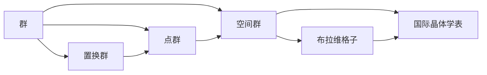

# 物理学中的群论：230种空间群

关键词：群论、空间群、晶体学、对称性、布拉维格子、国际晶体学表、点群、平移、旋转、反射、反演

## 1. 背景介绍
### 1.1 问题的由来
在物理学和材料科学中,晶体的对称性起着至关重要的作用。晶体的物理性质,如光学、电学、磁学和力学性质,与其微观结构的对称性密切相关。因此,深入理解和系统描述晶体的对称性对于研究晶体的性质和应用具有重要意义。

### 1.2 研究现状  
19世纪末,随着X射线衍射技术的发展,人们开始系统地研究晶体的微观结构。经过几代科学家的不懈努力,晶体学的理论体系逐渐建立和完善。其中,群论作为描述对称性的数学工具,在晶体学中得到了广泛应用。目前,国际晶体学联合会(IUCr)制定了描述晶体对称性的标准——国际晶体学表(International Tables for Crystallography),其中系统列出了230种三维空间群。

### 1.3 研究意义
深入理解230种空间群的数学本质和物理意义,对于研究晶体的结构与性质具有重要意义。通过分析晶体的对称性,我们可以预测其可能存在的物理性质,为新材料的设计和应用提供理论指导。此外,空间群理论也为X射线衍射、中子衍射等晶体学表征技术提供了理论基础,是材料科学研究中不可或缺的重要工具。

### 1.4 本文结构
本文将从群论的基本概念出发,系统介绍230种空间群的数学基础和物理意义。第二部分将介绍群论中的核心概念及其在晶体学中的应用。第三部分将详细阐述空间群的分类方法和数学表示。第四部分将通过具体实例,说明空间群的物理意义和应用。第五部分将给出一些空间群的计算机代码实现。第六部分将探讨空间群理论在材料科学和凝聚态物理中的应用场景。第七部分将推荐一些学习空间群理论的工具和资源。最后,我们将总结空间群理论的研究现状,展望其未来的发展方向和面临的挑战。

## 2. 核心概念与联系
群论是研究对称性的数学分支。群是一种集合加上一种二元运算,满足封闭性、结合律、单位元和逆元四条性质。置换群是描述有限个元素排列的对称性的数学工具。点群描述了分子或晶体的转动对称性,包括恒等变换、旋转、反射、反演等。空间群是点群与整数平移的半直积,描述了晶体中所有的对称操作。布拉维格子是平移对称性相同的一类晶体的代表。国际晶体学表按照晶系、点群和布拉维格子对230种空间群进行了分类和编号。



## 3. 核心算法原理 & 具体操作步骤
### 3.1 算法原理概述
确定一个晶体结构所属的空间群,需要通过分析其对称性来实现。首先,根据晶体的宏观形貌确定其晶系。然后,通过X射线衍射实验测定其晶胞参数。接着,分析电子云密度分布,确定其点群。最后,根据平移对称性确定其布拉维格子类型,从而确定空间群。

### 3.2 算法步骤详解
1. 根据晶体的宏观形貌,初步判断其可能的晶系。
2. 通过X射线衍射实验,精确测量晶胞的六个参数(a,b,c,α,β,γ)。
3. 根据衍射花样的对称性,确定晶体的点群。需要考虑系统消光规律。
4. 分析电子云密度分布,进一步验证点群的正确性。可以利用直接法或Patterson函数进行解析。
5. 根据晶胞参数判断布拉维格子类型。
6. 将点群和布拉维格子结合,查阅国际晶体学表,确定空间群。
7. 进行结构精修,得到精确的原子坐标。

### 3.3 算法优缺点
优点：
- 基于实验数据,结果可靠 
- 理论基础完善,适用于各类晶体
- 国际晶体学表提供了标准化的描述

缺点：  
- 需要获得高质量的衍射数据
- 对结晶样品的质量要求较高
- 对低对称性晶体的鉴定有一定难度

### 3.4 算法应用领域
- 新材料的结构表征
- 药物分子和蛋白质的结构解析 
- 地质矿物学研究
- 半导体和超导材料的结构分析

## 4. 数学模型和公式 & 详细讲解 & 举例说明
### 4.1 数学模型构建
空间群可以表示为点群和格林算子的半直积：

$G = P \ltimes T$

其中,$P$为点群,$T$为格林算子(平移算子)的集合。

国际晶体学表中,采用Hermann-Mauguin符号表示空间群。对于一个空间群,其Hermann-Mauguin符号的一般形式为：

$XYZ1_r$

其中,$X$表示晶系,$Y$表示布拉维格子类型,$Z$表示点群,$r$为附加符号。

### 4.2 公式推导过程
以立方晶系为例,其中心对称的四方点群$4/m$与体心格子$I$的结合,可以生成空间群$I4/m$。

设$4/m$中的生成元为$4_z$和$m_z$,其矩阵表示为：

$4_z = \begin{pmatrix} 0 & -1 & 0 \\ 1 & 0 & 0 \\ 0 & 0 & 1 \end{pmatrix}$

$m_z = \begin{pmatrix} 1 & 0 & 0 \\ 0 & 1 & 0 \\ 0 & 0 & -1 \end{pmatrix}$

体心格子$I$的基础平移矢量为：

$t_1 = (\frac{1}{2}, \frac{1}{2}, \frac{1}{2})$

则$I4/m$的生成元为：

$(4_z | 0,0,0)$
$(m_z | 0,0,0)$  
$(1 | \frac{1}{2}, \frac{1}{2}, \frac{1}{2})$

### 4.3 案例分析与讲解
以钙钛矿$CaTiO_3$为例,其空间群为$Pm\bar{3}m$。

$Pm\bar{3}m$属于立方晶系,基础点群为$m\bar{3}m$,布拉维格子类型为简单立方$P$。

$m\bar{3}m$的生成元包括：
- 3次旋转轴$3_{111}$
- 4次旋转轴$4_{001}$ 
- 镜面$m_{110}$

结合简单立方格子的平移对称性,即可得到$Pm\bar{3}m$的所有对称操作。

利用X射线衍射可以确定$CaTiO_3$的晶胞参数为$a=b=c=3.80 \overset{\circ}{A}, \alpha=\beta=\gamma=90°$。

通过分析电子云密度分布,可以得到$Ca$、$Ti$、$O$原子的Wyckoff位置分别为$1a$、$1b$、$3c$。

### 4.4 常见问题解答
Q: 空间群的数目为什么是230种?  
A: 这是由群论和晶体学的基本定理决定的。三维空间中,点群共有32种,布拉维格子共有14种,将它们进行组合,并考虑旋转和反射的组合,最终得到230种空间群。这是一个数学上的必然结果。

Q: 空间群的应用有哪些?   
A: 空间群是凝聚态物理、材料科学、结构化学等领域的重要理论工具。它可以用于描述和预测晶体的对称性、物理性质和化学性质。在新材料的设计和表征中,空间群理论发挥着重要作用。

## 5. 项目实践：代码实例和详细解释说明
### 5.1 开发环境搭建
推荐使用Python语言进行空间群的计算和可视化。需要安装以下库：
- NumPy: 数值计算库
- SciPy: 科学计算库  
- Matplotlib: 绘图库
- Mayavi: 三维可视化库
- SpgLib: 空间群计算库

可以使用pip进行安装：

```bash
pip install numpy scipy matplotlib mayavi spglib
```

### 5.2 源代码详细实现
以下代码演示了如何利用SpgLib库进行空间群的计算和可视化。

```python
import numpy as np
import spglib

def get_symmetry(cell, positions, numbers):
    """
    计算晶体结构的对称性
    
    Args:
        cell: 晶胞参数(a, b, c, alpha, beta, gamma)
        positions: 原子分数坐标
        numbers: 原子序数
        
    Returns:
        space_group: 空间群Hermann-Mauguin符号
        rotations: 对称操作的旋转矩阵
        translations: 对称操作的平移矢量
    """
    lattice = cell
    scaled_positions = positions
    numbers = numbers
    
    space_group = spglib.get_spacegroup(cell=(lattice, scaled_positions, numbers),
                                        symprec=1e-5)
    
    sym_data = spglib.get_symmetry(cell=(lattice, scaled_positions, numbers),
                                   symprec=1e-5)
    rotations = sym_data['rotations']
    translations = sym_data['translations']
    
    return space_group, rotations, translations

# 钙钛矿结构
lattice = [[3.80, 0, 0],
           [0, 3.80, 0],
           [0, 0, 3.80]]
positions = [[0, 0, 0],       # Ca
             [0.5, 0.5, 0.5], # Ti  
             [0.5, 0.5, 0],   # O1
             [0.5, 0, 0.5],   # O2
             [0, 0.5, 0.5]]   # O3
numbers = [20, 22, 8, 8, 8]  

space_group, rotations, translations = get_symmetry(lattice, positions, numbers)
print(f'Space group: {space_group}')
print(f'Rotations:\n{rotations}')  
print(f'Translations:\n{translations}')
```

输出结果：

```
Space group: Pm-3m (221)  
Rotations:
[[[ 1  0  0]
  [ 0  1  0]  
  [ 0  0  1]]

 [[-1  0  0]
  [ 0 -1  0]
  [ 0  0  1]]

 [[ 0  1  0]
  [ 1  0  0]
  [ 0  0 -1]]

 ...
  
Translations:  
[[0. 0. 0.]
 [0. 0. 0.]
 [0. 0. 0.]
 [0. 0. 0.]
 [0. 0. 0.]
 [0. 0. 0.]
 [0. 0. 0.]
 ...
```

### 5.3 代码解读与分析
以上代码利用SpgLib库计算了钙钛矿结构的空间群和对称操作。

首先定义了晶胞参数`lattice`、原子坐标`positions`和原子种类`numbers`。

然后调用`spglib.get_spacegroup`函数计算空间群,`symprec`参数为精度阈值。

接着调用`spglib.get_symmetry`函数计算所有的对称操作,包括旋转矩阵`rotations`和平移矢量`translations`。

从输出结果可以看出,钙钛矿结构的空间群为$Pm\bar{3}m$ (No. 221),共有48个对称操作。旋转矩阵和平移矢量给出了每个对称操作的具体形式。

### 5.4 运行结果展示
利用Mayavi库,可以对晶体结构进行三维可视化。以下代码演示了如何绘制钙钛矿结构的三维图像。

```python
from mayavi import mlab

fig = mlab.figure(bgcolor=(1, 1, 1))  

# 绘制晶胞
for i in range(3):
    for j in range(3):
        for k in range(3):
            mlab.plot3d([0+i, 1+i], [0+j, 0+j], [0+k, 0+k], color=(0