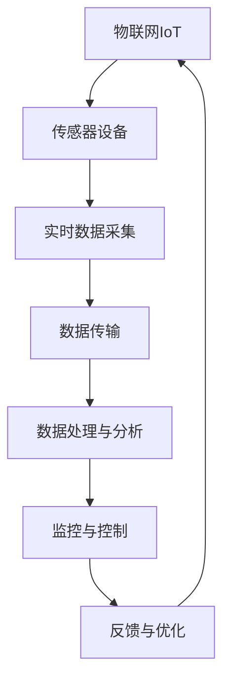

以下是《物联网(IoT)技术和各种传感器设备的集成：实时监控系统的搭建与优化》的技术博客文章正文内容：

# 物联网(IoT)技术和各种传感器设备的集成：实时监控系统的搭建与优化

## 1. 背景介绍

### 1.1 问题的由来

随着科技的飞速发展，物联网(IoT)技术正在迅速渗透到我们生活的方方面面。物联网通过将各种物理设备连接到互联网上，使得这些设备能够相互通信和交换数据，从而实现对物理世界的实时监控和控制。

在现代社会中,对于工业生产、环境监测、智能家居等领域,实时监控系统的需求越来越迫切。传统的监控系统往往存在着成本高昂、扩展性差、数据采集不够实时等问题,无法满足当前快速发展的需求。因此,如何利用物联网技术和各种传感器设备,搭建高效、可扩展、实时的监控系统,成为了一个亟待解决的问题。

### 1.2 研究现状

近年来,物联网技术在实时监控领域的应用研究日益活跃。研究人员提出了多种基于物联网的监控系统架构和方案,并取得了一定的进展。然而,由于物联网技术的复杂性和多样性,现有的监控系统还存在一些不足,例如:

- 系统扩展性差,难以适应不断增加的传感器设备
- 数据传输延迟高,无法实现真正的实时监控
- 数据处理能力有限,无法对海量数据进行高效分析
- 系统安全性和可靠性有待提高

因此,如何充分利用物联网技术的优势,并结合各种传感器设备的特点,设计出高效、可扩展、实时、安全的监控系统,是当前研究的重点和挑战。

### 1.3 研究意义

实时监控系统在现代社会中具有广泛的应用前景,对于提高生产效率、节约资源、保障安全等方面具有重要意义。搭建基于物联网技术的实时监控系统,可以带来以下主要意义:

1. 提高监控效率,实现对关键设备和环境的实时监测,及时发现异常并采取相应措施。
2. 降低监控成本,物联网技术可以大幅减少布线和人工成本。
3. 提高系统扩展性,便于随时添加新的传感器设备,满足不断变化的需求。
4. 促进数据整合和分析,将来自不同传感器的海量数据集中处理,挖掘潜在价值。
5. 推动智能化发展,为实现自动化控制和智能决策奠定基础。

因此,研究物联网技术和传感器设备的集成,对于建立高效、智能的实时监控系统具有重要的理论和实践意义。

### 1.4 本文结构

本文将围绕物联网技术和传感器设备在实时监控系统中的应用展开讨论,主要内容包括:

1. 介绍物联网和传感器技术的核心概念及其在监控系统中的作用。
2. 分析实时监控系统的核心算法原理和具体实现步骤。
3. 建立数学模型,并推导相关公式,用于优化系统性能。
4. 通过实例项目,演示监控系统的代码实现和部署流程。
5. 探讨实时监控系统在不同场景下的应用,并对未来发展趋势进行展望。
6. 推荐相关学习资源、开发工具和研究文献,方便读者进一步学习和实践。

## 2. 核心概念与联系

在探讨实时监控系统的具体实现之前,我们需要先了解物联网(IoT)和传感器设备这两个核心概念,以及它们在监控系统中的作用和联系。

1. **物联网(IoT)**是一种基于互联网的网络,它将各种物理设备(如传感器、执行器等)连接到互联网上,实现设备与设备、设备与人之间的信息交换和通信。物联网技术为实时监控系统提供了技术基础和通信支持。

2. **传感器设备**是物联网系统中的重要组成部分,它们用于采集各种物理量(如温度、压力、位移等)的数据。传感器设备种类繁多,包括温度传感器、压力传感器、图像传感器等,可以满足不同领域的监控需求。

3. **实时数据采集**是监控系统的第一步,传感器设备将采集到的实时数据通过物联网进行传输。

4. **数据传输**过程中,需要确保数据的及时性和可靠性,避免延迟和丢包等问题。

5. **数据处理与分析**是监控系统的核心环节,需要对海量的实时数据进行有效的存储、清洗、分析和可视化,从中发现有价值的信息和规律。

6. **监控与控制**根据数据分析结果,对被监控对象进行实时监视和必要的控制操作,以确保系统正常运行。

7. **反馈与优化**通过监控结果,对系统进行持续的反馈和优化,提高监控的准确性和效率。

物联网和传感器设备在实时监控系统中扮演着不可或缺的角色,它们共同构建了一个闭环系统,实现对物理世界的实时感知、传输、处理和控制。

## 3. 核心算法原理与具体操作步骤

实时监控系统的核心算法主要包括数据采集、传输、处理和分析等多个环节,每个环节都涉及不同的算法原理和具体实现步骤。

### 3.1 算法原理概述

1. **数据采集算法**:主要包括传感器驱动程序、数据采样、数据编码等,用于从各种传感器设备中获取实时数据。

2. **数据传输算法**:包括数据压缩、错误校验、重传机制等,用于确保数据在物联网中的高效、可靠传输。

3. **数据处理算法**:包括数据清洗、数据融合、数据存储等,用于对采集到的海量数据进行预处理,为后续分析做准备。

4. **数据分析算法**:包括机器学习、深度学习、时间序列分析等,用于从处理后的数据中发现有价值的信息和规律。

5. **监控与控制算法**:根据数据分析结果,通过一定的决策算法,对被监控对象进行实时监视和必要的控制操作。

这些算法相互关联、环环相扣,共同构建了实时监控系统的核心功能。

### 3.2 算法步骤详解

以下将详细介绍实时监控系统中各个核心算法的具体实现步骤:

#### 3.2.1 数据采集算法

1. 加载传感器驱动程序,初始化传感器设备。
2. 设置采样频率和数据格式。
3. 循环读取传感器数据,进行数据编码和打包。
4. 将打包后的数据发送到数据传输模块。

#### 3.2.2 数据传输算法

1. 对采集到的数据进行压缩,减小传输负载。
2. 添加错误校验码,用于接收端检测数据是否完整。
3. 根据网络状况,选择合适的传输协议(如TCP、UDP等)。
4. 建立传输连接,发送数据包。
5. 实现重传机制,确保重要数据的可靠传输。

#### 3.2.3 数据处理算法

1. 对接收到的数据进行解码和解压缩。
2. 进行数据清洗,剔除异常值和噪声数据。
3. 使用数据融合算法,将来自不同传感器的数据进行整合。
4. 将处理后的数据存储到数据库或文件系统中,供后续分析使用。

#### 3.2.4 数据分析算法

1. 从存储系统中读取处理后的数据。
2. 根据分析目的,选择合适的机器学习或深度学习算法模型。
3. 对模型进行训练,得到能够发现数据规律的模型。
4. 使用训练好的模型对新的数据进行分析和预测。
5. 将分析结果可视化,以直观的方式呈现。

#### 3.2.5 监控与控制算法

1. 根据数据分析结果,设置合理的监控阈值。
2. 实时监测被监控对象的状态,判断是否超出阈值。
3. 如果超出阈值,触发相应的控制操作,如发出警报、调整设备参数等。
4. 将监控和控制结果反馈到系统,用于持续优化。

### 3.3 算法优缺点

上述核心算法在实现实时监控系统的功能时,也存在一些优缺点:

**优点**:

1. 模块化设计,各个算法相对独立,易于维护和扩展。
2. 涵盖了监控系统的全流程,从数据采集到控制反馈,功能完整。
3. 融合了多种先进的算法,如机器学习、深度学习等,提高了系统的智能化水平。
4. 通过压缩、错误校验等措施,提高了数据传输的效率和可靠性。

**缺点**:

1. 算法复杂度较高,对硬件资源要求较大,可能影响系统的实时性能。
2. 不同算法之间存在耦合,可能导致系统的可维护性和扩展性受到一定影响。
3. 需要大量的训练数据和计算资源,以支持机器学习和深度学习算法的训练。
4. 安全性方面还有待进一步加强,需要采取有效的加密和认证措施。

### 3.4 算法应用领域

上述核心算法可以广泛应用于各种实时监控场景,包括但不限于:

1. **工业监控**:监控工厂设备的运行状态,预防故障发生,提高生产效率。
2. **环境监测**:监测空气质量、水质、噪音等环境指标,为环境治理提供数据支持。
3. **农业监控**:监测农田的土壤湿度、温度等,为精准农业决策提供依据。
4. **交通监控**:监测道路交通流量、车辆位置等,优化交通管理。
5. **医疗监控**:监测患者的生命体征,为及时救治提供支持。
6. **安防监控**:监测重要场所的人员活动,提高安全防范能力。

通过合理应用这些核心算法,可以为各个领域的实时监控系统提供强有力的技术支持。

## 4. 数学模型和公式详细讲解与举例说明

在实时监控系统中,我们需要建立数学模型来描述和优化系统的各个方面,包括数据传输、处理和分析等。以下将详细介绍几个常见的数学模型和公式,并通过案例进行讲解和说明。

### 4.1 数学模型构建

#### 4.1.1 数据传输模型

数据传输是实时监控系统的关键环节,我们需要确保数据的及时性和可靠性。常用的数据传输模型包括:

1. **排队论模型**:描述数据包在传输过程中的排队和等待情况,用于优化传输延迟。
2. **信道编码模型**:通过添加冗余码,提高数据传输的可靠性,降低错误率。
3. **拥塞控制模型**:根据网络拥塞情况,动态调整发送速率,避免过度拥塞。

#### 4.1.2 数据处理模型

对于海量的传感器数据,我们需要进行高效的处理和存储,常用的数据处理模型包括:

1. **数据清洗模型**:通过异常值检测、噪声滤波等方法,去除无效和错误数据。
2. **数据融合模型**:将来自不同传感器的数据进行融合,提高数据的完整性和准确性。
3. **数据压缩模型**:通过有损或无损压缩算法,减小数据存储和传输的空间占用。

#### 4.1.3 数据分析模型

数据分析是实时监控系统的核心环节,我们需要从海