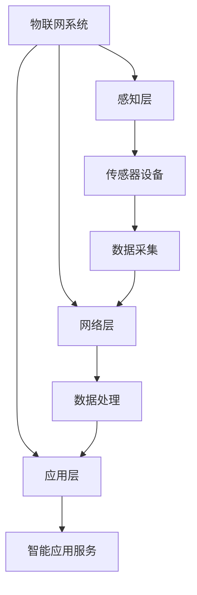
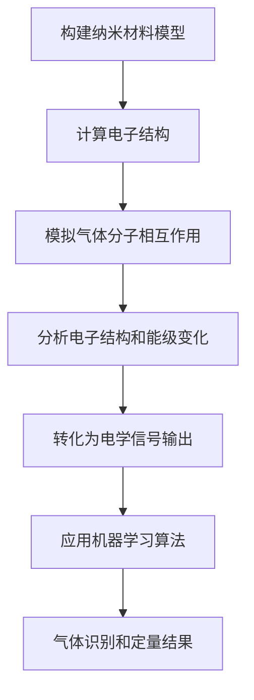
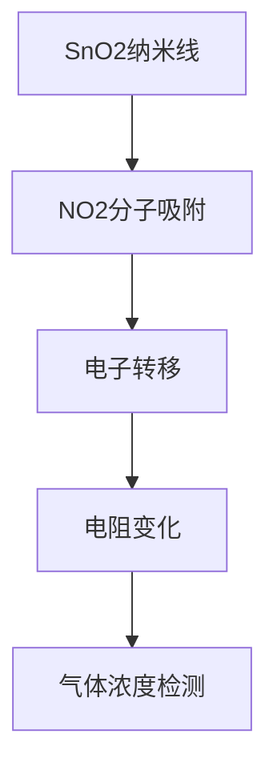

# 物联网(IoT)技术和各种传感器设备的集成：新型传感器的发展研究

## 1. 背景介绍

### 1.1 问题的由来

随着物联网(IoT)技术的快速发展,各种智能传感器设备的应用越来越广泛。传感器作为物联网系统的"眼睛"和"耳朵",负责采集各种环境数据,是物联网应用的关键基础设施。然而,现有的传感器技术在功能、性能、能耗等方面仍存在一些局限性,无法完全满足日益增长的物联网应用需求。因此,研究和开发新型传感器技术以支持物联网系统的高效运行,成为当前一个迫切的课题。

### 1.2 研究现状

目前,学术界和工业界都在积极探索新型传感器技术的发展方向。一些新兴传感器技术已经问世,例如基于纳米材料的传感器、生物传感器、可穿戴传感器等,展现出诸多优势,如高灵敏度、低功耗、多功能集成等。但这些新型传感器在实际应用中仍面临诸多挑战,如成本高、可靠性差、集成难度大等,制约了它们在物联网系统中的广泛应用。

### 1.3 研究意义

新型传感器技术的发展对于推动物联网技术的创新具有重要意义。高性能、低功耗、多功能集成的新型传感器,能够极大提升物联网系统的感知能力、数据采集效率和能源利用率,从而促进物联网应用的深入发展。同时,新型传感器技术的突破也将推动相关材料、制造、集成等领域的技术进步,产生广泛的经济和社会影响。

### 1.4 本文结构

本文将全面探讨新型传感器技术在物联网领域的发展研究。首先介绍物联网和传感器技术的核心概念及它们之间的联系;然后详细阐述新型传感器的工作原理、数学模型和算法;接着通过实际案例分析新型传感器的应用场景;最后总结该领域的发展趋势和面临的挑战,并给出相关资源推荐。

## 2. 核心概念与联系

物联网(IoT)是一种基于互联网、传统telecommunication网络等信息承载体,让所有能行使独立功能的普通物体实现互联互通的网络。它由感知层、网络层和应用层三部分组成:

- 感知层:由各种智能传感器设备构成,负责采集环境数据,是物联网的"眼睛"和"耳朵"。
- 网络层:负责传输和处理感知层采集的海量数据。
- 应用层:基于网络层处理的数据,为用户提供各种智能化应用服务。

传感器是物联网系统的核心部件,其性能直接影响着物联网应用的效果。新型传感器技术的发展,能够显著提升传感器的性能指标,从而推动物联网技术的创新发展。



## 3. 核心算法原理 & 具体操作步骤  

### 3.1 算法原理概述

新型传感器通常采用一些创新的工作原理和算法,以获得更优的性能表现。例如,基于纳米材料的传感器利用纳米材料优异的物理化学性质,可以实现高灵敏度、快速响应;生物传感器则模拟生物体内分子识别机制,具有高选择性和亲和力;可穿戴传感器融合多种传感技术,实现多参数监测等。

这些新型传感器的工作原理往往涉及微纳尺度的物理、化学、生物学过程,需要借助一些前沿理论和算法进行描述和求解,例如:

- 密度泛函理论(DFT)
- 分子动力学(MD)模拟 
- 机器学习算法
- 信号处理算法
- 图像处理算法
- ...

### 3.2 算法步骤详解

以基于纳米材料的气体传感器为例,其工作原理和算法步骤可概括为:

1. 构建纳米材料的原子模型
2. 基于密度泛函理论(DFT)计算材料的电子结构
3. 模拟气体分子与纳米材料表面的相互作用
4. 分析材料的电子结构和能级变化
5. 将能级变化转化为电学信号输出
6. 应用机器学习算法对信号进行识别和定量

更具体的步骤如下:



### 3.3 算法优缺点

上述算法的优点是:

- 能够准确描述纳米尺度下的物理化学过程
- 将分子水平的相互作用转化为宏观电学信号
- 利用机器学习提高气体识别的准确性和智能性

但也存在一些缺点:

- 计算量大,模拟时间长
- 需要高性能计算资源
- 算法参数设置复杂,需要大量实验数据支持

### 3.4 算法应用领域

除了气体传感器,类似的算法也广泛应用于其他新型传感器领域,如:

- 生物医学传感器:蛋白质组学、分子模拟等
- 化学传感器:分子动力学模拟、反应动力学等 
- 光电传感器:电磁理论、光学模拟等
- 微纳制造:工艺模拟、缺陷分析等

## 4. 数学模型和公式 & 详细讲解 & 举例说明

### 4.1 数学模型构建

对于纳米材料气体传感器,常用的数学模型是基于密度泛函理论(DFT)。DFT是量子力学的一种重要理论分支,用于描述多体系统(如原子、分子、固体等)的电子结构和性质。

在DFT框架下,系统的总能量可以表示为电子密度$\rho(\vec{r})$的泛函:

$$
E[\rho] = T[\rho] + V_\text{ext}[\rho] + V_\text{ee}[\rho] + E_\text{xc}[\rho]
$$

其中:
- $T[\rho]$是电子的运动能 
- $V_\text{ext}[\rho]$是外加的静电势能
- $V_\text{ee}[\rho]$是库仑静电相互作用能
- $E_\text{xc}[\rho]$是交换相关能

对于给定的外加静电势场,通过求解上述泛函的变分原理,可以获得系统的基态电子密度分布和总能量。

### 4.2 公式推导过程

DFT的核心是交换相关能$E_\text{xc}[\rho]$的表达式,不同的近似会导致不同的计算精度和效率。

常用的局域密度近似(LDA)假设:

$$
E_\text{xc}^\text{LDA}[\rho] = \int \rho(\vec{r}) \varepsilon_\text{xc}^\text{hom}(\rho(\vec{r})) d\vec{r}
$$

其中$\varepsilon_\text{xc}^\text{hom}$是均匀电子气体的交换相关能。

改进的广义梯度近似(GGA)考虑了电子密度的梯度效应:

$$
E_\text{xc}^\text{GGA}[\rho] = \int f(\rho(\vec{r}), \nabla\rho(\vec{r})) d\vec{r}
$$

对于纳米材料气体传感器,通常采用GGA近似能够获得较为准确的结果。

### 4.3 案例分析与讲解

以 $\text{SnO}_2$ 纳米线作为气体传感器为例,当 $\text{NO}_2$ 气体分子吸附在其表面时,会发生如下过程:

1. $\text{NO}_2$ 分子的电子被 $\text{SnO}_2$ 纳米线的导带捕获,形成 $\text{NO}_2^-$ 离子
2. 导带电子浓度降低,导致 $\text{SnO}_2$ 纳米线电阻增加
3. 通过测量电阻变化,可检测出 $\text{NO}_2$ 气体浓度

利用DFT计算可以模拟上述过程,如下图所示是 $\text{NO}_2$ 分子在 $\text{SnO}_2$ (110)面吸附时的电荷密度变化:




可以看到,NO2分子附近的电荷密度发生明显变化,表明发生了电荷转移,这就是纳米线气体传感器工作的本质机制。

### 4.4 常见问题解答

**Q: DFT计算是否可以应用于其他类型的传感器?**

A: DFT作为一种量子力学计算方法,可以广泛应用于各类纳米材料和分子体系,不仅限于气体传感器。比如生物医学传感器中的分子识别、化学传感器中的催化反应等,都可以借助DFT进行模拟和分析。

**Q: GGA近似是否足够准确?**

A: GGA是DFT中一种常用的交换相关泛函近似,比LDA更加精确,但对于一些强相关系统(如含有d/f电子的过渡金属氧化物),其精度仍有一定缺陷。在这种情况下,需要使用更高级的混合泛函或者多体perturbation理论等方法。

**Q: DFT计算是否高效?**

A: DFT计算的效率取决于系统的规模和所采用的数值算法。对于大规模系统,传统的DFT计算会变得非常低效。这就需要借助线性缩放的新算法(如分子动力学、密度矩阵扩展等)或者机器学习加速方法来提高计算效率。

## 5. 项目实践：代码实例和详细解释说明

### 5.1 开发环境搭建

以下是在Linux环境下使用开源软件VASP(Vienna Ab-initio Simulation Package)进行DFT计算的基本步骤:

1. 安装VASP软件包
2. 准备初始结构文件(POSCAR)和赝势文件(POTCAR) 
3. 编写INCAR文件(设置计算参数)
4. 编写KPOINTS文件(设置K空间网格采样)
5. 提交计算任务到并行计算机集群

### 5.2 源代码详细实现

以模拟 $\text{NO}_2$ 分子在 $\text{SnO}_2$ (110)面吸附为例,INCAR文件的主要参数设置如下:

```
System = NO2/SnO2(110)    # 系统描述
ENCUT = 400                # 平面波基矢截断能量(eV)
ISMEAR = 0; SIGMA = 0.1    # 高斯电子温度smearing
EDIFF = 1E-5               # 能量收敛标准
EDIFFG = -0.01             # 离子弛豫收敛标准
IBRION = 2; NSW = 200      # 离子弛豫算法和步数
ISIF = 3                   # 自由弛豫离子位置和晶胞参数
GGA = PE                   # 交换相关泛函(PBE)
LPARD = .TRUE.             # 开启基于投影密度的混合泛函
LCHARG = .TRUE.            # 输出电荷密度文件
```

通过VASP的标准输出文件(OUTCAR)和电荷密度文件(CHGCAR),可以获得系统的能量、原子坐标、电荷密度等信息。

### 5.3 代码解读与分析

VASP采用平面波基组和赝势的方法来求解Kohn-Sham方程,其基本计算步骤为:

1. 根据输入结构文件和赝势文件,构造初始电子波函数
2. 求解Kohn-Sham方程,获得电子