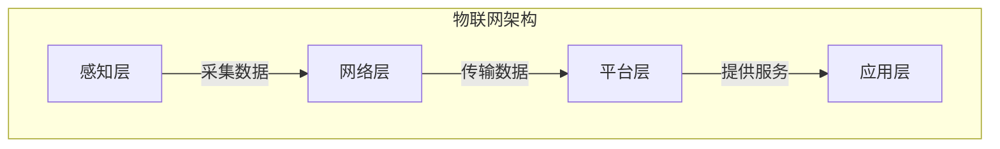

# 物联网(IoT)技术和各种传感器设备的集成：物联网在智慧城市的应用

作者：禅与计算机程序设计艺术 / Zen and the Art of Computer Programming

## 1. 背景介绍

### 1.1 问题的由来

随着城市化进程的不断加快,传统的城市基础设施和管理模式已经难以满足现代城市的发展需求。交通拥堵、环境污染、能源浪费等问题日益突出,亟需通过创新的技术手段来解决。在这种背景下,物联网(Internet of Things, IoT)技术应运而生,它通过将各种传感器、执行器等设备连接到互联网上,实现对城市中各种设施和系统的实时监控和智能管理,为建设智慧城市提供了有力支撑。

### 1.2 研究现状

目前,物联网技术在智慧城市的应用已经取得了一定的进展。例如,在交通领域,通过安装车载传感器和路侧单元,可以实时监测交通流量,优化交通信号灯时序,缓解拥堵;在环境监测方面,部署各种环境传感器可以实时采集空气质量、噪音等数据,为制定环保政策提供依据;在能源管理领域,安装智能电表可以实现用户用电量的实时监控和需求侧响应管理,提高能源利用效率。

### 1.3 研究意义

物联网技术在智慧城市的应用具有重要意义:

1. 提高城市运营效率,降低管理成本
2. 优化资源配置,实现可持续发展
3. 改善市民生活质量,创建宜居环境
4. 促进新兴产业发展,拓展经济增长点

### 1.4 本文结构

本文将全面介绍物联网技术在智慧城市中的应用。首先阐述物联网的核心概念和关键技术,然后详细解释其在智慧城市中的应用场景,包括交通、环境、能源等领域。接下来,探讨物联网系统的架构设计和实现方法,并给出相关案例分析。最后,总结物联网在智慧城市中的发展趋势和面临的挑战。

## 2. 核心概念与联系

物联网(IoT)是一种基于互联网的新型网络,它将各种物理设备(如传感器、执行器等)连接到互联网上,实现物与物、物与人之间的信息交互和智能服务。

物联网的核心概念包括:

1. **感知层**: 由各种传感器设备组成,用于采集环境数据。
2. **网络层**: 负责传输感知层采集的数据,常用技术有无线传感网络、蜂窝网络、互联网等。
3. **平台层**: 对接收的海量数据进行存储、处理和管理,提供开放的应用接口。
4. **应用层**: 基于平台层提供的服务,开发各种智能应用程序。

这些层次之间通过标准协议相互衔接,构成了物联网的整体架构。物联网技术与云计算、大数据、人工智能等新兴技术相结合,可以实现对城市中各种系统的智能化管理和优化。

## 3. 核心算法原理 & 具体操作步骤

### 3.1 算法原理概述

在物联网系统中,常用的核心算法包括:

1. **数据融合算法**: 将来自不同传感器的异构数据进行预处理、校准和融合,提高数据质量。
2. **数据挖掘算法**: 对海量数据进行分析和建模,发现潜在的知识和规律。
3. **优化算法**: 根据约束条件,寻找最优解,用于资源调度、路径规划等场景。
4. **机器学习算法**: 通过训练数据自动构建模型,用于模式识别、预测和决策。

这些算法在物联网系统的不同层次发挥着重要作用,为智能化应用提供算力支持。

### 3.2 算法步骤详解

以**数据融合算法**为例,其典型步骤如下:

1. **数据预处理**:
   - 去除异常值和噪声
   - 处理缺失值
   - 进行数据标准化

2. **数据对齐**:
   - 时间同步
   - 空间对准
   - 模态对准

3. **数据融合**:
   - 基于概率论的贝叶斯融合
   - 基于粗糙集的证据理论融合
   - 基于人工智能的神经网络融合

4. **融合结果评估**:
   - 定量评估指标(均方根误差等)
   - 定性评估(可解释性等)

通过以上步骤,可以将来自不同传感器的数据进行有效融合,提高数据质量和可用性。

### 3.3 算法优缺点

不同算法具有不同的优缺点,需要根据具体场景进行权衡选择。

以**数据融合算法**为例:

- 优点:
  - 提高数据质量和可靠性
  - 减少数据冗余和噪声
  - 增强系统的容错能力

- 缺点:
  - 算法复杂度较高,计算开销大
  - 需要对异构数据进行预处理
  - 融合结果的可解释性较差

### 3.4 算法应用领域

物联网系统中的核心算法在多个领域得到了广泛应用:

- **智能交通**: 利用优化算法进行路径规划和交通信号控制,缓解拥堵;使用机器学习算法预测交通流量。
- **环境监测**: 通过数据融合算法整合不同传感器数据,全面评估环境质量;利用数据挖掘算法发现环境污染源。
- **能源管理**: 基于优化算法实现能源负荷预测和需求侧响应;使用机器学习算法构建用户用能模型。
- **智能制造**: 应用机器学习算法进行产品缺陷检测和预测性维护;利用优化算法完成工艺参数优化。

## 4. 数学模型和公式 & 详细讲解 & 举例说明

### 4.1 数学模型构建

在物联网系统中,常需要构建数学模型来描述和解决实际问题。以**交通流量预测**为例,可以建立如下数学模型:

设有 $n$ 个路口,第 $i$ 个路口在时间 $t$ 的流量为 $x_i(t)$,则整个路网的流量向量为:

$$\boldsymbol{x}(t)=\left[x_1(t),x_2(t),\cdots,x_n(t)\right]^T$$

假设流量与历史数据、天气、节假日等因素相关,可以表示为:

$$\boldsymbol{x}(t)=f\left(\boldsymbol{x}(t-1),\boldsymbol{x}(t-2),\cdots,\boldsymbol{x}(t-p),\boldsymbol{u}(t)\right)$$

其中, $\boldsymbol{u}(t)$ 为外部影响因素向量, $p$ 为历史数据的时间窗口大小。

该模型的目标是找到合适的函数 $f$,使预测值 $\hat{\boldsymbol{x}}(t)$ 与真实值 $\boldsymbol{x}(t)$ 的差异最小。

### 4.2 公式推导过程

对于上述交通流量预测模型,可以使用**机器学习算法**来训练函数 $f$。以**长短期记忆网络(LSTM)**为例,其公式推导过程如下:

LSTM 是一种特殊的递归神经网络,它的核心思想是引入"门控机制",以解决传统递归神经网络存在的梯度消失和梯度爆炸问题。

LSTM 单元的计算公式为:

$$\begin{aligned}
\boldsymbol{f}_t&=\sigma\left(\boldsymbol{W}_f\cdot\left[\boldsymbol{h}_{t-1},\boldsymbol{x}_t\right]+\boldsymbol{b}_f\right)&&\text{(遗忘门)}\\
\boldsymbol{i}_t&=\sigma\left(\boldsymbol{W}_i\cdot\left[\boldsymbol{h}_{t-1},\boldsymbol{x}_t\right]+\boldsymbol{b}_i\right)&&\text{(输入门)}\\
\boldsymbol{\tilde{c}}_t&=\tanh\left(\boldsymbol{W}_c\cdot\left[\boldsymbol{h}_{t-1},\boldsymbol{x}_t\right]+\boldsymbol{b}_c\right)&&\text{(候选记忆细胞)}\\
\boldsymbol{c}_t&=\boldsymbol{f}_t\odot\boldsymbol{c}_{t-1}+\boldsymbol{i}_t\odot\boldsymbol{\tilde{c}}_t&&\text{(记忆细胞)}\\
\boldsymbol{o}_t&=\sigma\left(\boldsymbol{W}_o\cdot\left[\boldsymbol{h}_{t-1},\boldsymbol{x}_t\right]+\boldsymbol{b}_o\right)&&\text{(输出门)}\\
\boldsymbol{h}_t&=\boldsymbol{o}_t\odot\tanh\left(\boldsymbol{c}_t\right)&&\text{(隐藏状态)}
\end{aligned}$$

其中, $\sigma$ 为 Sigmoid 函数, $\odot$ 为元素wise乘积, $\boldsymbol{W}$ 和 $\boldsymbol{b}$ 为需要训练的权重和偏置参数。

通过以上公式,LSTM 能够有选择性地保留和遗忘历史信息,从而更好地捕捉序列数据中的长期依赖关系。

### 4.3 案例分析与讲解

现以某城市的交通流量预测为例,说明如何应用 LSTM 模型:

1. **数据预处理**:
   - 收集历史交通流量数据、天气数据、节假日信息等
   - 对异常值和缺失值进行处理
   - 将数据归一化到 $[0,1]$ 区间

2. **构建 LSTM 模型**:
   - 输入层:包含历史流量数据和外部影响因素
   - LSTM 层:设置合适的隐藏单元数和层数
   - 输出层:预测未来时刻的交通流量

3. **模型训练**:
   - 将数据划分为训练集和测试集
   - 设置合适的损失函数(如均方误差)和优化器
   - 使用训练数据对模型进行训练,直至收敛

4. **模型评估**:
   - 在测试集上评估模型的预测性能
   - 使用评估指标,如均方根误差(RMSE)、决定系数($R^2$)等

5. **模型应用**:
   - 将训练好的模型部署到实际系统中
   - 根据新的输入数据,预测未来时刻的交通流量
   - 将预测结果应用于交通管控和路径规划

通过以上步骤,LSTM 模型能够有效捕捉交通流量数据中的时间序列特征,为智能交通管理提供决策支持。

### 4.4 常见问题解答

1. **如何选择合适的机器学习算法?**

选择机器学习算法需要考虑以下因素:
   - 问题的性质(回归、分类、聚类等)
   - 数据的特征(维度、噪声水平、缺失值等)
   - 模型的可解释性和可靠性要求
   - 计算资源的限制(内存、CPU/GPU等)

常见的算法包括线性回归、决策树、支持向量机、神经网络等,可以根据具体场景进行权衡选择。

2. **如何处理异构传感器数据?**

异构传感器数据存在格式、尺度、时间戳不一致等问题,需要进行如下处理:
   - 数据格式转换,将不同格式的数据统一
   - 数据标准化,将数据映射到同一尺度范围
   - 时间同步,对不同时间戳的数据进行对齐
   - 模态对准,将不同模态(如图像、声音等)的数据对准

经过预处理后,异构数据可以输入到数据融合算法中进行整合。

3. **如何评估数据融合的效果?**

评估数据融合效果可以使用以下指标:
   - 定量指标:均方根误差(RMSE)、信噪比(SNR)等
   - 定性指标:融合结果的可解释性、一致性等
   - 应用层面:融