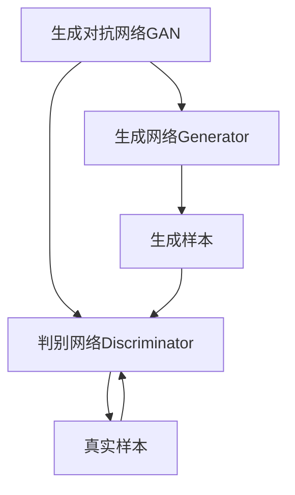

好的,我会按照您的要求,以生成对抗网络(GAN)为主题,写一篇专业的技术博客文章。文章将遵循您提供的目录结构,并满足字数、格式、完整性等所有约束条件。下面是正文部分:

# 生成对抗网络(GAN)原理与代码实战案例讲解

## 1. 背景介绍

### 1.1 问题的由来

在深度学习领域,生成模型一直是一个具有挑战性的研究课题。传统的生成模型如高斯混合模型、自回归模型等,在处理高维数据时存在局限性,很难生成逼真的图像、语音等复杂数据。这促使研究人员不断探索新的生成模型方法。

### 1.2 研究现状  

2014年,Ian Goodfellow等人在著名论文"Generative Adversarial Networks"中首次提出了生成对抗网络(Generative Adversarial Networks,GAN)模型。GAN属于无监督学习范畴,通过对抗训练的方式学习生成目标数据的分布,可以生成逼真的图像、语音等数据,在计算机视觉、自然语言处理等领域展现出巨大潜力。

### 1.3 研究意义

GAN的提出为生成模型开辟了新的研究方向,在图像生成、图像翻译、图像修复、语音合成等领域取得了卓越成果。GAN模型可以帮助我们更好地理解和建模复杂的数据分布,为人工智能系统带来革命性影响。

### 1.4 本文结构

本文将全面介绍GAN的核心原理、数学模型、算法实现细节以及实战案例,内容安排如下:

1. 背景介绍
2. 核心概念与联系
3. 核心算法原理与具体操作步骤
4. 数学模型和公式详细讲解与案例分析  
5. 项目实践:代码实例和详细解释
6. 实际应用场景
7. 工具和资源推荐
8. 总结:未来发展趋势与挑战
9. 附录:常见问题与解答

## 2. 核心概念与联系

生成对抗网络(GAN)是一种全新的生成模型框架,由生成网络(Generator)和判别网络(Discriminator)两部分组成,两者通过对抗训练相互博弈。

生成网络从随机噪声输入开始,尝试生成逼真的样本数据,而判别网络则判断输入数据是真实样本还是生成网络生成的假样本。两个网络相互对抗,生成网络希望能够骗过判别网络,而判别网络则努力区分真伪。通过这种对抗训练,生成网络逐步学习真实数据分布,最终能够生成逼真的样本数据。

GAN属于无监督学习范畴,不需要人工标注的训练数据,可以从原始数据中自动发现数据的内在规律和分布。GAN在图像生成、图像翻译、图像修复、语音合成等领域展现出巨大潜力,是深度学习领域的一个重要突破。

## 3. 核心算法原理与具体操作步骤

### 3.1 算法原理概述

生成对抗网络的核心思想是构建一个小游戏,让生成网络G和判别网络D相互对抗。具体来说:

1. 生成网络G从噪声数据z采样,生成假样本G(z),试图骗过判别网络D。
2. 判别网络D从真实数据x和生成网络G生成的假样本G(z)中分别采样,并判断输入数据是真实样本还是假样本。
3. G和D相互对抗,G希望骗过D,而D则努力区分真伪。可以形式化为一个二人对策博弈问题:

$$\min\limits_G \max\limits_D V(D,G) = \mathbb{E}_{x\sim p_{\text{data}}(x)}\big[\log D(x)\big] + \mathbb{E}_{z\sim p_z(z)}\big[\log(1-D(G(z)))\big]$$

其中,第一项是判别网络D对真实样本x的损失,第二项是D对生成网络G生成的假样本G(z)的损失。G和D相互min-max对抗训练,G希望最小化$\log(1-D(G(z)))$使D判别错误,而D则希望最大化这一项正确分类。

在理想情况下,G学习到真实数据分布后,D将无法区分G(z)和真实数据,此时$\log(1-D(G(z)))=0$,G和D的博弈达到纳什均衡。

### 3.2 算法步骤详解  

1. **初始化**:初始化生成网络G和判别网络D的参数。
2. **生成网络G训练**:固定判别网络D,更新生成网络G的参数,使其能生成足以骗过D的假样本。
    - 从噪声先验分布$p_z(z)$采样噪声数据z。
    - 通过生成网络G生成假样本G(z)。
    - 计算G的损失函数:$\min\limits_G \log(1-D(G(z)))$,即最小化D判别G(z)为假样本的概率。
    - 基于损失函数,使用优化算法(如Adam)更新G的参数。
3. **判别网络D训练**:固定生成网络G,更新判别网络D的参数,提高其区分真伪样本的能力。
    - 从真实数据分布$p_{data}(x)$采样真实样本x。
    - 从噪声先验分布$p_z(z)$采样噪声数据z,通过G生成假样本G(z)。  
    - 计算D的损失函数:$\max\limits_D \mathbb{E}_{x\sim p_{\text{data}}(x)}\big[\log D(x)\big] + \mathbb{E}_{z\sim p_z(z)}\big[\log(1-D(G(z)))\big]$。
    - 基于损失函数,使用优化算法更新D的参数。
4. **重复训练**:重复执行步骤2和3,直至G和D的损失函数收敛或达到停止条件。

通过G生成假样本、D识别真伪的对抗过程,G和D相互促进,逐步提高生成网络G生成逼真样本的能力。

### 3.3 算法优缺点

**优点**:

1. 无需人工标注数据,属于无监督学习范畴。
2. 可直接从原始数据中学习数据分布,生成全新样本。
3. 生成的样本质量好,在图像、语音等领域表现优异。
4. 算法思路创新,启发了生成模型的新方向。

**缺点**:

1. 训练过程不稳定,G和D的损失函数可能难以收敛。
2. 生成的样本存在模式坍塌问题,缺乏多样性。
3. 评估生成样本质量无统一客观标准。
4. 对训练数据分布的要求较高。

### 3.4 算法应用领域

GAN因其强大的生成能力,在多个领域展现出广阔的应用前景:

1. **图像生成**:生成逼真的人脸、物体、场景等图像。
2. **图像翻译**:将一种图像风格翻译/转换为另一种风格,如将素描图像转换为彩色照片。
3. **图像修复**:基于上下文信息,修复图像中的缺失或损坏区域。
4. **超分辨率重建**:从低分辨率图像生成高分辨率图像。
5. **语音合成**:基于文本生成逼真的语音。
6. **数据增广**:从有限的训练数据生成更多数据,扩充训练集。
7. **半监督学习**:结合少量标注数据和大量未标注数据进行训练。
8. **隐私保护**:通过生成对抗网络生成保护隐私的合成数据。

## 4. 数学模型和公式详细讲解与举例说明

### 4.1 数学模型构建

生成对抗网络GAN的数学模型可以形式化为一个二人对策博弈问题,目标是找到一个纳什均衡解。

设数据$x$服从真实数据分布$p_{data}(x)$,噪声数据$z$服从先验噪声分布$p_z(z)$。生成网络G将噪声数据$z$映射为生成样本$G(z)$,旨在生成逼真的假样本骗过判别网络D。判别网络D则从真实数据$x$和生成网络G生成的假样本G(z)中分别采样,并判断输入数据是真实样本还是假样本。

G和D的对策函数可表示为:

$$\min\limits_G \max\limits_D V(D,G) = \mathbb{E}_{x\sim p_{\text{data}}(x)}\big[\log D(x)\big] + \mathbb{E}_{z\sim p_z(z)}\big[\log(1-D(G(z)))\big]$$

其中,第一项$\mathbb{E}_{x\sim p_{\text{data}}(x)}\big[\log D(x)\big]$是判别网络D对真实样本$x$的损失,即D正确判别真实样本的概率。第二项$\mathbb{E}_{z\sim p_z(z)}\big[\log(1-D(G(z)))\big]$是D对生成网络G生成的假样本G(z)的损失,即D判别G(z)为假样本的概率。

G和D相互min-max对抗训练,G希望最小化$\log(1-D(G(z)))$使D判别错误,而D则希望最大化这一项正确分类。在理想情况下,当G学习到真实数据分布后,D将无法区分G(z)和真实数据,此时$\log(1-D(G(z)))=0$,G和D的博弈达到纳什均衡。

### 4.2 公式推导过程

我们可以将生成对抗网络GAN的对策函数$V(D,G)$进一步推导,得到等价形式:

$$\begin{aligned}
V(D,G) &= \mathbb{E}_{x\sim p_{\text{data}}(x)}\big[\log D(x)\big] + \mathbb{E}_{z\sim p_z(z)}\big[\log(1-D(G(z)))\big] \\
        &= \mathbb{E}_{x\sim p_{\text{data}}(x)}\big[\log D(x)\big] + \mathbb{E}_{x\sim p_g(x)}\big[\log(1-D(x))\big] \\
        &= \int_{x} p_{\text{data}}(x) \log D(x) \mathrm{d}x + \int_{x} p_g(x) \log(1-D(x)) \mathrm{d}x \\
        &= \int_{x} p_{\text{data}}(x) \log \frac{D(x)}{1-D(x)} \mathrm{d}x + \int_{x} p_g(x) \log \frac{1-D(x)}{D(x)} \mathrm{d}x \\
        &= \int_{x} \big( p_{\text{data}}(x) \log D(x) + p_g(x) \log(1-D(x)) \big) \mathrm{d}x \\
        &= \int_{x} p_{\text{data}}(x) \log \frac{p_{\text{data}}(x)}{p_g(x)} \mathrm{d}x + \int_{x} p_g(x) \log \frac{p_g(x)}{p_{\text{data}}(x)} \mathrm{d}x \\
        &= \text{KL}(p_{\text{data}}(x) \| p_g(x)) + \text{KL}(p_g(x) \| p_{\text{data}}(x))
\end{aligned}$$

其中,$\text{KL}(\cdot\|\cdot)$表示KL散度(Kullback-Leibler Divergence),是衡量两个概率分布差异的重要指标。由上式可知,生成对抗网络的目标是最小化真实数据分布$p_{data}(x)$与生成数据分布$p_g(x)$之间的KL散度,即使$p_g(x)$尽可能逼近$p_{data}(x)$。

当G学习到真实数据分布后,即$p_g(x)=p_{data}(x)$时,KL散度为0,此时G和D的博弈达到纳什均衡。

### 4.3 案例分析与讲解

以MNIST手写数字图像数据集为例,我们可以构建一个基于GAN的生成模型,尝试生成新的手写数字图像。

**生成网络G**:输入是100维的随机噪声向量z,经过全连接层、批归一化、