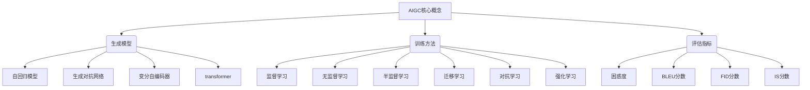

# 生成式AIGC：未来商业的智能化发展

## 1. 背景介绍

### 1.1 问题的由来

在当今时代，数据和信息的爆炸式增长已成为一个不可忽视的现象。无论是个人还是企业,都面临着如何高效地处理和利用这些海量数据的挑战。传统的数据处理方式已经难以满足现代商业的需求,因此迫切需要一种新的解决方案来应对这一挑战。

生成式人工智能(Generative AI,简称AIGC)作为一种新兴的技术,正在为这一问题提供一种全新的思路。AIGC能够基于现有的数据和信息,生成新的、高质量的内容,如文本、图像、音频和视频等。这种生成式方法不仅能够极大地提高数据处理效率,还能为企业带来新的商业机遇和价值创造。

### 1.2 研究现状

近年来,AIGC技术取得了长足的进步,尤其是在自然语言处理(NLP)和计算机视觉(CV)领域。一些知名的AIGC模型,如GPT-3、DALL-E和Stable Diffusion等,已经展现出了令人惊叹的生成能力。这些模型能够根据给定的提示或描述,生成高质量的文本、图像和视频内容。

然而,尽管取得了重大进展,AIGC技术仍然面临着一些挑战和局限性。例如,生成内容的一致性和可控性、版权和知识产权问题、模型的可解释性和透明度等,都是需要进一步研究和解决的问题。

### 1.3 研究意义

AIGC技术的发展对于未来商业的智能化转型具有重大意义。它不仅能够提高数据处理效率,还能为企业带来新的商业模式和价值创造机会。例如,AIGC可以用于自动化内容生成、个性化推荐、虚拟助手等领域,从而提高企业的运营效率和用户体验。

此外,AIGC技术还可以促进人工智能与其他技术领域的融合,推动跨学科的创新和发展。例如,将AIGC与物联网、大数据、云计算等技术相结合,可以为智能制造、智能城市、智能医疗等领域带来全新的解决方案。

### 1.4 本文结构

本文将全面介绍AIGC技术在未来商业智能化发展中的作用和应用。首先,我们将探讨AIGC的核心概念和原理,包括生成模型、训练方法和评估指标等。接下来,我们将深入分析AIGC的核心算法原理和数学模型,并通过案例分析和代码实现来加深理解。

此外,本文还将介绍AIGC在各个行业的实际应用场景,以及未来的发展趋势和挑战。最后,我们将推荐一些有用的工具和资源,以帮助读者进一步学习和实践AIGC技术。

## 2. 核心概念与联系

AIGC(Generative AI)是一种新兴的人工智能技术,旨在基于现有的数据和信息生成新的、高质量的内容。它主要包括三个核心概念:生成模型、训练方法和评估指标。

生成模型是AIGC的核心,它决定了生成内容的质量和特性。常见的生成模型包括自回归模型(如GPT)、生成对抗网络(GAN)、变分自编码器(VAE)和Transformer等。每种模型都有其独特的优势和局限性,适用于不同的应用场景。

训练方法则决定了如何有效地训练生成模型。常见的训练方法包括监督学习、无监督学习、半监督学习、迁移学习、对抗学习和强化学习等。选择合适的训练方法对于提高模型的生成能力至关重要。

评估指标用于衡量生成内容的质量和性能。常见的评估指标包括困惑度(Perplexity)、BLEU分数(用于评估文本生成质量)、FID分数和IS分数(用于评估图像生成质量)等。选择合适的评估指标有助于监控和优化模型的性能。

这三个核心概念相互关联,共同构建了AIGC技术的基础。只有将它们有机结合,才能开发出高质量、高效率的AIGC系统,从而推动未来商业的智能化发展。

## 3. 核心算法原理 & 具体操作步骤

### 3.1 算法原理概述

AIGC技术的核心算法原理主要基于深度学习和生成模型。其中,自回归模型(如GPT)和生成对抗网络(GAN)是两种最常用的生成模型。

自回归模型旨在根据输入的上文,预测下一个单元(如单词或像素)的概率分布。通过最大化预测的概率,模型可以生成连贯、自然的输出序列。自回归模型广泛应用于文本生成、机器翻译和语音识别等任务。

生成对抗网络(GAN)则由一个生成器(Generator)和一个判别器(Discriminator)组成。生成器旨在生成逼真的样本(如图像或音频),而判别器则试图区分生成的样本和真实样本。通过生成器和判别器之间的对抗训练,GAN可以学习到数据的真实分布,从而生成高质量的样本。GAN广泛应用于图像生成、风格迁移和视频生成等任务。

除了这两种主要的生成模型,还有一些其他的模型,如变分自编码器(VAE)、流模型(Flow Models)和扩散模型(Diffusion Models)等,每种模型都有其独特的优势和应用场景。

### 3.2 算法步骤详解

以自回归模型(如GPT)为例,其核心算法步骤如下:

1. **数据预处理**:首先对输入数据(如文本)进行预处理,包括分词、编码、填充等操作,将其转换为模型可以处理的张量形式。

2. **模型初始化**:初始化自回归模型的参数,包括embedding层、transformer编码器层和输出层等。

3. **前向传播**:将预处理后的输入数据输入模型,通过transformer编码器层计算输入序列的隐藏状态表示。

4. **预测输出**:将隐藏状态表示输入到输出层,计算下一个单元(如单词)的概率分布。

5. **采样生成**:根据预测的概率分布,采用贪婪搜索、束搜索或其他采样策略,生成下一个单元。

6. **迭代生成**:将生成的单元作为新的输入,重复步骤3-5,直到达到预设的长度或遇到终止符。

7. **后处理输出**:对生成的序列进行后处理,如解码、去除特殊符号等,得到最终的输出结果。

在训练阶段,模型会根据真实数据和生成数据之间的损失函数(如交叉熵损失)进行参数优化,以提高生成质量。

对于GAN模型,其核心算法步骤包括:数据预处理、生成器和判别器初始化、生成器生成样本、判别器判别真伪、计算生成器和判别器损失、反向传播优化参数、迭代训练,直到模型收敛。

### 3.3 算法优缺点

自回归模型和GAN模型都有其独特的优缺点:

**自回归模型优点**:
- 生成质量较高,能够产生连贯、自然的序列输出。
- 训练相对简单,损失函数直观。
- 具有较强的可解释性和可控性。

**自回归模型缺点**:
- 生成效率较低,需要逐个单元生成。
- 存在累积错误问题,前面的错误会影响后续生成。
- 对于非序列数据(如图像)的生成能力较差。

**GAN优点**:
- 能够直接生成高质量的样本,如图像和音频。
- 生成效率较高,一次可以生成整个样本。
- 具有较强的生成能力,可以学习到数据的真实分布。

**GAN缺点**:
- 训练过程不稳定,容易出现模式坍塌和梯度消失等问题。
- 缺乏可解释性和可控性,难以解释生成过程。
- 评估生成质量困难,缺乏统一的评估指标。

因此,在实际应用中,需要根据具体任务和需求选择合适的生成模型。有时也可以将多种模型结合使用,发挥各自的优势。

### 3.4 算法应用领域

AIGC技术的核心算法可以应用于多个领域,包括但不限于:

- **自然语言处理**:文本生成、机器翻译、问答系统、文本摘要等。
- **计算机视觉**:图像生成、图像编辑、图像超分辨率、视频生成等。
- **语音处理**:语音合成、语音转换、音乐生成等。
- **推荐系统**:个性化推荐、内容推荐等。
- **虚拟现实**:虚拟人物生成、虚拟场景生成等。
- **医疗健康**:医学图像生成、药物设计等。
- **设计创作**:logo设计、插画生成、3D模型生成等。

随着AIGC技术的不断发展和完善,其应用领域将越来越广泛,为各个行业带来全新的发展机遇。

## 4. 数学模型和公式 & 详细讲解 & 举例说明

### 4.1 数学模型构建

AIGC技术的核心数学模型主要基于概率论和信息论。我们将以自回归模型(如GPT)为例,介绍其数学模型的构建过程。

假设我们有一个长度为$N$的序列$X = (x_1, x_2, \dots, x_N)$,我们的目标是学习该序列的联合概率分布$P(X)$。根据链式法则,我们可以将$P(X)$分解为条件概率的乘积:

$$P(X) = P(x_1, x_2, \dots, x_N) = \prod_{t=1}^N P(x_t | x_1, \dots, x_{t-1})$$

自回归模型的核心思想是使用神经网络来建模条件概率分布$P(x_t | x_1, \dots, x_{t-1})$。具体来说,我们定义一个神经网络$f_\theta$,其输入为前$t-1$个单元$(x_1, \dots, x_{t-1})$,输出为下一个单元$x_t$的概率分布:

$$P(x_t | x_1, \dots, x_{t-1}) = f_\theta(x_1, \dots, x_{t-1})$$

其中,$\theta$表示神经网络的参数。

在训练阶段,我们可以最大化训练数据的对数似然函数:

$$\mathcal{L}(\theta) = \sum_{X \in \mathcal{D}} \log P(X; \theta) = \sum_{X \in \mathcal{D}} \sum_{t=1}^N \log P(x_t | x_1, \dots, x_{t-1}; \theta)$$

其中,$\mathcal{D}$表示训练数据集。通过梯度下降等优化算法,我们可以找到最优的参数$\theta^*$,使得模型在训练数据上的对数似然函数最大化。

在生成阶段,给定前$t-1$个单元$(x_1, \dots, x_{t-1})$,我们可以使用训练好的模型$f_{\theta^*}$来预测下一个单元$x_t$的概率分布:

$$P(x_t | x_1, \dots, x_{t-1}) = f_{\theta^*}(x_1, \dots, x_{t-1})$$

然后,我们可以根据这个概率分布采样或者选择概率最大的单元作为生成的下一个单元。重复这个过程,直到达到预设的长度或遇到终止符,就可以生成一个完整的序列。

### 4.2 公式推导过程

在上一节中,我们介绍了自回归模型的核