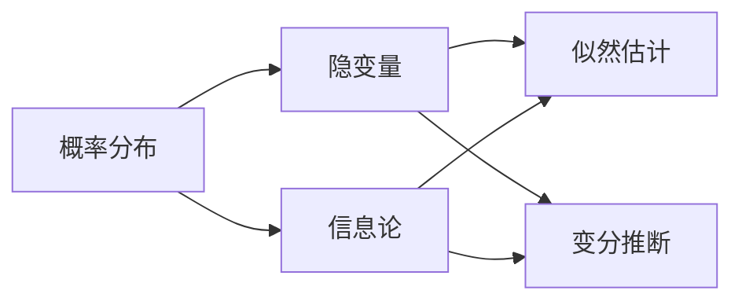

# 生成式人工智能 (Generative AI)

## 1. 背景介绍

### 1.1 问题的由来
人工智能(Artificial Intelligence, AI)自诞生以来就一直是计算机科学领域最令人兴奋和充满想象力的分支。近年来,随着深度学习等技术的快速发展,AI已经在许多领域取得了令人瞩目的成就,如计算机视觉、自然语言处理、语音识别等。而生成式AI作为人工智能的一个新兴分支,正在受到越来越多研究者和业界的关注。

生成式AI旨在学习数据的内在模式和规律,并基于学习到的知识生成与训练数据相似的全新内容,如图像、文本、音频等。与传统的判别式AI模型不同,生成式模型能够捕捉数据的内在概率分布,从而具备一定的创造力和想象力。这使得生成式AI在许多应用场景中展现出了巨大的潜力,如艺术创作、游戏设计、药物发现等。

### 1.2 研究现状
近年来,生成式AI取得了长足的进展。以生成对抗网络(GAN)为代表的一系列生成式模型被相继提出,并在图像生成、风格迁移、超分辨率等任务上取得了惊人的效果。例如,StyleGAN系列模型能够生成极其逼真的人脸图像,DALL-E模型可以根据文本描述生成匹配的图像,GPT-3等大规模语言模型展现出了惊人的文本生成能力。

同时,生成式AI在学术界和工业界也受到了高度重视。顶级会议如CVPR、ICLR、NeurIPS等都设立了专门的生成式模型分会场,许多科技巨头如谷歌、OpenAI、微软等纷纷投入大量资源进行生成式AI的研究和应用。一些初创公司如Anthropic、Stability AI等也推出了自己的生成式AI平台和工具。

### 1.3 研究意义
生成式AI具有重要的理论意义和应用价值:

1. 揭示AI创造力的奥秘。生成式模型一定程度上模拟了人类的创造过程,研究生成式AI有助于我们理解机器如何产生创造力,进而探索人类智能的本质。

2. 拓展AI的应用边界。生成式AI使得计算机具备了生产内容的能力,大大拓宽了人工智能的应用场景,将对内容创作、设计、科研等领域产生深远影响。

3. 促进AI与人类的协作。生成式AI可以作为人类创作的助手和伙伴,与人类形成互补,提高生产力,激发更多的创意和灵感。

4. 推动AI的可解释性和可控性。生成式模型的内在机制比判别模型更加透明,有利于我们理解AI系统的决策过程,提高其可解释性。同时,生成式模型可以引入更多先验知识和约束,增强其可控性。

### 1.4 本文结构
本文将全面介绍生成式人工智能的相关知识。第2部分阐述生成式AI的核心概念;第3部分介绍主要的生成式模型和算法;第4部分系统讲解生成式模型的数学原理;第5部分通过代码实例演示生成式模型的实现;第6部分探讨生成式AI的应用场景;第7部分推荐相关的学习资源;第8部分总结全文并展望未来。

## 2. 核心概念与联系

生成式人工智能的核心概念包括:

- 概率分布:描述变量的统计规律,生成式模型通过学习训练数据的概率分布来刻画其内在模式。
- 隐变量:生成式模型引入隐变量来表示数据的潜在特征和结构,通过隐变量可以更高效地建模复杂数据。 
- 似然估计:通过最大化似然函数来估计概率分布的参数,是许多生成式模型的优化目标。
- 变分推断:通过近似后验分布来估计复杂模型的隐变量和参数,在训练和推断过程中起关键作用。
- 信息论:生成式模型利用信息论原理如交叉熵、KL散度等来度量分布之间的差异,指导模型优化。

这些概念相互关联,共同构成了生成式AI的理论基础。概率分布刻画了数据的统计规律,隐变量增强了模型的表达能力,似然估计和变分推断是模型求解的途径,信息论则提供了优化的指标和目标。

下图展示了生成式AI的核心概念之间的联系:



## 3. 核心算法原理 & 具体操作步骤

### 3.1 算法原理概述
生成式AI模型主要包括以下三大类:

1. 隐变量模型:通过引入隐变量来刻画数据的潜在结构,代表算法有变分自编码器(VAE)、生成对抗网络(GAN)等。
2. 自回归模型:通过对序列数据的概率分解,逐步生成新的序列,代表算法有PixelRNN、Transformer等。
3. 流模型:通过可逆变换将简单分布映射到复杂分布,代表算法有RealNVP、Glow等。

这些模型的基本原理是学习数据的内在概率分布,并基于学到的分布生成新样本。它们采用了不同的建模方式和优化目标,各有优势和局限。

### 3.2 算法步骤详解
以变分自编码器(VAE)为例,详细介绍生成式模型的训练和推断过程。

VAE由编码器和解码器两部分组成。编码器将输入数据x映射到隐空间的后验分布q(z|x),解码器从先验分布p(z)中采样隐变量z,并解码为生成分布p(x|z)。VAE的目标是最大化数据的边缘似然p(x),同时最小化后验分布q(z|x)与先验分布p(z)的KL散度。

VAE的训练过程如下:

1. 初始化编码器和解码器的参数。
2. 从数据集中采样一批数据x。
3. 将x输入编码器,得到后验分布q(z|x)的参数。
4. 从后验分布q(z|x)中采样隐变量z。
5. 将z输入解码器,得到生成分布p(x|z)。 
6. 计算重构损失-log p(x|z)和KL散度KL(q(z|x)||p(z))。
7. 计算总损失,并通过反向传播更新参数。
8. 重复步骤2-7,直到模型收敛。

VAE的推断过程如下:

1. 从先验分布p(z)中采样隐变量z。
2. 将z输入解码器,得到生成分布p(x|z)。
3. 从p(x|z)中采样生成数据x。

### 3.3 算法优缺点
VAE的优点包括:

- 可以学习数据的低维流形结构。
- 训练稳定,不易出现模式崩溃。
- 可以进行可控生成和插值。
- 适合半监督和无监督学习。

VAE的缺点包括:

- 生成质量不如GAN。
- 后验分布假设过于简单。
- 难以捕捉精细的局部特征。

### 3.4 算法应用领域
VAE在以下领域有广泛应用:

- 图像生成与编辑
- 语音合成
- 分子生成与药物发现
- 异常检测
- 机器翻译与对话生成

## 4. 数学模型和公式 & 详细讲解 & 举例说明

### 4.1 数学模型构建
VAE的数学模型基于概率图模型。假设观测变量x由隐变量z生成,其联合分布为:

$p(x,z)=p(x|z)p(z)$

其中p(z)为先验分布,通常假设为标准正态分布:

$p(z)=\mathcal{N}(z;0,I)$

p(x|z)为生成分布,形式取决于数据类型,如高斯分布、伯努利分布等。

引入变分分布q(z|x)来近似真实后验分布p(z|x),优化目标为最大化变分下界(ELBO):

$\mathcal{L}(x)=\mathbb{E}_{q(z|x)}[\log p(x|z)]-KL(q(z|x)||p(z))$

其中第一项为重构损失,第二项为KL散度正则化。

### 4.2 公式推导过程
利用Jensen不等式,可以推导出边缘似然p(x)的变分下界:

$\log p(x)=\log \int p(x,z)dz=\log \int q(z|x)\frac{p(x,z)}{q(z|x)}dz \geq \int q(z|x)\log \frac{p(x,z)}{q(z|x)}dz$

$=\int q(z|x)\log p(x|z)dz-\int q(z|x)\log \frac{q(z|x)}{p(z)}dz$

$=\mathbb{E}_{q(z|x)}[\log p(x|z)]-KL(q(z|x)||p(z))$

即得到ELBO的表达式。最大化ELBO等价于最小化重构误差和KL散度。

### 4.3 案例分析与讲解
以图像生成任务为例,说明VAE的具体应用。

假设要生成手写数字图像,每个图像的大小为28x28,像素值为0-1之间的实数。我们可以设计如下的VAE模型:

- 编码器:输入为28x28的图像,经过卷积层和全连接层,输出隐变量均值和方差。
- 解码器:从标准正态分布中采样隐变量,经过全连接层和反卷积层,输出28x28的图像。
- 重构损失:使用二元交叉熵来度量原始图像和重构图像的差异。
- KL散度:隐变量的后验分布与标准正态分布的KL散度。

在训练过程中,我们最小化重构损失和KL散度,使得编码器能够将图像压缩到低维隐空间,解码器能够从隐变量恢复出图像。训练完成后,我们可以从先验分布中采样隐变量,并用解码器生成新的手写数字图像。通过改变隐变量的值,还可以实现数字的插值和编辑。

### 4.4 常见问题解答
Q: VAE和GAN有何区别?

A: VAE和GAN都是常用的生成式模型,但原理不同。VAE通过最大化边缘似然来训练,可以显式地估计数据分布,但生成质量不如GAN。GAN通过判别器和生成器的对抗来训练,生成质量高,但训练不稳定,难以捕捉数据分布。

Q: VAE的隐变量有何物理意义?

A: VAE的隐变量通常被解释为数据的潜在特征或属性。例如在人脸图像生成中,隐变量可能对应于人脸的角度、表情、发型等特征。通过改变隐变量的值,可以控制生成图像的属性。

Q: 如何衡量VAE生成样本的质量?

A: 评估生成式模型的质量是一个开放的问题。常用的指标包括重构误差、对数似然、Inception Score(IS)、Frechet Inception Distance(FID)等。其中IS和FID主要用于评估GAN,对VAE的评估需要结合重构误差和生成多样性。

## 5. 项目实践：代码实例和详细解释说明

### 5.1 开发环境搭建
本项目使用PyTorch深度学习框架,需要安装以下依赖:

- Python 3.6+
- PyTorch 1.8+
- torchvision 0.9+
- NumPy
- Matplotlib

可以使用pip或conda来安装这些库:

```bash
pip install torch torchvision numpy matplotlib
```

### 5.2 源代码详细实现
下面给出VAE的PyTorch实现代码:

```python
import torch
import torch.nn as nn
import torch.optim as optim
import torchvision.transforms as transforms
from torchvision.datasets import MNIST
from torch.utils.data import DataLoader

# 定义编码器
class Encoder(nn.Module):
    def __init__(self, latent_dim):
        super(Encoder, self).__init__()
        self.conv1 = nn.Conv2d(1, 32, 3, stride=2, padding=1)
        self.conv2 = nn.Conv2d(32, 64, 3, stride=2, padding=1)
        self.