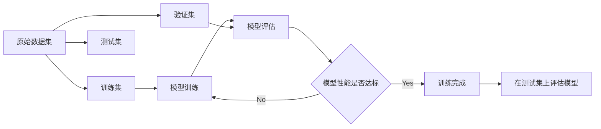

# 用Evaluation Dataset评估训练过程

关键词：机器学习、评估数据集、训练过程评估、模型性能度量

## 1. 背景介绍
### 1.1 问题的由来
随着机器学习和深度学习技术的快速发展,越来越多的模型被应用到各个领域。然而,训练出一个高质量的模型并非易事。在模型训练的过程中,我们需要持续地评估模型的性能,以便及时发现问题并进行改进。而Evaluation Dataset就是用于评估模型训练过程的重要工具。

### 1.2 研究现状
目前,大多数机器学习项目都会使用Evaluation Dataset来评估模型的性能。一些常见的做法包括:

- 将原始数据集划分为训练集、验证集和测试集,其中验证集就是Evaluation Dataset
- 使用交叉验证的方法,将数据集划分为多个部分,轮流将其中一部分作为Evaluation Dataset
- 使用单独的Evaluation Dataset,该数据集不参与模型的训练,只用于评估

不同的项目和任务,对Evaluation Dataset的要求也有所不同。但总的来说,Evaluation Dataset需要具备以下特点:

- 与训练数据集有着相似的数据分布
- 数据量要足够大,以保证评估结果的可靠性 
- 数据要有足够的多样性,覆盖各种可能的情况

### 1.3 研究意义
使用Evaluation Dataset评估模型训练过程,对于提升模型性能、加速开发进度都有重要意义:

- 帮助我们及时发现模型的不足之处,避免过拟合、欠拟合等问题
- 为超参数调优、模型结构改进等提供依据
- 减少人工检查模型和调试代码的成本,提高开发效率
- 为模型上线提供性能保障,降低风险

### 1.4 本文结构
本文将重点介绍Evaluation Dataset在评估模型训练过程中的应用。内容安排如下:

- 第2部分介绍Evaluation Dataset的核心概念
- 第3部分介绍使用Evaluation Dataset评估模型性能的主要步骤和常用算法
- 第4部分通过数学模型和案例分析,讲解Evaluation Dataset的工作原理
- 第5部分给出基于Keras和PyTorch的代码实例,展示如何构建Evaluation Dataset并评估模型
- 第6部分总结Evaluation Dataset在实际项目中的应用情况
- 第7部分推荐相关的学习资源和开发工具
- 第8部分讨论Evaluation Dataset技术的未来发展趋势与挑战
- 第9部分的附录,解答一些常见问题

## 2. 核心概念与联系

在机器学习中,数据集通常被划分为3个不同的子集:

- Training Set(训练集):用于训练模型,使模型学习数据的特征
- Validation Set(验证集):在训练过程中,用于评估模型的性能,为调参提供依据。验证集也称为Evaluation Dataset,是本文的重点
- Test Set(测试集):在训练完成后,用于评估模型的最终性能

训练集和验证集会参与到模型的训练过程中,而测试集则是在训练完成后才使用。它们之间的关系如下图所示:



可以看到,验证集在整个训练过程中起到了重要的评估和反馈作用,帮助我们不断优化和改进模型。

## 3. 核心算法原理 & 具体操作步骤
### 3.1 算法原理概述
使用Evaluation Dataset评估模型性能的基本原理很简单:将当前的模型应用于验证集,计算模型的预测结果与真实标签之间的差异,从而得出模型的性能指标。

常见的性能指标包括:
- 准确率(Accuracy):预测正确的样本数/总样本数
- 精确率(Precision):预测为正例且真实为正例的样本数/预测为正例的样本数
- 召回率(Recall):预测为正例且真实为正例的样本数/真实为正例的样本数
- F1分数(F1-Score):精确率和召回率的调和平均数
- 均方误差(MSE):预测值与真实值差值的平方和的均值
- 平均绝对误差(MAE):预测值与真实值差值的绝对值的均值

不同的任务和场景,需要选取不同的性能指标。比如对于分类任务,一般使用准确率、精确率、召回率等;而对于回归任务,则使用均方误差、平均绝对误差等。

### 3.2 算法步骤详解
使用Evaluation Dataset评估模型性能的一般步骤如下:

1. 准备Evaluation Dataset。从原始数据集中划分出一部分样本作为验证集,通常占10%~30%。验证集不能参与模型训练。
2. 开始训练模型。每经过一定的训练轮数(如每个epoch结束),就在验证集上评估当前模型的性能。 
3. 记录模型在验证集上的各项性能指标,绘制成曲线图,展示性能变化的趋势。
4. 根据性能曲线分析当前模型是否过拟合或欠拟合,是否需要调整超参数。
5. 如果性能还不够理想,则继续训练,重复步骤2~4;如果性能已经满足要求或者过拟合,则停止训练。
6. 在测试集上评估最终模型的性能,作为模型质量的客观衡量标准。

以上就是使用Evaluation Dataset评估模型性能的基本流程。在实践中,还需要根据具体情况进行适当调整。

### 3.3 算法优缺点
使用Evaluation Dataset评估模型性能是一种简单有效的方法,主要优点包括:

- 可以客观衡量模型的泛化能力,减少过拟合风险
- 为超参数调优提供量化指标,加速开发进度
- 适用于绝大部分机器学习任务和算法

但同时也存在一些局限性:

- 数据集划分方式的选择会影响评估结果的准确性
- 对数据量要求较高,数据不足时评估结果可能不够稳定
- 只能评估模型的性能,无法解释模型的内部机制

因此在实践中,除了使用Evaluation Dataset,还需要从其他角度对模型进行分析和评估,以全面了解模型的特点。

### 3.4 算法应用领域
Evaluation Dataset作为一种通用的模型评估方法,在各个机器学习应用领域都有广泛使用,比如:

- 计算机视觉:图像分类、目标检测、语义分割等
- 自然语言处理:文本分类、命名实体识别、机器翻译等
- 语音识别:声学模型训练、语言模型训练等
- 推荐系统:评分预测、排序学习等

不同领域的模型架构、数据特点、评估指标等都有所不同,需要根据具体情况选择合适的Evaluation Dataset划分方式和评估指标。

## 4. 数学模型和公式 & 详细讲解 & 举例说明
### 4.1 数学模型构建
为了定量分析Evaluation Dataset的作用,我们可以建立简单的数学模型。假设:

- 训练集样本数为$n$,验证集样本数为$m$
- 模型在训练集上的损失函数为$L_{\text{train}}$,在验证集上的损失函数为$L_{\text{val}}$
- 模型参数为$\theta$,学习率为$\eta$,训练轮数为$T$

则模型的训练过程可以表示为:

$$
\theta^{(t+1)} = \theta^{(t)} - \eta \nabla_{\theta} L_{\text{train}}(\theta^{(t)}), \quad t=1,2,...,T
$$

其中$\nabla_{\theta} L_{\text{train}}$表示损失函数对参数$\theta$的梯度。

在每个训练轮结束后,我们在验证集上评估模型的性能:

$$
L_{\text{val}}^{(t)} = \frac{1}{m} \sum_{i=1}^{m} \ell(f_{\theta^{(t)}}(x_i), y_i)
$$

其中$\ell$表示样本级别的损失函数,$f_{\theta}$表示参数为$\theta$的模型。

通过跟踪$L_{\text{val}}^{(t)}$随训练轮数$t$的变化,我们可以判断模型的训练状态:

- 如果$L_{\text{val}}^{(t)}$持续下降,说明模型仍在学习数据的一般特征,应该继续训练
- 如果$L_{\text{val}}^{(t)}$开始上升,说明模型已经过拟合训练数据,应该停止训练或者增大正则化强度
- 如果$L_{\text{val}}^{(t)}$长期保持不变,说明模型已经收敛,继续训练的意义不大

### 4.2 公式推导过程
上面的数学模型中,最关键的公式是验证集损失$L_{\text{val}}^{(t)}$的计算公式:

$$
L_{\text{val}}^{(t)} = \frac{1}{m} \sum_{i=1}^{m} \ell(f_{\theta^{(t)}}(x_i), y_i)
$$

这个公式的推导过程如下:

1. 假设验证集为$\{(x_1,y_1), (x_2,y_2),...,(x_m,y_m)\}$,其中$x_i$为输入特征,$y_i$为标签或目标值。
2. 对于每个样本$(x_i,y_i)$,用当前模型$f_{\theta^{(t)}}$预测其输出$\hat{y}_i=f_{\theta^{(t)}}(x_i)$。
3. 用样本级别的损失函数$\ell$衡量预测值$\hat{y}_i$与真实值$y_i$的差异,得到样本损失$\ell_i=\ell(\hat{y}_i,y_i)$。常见的样本损失函数有均方误差、交叉熵损失等。
4. 对所有样本的损失求平均,得到验证集的平均损失:

$$
L_{\text{val}}^{(t)} = \frac{1}{m} \sum_{i=1}^{m} \ell_i = \frac{1}{m} \sum_{i=1}^{m} \ell(f_{\theta^{(t)}}(x_i), y_i)
$$

这个平均损失反映了当前模型在验证集上的整体性能,是评估模型泛化能力的重要指标。

需要注意的是,不同的机器学习任务和模型,具体的损失函数形式会有所不同,但基本的推导思路是一致的。

### 4.3 案例分析与讲解
下面我们以一个简单的二分类任务为例,演示如何使用Evaluation Dataset评估模型性能。

假设我们要训练一个模型,根据用户的个人信息预测其是否会购买某个产品。我们有1000个用户的数据,其中800个作为训练集,200个作为验证集。

我们选择逻辑回归模型,用交叉熵损失函数作为样本损失:

$$
\ell(\hat{y}, y) = -[y\log(\hat{y}) + (1-y)\log(1-\hat{y})]
$$

其中$y\in\{0,1\}$表示真实标签,$\hat{y}\in(0,1)$表示模型预测的购买概率。

在训练过程中,我们每隔100个样本评估一次模型在验证集上的损失。得到如下结果:

| 训练样本数 | 验证集损失 |
|------------|------------|
| 100        | 0.693      |
| 200        | 0.684      |
| 300        | 0.632      |
| 400        | 0.574      |
| 500        | 0.521      |
| 600        | 0.488      |
| 700        | 0.463      |
| 800        | 0.455      |

可以看到,随着训练的进行,验证集损失不断下降,说明模型的性能在不断提升。我们可以绘制验证集损失曲线,直观地展示这一趋势:

```python
import matplotlib.pyplot as plt

train_samples = [100, 200, 300, 400, 500, 600, 700, 800]
val_losses = [0.693, 0.684, 0.632, 0.574, 0.521, 0.488, 0.463, 0.455]

plt.plot(train_samples, val_losses)
plt.xlabel('Number of training samples')
plt.ylabel('Validation loss')
plt.