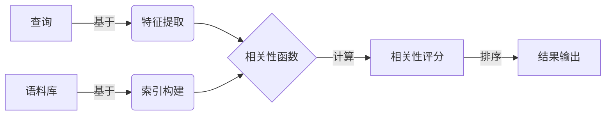
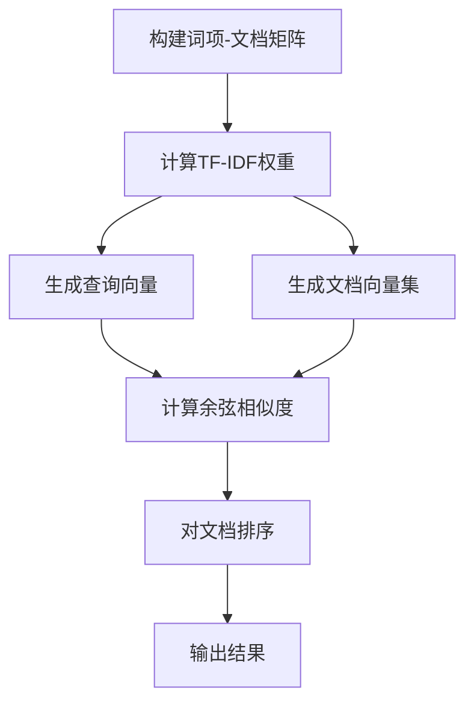
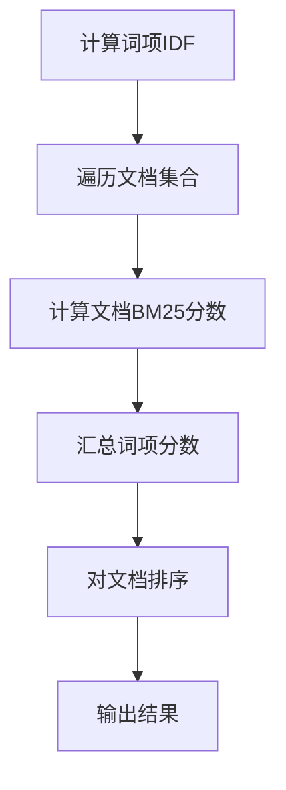
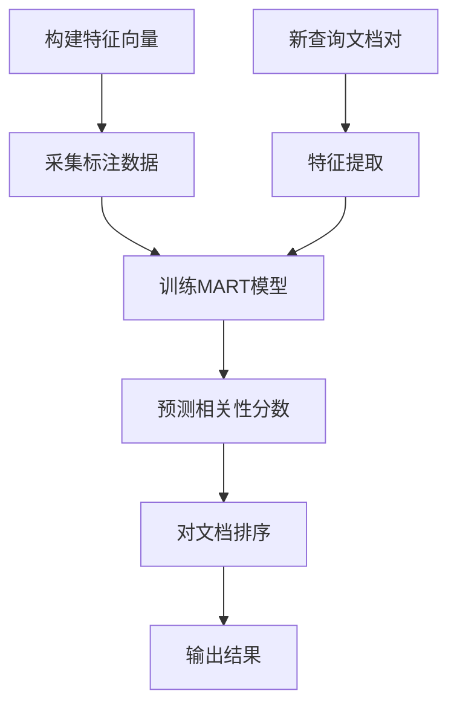

以下是关于《相关性评分 原理与代码实例讲解》的技术博客文章正文内容：

# 相关性评分 原理与代码实例讲解

## 1. 背景介绍

### 1.1 问题的由来

在现代信息时代，海量的数据和信息资源已经成为常态。无论是在网络搜索、电子商务平台、社交媒体还是其他各种应用场景中，我们都需要从大量的数据中快速找到与用户需求最相关的内容。这就引出了相关性评分的重要性。

相关性评分旨在量化待检索对象与查询之间的相关程度,为用户提供最匹配的结果。传统的布尔检索模型虽然可以满足一些基本需求,但往往无法很好地对结果进行排序,也难以处理语义相似但词汇不同的查询需求。

### 1.2 研究现状

相关性评分是信息检索领域的核心问题之一,目前已有多种经典模型和算法,如向量空间模型(VSM)、概率模型(BM25)、语言模型等。近年来,随着深度学习技术的发展,基于神经网络的相关性模型也取得了长足进步,显著提高了查全率和查准率。

### 1.3 研究意义

有效的相关性评分对于提升用户体验至关重要。合理、精准的排序可以让用户快速获取所需信息,提高工作效率;同时也有助于挖掘数据价值,为个性化推荐等场景提供支持。因此,相关性评分一直是信息检索领域的重点研究课题。

### 1.4 本文结构  

本文将全面介绍相关性评分的核心原理、算法细节、数学模型以及实际应用。内容包括:

- 相关性评分的核心概念
- 经典算法原理及实现步骤  
- 数学模型构建和公式推导
- 基于深度学习的新模型
- 实际应用案例和代码示例
- 未来发展趋势和挑战分析

## 2. 核心概念与联系

相关性评分的核心概念主要包括:

1. **相关性(Relevance)**: 描述查询与文档之间的关联程度。
2. **查全率(Recall)**: 能够检索到的相关文档占所有相关文档的比例。
3. **查准率(Precision)**: 检索到的文档中相关文档的比例。 
4. **语料库(Corpus)**: 待检索的文档集合。
5. **索引(Index)**: 用于快速查找文档的数据结构,如倒排索引。
6. **特征(Feature)**: 用于量化查询与文档相关性的属性,如词频、位置等。

这些概念相互关联、环环相扣。我们需要从语料库中检索出与查询相关的文档,并对结果进行排序,使相关性最高的文档排在前面。这就需要构建合理的相关性函数,并基于特征对查询与文档进行量化,最终得到相关性评分。

## 3. 核心算法原理 & 具体操作步骤

### 3.1 算法原理概述

相关性评分算法的目标是为查询与文档对之间的相关程度赋予一个数值分数。根据算法的不同原理,可以分为以下几种主要类型:

1. **向量空间模型(VSM)**: 将查询和文档表示为向量,相关性由向量夹角的余弦值决定。
2. **概率模型**: 如BM25,根据文档中的词频计算查询生成该文档的概率作为相关性分数。
3. **语言模型**: 基于文档生成查询的概率估计相关性,常与平滑技术相结合。
4. **学习排序模型**: 将相关性评分视为学习的排序问题,利用机器学习算法构建模型。
5. **神经网络模型**: 基于深度学习技术自动提取语义特征,端到端建模相关性。

下面将重点介绍几种经典算法的原理和实现细节。

### 3.2 算法步骤详解

#### 3.2.1 向量空间模型(VSM)

VSM算法将查询和文档表示为向量,向量中每个元素对应一个词项的权重,通常使用TF-IDF作为权重计算公式:

$$w_{i,j}=tf_{i,j} \times \log{\frac{N}{n_i}}$$

其中$tf_{i,j}$表示词项$t_i$在文档$d_j$中出现的频率,$N$为语料库文档总数,$n_i$为包含$t_i$的文档数量。

查询向量$\vec{q}$和文档向量$\vec{d}$的相关性分数由它们的余弦相似度计算得到:

$$\text{Score}(\vec{q},\vec{d})=\cos(\vec{q},\vec{d})=\frac{\vec{q}\cdot\vec{d}}{|\vec{q}||\vec{d}|}$$

VSM算法步骤:

1. 构建词项-文档矩阵,矩阵元素为TF-IDF权重
2. 查询向量与文档向量求余弦相似度作为相关性分数
3. 对文档集合按分数降序排列输出结果

#### 3.2.2 BM25算法

BM25是一种概率模型,其核心思想是计算查询生成文档的概率,作为相关性分数:

$$\text{Score}(D,Q)=\sum_{i=1}^{n}{\text{IDF}(q_i)}\cdot\frac{f(q_i,D)\cdot(k_1+1)}{f(q_i,D)+k_1\cdot\left(1-b+b\cdot\frac{|D|}{avgdl}\right)}$$

其中:

- $q_i$是查询$Q$中的词项
- $f(q_i,D)$是$q_i$在文档$D$中出现的词频
- $|D|$是文档$D$的长度
- $avgdl$是语料库中平均文档长度
- $k_1$和$b$是调节因子,用于控制词频和文档长度的影响

BM25算法步骤:

1. 计算每个词项的IDF值
2. 对每个文档,计算查询中词项的BM25分数之和作为相关性分数
3. 对文档集合按分数降序排列输出结果  

#### 3.2.3 学习排序模型

学习排序模型将相关性评分问题转化为机器学习的排序问题。它通过构建特征向量,利用人工标注的相关性数据训练模型,自动学习特征与相关性之间的映射关系。

常用的学习算法包括LambdaMART、RankNet、ListNet等。以LambdaMART为例,它基于MART(Multiple Additive Regression Trees)算法,使用梯度提升决策树进行学习。

LambdaMART算法步骤:

1. 构建特征向量,包括统计特征(如TF-IDF)、语义特征等
2. 采集标注数据,人工标定查询-文档对的相关性分数
3. 使用MART算法训练梯度提升决策树模型
4. 对新的查询-文档对,使用训练好的模型预测相关性分数
5. 对文档集合按分数降序排列输出结果

### 3.3 算法优缺点

不同算法有着各自的优缺点:

- VSM简单直观,但无法处理语义信息
- BM25有较好的查全率表现,但查准率一般  
- 学习排序模型可自动挖掘特征,但需要大量标注数据
- 神经网络模型具有强大的表示能力,但可解释性较差

在实际应用中,往往需要根据具体场景和需求,选择合适的算法或者对算法进行融合和优化。

### 3.4 算法应用领域

相关性评分算法在诸多领域有着广泛的应用:

- 网络搜索引擎
- 电商产品搜索与推荐
- 论文检索系统
- 知识图谱问答系统
- 社交媒体内容优化
- 垃圾邮件过滤
- ...

## 4. 数学模型和公式 & 详细讲解 & 举例说明

### 4.1 数学模型构建

相关性评分的数学模型通常建立在概率论和线性代数的基础之上。我们以概率模型为例,阐述其数学基础。

假设有一个查询$Q$和一个文档集合$C$,我们希望找到与$Q$最相关的文档$D\in C$。根据概率论,我们可以计算$P(Q|D)$,即给定文档$D$时,查询$Q$出现的概率。这个条件概率越大,说明$D$越可能是$Q$的相关文档。

然而,直接计算$P(Q|D)$并不容易。我们可以根据贝叶斯公式对其进行转化:

$$P(Q|D)=\frac{P(D|Q)P(Q)}{P(D)}$$

由于分母$P(D)$对所有文档是相同的,因此可以忽略不计。我们的目标变为最大化$P(D|Q)P(Q)$。

进一步,如果查询$Q$由多个词项$q_1,q_2,...,q_n$组成,根据链式法则可得:

$$P(D|Q)P(Q)=P(D|q_1,q_2,...,q_n)P(q_1,q_2,...,q_n)$$

这就将问题转化为如何估计文档生成查询词项序列的概率。我们可以引入不同的假设和平滑技术对其进行建模和计算。

### 4.2 公式推导过程

在4.1节中,我们将相关性评分问题转化为估计$P(D|q_1,q_2,...,q_n)P(q_1,q_2,...,q_n)$。下面我们对这个公式进行具体推导。

首先,我们可以假设查询词项是相互独立的,即:

$$P(q_1,q_2,...,q_n)=\prod_{i=1}^{n}P(q_i)$$

接着,对于$P(D|q_1,q_2,...,q_n)$,我们可以引入"词袋模型"的假设,即文档生成查询词项的概率只与词项频率有关,与位置和序列无关。于是:

$$P(D|q_1,q_2,...,q_n)=\prod_{i=1}^{n}P(q_i|D)$$

将上面两个等式代入原始公式,我们得到:

$$\begin{aligned}
P(D|Q)P(Q)&=\prod_{i=1}^{n}P(q_i|D)P(q_i)\\
&=\prod_{i=1}^{n}\frac{f(q_i,D)}{|D|}P(q_i)
\end{aligned}$$

其中$f(q_i,D)$表示词项$q_i$在文档$D$中出现的频率,$|D|$表示文档长度。$P(q_i)$可以通过最大似然估计得到。

为了避免概率值过小导致的数值下溢问题,我们可以取对数,得到:

$$\log P(D|Q)P(Q)=\sum_{i=1}^{n}\log\frac{f(q_i,D)}{|D|}+\log P(q_i)$$

这就是经典的查询似然语言模型,可作为相关性评分的基础模型。

### 4.3 案例分析与讲解

现在,我们来看一个具体的案例,分析语言模型在实际应用中的效果。

假设有一个关于"足球"主题的语料库,包含了大量的新闻报道和赛事介绍。用户输入查询"梅西进球"。我们将使用上一节推导的查询似然语言