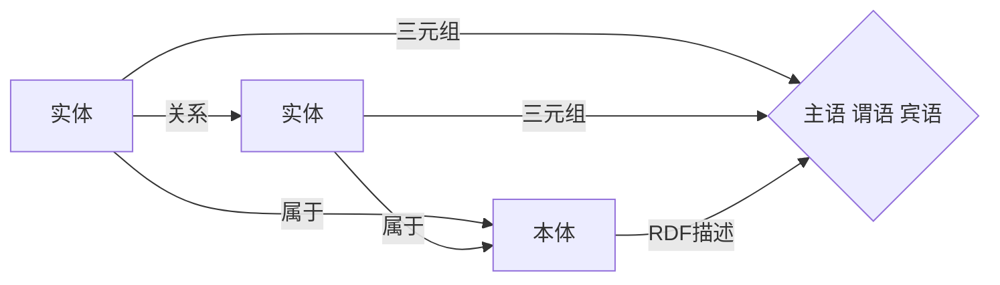

# 知识图谱(Knowledge Graph)原理与代码实战案例讲解

关键词：知识图谱、知识表示、本体论、图数据库、知识融合、实体链接、知识推理

## 1. 背景介绍

### 1.1  问题的由来

随着大数据时代的到来，海量的非结构化和半结构化数据不断涌现。如何有效地组织、管理和利用这些异构数据，成为了一个亟待解决的问题。知识图谱作为一种新兴的知识表示和存储技术，为解决这一问题提供了新的思路和方法。

### 1.2  研究现状

知识图谱的概念最早由Google公司在2012年提出，用于增强其搜索引擎的性能。此后，知识图谱迅速成为了学术界和工业界研究的热点。目前，知识图谱已经在智能搜索、问答系统、推荐系统等多个领域得到了广泛应用。

### 1.3  研究意义

知识图谱能够将大规模异构数据映射为结构化的、语义化的知识，使计算机能够像人一样理解和利用知识，从而极大地提升了人工智能系统的性能。深入研究知识图谱的原理和实现方法，对于推动人工智能的发展具有重要意义。

### 1.4  本文结构

本文将从以下几个方面对知识图谱进行深入探讨：首先介绍知识图谱的核心概念和相关技术；然后重点阐述知识图谱构建的核心算法原理和具体操作步骤；接着通过数学模型和代码实例进一步说明知识图谱的实现细节；最后总结知识图谱的发展趋势和面临的挑战。

## 2. 核心概念与联系

知识图谱涉及的核心概念包括：

- 实体(Entity)：现实世界中的具体事物，如人、地点、组织等。
- 关系(Relation)：实体之间的联系，表示实体如何相互作用。
- 本体(Ontology)：描述特定领域知识的概念体系和关系模型。
- 三元组(Triple)：由主语(Subject)、谓语(Predicate)、宾语(Object)组成，表示两个实体之间的一个事实。
- RDF(Resource Description Framework)：W3C发布的知识表示框架，用于描述实体及其关系。

这些概念之间的联系可以用下面的Mermaid图来表示：



## 3. 核心算法原理 & 具体操作步骤

### 3.1  算法原理概述

知识图谱构建的核心是从非结构化和半结构化数据中抽取结构化的知识。这一过程通常包括以下几个步骤：

1. 实体识别：从文本中识别出实体提及(entity mention)。
2. 实体消歧：确定实体提及指代的具体实体。
3. 关系抽取：从文本中抽取实体之间的关系。
4. 知识融合：将抽取出的知识整合到已有的知识库中。

### 3.2  算法步骤详解

1. 实体识别：常用的方法包括基于规则的方法和基于机器学习的方法。基于规则的方法利用人工定义的模式来识别实体，而基于机器学习的方法则通过训练序列标注模型(如CRF、LSTM等)来自动识别实体。

2. 实体消歧：需要根据实体提及的上下文信息来判断其指代的具体实体。主要方法有基于图的协同推断算法和基于向量表示的相似度计算方法。

3. 关系抽取：一般采用基于模式匹配的方法，即从句子中识别出特定的语法结构，如"实体1+关系+实体2"。还可以使用基于深度学习的方法，将关系抽取看作一个分类问题。

4. 知识融合：需要解决实体对齐(entity alignment)和知识去重(knowledge deduplication)的问题。常用的方法包括基于相似度的聚类算法和基于规则的推理方法。

### 3.3  算法优缺点

上述算法各有优缺点：

- 基于规则的方法可解释性强，但泛化能力差，需要大量人工工作。
- 基于机器学习的方法可以自动学习特征，但需要大量标注数据，且解释性差。
- 基于图的推理方法可以利用丰富的结构信息，但计算复杂度高。
- 基于向量的表示学习方法可以刻画语义相似性，但难以建模复杂关系。

### 3.4  算法应用领域

知识图谱构建算法已经在多个领域得到应用，如：

- 智能搜索：使搜索引擎可以理解用户意图，提供更精准的搜索结果。
- 智能问答：根据知识图谱回答用户的自然语言问题。
- 个性化推荐：利用知识图谱挖掘用户兴趣，实现精准营销。
- 金融风控：基于知识图谱的关联分析，识别金融欺诈行为。

## 4. 数学模型和公式 & 详细讲解 & 举例说明

### 4.1  数学模型构建

知识图谱可以形式化地表示为一个有向多关系图$G=(E,R,S)$，其中：

- $E$是实体集合。
- $R$是关系集合。
- $S \subseteq E \times R \times E$是三元组集合，表示实体之间的关系事实。

每个实体$e \in E$可以用一个$d$维实值向量$\mathbf{e} \in \mathbb{R}^d$来表示，刻画实体的语义特征。

每个关系$r \in R$可以用一个$d \times d$维实值矩阵$\mathbf{M}_r \in \mathbb{R}^{d \times d}$来表示，刻画关系的语义特征。

给定一个三元组$(h,r,t) \in S$，其中$h,t \in E$是头实体和尾实体，$r \in R$是关系，我们可以定义一个评分函数$f_r(h,t)$来衡量这个三元组的合理性：

$$
f_r(h,t) = \mathbf{e}_h^\top \mathbf{M}_r \mathbf{e}_t
$$

直观地，$f_r(h,t)$表示在关系$r$下，头实体$h$和尾实体$t$的语义相关性。$f_r(h,t)$越大，则$(h,r,t)$越可能成立。

### 4.2  公式推导过程

知识图谱表示学习的目标是从已知的三元组集合$S$中学习实体和关系的语义表示$\{\mathbf{e}\}_{e \in E}$和$\{\mathbf{M}_r\}_{r \in R}$，使得合理的三元组得到高评分，不合理的三元组得到低评分。形式化地，我们可以定义如下的优化目标：

$$
\min_{\{\mathbf{e}\},\{\mathbf{M}_r\}} \sum_{(h,r,t) \in S} \ell \big(f_r(h,t)\big) + \lambda \cdot \mathrm{Reg}(\{\mathbf{e}\},\{\mathbf{M}_r\})
$$

其中$\ell(\cdot)$是损失函数，衡量模型预测值与真实值之间的差异，常用的有平方损失、铰链损失、交叉熵损失等。$\mathrm{Reg}(\cdot)$是正则化项，用于控制模型复杂度，避免过拟合，常用的有L1正则、L2正则等。$\lambda$是正则化系数，控制正则化的强度。

上述优化问题可以通过随机梯度下降(SGD)算法求解。具体地，在每次迭代中，我们随机采样一个小批量的三元组，然后根据梯度信息更新实体向量和关系矩阵：

$$
\begin{aligned}
\mathbf{e} &\leftarrow \mathbf{e} - \eta \cdot \frac{\partial \ell}{\partial \mathbf{e}} \\
\mathbf{M}_r &\leftarrow \mathbf{M}_r - \eta \cdot \frac{\partial \ell}{\partial \mathbf{M}_r}
\end{aligned}
$$

其中$\eta$是学习率，控制每次更新的步长。

### 4.3  案例分析与讲解

下面我们以一个简单的例子来说明知识图谱表示学习的过程。假设我们有以下三元组：

- (张三, 出生地, 北京)
- (李四, 出生地, 上海)
- (张三, 好友, 李四)

我们希望学习这些实体和关系的语义表示。为简单起见，我们令实体向量和关系矩阵的维度$d=2$，初始化所有向量和矩阵为随机值。然后，我们采用平方损失函数和L2正则化，优化目标为：

$$
\min_{\{\mathbf{e}\},\{\mathbf{M}_r\}} \sum_{(h,r,t) \in S} \big(1 - f_r(h,t)\big)^2 + \lambda \cdot \big(\|\mathbf{e}\|_2^2 + \|\mathbf{M}_r\|_F^2\big)
$$

通过SGD优化，我们得到实体向量和关系矩阵的优化值。可以发现，在关系"出生地"下，"张三"和"北京"的向量内积较大，"李四"和"上海"的向量内积较大，说明模型学到了这两个三元组的语义关系。同时，在关系"好友"下，"张三"和"李四"的向量内积也较大，说明模型学到了这两个实体之间的好友关系。

### 4.4  常见问题解答

**Q:** 知识图谱表示学习能否处理一对多、多对一、多对多关系？

**A:** 可以。一对多、多对一关系可以直接用三元组$(h,r,t)$表示，其中$h$或$t$可以是多个实体。多对多关系可以转化为多个三元组来表示，例如$(e_1,r,e_2), (e_1,r,e_3), (e_2,r,e_3)$。

**Q:** 知识图谱表示学习的结果如何用于下游任务？

**A:** 可以用知识图谱表示增强下游任务的特征。例如，在文本分类任务中，可以用实体和关系的语义表示作为额外的特征，融合到文档表示中；在推荐系统中，可以用实体和关系的相似度作为用户和物品的相似度度量。

## 5. 项目实践：代码实例和详细解释说明

### 5.1  开发环境搭建

首先，我们需要搭建知识图谱表示学习的开发环境。这里我们使用Python语言和PyTorch深度学习框架。

安装PyTorch：

```bash
pip install torch
```

### 5.2  源代码详细实现

下面是知识图谱表示学习的PyTorch实现代码：

```python
import torch
import torch.nn as nn
import torch.optim as optim

class KGEModel(nn.Module):
    def __init__(self, num_ent, num_rel, dim):
        super(KGEModel, self).__init__()
        self.num_ent = num_ent
        self.num_rel = num_rel
        self.dim = dim
        
        self.ent_embeddings = nn.Embedding(num_ent, dim)
        self.rel_matrices = nn.Embedding(num_rel, dim * dim)
        
    def forward(self, triples):
        h, r, t = triples[:, 0], triples[:, 1], triples[:, 2]
        h_emb = self.ent_embeddings(h)
        t_emb = self.ent_embeddings(t)
        r_mat = self.rel_matrices(r).view(-1, self.dim, self.dim)
        
        score = torch.sum(h_emb * torch.matmul(r_mat, t_emb.unsqueeze(-1)).squeeze(-1), dim=-1)
        return score
    
def train(model, triples, num_epochs, batch_size, lr, reg_lambda):
    optimizer = optim.SGD(model.parameters(), lr=lr)
    
    for epoch in range(num_epochs):
        permutation = torch.randperm(len(triples))
        triples = triples[permutation]
        
        for i in range(0, len(triples), batch_size):
            batch = triples[i:i+batch_size]
            scores = model(batch)
            
            loss = torch.sum(torch.pow(1 - scores, 2))
            reg_loss = reg_lambda * (torch.norm(model.ent_embeddings.weight, p=2) + 
                                     torch.norm(model.rel_