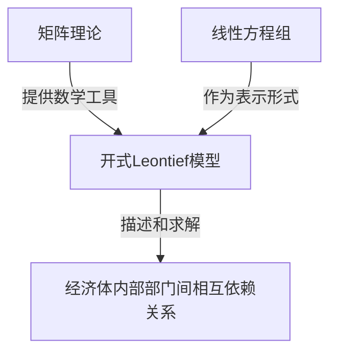

# 矩阵理论与应用：引言与开式Leontief模型

## 1. 背景介绍

### 1.1 问题的由来

在现代社会中,各个行业和领域都存在着复杂的相互依赖关系。每个行业的产出不仅需要满足最终消费需求,还需要作为其他行业的投入,形成一个错综复杂的经济网络。如何准确描述和分析这种相互依赖关系,对于制定合理的经济政策、优化资源配置等具有重要意义。

### 1.2 研究现状

矩阵理论作为一种强大的数学工具,在描述和分析复杂系统中发挥着关键作用。20世纪30年代,美国经济学家瓦西里·莱昂惕夫(Wassily Leontief)提出了著名的投入产出模型,利用矩阵代数来描述经济体内部各个部门之间的相互依赖关系,为经济分析提供了新的视角和方法。

### 1.3 研究意义

投入产出模型不仅在经济学领域具有重要应用,同时也为其他领域的系统分析提供了借鉴。通过对矩阵理论和开式Leontief模型的深入研究,我们可以更好地理解和分析复杂系统的内部结构和动态演化过程,为解决实际问题提供有力的理论支持和分析工具。

### 1.4 本文结构

本文将从矩阵理论的基础概念出发,介绍开式Leontief模型的理论基础、数学表达式及其求解方法。同时,我们将探讨该模型在实际应用中的案例,分析其优缺点,并展望未来的发展方向和挑战。

## 2. 核心概念与联系

矩阵理论和开式Leontief模型的核心概念包括:

1. **矩阵**:矩阵是一种用于表示和操作多元数据的数学工具,它由有限个元素按照矩形阵列排列而成。矩阵的基本运算包括加法、数乘、矩阵乘法等。

2. **线性方程组**:线性方程组是一组包含未知数的线性方程的集合,可以用矩阵的形式表示和求解。

3. **投入产出模型**:投入产出模型描述了一个经济体内部各个部门之间的相互依赖关系,即一个部门的产出不仅需要满足最终消费需求,还需要作为其他部门的投入。

4. **开式Leontief模型**:开式Leontief模型是投入产出模型的一种特殊形式,它假设每个部门的总产出等于中间需求和最终需求的总和。该模型利用矩阵代数来描述和求解部门间的相互依赖关系。

这些概念之间存在紧密的联系:开式Leontief模型利用矩阵代数的理论和方法,将经济体内部各个部门之间的相互依赖关系表示为线性方程组,从而可以通过求解矩阵方程来获得各个部门的产出水平。

## 3. 核心算法原理 & 具体操作步骤

### 3.1 算法原理概述

开式Leontief模型的核心算法原理是利用矩阵代数来描述和求解经济体内部各个部门之间的相互依赖关系。具体来说,该模型将每个部门的总产出分为两部分:中间需求和最终需求。中间需求指该部门的产出被其他部门作为投入所需要的部分,而最终需求则指该部门的产出被用于最终消费的部分。

通过构建适当的矩阵,我们可以将各个部门之间的相互依赖关系表示为线性方程组,并利用矩阵运算求解该方程组,从而获得各个部门的产出水平。

### 3.2 算法步骤详解

开式Leontief模型的算法步骤可以概括为以下几个部分:

1. **构建投入系数矩阵**

   投入系数矩阵$A$描述了每个��门的产出在其他部门中作为投入所占的比例。矩阵元素$a_{ij}$表示第$i$个部门的产出在第$j$个部门中作为投入所占的比例。

   $$A = \begin{bmatrix}
   a_{11} & a_{12} & \cdots & a_{1n} \\
   a_{21} & a_{22} & \cdots & a_{2n} \\
   \vdots & \vdots & \ddots & \vdots \\
   a_{n1} & a_{n2} & \cdots & a_{nn}
   \end{bmatrix}$$

2. **构建最终需求向量**

   最终需求向量$f$表示每个部门的产出中用于最终消费的部分。

   $$f = \begin{bmatrix}
   f_1 \\
   f_2 \\
   \vdots \\
   f_n
   \end{bmatrix}$$

3. **建立开式Leontief模型方程**

   根据每个部门的总产出等于中间需求和最终需求的总和,我们可以建立如下矩阵方程:

   $$x = Ax + f$$

   其中,$x$表示各个部门的总产出向量。

4. **求解总产出向量**

   对上式两边同时做减法运算,我们可以得到:

   $$(I - A)x = f$$

   其中,$I$为单位矩阵。如果$(I - A)$可逆,则我们可以解出总产出向量$x$:

   $$x = (I - A)^{-1}f$$

通过上述步骤,我们可以利用矩阵运算求解开式Leontief模型,获得各个部门的总产出水平。

### 3.3 算法优缺点

**优点:**

1. 数学模型严谨,利用矩阵代数的理论和方法,能够准确描述和分析经济体内部各个部门之间的相互依赖关系。

2. 计算过程简单,只需要进行矩阵运算,可以快速获得各个部门的产出水平。

3. 模型具有很强的扩展性,可以根据实际情况调整投入系数矩阵和最终需求向量,用于分析不同场景下的经济状况。

**缺点:**

1. 模型假设各个部门之间的投入系数是固定不变的,这在实际情况中可能不太合理。

2. 模型只考虑了部门之间的直接依赖关系,忽略了间接依赖关系的影响。

3. 模型假设生产函数是线性的,无法反映实际生产过程中可能存在的非线性关系。

4. 模型只考虑了产品的流动,没有涉及资金和其他要素的流动。

### 3.4 算法应用领域

开式Leontief模型及其扩展形式广泛应用于以下领域:

1. **经济分析**:用于分析国民经济各个部门之间的相互依赖关系,预测各个部门的产出水平,为制定经济政策提供依据。

2. **环境影响评估**:通过引入环境因素,可以分析各个部门的生产活动对环境的影响,为制定环保政策提供参考。

3. **能源规划**:将能源部门纳入模型中,可以分析各个部门对能源的需求,为能源规划和资源配置提供决策支持。

4. **区域经济分析**:将模型应用于特定区域,可以分析该区域内各个部门之间的相互依赖关系,为区域经济发展提供参考。

5. **供应链管理**:将供应链中的各个环节视为不同的部门,可以分析它们之间的相互依赖关系,优化供应链流程。

## 4. 数学模型和公式 & 详细讲解 & 举例说明

### 4.1 数学模型构建

开式Leontief模型的数学模型可以表示为:

$$x = Ax + f$$

其中:

- $x$是$n$维向量,表示各个部门的总产出水平;
- $A$是$n \times n$阶矩阵,称为投入系数矩阵,其元素$a_{ij}$表示第$i$个部门的产出在第$j$个部门中作为投入所占的比例;
- $f$是$n$维向量,表示各个部门的最终需求水平。

该模型的基本假设是:每个部门的总产出等于中间需求和最终需求的总和。中间需求指该部门的产出被其他部门作为投入所需要的部分,最终需求则指该部门的产出被用于最终消费的部分。

为了求解该模型,我们可以对上式两边同时做减法运算:

$$(I - A)x = f$$

其中,$I$为$n$阶单位矩阵。如果$(I - A)$可逆,则我们可以解出总产出向量$x$:

$$x = (I - A)^{-1}f$$

这就是开式Leontief模型的核心公式,通过它我们可以计算出各个部门的总产出水平。

### 4.2 公式推导过程

为了更好地理解开式Leontief模型的数学原理,我们来推导一下上述公式的过程。

首先,我们将模型方程$x = Ax + f$进行矩阵展开:

$$\begin{bmatrix}
x_1 \\
x_2 \\
\vdots \\
x_n
\end{bmatrix} = \begin{bmatrix}
a_{11} & a_{12} & \cdots & a_{1n} \\
a_{21} & a_{22} & \cdots & a_{2n} \\
\vdots & \vdots & \ddots & \vdots \\
a_{n1} & a_{n2} & \cdots & a_{nn}
\end{bmatrix} \begin{bmatrix}
x_1 \\
x_2 \\
\vdots \\
x_n
\end{bmatrix} + \begin{bmatrix}
f_1 \\
f_2 \\
\vdots \\
f_n
\end{bmatrix}$$

对于第$i$个方程,我们有:

$$x_i = a_{i1}x_1 + a_{i2}x_2 + \cdots + a_{in}x_n + f_i$$

将所有方程组合在一起,我们可以得到:

$$\begin{bmatrix}
x_1 \\
x_2 \\
\vdots \\
x_n
\end{bmatrix} - \begin{bmatrix}
a_{11} & a_{12} & \cdots & a_{1n} \\
a_{21} & a_{22} & \cdots & a_{2n} \\
\vdots & \vdots & \ddots & \vdots \\
a_{n1} & a_{n2} & \cdots & a_{nn}
\end{bmatrix} \begin{bmatrix}
x_1 \\
x_2 \\
\vdots \\
x_n
\end{bmatrix} = \begin{bmatrix}
f_1 \\
f_2 \\
\vdots \\
f_n
\end{bmatrix}$$

利用矩阵表示,上式可以写成:

$$(I - A)x = f$$

其中,$I$为$n$阶单位矩阵。

如果$(I - A)$可逆,我们就可以在两边同时乘以$(I - A)^{-1}$,从而得到:

$$x = (I - A)^{-1}f$$

这就是开式Leontief模型的核心公式。通过该公式,我们可以计算出各个部门的总产出水平$x$,只需要知道投入系数矩阵$A$和最终需求向量$f$的值。

### 4.3 案例分析与讲解

为了更好地理解开式Leontief模型的应用,我们来分析一个简单的案例。

假设一个经济体由三个部门组成:农业部门、制造业部门和服务业部门。我们已知各个部门的投入系数矩阵和最终需求向量如下:

$$A = \begin{bmatrix}
0.2 & 0.3 & 0.1 \\
0.4 & 0.1 & 0.2 \\
0.1 & 0.2 & 0.4
\end{bmatrix}, \quad f = \begin{bmatrix}
500 \\
800 \\
700
\end{bmatrix}$$

我们的目标是计算出各个部门的总产出水平。

根据开式Leontief模型的公式,我们首先需要计算$(I - A)$的逆矩阵:

$$I - A = \begin{bmatrix}
0.8 & -0.3 & -0.1 \\
-0.4 & 0.9 & -0.2 \\
-0.1 & -0.2 & 0