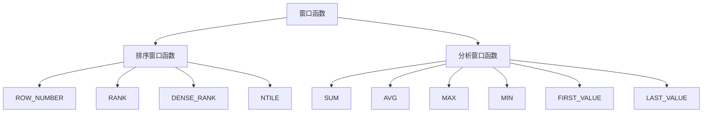

以下是题为《窗口函数 原理与代码实例讲解》的技术博客文章正文内容：

# 窗口函数 原理与代码实例讲解

## 1. 背景介绍

### 1.1 问题的由来

在数据处理和分析领域,我们经常会遇到需要对数据进行分组、排序和聚合计算的场景。传统的SQL聚合函数(如SUM、AVG、COUNT等)对整个结果集进行计算,但有时我们需要对分组内的部分行进行计算,这种需求无法使用传统聚合函数满足。窗口函数(Window Function)应运而生,它提供了一种在单个查询中对分区数据进行计算的强大方法。

### 1.2 研究现状

窗口函数最早出现在SQL:2003标准中,最初只有RANK、DENSE_RANK、ROW_NUMBER和NTILE四个函数。随后在SQL:2011标准中,窗口函数得到了进一步扩展,新增了LEAD、LAG、FIRST_VALUE、LAST_VALUE和NTH_VALUE等函数。主流数据库如Oracle、SQL Server、PostgreSQL和MySQL等都支持窗口函数,并根据自身特点对其进行了扩展和优化。

### 1.3 研究意义  

窗口函数为数据处理和分析提供了极大的便利,能够简化复杂的查询逻辑,提高查询效率。它在很多领域都有广泛应用,如金融分析、统计分析、商业智能等。掌握窗口函数的原理和使用方法,对于数据分析师、数据工程师和数据科学家等角色来说是非常重要的。

### 1.4 本文结构

本文将全面介绍窗口函数的核心概念、原理和使用方法。首先阐述窗口函数的基本概念和分类,然后重点讲解排序窗口函数和分析窗口函数的原理和用法,并配以大量实例代码进行说明。接下来探讨窗口函数在实际应用中的场景,并给出相关的工具和学习资源推荐。最后总结窗口函数的发展趋势和面临的挑战。

## 2. 核心概念与联系

窗口函数(Window Function)是SQL中的一种特殊函数,它对查询结果集中的每个行进行计算,计算时会考虑当前行所在的上下文(即窗口)。根据窗口的定义方式不同,窗口函数可分为两大类:

1. **排序窗口函数(Ranking Window Functions)**: 根据指定的排序条件,为每个记录分配一个唯一或连续的排名值。常见的有ROW_NUMBER()、RANK()、DENSE_RANK()、NTILE()等。

2. **分析窗口函数(Analytic Window Functions)**: 基于窗口内的数据集进行计算,如求和、平均值、极值等。常见的有SUM()、AVG()、MAX()、MIN()、FIRST_VALUE()、LAST_VALUE()等。

排序窗口函数和分析窗口函数虽然功能不同,但都需要定义三个核心概念:

1. **分区(PARTITION BY)**: 指定如何对数据进行分区或分组。

2. **排序(ORDER BY)**: 指定窗口内数据的排序方式。

3. **窗口框架(ROWS/RANGE)**: 指定窗口的范围,即包含哪些行参与计算。

通过这三个概念的组合,窗口函数可以实现非常灵活和强大的数据处理功能。下面将分别介绍排序窗口函数和分析窗口函数的原理和用法。



## 3. 核心算法原理 & 具体操作步骤  

### 3.1 算法原理概述

窗口函数的核心算法原理可以概括为三个步骤:

1. **分区(PARTITION BY)**: 根据指定的分区条件,将数据划分为多个分区。

2. **排序(ORDER BY)**: 在每个分区内,根据指定的排序条件对数据进行排序。

3. **计算(窗口函数)**: 对每个分区内的排序数据应用窗口函数进行计算,计算时考虑窗口框架(ROWS/RANGE)定义的范围。

不同的窗口函数在第三步的计算逻辑上有所区别,排序窗口函数是根据排名值进行赋值,而分析窗口函数则是对窗口内的数据进行聚合运算。

### 3.2 算法步骤详解

以下以一个员工工资数据示例,详细说明窗口函数的算法步骤:

```sql
SELECT 
    employee_id,
    department, 
    salary,
    ROW_NUMBER() OVER (PARTITION BY department ORDER BY salary DESC) AS rn,
    RANK() OVER (PARTITION BY department ORDER BY salary DESC) AS rnk,
    DENSE_RANK() OVER (PARTITION BY department ORDER BY salary DESC) AS dense_rnk,
    NTILE(4) OVER (PARTITION BY department ORDER BY salary DESC) AS quartile,
    SUM(salary) OVER (PARTITION BY department ORDER BY salary DESC 
                      ROWS BETWEEN UNBOUNDED PRECEDING AND CURRENT ROW) AS running_total
FROM employee_salary;
```

1. **分区(PARTITION BY)**: 根据`department`列对数据进行分区,即按部门分组。

2. **排序(ORDER BY)**: 在每个部门分区内,根据`salary`列按降序对员工工资进行排序。

3. **计算(窗口函数)**: 
    - `ROW_NUMBER()`: 为每个分区内的员工赋予连续的行号。
    - `RANK()`: 为每个分区内的员工赋予排名,相同工资的员工排名相同。
    - `DENSE_RANK()`: 为每个分区内的员工赋予连续的dense rank,相同工资的员工有相同的dense rank,下一个不同工资的dense rank为上一个+1。  
    - `NTILE(4)`: 将每个分区内的员工等分为4个等级组(1~4),工资从高到低。
    - `SUM(salary) OVER (...ROWS BETWEEN UNBOUNDED PRECEDING AND CURRENT ROW)`: 计算从该分区第一行到当前行的工资累计和。

通过以上步骤,窗口函数可以高效地实现对分区数据的处理和分析,而无需使用复杂的自连接或子查询。

### 3.3 算法优缺点

**优点**:

- 简洁高效,可以在单个SQL查询中完成复杂的数据处理和分析任务。
- 支持多种灵活的窗口框架定义,可以针对不同需求进行优化。
- 与传统SQL完全兼容,易于集成到现有系统中。

**缺点**:  

- 窗口函数语法相对复杂,对初学者来说有一定学习曲线。
- 不同数据库对窗口函数的支持和实现可能有所差异,可移植性受到一定影响。
- 对于大数据量的情况,窗口函数的性能可能会受到影响,需要进行优化。

### 3.4 算法应用领域

窗口函数在数据处理和分析领域有广泛的应用,包括但不限于:

- **商业智能(BI)**: 用于构建报表、仪表盘,实现多维数据分析。
- **金融分析**: 计算累计收益、排名等金融指标。
- **统计分析**: 计算均值、中位数、百分位数等统计量。  
- **运维监控**: 分析日志数据,检测异常情况。
- **推荐系统**: 计算用户行为的滑动统计指标,为推荐引擎提供数据支持。

## 4. 数学模型和公式 & 详细讲解 & 举例说明

虽然窗口函数主要是基于SQL语法的函数,但其中一些函数的计算过程涉及到一些数学公式和模型,下面将对其进行详细讲解和举例说明。

### 4.1 数学模型构建

#### 4.1.1 NTILE函数

NTILE函数用于将分区内的行组划分为指定数量的组,每个组包含尽可能相等数量的行。其计算公式如下:

$$
NTILE(n) = \Biggl\lceil \frac{rank}{(rows/n)} \Biggr\rceil
$$

其中:
- $n$是要划分的组数
- $rank$是当前行在分区内的排名(从1开始)
- $rows$是分区内的总行数

例如,对一个有10行数据的分区执行`NTILE(4)`,则前3组各包含3行,最后一组包含1行。

#### 4.1.2 百分位数

在统计学中,百分位数(Percentile)用于度量一个值在整个数据集中所处的相对位置。给定一个百分位数$p(0 \le p \le 1)$,则有$p \times 100\%$的值小于或等于该百分位数对应的值。

常见的百分位数有四分位数(Quartile)、五分位数(Quintile)等,它们可以用NTILE函数计算得到,如`NTILE(4)`对应四分位数。

对于任意百分位数$P_p$,可以使用`PERCENT_RANK`窗口函数计算:

$$
P_p = (1 + \text{PERCENT_RANK}(p) \times (n-1))
$$

其中$n$是分区内的总行数。

### 4.2 公式推导过程  

#### 4.2.1 RANK函数

RANK函数为每个分区内的行赋予排名,相同值的行获得相同的排名。其排名计算过程如下:

1) 对分区内的行按指定的ORDER BY条件进行排序
2) 初始化rank为1
3) 从排序后的第一行开始,对每一行:
    - 如果该行的值与上一行不同,则rank加1
    - 将当前rank赋予该行
4) 重复步骤3,直到处理完所有行

例如,对于数据[10, 5, 5, 8, 3],RANK函数的计算过程为:

```
初始: rank = 1
第1行(10): 不同于上一行,rank=1,赋值给第1行
第2行(5): 不同于上一行,rank=2,赋值给第2行 
第3行(5): 与上一行相同,rank=2,赋值给第3行
第4行(8): 不同于上一行,rank=3,赋值给第4行
第5行(3): 不同于上一行,rank=4,赋值给第5行
最终结果: [1, 2, 2, 3, 4]
```

#### 4.2.2 DENSE_RANK函数

DENSE_RANK函数的计算过程与RANK类似,不同之处在于相同值的行获得相同的dense rank,且下一个不同值的dense rank为上一个+1。其计算过程为:

1) 对分区内的行按指定的ORDER BY条件进行排序
2) 初始化dense_rank为1  
3) 从排序后的第一行开始,对每一行:
    - 如果该行的值与上一行不同,则dense_rank加1
    - 将当前dense_rank赋予该行
4) 重复步骤3,直到处理完所有行  

以上例[10, 5, 5, 8, 3]为例,DENSE_RANK的计算过程为:

```
初始: dense_rank = 1
第1行(10): 不同于上一行,dense_rank=1,赋值给第1行
第2行(5): 不同于上一行,dense_rank=2,赋值给第2行
第3行(5): 与上一行相同,dense_rank=2,赋值给第3行
第4行(8): 不同于上一行,dense_rank=3,赋值给第4行 
第5行(3): 不同于上一行,dense_rank=4,赋值给第5行
最终结果: [1, 2, 2, 3, 4]
```

### 4.3 案例分析与讲解

为了更好地理解窗口函数的使用,这里将通过一些实际案例进行分析和讲解。

#### 4.3.1 案例1: 计算员工工资排名

```sql
SELECT 
    employee_id, 
    department,
    salary,
    RANK() OVER (PARTITION BY department ORDER BY salary DESC) AS salary_rank
FROM employee_salary;
```

这个查询使用RANK()函数计算了每个部门内员工工资的排名。通过PARTITION BY department对数据按部门进行分区,ORDER BY salary DESC按工资降序排序,然后RANK()函数为每个分区内的员工赋予工资排名。

执行结果示例:

```
employee_id | department | salary | salary_rank
------------+------------+--------+------------
1001        | Sales      | 120000 | 1  
1002        