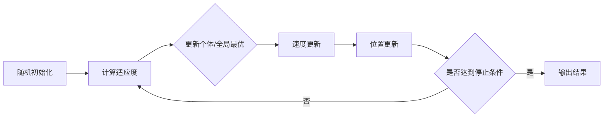

# 粒子群算法(Particle Swarm Optimization) - 原理与代码实例讲解

关键词：粒子群算法、群体智能、优化问题、进化计算、自适应

## 1. 背景介绍
### 1.1 问题的由来
在现实世界中,我们经常会遇到各种优化问题,如工程设计优化、生产调度优化、金融投资组合优化等。这些问题通常具有非线性、多峰值、不连续等特点,传统的数学规划方法难以奏效。如何高效求解这些复杂优化问题,一直是学术界和工业界关注的热点。

### 1.2 研究现状
近年来,群体智能优化算法受到广泛关注。该类算法从自然界的群体行为中获得启发,通过群体中个体的互相协作与竞争,实现对复杂问题的求解。其中,粒子群优化算法(Particle Swarm Optimization,PSO)以其思想简单、实现方便、收敛速度快等优点,成为最具代表性和应用最广泛的群智能优化算法之一。

### 1.3 研究意义 
PSO算法自1995年由Kennedy和Eberhart提出以来,在理论研究和工程应用两方面取得了长足的进展。深入研究PSO算法的原理,并给出详细的代码实例讲解,对于推动该算法的进一步发展和应用具有重要意义。

### 1.4 本文结构
本文将从以下几个方面对粒子群优化算法进行系统阐述：第2部分介绍PSO的核心概念;第3部分详细讲解PSO的算法原理和操作步骤;第4部分给出PSO的数学模型和公式推导;第5部分通过代码实例演示PSO的具体实现;第6部分总结PSO的实际应用场景;第7部分推荐PSO相关的工具和资源;第8部分对PSO的未来发展趋势和挑战进行展望;第9部分列举PSO的常见问题解答。

## 2. 核心概念与联系
粒子群优化算法(PSO)源于对鸟/鱼群觅食行为的研究。在PSO算法中,每个待优化的问题解都被看作搜索空间中的一个"粒子",所有粒子组成一个群体。每个粒子都有自己的位置和速度,分别代表该粒子的解和搜索方向。此外,每个粒子还记录了自己搜索到的最优解(个体最优)以及整个群体的最优解(全局最优)。算法开始时,粒子群被随机初始化。之后,粒子将根据个体最优和全局最优调整自己的速度和位置,经过多次迭代搜索逐步逼近问题的最优解。

PSO算法与其他群智能算法(如蚁群算法、人工鱼群算法等)一脉相承,都是通过群体协作产生智能行为。但PSO更加简单高效,不需要繁琐的路径记忆和信息素更新等操作。同时,PSO与进化算法(如遗传算法)也有相通之处,本质上都是一种基于群体搜索的随机优化方法。但PSO没有遗传算法中的选择、交叉、变异等操作,其搜索完全由速度-位置更新公式驱动。

## 3. 核心算法原理 & 具体操作步骤
### 3.1 算法原理概述
PSO算法的核心思想可以概括为:粒子在解空间中搜索,通过个体认知和社会经验不断调整运动轨迹,最终聚集于最优解附近。其数学本质是一个动态系统,通过速度-位置迭代公式模拟粒子群在解空间中的运动。算法包含以下关键要素:
- 粒子:代表问题的一个候选解,有位置和速度两个属性。
- 适应度:衡量粒子当前位置的优劣程度,由优化目标确定。
- 个体最优:粒子迄今为止搜索到的最优位置。
- 全局最优:整个粒子群迄今搜索到的最优位置。

### 3.2 算法步骤详解
PSO的标准算法流程如下:
1. 初始化粒子群。随机设置每个粒子的初始位置和速度。
2. 评估每个粒子的适应度,更新个体最优和全局最优。 
3. 根据速度更新公式,计算每个粒子的新速度:
$v_{i}(t+1)=w \cdot v_{i}(t)+c_{1} \cdot r_{1} \cdot (p_{i}-x_{i}(t))+c_{2} \cdot r_{2} \cdot (p_{g}-x_{i}(t))$
其中,$v_{i}(t)$和$x_{i}(t)$分别表示粒子$i$在$t$时刻的速度和位置,$p_{i}$为粒子$i$的个体最优位置,$p_{g}$为粒子群的全局最优位置,$w$为惯性权重,$c_{1}$和$c_{2}$为加速常数,$r_{1}$和$r_{2}$为[0,1]上的随机数。
4. 根据位置更新公式,计算每个粒子的新位置:
$x_{i}(t+1)=x_{i}(t)+v_{i}(t+1)$
5. 评估每个粒子的适应度,必要时更新个体最优和全局最优。
6. 检查停止准则,若不满足则转第3步,否则输出全局最优解。

### 3.3 算法优缺点
PSO的主要优点包括:
- 概念简单,容易实现。算法只包含速度和位置两个公式。
- 收敛速度快。粒子可以快速聚集到最优解附近。
- 鲁棒性好。对参数不敏感,少量参数即可工作良好。
- 适用性强。可用于多种连续/组合优化问题。

PSO的主要缺点包括:
- 易早熟收敛。粒子容易过早聚集,陷入局部最优。
- 后期搜索效率低。算法后期粒子搜索能力下降。
- 理论基础薄弱。算法机理的严格数学证明有待加强。
- 离散问题求解能力不足。对离散问题建模和求解有局限。

### 3.4 算法应用领域
凭借其独特优势,PSO被广泛应用于以下领域:
- 函数优化:作为一般的非线性优化技术,求解复杂函数和工程设计问题。
- 组合优化:如旅行商问题、车间调度等。通过离散化或与其他启发式方法结合处理。
- 多目标优化:通过引入非支配排序、拥挤度等机制,求解多目标优化问题。
- 机器学习:用于SVM参数优化、神经网络训练、特征选择等。
- 图像处理:如阈值分割、图像配准、图像压缩等。
- 控制优化:优化PID控制器参数、模糊控制器参数等。

## 4. 数学模型和公式 & 详细讲解 & 举例说明
### 4.1 数学模型构建
考虑以下无约束优化问题:
$$\min f(\boldsymbol{x}), \boldsymbol{x}=(x_{1},\ldots,x_{n}) \in \mathbb{R}^{n}$$
其中,$f(\boldsymbol{x})$为目标函数,$\boldsymbol{x}$为$n$维决策变量。假设$f$有下界,但不要求$f$处处可导。

PSO用一组粒子来表示问题的候选解,每个粒子对应一个$n$维位置向量和速度向量:
$$\boldsymbol{x}_{i}(t)=(x_{i1}(t),\ldots,x_{in}(t)), \boldsymbol{v}_{i}(t)=(v_{i1}(t),\ldots,v_{in}(t)), i=1,2,\ldots,m$$
其中,$m$为粒子数,$t$为迭代次数。每个粒子还记录其个体最优位置$\boldsymbol{p}_{i}$和适应度最优值$f_{i}^{*}$:
$$\boldsymbol{p}_{i}(t)=(p_{i1}(t),\ldots,p_{in}(t)), f_{i}^{*}(t)=f(\boldsymbol{p}_{i}(t)), i=1,2,\ldots,m$$
此外,用$\boldsymbol{p}_{g}$和$f_{g}^{*}$表示整个粒子群的全局最优位置和适应度值:
$$\boldsymbol{p}_{g}(t)=(p_{g1}(t),\ldots,p_{gn}(t)), f_{g}^{*}(t)=\min_{1 \leq i \leq m}f_{i}^{*}(t)$$

### 4.2 公式推导过程
PSO算法的核心是速度更新公式和位置更新公式。以下给出这两个公式的推导过程。

#### 4.2.1 速度更新公式
PSO的速度更新考虑了三个因素:粒子的惯性、认知能力和社会经验。设$t$时刻粒子$i$在维度$j$上的速度为$v_{ij}(t)$,则$t+1$时刻的速度为:
$$v_{ij}(t+1)=w \cdot v_{ij}(t)+c_{1} \cdot r_{1} \cdot (p_{ij}(t)-x_{ij}(t))+c_{2} \cdot r_{2} \cdot (p_{gj}(t)-x_{ij}(t))$$
其中:
- $w \cdot v_{ij}(t)$表示粒子的惯性。$w$为惯性权重,控制粒子保持当前速度飞行的趋势。$w$取值在[0,1]之间,越大则粒子越倾向于探索新区域,越小则越倾向于在局部范围内搜索。
- $c_{1} \cdot r_{1} \cdot (p_{ij}(t)-x_{ij}(t))$表示粒子的个体认知。其中$p_{ij}(t)-x_{ij}(t)$为粒子当前位置与个体最优位置在维度$j$上的差距,$c_{1}$为个体学习因子,控制粒子向自身经验学习的程度,$r_{1}$为[0,1]上的随机数,引入随机性。
- $c_{2} \cdot r_{2} \cdot (p_{gj}(t)-x_{ij}(t))$表示粒子的社会经验。其中$p_{gj}(t)-x_{ij}(t)$为粒子当前位置与全局最优位置在维度$j$上的差距,$c_{2}$为社会学习因子,控制粒子向群体经验学习的程度,$r_{2}$也为[0,1]上的随机数。

可见,速度更新公式巧妙地平衡了粒子的探索能力和开采能力。通过调节$w$、$c_{1}$、$c_{2}$三个参数,可以控制算法的全局搜索和局部搜索能力。

#### 4.2.2 位置更新公式
有了粒子新的速度向量,就可以对位置进行更新。$t+1$时刻粒子$i$在维度$j$上的位置为:
$$x_{ij}(t+1)=x_{ij}(t)+v_{ij}(t+1)$$
即粒子在原位置基础上,沿速度方向进行位移,从而得到新的解。

### 4.3 案例分析与讲解
下面我们以求解Rastrigin函数最小值为例,直观展示PSO算法的运行过程。Rastrigin函数是一个典型的非线性多模态函数,数学形式为:
$$f(x_{1},x_{2})=20+x_{1}^{2}+x_{2}^{2}-10(\cos 2 \pi x_{1}+ \cos 2 \pi x_{2})$$
其三维图像如下:

可见该函数有大量的局部极小值点,很容易陷入局部最优。我们使用PSO来求解其全局最小值。

设置如下参数:粒子数$m=20$,最大迭代次数$T=100$,惯性权重$w=0.8$,加速常数$c_{1}=c_{2}=2.0$,位置边界$[-5.12,5.12]$,速度边界$[-1,1]$。随机初始化粒子的位置和速度,然后开始迭代:

在迭代过程中,粒子群的搜索