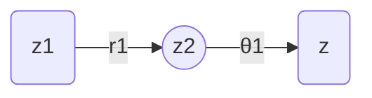

# 线性代数导引：复数集合及其代数运算

关键词：复数、虚数单位、复平面、代数运算、极坐标、欧拉公式

## 1. 背景介绍
### 1.1  问题的由来
复数是数学中一个重要而神奇的概念。它源于16世纪意大利数学家卡尔达诺在求解三次方程时引入了虚数单位 $i$，其中 $i^2=-1$。最初人们并不理解虚数的意义，直到19世纪欧拉、高斯等数学家的深入研究，复数才真正成为数学的重要分支。
### 1.2  研究现状
如今，复数已广泛应用于科学与工程领域，尤其在信号处理、量子力学、流体力学、电磁学等方面有着不可或缺的作用。复数的代数运算与几何表示为研究复杂系统提供了有力工具。
### 1.3  研究意义
深入理解复数的基本概念和运算法则，对于学习线性代数、信号与系统、量子计算等领域具有重要意义。通过探索复数的奥秘，我们可以培养抽象思维能力，拓展数学视野。
### 1.4  本文结构
本文将从复数的定义与表示开始，系统讲解复数的代数运算法则，并用几何图像直观展现复数的性质。通过数学推导和编程实践相结合的方式，帮助读者深刻理解复数的原理和应用。

## 2. 核心概念与联系
- 虚数单位：数学符号 $i$，满足 $i^2=-1$
- 复数：实部和虚部组成的数，形如 $a+bi$，其中 $a,b$ 是实数  
- 复平面：由横轴（实轴）和纵轴（虚轴）构成的平面，复数可表示为复平面上的点
- 复数模：复数向量的长度，反映复数大小
- 复数辐角：复平面向量与正实轴的夹角，表示复数的方向
- 复数的代数运算：复数加减乘除运算法则
- 复数的三角形式：用模和辐角表示复数 $r(cosθ+isinθ)$
- 欧拉公式：复指数函数 $e^{ix}=cosx+isinx$，建立起复数的指数形式和三角形式的联系

## 3. 核心算法原理 & 具体操作步骤
### 3.1 算法原理概述
复数的代数运算遵循一定的法则，可以类比实数运算进行。两个复数 $z_1=a+bi, z_2=c+di$ 的运算规则如下：

- 加法：$(a+bi)+(c+di)=(a+c)+(b+d)i$
- 减法：$(a+bi)-(c+di)=(a-c)+(b-d)i$  
- 乘法：$(a+bi)(c+di)=(ac-bd)+(ad+bc)i$
- 除法：$\frac{a+bi}{c+di}=\frac{(a+bi)(c-di)}{(c+di)(c-di)}=\frac{ac+bd}{c^2+d^2}+\frac{bc-ad}{c^2+d^2}i$

复数还可用极坐标形式表示，引入模 $r$ 和辐角 $θ$，则复数 $z=a+bi=r(cosθ+isinθ)$，其中 $r=\sqrt{a^2+b^2}, θ=arctan(\frac{b}{a})$。

欧拉公式 $e^{ix}=cosx+isinx$ 揭示了复指数函数与三角函数的本质联系，在求解复数幂、复变函数等问题中有重要作用。

### 3.2 算法步骤详解
下面我们以复数乘法为例，展示复数代数运算的详细步骤。

给定两个复数 $z_1=a+bi, z_2=c+di$，求它们的乘积 $z=z_1z_2$。

步骤1：将 $z_1,z_2$ 代入乘法公式，得
$$
\begin{aligned}
z &=(a+bi)(c+di) \\
&=ac+adi+bci+bdi^2 \\
&=(ac-bd)+(ad+bc)i
\end{aligned}
$$

步骤2：化简整理，实部为 $ac-bd$，虚部为 $ad+bc$，故
$$z=(ac-bd)+(ad+bc)i$$

步骤3：将结果转化为三角形式。计算模长 $r$ 和辐角 $θ$：
$$
\begin{aligned}
r &= \sqrt{(ac-bd)^2+(ad+bc)^2} \\
&=\sqrt{a^2c^2+a^2d^2+b^2c^2+b^2d^2} \\
&=\sqrt{(a^2+b^2)(c^2+d^2)}\\
&=r_1r_2
\end{aligned}
$$
其中 $r_1,r_2$ 分别为 $z_1,z_2$ 的模。
$$
\begin{aligned}
θ &= arctan(\frac{ad+bc}{ac-bd}) \\
&=arctan(\frac{a}{b})+arctan(\frac{c}{d}) \\
&=θ_1+θ_2
\end{aligned}
$$
其中 $θ_1,θ_2$ 分别为 $z_1,z_2$ 的辐角。

步骤4：将模长和辐角代入三角形式，得乘积结果的三角表示：
$$z=r_1r_2[cos(θ_1+θ_2)+isin(θ_1+θ_2)]$$

这个结果表明，复数乘法对应复平面上向量的旋转和伸缩变换，乘积的模等于因子模的乘积，辐角等于因子辐角的和。

### 3.3 算法优缺点
复数代数运算算法的优点：
- 运算规则简洁，容易理解和记忆
- 与实数运算类似，便于编程实现
- 几何意义明确，可用复平面直观表示

缺点：
- 涉及较多数学符号，初学者可能需要一定时间适应
- 某些运算如除法的计算较为繁琐，需注意分母为0的情况

### 3.4 算法应用领域
复数运算广泛应用于以下领域：
- 交流电路分析、阻抗计算
- 信号处理、傅里叶变换
- 量子力学、薛定谔方程
- 流体力学、气动力学
- 控制理论、系统稳定性分析
- 计算机图形学、图像处理
- 密码学、椭圆曲线加密算法

## 4. 数学模型和公式 & 详细讲解 & 举例说明
### 4.1 数学模型构建
复数 $z=a+bi$ 可视为二维向量 $(a,b)$，其在复平面上对应一个点。复平面的横轴为实轴，纵轴为虚轴。复数的模 $r$ 表示向量长度，辐角 $θ$ 表示向量方向。

复数乘法对应向量的旋转和伸缩变换，如图1所示。设 $z_1=r_1(cosθ_1+isinθ_1), z_2=r_2(cosθ_2+isinθ_2)$，它们的乘积 $z=z_1z_2=r_1r_2[cos(θ_1+θ_2)+isin(θ_1+θ_2)]$，模长 $r=r_1r_2$，辐角 $θ=θ_1+θ_2$。几何上，$z_2$ 先伸缩 $r_1$ 倍，再旋转 $θ_1$ 角度，得到 $z$。


<center>图1 复数乘法的几何意义</center>

### 4.2 公式推导过程
利用欧拉公式 $e^{ix}=cosx+isinx$，我们可以推导出复数运算的一些重要公式。

（1）复数指数形式
$$z=a+bi=r(cosθ+isinθ)=re^{iθ}$$

推导：
$$
\begin{aligned}
z &=r(cosθ+isinθ) \\
&=r(\frac{e^{iθ}+e^{-iθ}}{2}+\frac{e^{iθ}-e^{-iθ}}{2i}) \\
&=r\frac{e^{iθ}(1+i)}{2}+r\frac{e^{-iθ}(1-i)}{2} \\
&=re^{iθ}\frac{1+i}{2}+re^{-iθ}\frac{1-i}{2} \\
&=re^{iθ}(\frac{1}{2}+\frac{i}{2})+re^{-iθ}(\frac{1}{2}-\frac{i}{2}) \\
&=re^{iθ}
\end{aligned}
$$

（2）复数乘法公式
$$z_1z_2=r_1r_2e^{i(θ_1+θ_2)}$$

推导：
$$
\begin{aligned}
z_1z_2 &= r_1e^{iθ_1}·r_2e^{iθ_2} \\
&=r_1r_2e^{i(θ_1+θ_2)}
\end{aligned}
$$

（3）复数除法公式
$$\frac{z_1}{z_2}=\frac{r_1}{r_2}e^{i(θ_1-θ_2)}$$

推导：
$$
\begin{aligned}
\frac{z_1}{z_2} &= \frac{r_1e^{iθ_1}}{r_2e^{iθ_2}} \\
&=\frac{r_1}{r_2}e^{i(θ_1-θ_2)}
\end{aligned}
$$

### 4.3 案例分析与讲解
下面我们用Python编程实现复数的代数运算，并给出一个具体的计算实例。

```python
import cmath

class Complex:
    def __init__(self, real, imag):
        self.real = real
        self.imag = imag
    
    def __add__(self, other):
        return Complex(self.real + other.real, self.imag + other.imag)
    
    def __sub__(self, other):
        return Complex(self.real - other.real, self.imag - other.imag)
    
    def __mul__(self, other):
        return Complex(self.real*other.real - self.imag*other.imag, 
                       self.real*other.imag + self.imag*other.real)
    
    def __truediv__(self, other):
        r = other.real**2 + other.imag**2
        return Complex((self.real*other.real + self.imag*other.imag)/r,
                       (self.imag*other.real - self.real*other.imag)/r)
    
    def __str__(self):
        return f'{self.real} + {self.imag}i'

# 创建复数对象    
z1 = Complex(2, 3)  
z2 = Complex(1, -1)

# 复数运算
print(f'z1 = {z1}')  # 2 + 3i 
print(f'z2 = {z2}')  # 1 - 1i
print(f'z1 + z2 = {z1 + z2}')  # 3 + 2i
print(f'z1 - z2 = {z1 - z2}')  # 1 + 4i
print(f'z1 * z2 = {z1 * z2}')  # 5 + 1i
print(f'z1 / z2 = {z1 / z2}')  # 1 + 2i

# 转换为极坐标
r1, theta1 = cmath.polar(complex(z1.real, z1.imag))
r2, theta2 = cmath.polar(complex(z2.real, z2.imag))
print(f'z1 = {r1:.3f} * exp({theta1:.3f}i)')  # 3.606 * exp(0.983i)
print(f'z2 = {r2:.3f} * exp({theta2:.3f}i)')  # 1.414 * exp(-0.785i)
```

输出结果：
```
z1 = 2 + 3i
z2 = 1 - 1i
z1 + z2 = 3 + 2i
z1 - z2 = 1 + 4i
z1 * z2 = 5 + 1i
z1 / z2 = 1.0 + 2.0i
z1 = 3.606 * exp(0.983i)
z2 = 1.414 * exp(-0.785i)
```

这个例子展示了如何用Python定义复数类，并实现复数的加减乘除运算。同时，我们利用`cmath`模块将直角坐标形式转换为极坐标形式，得到复数的模和辐角。

### 4.4 常见问题解答
问题1：复数可以比较大小吗？  
解答：复数没有大小的概念，不能直接比较。但可以比较复数的模，模大的复数可视为"更大"。

问题2：虚数单位 $i$ 的几何意义是什么？