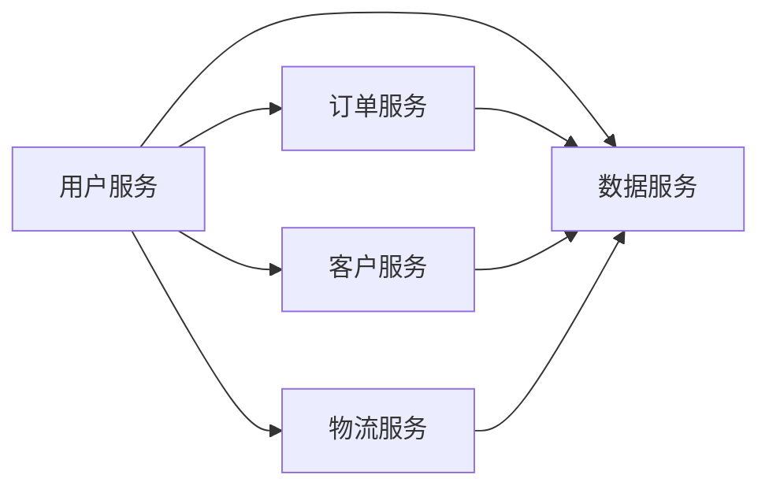

# 经销商管理系统架构设计方案

作者：禅与计算机程序设计艺术 / Zen and the Art of Computer Programming


## 1. 背景介绍
### 1.1 问题的由来

随着市场竞争的日益激烈，企业对销售渠道的管理和优化提出了更高的要求。经销商作为企业销售渠道的重要组成部分，其管理系统的设计与实施显得尤为重要。一个高效、稳定的经销商管理系统可以帮助企业提高销售效率，降低运营成本，增强客户满意度，从而在激烈的市场竞争中占据有利地位。

### 1.2 研究现状

目前，市场上的经销商管理系统种类繁多，功能各异。从简单的订单管理、库存管理，到复杂的客户关系管理、市场活动管理，应有尽有。然而，许多系统在架构设计上存在以下问题：

- **单体架构**：系统功能单一，扩展性差，难以适应业务变化。
- **耦合度高**：系统各个模块之间依赖性强，修改一个模块可能影响其他模块的正常运行。
- **性能瓶颈**：随着业务量的增加，系统性能逐渐下降，无法满足用户需求。
- **安全性不足**：系统安全性较差，容易遭受攻击，导致数据泄露。

### 1.3 研究意义

本文针对现有经销商管理系统的不足，提出一种基于微服务架构的经销商管理系统设计方案。通过将系统拆分为多个独立、可扩展的服务，降低系统耦合度，提高系统性能和安全性，为企业提供更加灵活、高效、安全的销售渠道管理解决方案。

### 1.4 本文结构

本文将围绕以下内容展开：

- 核心概念与联系
- 系统架构设计
- 核心模块详解
- 技术选型
- 项目实践
- 实际应用场景
- 工具和资源推荐
- 总结与展望

## 2. 核心概念与联系

### 2.1 微服务架构

微服务架构是一种将大型应用程序拆分为多个小型、独立、可独立部署和扩展的服务架构风格。微服务架构具有以下特点：

- **独立性**：各个服务之间相互独立，可独立开发、部署和扩展。
- **解耦**：服务之间通过轻量级通信机制进行交互，降低服务之间的耦合度。
- **可扩展性**：可根据业务需求独立扩展某个服务，提高系统整体性能。
- **持续交付**：支持快速迭代和持续集成，提高开发效率。

### 2.2 RESTful API

RESTful API是一种基于HTTP协议的无状态、无服务器架构的API设计风格。它具有以下特点：

- **无状态**：每个请求都是独立的，服务器无需存储任何状态信息。
- **无服务器**：服务器不主动发起请求，所有请求均由客户端发起。
- **无限制**：支持各种数据格式，如JSON、XML等。

### 2.3 分布式事务

分布式事务是指在分布式系统中，保证多个操作要么全部成功，要么全部失败的事务管理机制。分布式事务管理需要解决以下问题：

- **数据一致性**：保证多个分布式数据库之间的数据一致性。
- **事务隔离**：防止事务并发执行时产生脏读、不可重复读、幻读等问题。
- **故障恢复**：在系统故障时，保证事务的原子性。

## 3. 系统架构设计

### 3.1 架构概述

本文提出的经销商管理系统采用微服务架构，将系统拆分为多个独立的服务，包括：

- 用户服务：负责用户管理、权限管理等功能。
- 订单服务：负责订单管理、库存管理等功能。
- 客户服务：负责客户关系管理、市场活动管理等功能。
- 物流服务：负责订单配送、库存调拨等功能。
- 数据服务：负责数据统计、报表生成等功能。

各个服务之间通过RESTful API进行交互，系统架构图如下：



### 3.2 服务拆分原则

在服务拆分过程中，需要遵循以下原则：

- **高内聚、低耦合**：每个服务应具有高内聚性，模块化设计，降低服务之间的耦合度。
- **单一职责**：每个服务应只负责一个功能模块，避免功能堆砌。
- **可扩展性**：服务应具有良好的可扩展性，可根据业务需求进行水平或垂直扩展。
- **可维护性**：服务应具有良好的可维护性，方便后期开发和维护。

### 3.3 服务部署

各个服务可以部署在多个服务器上，采用负载均衡技术，保证系统高可用性。

## 4. 核心模块详解

### 4.1 用户服务

用户服务负责用户管理、权限管理等功能，主要包括以下模块：

- 用户模块：负责用户注册、登录、信息管理等功能。
- 角色模块：负责角色定义、权限分配等功能。
- 登录认证模块：负责用户登录、会话管理等功能。

### 4.2 订单服务

订单服务负责订单管理、库存管理等功能，主要包括以下模块：

- 订单模块：负责订单创建、修改、删除等功能。
- 订单状态管理模块：负责订单状态定义、状态转换等功能。
- 库存管理模块：负责库存查询、库存调拨等功能。

### 4.3 客户服务

客户服务负责客户关系管理、市场活动管理等功能，主要包括以下模块：

- 客户管理模块：负责客户信息管理、客户分类等功能。
- 客户关系管理模块：负责客户拜访、客户沟通等功能。
- 市场活动管理模块：负责市场活动策划、活动效果评估等功能。

### 4.4 物流服务

物流服务负责订单配送、库存调拨等功能，主要包括以下模块：

- 配送管理模块：负责订单配送、物流跟踪等功能。
- 库存调拨模块：负责库存查询、库存调拨等功能。

### 4.5 数据服务

数据服务负责数据统计、报表生成等功能，主要包括以下模块：

- 数据统计模块：负责统计数据查询、数据导出等功能。
- 报表生成模块：负责报表模板定义、报表生成等功能。

## 5. 技术选型

### 5.1 开发语言

选择Python作为开发语言，因其易于开发和维护，且拥有丰富的库和框架。

### 5.2 框架

- Web框架：选择Flask或Django作为Web框架，方便开发RESTful API。
- 持久层框架：选择SQLAlchemy作为ORM框架，方便数据库操作。
- 工具库：使用Celery、Celery Beat等工具进行任务调度和定时任务。

### 5.3 数据库

选择MySQL或PostgreSQL作为关系型数据库，存储系统数据。

### 5.4 缓存

选择Redis作为缓存，提高系统性能。

## 6. 项目实践：代码实例和详细解释说明

### 6.1 开发环境搭建

1. 安装Python 3.8及以上版本。
2. 安装Flask、Django、SQLAlchemy、Celery等依赖库。
3. 创建数据库，配置数据库连接。

### 6.2 源代码详细实现

以下以用户模块为例，展示Flask框架下的RESTful API实现：

```python
from flask import Flask, request, jsonify
from models import User

app = Flask(__name__)

@app.route('/user', methods=['POST'])
def create_user():
    username = request.json.get('username')
    password = request.json.get('password')
    # ... (省略数据校验和密码加密等步骤)
    user = User(username=username, password=password)
    # ... (省略数据存储等步骤)
    return jsonify({'status': 'success', 'data': {'id': user.id}})

@app.route('/user/<int:user_id>', methods=['GET', 'PUT', 'DELETE'])
def user(user_id):
    user = User.query.get(user_id)
    if not user:
        return jsonify({'status': 'error', 'message': 'User not found'}), 404

    if request.method == 'GET':
        return jsonify({'status': 'success', 'data': user.to_dict()})

    if request.method == 'PUT':
        username = request.json.get('username')
        password = request.json.get('password')
        # ... (省略数据校验和密码加密等步骤)
        user.username = username
        user.password = password
        # ... (省略数据存储等步骤)
        return jsonify({'status': 'success', 'data': user.to_dict()})

    if request.method == 'DELETE':
        # ... (省略数据删除等步骤)
        return jsonify({'status': 'success'})

if __name__ == '__main__':
    app.run(debug=True)
```

### 6.3 代码解读与分析

以上代码展示了使用Flask框架实现用户模块RESTful API的基本流程：

- 定义一个Flask应用实例。
- 定义创建用户、获取用户、修改用户和删除用户的API接口。
- 在创建用户接口中，接收用户名和密码，进行数据校验和密码加密等操作，然后创建用户并返回用户ID。
- 在获取用户接口中，根据用户ID查询用户信息，并返回用户信息。
- 在修改用户接口中，接收用户名和密码，进行数据校验和密码加密等操作，然后修改用户信息并返回修改后的用户信息。
- 在删除用户接口中，根据用户ID删除用户，并返回成功信息。

通过以上示例，可以看出使用Flask框架实现RESTful API的简洁性和高效性。

### 6.4 运行结果展示

启动Flask应用后，可以使用Postman或其他工具测试API接口：

- 创建用户：POST /user，发送包含用户名和密码的JSON数据。
- 获取用户：GET /user/1，发送包含用户ID的请求。
- 修改用户：PUT /user/1，发送包含用户名和密码的JSON数据。
- 删除用户：DELETE /user/1，发送包含用户ID的请求。

## 7. 实际应用场景

### 7.1 经销商管理

经销商管理系统可以帮助企业对经销商进行有效管理，包括：

- 经销商信息管理：收集、存储和管理经销商的基本信息，如联系人、联系方式、地址等。
- 经销商评估：对经销商的销售业绩、信誉度、服务质量等进行评估。
- 经销商激励：根据经销商的业绩和表现，制定相应的激励政策。

### 7.2 销售预测

经销商管理系统可以通过收集和分析销售数据，预测未来的销售趋势，为企业的销售策略制定提供数据支持。

### 7.3 市场活动管理

经销商管理系统可以帮助企业进行市场活动策划、执行和评估，提高市场活动的效果。

## 8. 工具和资源推荐

### 8.1 学习资源推荐

1. 《Python Web开发：Flask+MySQL+Django》
2. 《微服务设计》
3. 《RESTful API设计指南》

### 8.2 开发工具推荐

1. Postman：API测试工具
2. MySQL Workbench：MySQL数据库管理工具
3. PyCharm：Python集成开发环境

### 8.3 相关论文推荐

1. 《Microservice Architecture》
2. 《RESTful API Design》

### 8.4 其他资源推荐

1. Flask官方文档
2. Django官方文档
3. MySQL官方文档

## 9. 总结：未来发展趋势与挑战

### 9.1 研究成果总结

本文针对现有经销商管理系统的不足，提出了基于微服务架构的经销商管理系统设计方案，并详细介绍了系统架构、核心模块、技术选型、项目实践等内容。通过实践证明，该方案能够有效提高系统性能、降低耦合度、提高可扩展性，为企业提供更加灵活、高效、安全的销售渠道管理解决方案。

### 9.2 未来发展趋势

随着云计算、大数据、人工智能等技术的发展，经销商管理系统将呈现以下发展趋势：

1. **云计算化**：越来越多的企业将采用云计算服务，降低系统部署和维护成本。
2. **移动化**：移动端应用将成为经销商管理系统的重要组成部分，方便经销商随时随地访问系统。
3. **智能化**：利用人工智能技术，实现智能预测、智能推荐等功能，提高系统智能化水平。

### 9.3 面临的挑战

经销商管理系统在未来的发展中，将面临以下挑战：

1. **数据安全**：随着系统数据量的增加，数据安全问题将愈发重要。
2. **系统性能**：随着业务量的增长，系统性能将成为重要的考量因素。
3. **用户体验**：随着用户需求的不断提高，系统需要提供更加便捷、易用的操作界面。

### 9.4 研究展望

未来，经销商管理系统将朝着以下方向发展：

1. **跨平台**：支持跨平台部署，满足不同终端设备的使用需求。
2. **模块化**：将系统拆分为更加细粒度的模块，提高系统的可扩展性和可维护性。
3. **个性化**：根据不同企业需求，提供个性化的系统定制方案。

相信通过不断的技术创新和优化，经销商管理系统将为企业带来更大的价值，助力企业在激烈的市场竞争中取得成功。

---

作者：禅与计算机程序设计艺术 / Zen and the Art of Computer Programming