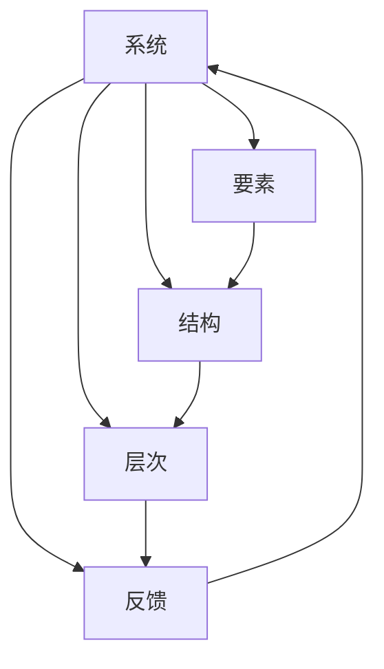

# 结构化思维的应用：从理论到实践

关键词：结构化思维、系统思考、逻辑推理、问题解决、决策制定

## 1. 背景介绍

### 1.1 问题的由来

在当今复杂多变的世界中，我们面临着各种各样的问题和挑战。无论是在个人生活、学习工作,还是在企业管理、社会治理等方方面面,都需要运用系统的、结构化的思维方式来分析问题、解决问题。然而,很多人在思考问题时往往缺乏条理,逻辑混乱,难以抓住问题的本质。这就凸显出学习和掌握结构化思维的重要性。

### 1.2 研究现状

近年来,结构化思维受到学术界和商界的广泛关注。一些学者从认知心理学、管理学等不同角度对结构化思维进行了研究。例如,Edward de Bono提出的"六顶思考帽"理论,为系统思考提供了实用的工具。麻省理工学院的系统动力学研究为理解复杂系统行为提供了新的视角。同时,像麦肯锡、埃森哲等知名咨询公司也将结构化思维应用于管理实践,帮助企业优化流程、制定战略。

### 1.3 研究意义

深入研究结构化思维,对于提升个人和组织的思考能力与决策水平具有重要意义:

1. 有助于克服思维定式,拓宽思路,激发创新。
2. 能够更全面、更系统地审视问题,不被表象所迷惑。
3. 通过梳理复杂问题的逻辑关系,使决策更加科学严谨。
4. 为跨领域知识整合、集体智慧汇聚提供了有效途径。

总之,在变革加速的时代,掌握结构化思维已成为适应环境、驾驭未来的关键能力。

### 1.4 本文结构

本文将围绕结构化思维的理论与实践展开探讨。首先阐述结构化思维的核心概念,然后介绍其背后的原理和方法。接着举例说明如何将结构化思维应用于实际问题,并给出一些实用的工具和资源推荐。最后总结全文,展望结构化思维的发展趋势和面临的挑战。

## 2. 核心概念与联系

要理解结构化思维,首先需要厘清其核心概念:

- 系统:由相互关联、相互作用的多个部分组成的有机整体。系统具有层次性、动态性、涌现性等特征。
- 要素:构成系统的基本单元。要素之间通过结构产生联系。
- 结构:反映系统内部各要素之间相互关系的方式。结构决定了系统的功能和属性。
- 层次:系统从局部到整体呈现出不同的复杂程度,每一层次都有其独特的模式。
- 反馈:系统通过反馈回路不断调节自身行为,以适应内外部变化。反馈可分为正反馈(自我增强)和负反馈(自我平衡)。

这些概念相互关联、相互影响,构成了结构化思维的理论基础。只有系统地把握其内在联系,才能真正领会结构化思维的精髓。



## 3. 核心算法原理 & 具体操作步骤

### 3.1 算法原理概述

结构化思维的核心是系统分析方法。它将复杂问题分解为若干相对简单的子问题,再对各子问题的解进行综合,从而得出整体的解决方案。这一过程可用下面的公式表示:

$$
Solution = \sum_{i=1}^{n} Subproblem_i
$$

其中,$Solution$表示整体解,$Subproblem_i$表示第$i$个子问题的解,n为子问题数。

### 3.2 算法步骤详解

结构化思维算法可分为以下几个步骤:

1. 明确问题:准确界定所要解决的核心问题。
2. 分解问题:将问题逐级分解为多个子问题,直至每个子问题都可以单独求解。
3. 解决子问题:运用各种分析工具和方法,逐一解决各个子问题。
4. 整合方案:将子问题的解整合为整体解决方案,并检验其可行性和优化空间。
5. 方案实施:制定详细的实施计划,并在实践中不断改进方案。

这些步骤环环相扣,遵循"分而治之,合而用之"的基本思路。

### 3.3 算法优缺点

结构化思维算法的优点在于:
- 化繁为简,使复杂问题变得可解
- 条理清晰,便于理清思路
- 可操作性强,容易付诸实践

但它也存在一定局限:
- 割裂整体,可能忽视要素间的相互作用
- 依赖经验,缺乏严格的数学基础
- 不适用于所有问题,有其使用边界

因此在实际应用中,需要辩证看待,灵活运用。

### 3.4 算法应用领域

结构化思维算法在诸多领域得到广泛应用,如:

- 商业决策:市场分析、战略规划、流程优化等
- 工程设计:需求分析、系统架构、项目管理等 
- 科学研究:学科分类、理论构建、实验设计等
- 日常生活:目标管理、时间规划、问题解决等

可以说,结构化思维已经成为现代社会的一项基本思维技能。

## 4. 数学模型和公式 & 详细讲解 & 举例说明

### 4.1 数学模型构建

为了更精确地描述结构化思维过程,我们可以构建数学模型。设系统$S$由$n$个要素$\{e_1,e_2,...,e_n\}$组成,要素$e_i$的属性用向量$\vec{v_i}$表示。系统的结构用邻接矩阵$A$描述:

$$
A = \begin{bmatrix} 
a_{11} & a_{12} & \cdots & a_{1n} \\
a_{21} & a_{22} & \cdots & a_{2n} \\
\vdots & \vdots & \ddots & \vdots \\
a_{n1} & a_{n2} & \cdots & a_{nn}
\end{bmatrix}
$$

其中,$a_{ij}=1$表示要素$i$和$j$之间存在直接联系,$a_{ij}=0$则表示二者无直接联系。

系统的状态可用状态向量$\vec{S}(t)$表示:

$$
\vec{S}(t) = [s_1(t),s_2(t),...,s_n(t)]
$$

其中,$s_i(t)$表示$t$时刻要素$e_i$的状态值。

状态的演化由微分方程组描述:

$$
\frac{d\vec{S}(t)}{dt} = F(\vec{S}(t),\vec{P})
$$

其中,$F$为状态转移函数,$\vec{P}$为外部输入。求解该方程组,即可预测系统的动态行为。

### 4.2 公式推导过程

以上模型涉及到几个重要公式的推导,这里简要说明。

状态向量$\vec{S}(t)$的定义直接来自于系统的状态描述,是状态变量$s_i(t)$的集合。

状态转移函数$F$可通过对系统结构的分析得到。一般而言,要素$e_i$的状态变化率$\frac{ds_i(t)}{dt}$与其他要素的状态及联系强度有关,可表示为:

$$
\frac{ds_i(t)}{dt} = f_i(s_1(t),s_2(t),...,s_n(t),a_{i1},a_{i2},...,a_{in},\vec{p_i})
$$

其中,$f_i$为要素$i$的状态转移函数,$\vec{p_i}$为外部输入。将各要素的状态转移函数组合,即得到整个系统的状态转移函数$F$。

### 4.3 案例分析与讲解

下面我们以一个简单的人口增长模型为例,演示如何应用上述数学模型。

假设某地区只有青年和老年两个年龄段,其人口数分别为$x(t)$和$y(t)$。青年人口的增长率与老年人口数成正比,老年人口的增长率与青年人口数成正比。记青年人口向老年人口转化的比例为$a$,老年人口死亡率为$b$,则该系统的状态方程为:

$$
\begin{cases}
\frac{dx(t)}{dt} = ay(t) \\
\frac{dy(t)}{dt} = x(t) - by(t)
\end{cases}
$$

初始条件为$x(0)=x_0$,$y(0)=y_0$。求解该方程组,得到:

$$
\begin{cases}
x(t) = C_1e^{\sqrt{ab}t} + C_2e^{-\sqrt{ab}t} \\
y(t) = \frac{1}{\sqrt{a}}(C_1e^{\sqrt{ab}t} - C_2e^{-\sqrt{ab}t})
\end{cases}
$$

其中,

$$
C_1 = \frac{x_0+y_0\sqrt{a}}{2},C_2 = \frac{x_0-y_0\sqrt{a}}{2}
$$

由此可知,该地区的人口数呈指数增长,增长率为$\sqrt{ab}$。这一结论对人口政策的制定具有重要参考价值。

### 4.4 常见问题解答

Q:建立数学模型的意义何在?

A:数学模型是对现实系统的抽象和简化,它用严谨的数学语言刻画了系统的关键特征,揭示了内在规律。借助数学模型,我们可以定量分析系统行为,预测未来走势,为决策提供科学依据。同时,模型也为复杂系统的计算机仿真奠定了基础。

Q:如何评估模型的有效性?  

A:模型的有效性可从以下几方面评估:
- 逻辑自洽:模型的假设和推导是否严谨,结论是否合理。
- 与数据的拟合:模型产生的结果能否很好地拟合观测数据。
- 预测能力:模型对未知情况的预测是否准确。
- 解释力:模型能否很好地解释现象背后的机理。
- 应用价值:模型是否有助于指导实践,解决实际问题。

一个好的模型应在上述方面取得较好的平衡。

Q:模型能否应对所有复杂系统?

A:任何模型都有其适用范围。当系统过于复杂,包含大量不确定因素时,精确建模会变得十分困难。此时,我们可采取一些策略:
- 降低对精度的要求,建立粗略的定性模型。
- 用多个模型从不同侧面刻画系统。
- 借助仿真技术,通过计算机实验探索系统行为。
- 收集更多数据,用于修正和完善模型。

总之,模型是认识复杂系统的有力工具,但仍需与其他方法互补。

## 5. 项目实践：代码实例和详细解释说明

### 5.1 开发环境搭建

为了将结构化思维的理论付诸实践,我们可以开发一套软件系统。以下是推荐的开发环境:
- 操作系统:Windows 10 / macOS / Linux
- 开发语言:Python 3.x
- 集成开发环境:PyCharm / VS Code
- 依赖库:NumPy, SciPy, Matplotlib等

搭建好环境后,就可以开始编写代码了。

### 5.2 源代码详细实现

下面是一个用Python实现的结构化思维案例,用于分析复杂项目的任务分解与进度管理。

```python
import numpy as np
import matplotlib.pyplot as plt

# 定义任务类
class Task:
    def __init__(self, name, duration, predecessors=[]):
        self.name = name
        self.duration = duration
        self.predecessors = predecessors
        self.earliest_start = 0
        self.earliest_finish = 0
        self.latest_start = 0
        self.latest_finish = 0
        self.slack = 0
        
    def __str__(self):
        return self.name
        
# 定义项目类        
class Project:
    def __init__(self, tasks):
        self.tasks = tasks
        
    def forward_pass(self):
        for task in self.tasks:
            task.earliest_start = max([t.earliest_finish for t in task.predecessors], default=0)
            task.