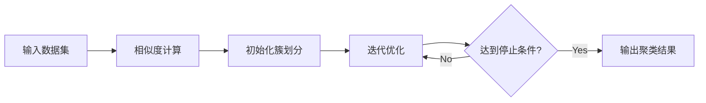

# 聚类分析原理与代码实例讲解

关键词：聚类分析、无监督学习、相似度度量、K-Means、层次聚类、DBSCAN、高维数据

## 1. 背景介绍
### 1.1 问题的由来
在现实世界中,我们经常需要对大量的数据进行分组和归类。例如,在客户细分、图像分割、社交网络分析等领域,我们需要将相似的对象聚集在一起,形成不同的簇。这就需要用到聚类分析技术。聚类分析作为一种无监督学习方法,可以在没有预先标记数据的情况下,自动发现数据内在的分组结构。

### 1.2 研究现状
聚类分析已经有几十年的研究历史,形成了多种经典的聚类算法,如K-Means、层次聚类、DBSCAN等。近年来,随着大数据时代的到来,聚类分析面临着高维数据、大规模数据、异构数据等新的挑战。研究者们提出了一系列改进和创新的聚类算法,如谱聚类、子空间聚类、流式聚类等,不断拓展聚类分析的应用边界。

### 1.3 研究意义
聚类分析在许多领域都有重要应用,如:

- 客户细分:通过对客户数据进行聚类,可以发现不同客户群体的特点,制定针对性营销策略。
- 图像分割:将图像像素点进行聚类,可以实现对图像的语义分割。 
- 社交网络分析:在社交网络中识别紧密联系的社区结构。
- 异常检测:通过聚类找出异常点和离群点。

深入理解聚类分析的原理和实现,对于数据挖掘从业者具有重要意义。

### 1.4 本文结构
本文将系统介绍聚类分析的基本概念、主要算法、数学原理和代码实现。内容安排如下:

- 第2部分介绍聚类分析的核心概念。
- 第3部分详细讲解经典聚类算法的原理和步骤。
- 第4部分阐述聚类分析背后的数学模型和公式。
- 第5部分给出Python代码实例。
- 第6部分讨论聚类分析的应用场景。
- 第7部分推荐相关工具和资源。
- 第8部分总结全文,展望聚类分析的未来发展。

## 2. 核心概念与联系
聚类分析的目标是将数据集划分为若干个簇,使得同一簇内的样本相似度高,不同簇之间的样本相似度低。其核心概念包括:

- 样本:数据集中的每个数据点,通常由多个属性(特征)描述。
- 簇:由相似样本组成的子集。
- 相似度:衡量两个样本之间的相似程度,可以基于距离、相关性等度量。
- 中心点:每个簇的代表点,如簇内样本的均值。

聚类过程就是不断迭代优化簇划分,使得定义的损失函数最小化。不同的聚类算法在相似度度量、优化目标等方面有所区别。下图展示了聚类分析的基本流程:



## 3. 核心算法原理 & 具体操作步骤
### 3.1 算法原理概述
聚类算法可以分为划分方法、层次方法、基于密度方法、基于网格方法等。下面重点介绍几种经典算法:

- K-Means:以欧氏距离为相似度度量,通过迭代优化最小化簇内样本与簇中心点的距离平方和。
- 层次聚类:自底向上或自顶向下地合并或拆分簇,形成树状的聚类结构。
- DBSCAN:基于样本密度定义簇,能够发现任意形状的簇。

### 3.2 算法步骤详解
以K-Means为例,其算法步骤如下:

1. 随机选择K个初始中心点
2. 重复直到收敛:
   - 将每个样本指派到最近的中心点所在簇
   - 更新每个簇的中心点为簇内样本的均值  
3. 输出最终的簇划分

层次聚类有聚合法(自底向上)和分裂法(自顶向下)两种,以聚合法为例:

1. 将每个样本视为一个簇
2. 重复直到达到预设的簇数目:
   - 计算各簇之间的距离(如最近距离、最远距离、平均距离)
   - 合并距离最近的两个簇
3. 输出层次化的聚类结果

DBSCAN的核心是基于密度的可达性,步骤为:

1. 对每个样本,确定其$\epsilon$-邻域内的样本数是否大于阈值$minPts$
   - 是,则该样本为核心对象
   - 否,若该样本能被其他核心对象密度可达,则为边界点;否则为噪声点
2. 将密度可达的样本链接成簇
3. 输出最终的簇和噪声点

### 3.3 算法优缺点
- K-Means:
  - 优点:简单高效,适合球形簇
  - 缺点:需要预设簇数目,对噪声和异常点敏感
- 层次聚类:
  - 优点:无需预设簇数目,可以生成层次化结果
  - 缺点:计算复杂度高,对噪声敏感 
- DBSCAN:
  - 优点:无需预设簇数目,可以发现任意形状簇,鲁棒性好
  - 缺点:参数$\epsilon$和$minPts$选择有难度,高维数据查找邻域开销大

### 3.4 算法应用领域
- K-Means:文本聚类、用户细分等
- 层次聚类:基因表达数据分析、系统树构建等  
- DBSCAN:异常检测、交通轨迹聚类等

## 4. 数学模型和公式 & 详细讲解 & 举例说明
### 4.1 数学模型构建
聚类可以形式化为一个组合优化问题。给定样本集$D=\{x_1,\ldots,x_n\}$,找到划分$C=\{C_1,\ldots,C_K\}$,最小化目标函数:

$$
\min_{C} \sum_{k=1}^K\sum_{x_i\in C_k} dist(x_i,\mu_k)
$$

其中$\mu_k$为簇$C_k$的中心点,$dist$为相似度度量。不同的聚类算法对应不同的目标函数和优化过程。

### 4.2 公式推导过程
以K-Means为例,其目标函数为最小化簇内样本与簇均值的距离平方和:

$$
\min_{C} \sum_{k=1}^K\sum_{x_i\in C_k} \|x_i-\mu_k\|^2
$$

其中$\mu_k=\frac{1}{|C_k|}\sum_{x_i\in C_k}x_i$为簇$C_k$的均值。

求解该最优化问题可以使用坐标下降法,交替优化$C$和$\mu$:

- 固定$\mu$,优化$C$:将每个样本$x_i$指派到最近的$\mu_k$所在簇。
$$
C_k=\{x_i \mid \forall j\ne k, \|x_i-\mu_k\|\le \|x_i-\mu_j\|\}
$$
- 固定$C$,优化$\mu$:将每个簇$C_k$的均值作为新的$\mu_k$。
$$
\mu_k=\frac{1}{|C_k|}\sum_{x_i\in C_k}x_i
$$

交替迭代上述两步,直到簇划分不再改变,即达到局部最优解。

### 4.3 案例分析与讲解
考虑一个简单的二维数据集,包含6个样本点$\{(1,1),(1.5,2),(3,4),(8,7),(9,6),(10,8)\}$。我们使用K-Means算法将其聚成2类。

1. 随机初始化两个中心点,如$\mu_1=(1,1),\mu_2=(9,6)$。

2. 迭代过程:
   - 第1轮:
     - 将样本指派到最近的中心点:$C_1=\{(1,1),(1.5,2),(3,4)\},C_2=\{(8,7),(9,6),(10,8)\}$
     - 更新中心点:$\mu_1=(1.83,2.33),\mu_2=(9,7)$
   - 第2轮:  
     - 指派样本:$C_1,C_2$不变
     - 更新中心点:$\mu_1,\mu_2$不变
   - 达到收敛,输出结果

最终得到的聚类结果为$C_1=\{(1,1),(1.5,2),(3,4)\},C_2=\{(8,7),(9,6),(10,8)\}$,中心点为$\mu_1=(1.83,2.33),\mu_2=(9,7)$。

### 4.4 常见问题解答
- 如何选择聚类算法?
  - 根据数据规模、特征类型、期望簇形状、对噪声的敏感度等因素,选择合适的聚类算法。一般情况下,先尝试K-Means等简单算法,然后根据结果决定是否需要使用更复杂的算法。
- 如何评估聚类结果的好坏?
  - 根据聚类任务的目的,可以使用外部指标(如与真实标签的匹配程度)、内部指标(如簇内紧致度和簇间分离度)来评价聚类质量。常见指标有Purity、NMI、轮廓系数等。也可以进行可视化分析,人工检查聚类结果是否符合预期。
- 如何处理高维数据的聚类?
  - 高维数据会带来维度灾难,使得距离度量失效。可以先对数据进行降维(如PCA、t-SNE等),然后在低维空间进行聚类。或者使用子空间聚类、谱聚类等算法,自动找出数据的内在簇结构。

## 5. 项目实践：代码实例和详细解释说明
### 5.1 开发环境搭建
本文使用Python 3实现聚类算法,需要安装以下库:

- numpy:数值计算
- matplotlib:数据可视化
- scikit-learn:机器学习算法

可以使用pip安装:

```
pip install numpy matplotlib scikit-learn
```

### 5.2 源代码详细实现
下面给出K-Means算法的Python实现:

```python
import numpy as np

class KMeans:
    def __init__(self, n_clusters=2, max_iter=300):
        self.n_clusters = n_clusters
        self.max_iter = max_iter
        self.centroids = None
        self.labels = None
        
    def fit(self, X):
        # 随机选择初始中心点
        idx = np.random.choice(X.shape[0], self.n_clusters)
        self.centroids = X[idx]
        
        for _ in range(self.max_iter):
            # 将样本指派到最近的中心点
            distances = self._calc_distances(X)
            self.labels = np.argmin(distances, axis=1)
            
            # 更新中心点
            for i in range(self.n_clusters):
                self.centroids[i] = np.mean(X[self.labels==i], axis=0)
    
    def predict(self, X):
        distances = self._calc_distances(X)
        return np.argmin(distances, axis=1)
    
    def _calc_distances(self, X):
        distances = np.zeros((X.shape[0], self.n_clusters))
        for i in range(self.n_clusters):
            distances[:,i] = np.linalg.norm(X - self.centroids[i], axis=1)
        return distances
```

### 5.3 代码解读与分析
上述代码实现了K-Means聚类的主要步骤:

- 初始化:随机选择K个样本作为初始中心点。
- 迭代优化:
  - 计算每个样本到各中心点的距离,将其指派到最近的中心点所在簇。
  - 更新每个簇的中心点为簇内样本的均值。
- 输出结果:返回最终的簇划分和中心点。

预测新样本的簇标签时,只需计算其到各中心点的距离,选择最近的中心点所在簇即可。

### 5.4 运行结果展示
我们用scikit-learn的make_blobs函数生成一个包含3个簇的二维数据集,然后用自实现的