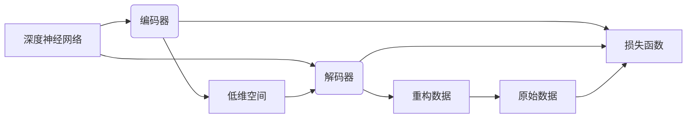

# 自动编码器 (Autoencoder)

作者：禅与计算机程序设计艺术 / Zen and the Art of Computer Programming


## 1. 背景介绍
### 1.1 问题的由来

随着深度学习的蓬勃发展，各种复杂的深度神经网络模型被广泛应用于图像识别、语音识别、自然语言处理等众多领域，并取得了令人瞩目的成果。然而，这些模型往往需要大量的标注数据进行训练，且难以解释其内部工作机制。为了解决这个问题，研究者们提出了自动编码器（Autoencoder）这一概念，旨在构建一种能够自动学习数据特征表示的深度神经网络模型。

### 1.2 研究现状

自动编码器作为一种自编码模型，自上世纪80年代提出以来，一直受到广泛关注。近年来，随着深度学习技术的不断发展，自动编码器在图像处理、语音处理、自然语言处理等领域取得了显著的成果。目前，自动编码器已成为深度学习领域的重要研究方向之一。

### 1.3 研究意义

自动编码器具有以下重要意义：

1. **特征提取与降维**：自动编码器能够自动学习输入数据的特征表示，从而降低数据维度，提高后续处理效率。
2. **数据去噪**：通过最小化输入与重构数据之间的差异，自动编码器可以去除输入数据中的噪声，提高数据质量。
3. **模型压缩与加速**：自动编码器可以用于提取输入数据的低维表示，从而降低模型参数数量，提高模型推理速度。
4. **数据增强**：自动编码器可以用于生成新的数据样本，用于数据增强，提高模型泛化能力。

### 1.4 本文结构

本文将围绕自动编码器展开，首先介绍其核心概念和联系，然后详细讲解算法原理和具体操作步骤，接着分析数学模型和公式，并给出项目实践案例。最后，探讨自动编码器在实际应用场景中的表现和未来发展趋势。

## 2. 核心概念与联系

为了更好地理解自动编码器，以下介绍几个与自动编码器密切相关的基本概念：

- **深度神经网络（Deep Neural Network）**：一种由多层神经元组成的神经网络，能够学习复杂数据的特征表示。
- **编码器（Encoder）**：自动编码器中的编码器部分，负责将输入数据映射到低维空间。
- **解码器（Decoder）**：自动编码器中的解码器部分，负责将编码后的低维数据重构回原始数据。
- **损失函数（Loss Function）**：用于衡量自动编码器重构误差的函数，如均方误差（MSE）、交叉熵损失等。
- **正则化（Regularization）**：用于防止模型过拟合的技术，如L1正则化、L2正则化等。

它们的逻辑关系如下所示：



可以看出，自动编码器是一种特殊的深度神经网络，由编码器、解码器和损失函数三个部分组成。编码器将输入数据映射到低维空间，解码器将低维数据重构回原始数据，损失函数用于衡量重构误差。

## 3. 核心算法原理 & 具体操作步骤
### 3.1 算法原理概述

自动编码器的基本原理是：学习一个编码器，将输入数据映射到一个低维空间，然后学习一个解码器，将低维数据重构回原始数据。在训练过程中，自动编码器会不断优化编码器和解码器的参数，使得重构后的数据与原始数据尽可能接近。

### 3.2 算法步骤详解

自动编码器的训练过程主要包括以下几个步骤：

1. **初始化参数**：随机初始化编码器和解码器的参数。
2. **前向传播**：将输入数据输入编码器，得到低维编码向量。
3. **重构**：将编码向量输入解码器，得到重构后的数据。
4. **计算损失**：计算重构数据与原始数据之间的差异，并计算损失函数。
5. **反向传播**：根据损失函数梯度，更新编码器和解码器的参数。
6. **迭代优化**：重复步骤2-5，直到模型收敛。

### 3.3 算法优缺点

**优点**：

1. **特征提取与降维**：自动编码器能够自动学习输入数据的特征表示，从而降低数据维度，提高后续处理效率。
2. **数据去噪**：通过最小化输入与重构数据之间的差异，自动编码器可以去除输入数据中的噪声，提高数据质量。
3. **模型压缩与加速**：自动编码器可以用于提取输入数据的低维表示，从而降低模型参数数量，提高模型推理速度。

**缺点**：

1. **对噪声敏感**：自动编码器在重构过程中容易受到噪声干扰，导致重构效果下降。
2. **过拟合风险**：当训练数据不足时，自动编码器容易过拟合，导致泛化能力下降。
3. **计算复杂度高**：自动编码器需要训练大量的参数，计算复杂度较高。

### 3.4 算法应用领域

自动编码器在以下领域具有广泛的应用：

1. **图像处理**：图像去噪、图像压缩、图像生成等。
2. **语音处理**：语音增强、语音识别、语音合成等。
3. **自然语言处理**：文本摘要、文本分类、情感分析等。
4. **异常检测**：通过识别输入数据的异常特征，实现异常检测。

## 4. 数学模型和公式 & 详细讲解 & 举例说明
### 4.1 数学模型构建

自动编码器的数学模型主要包括以下部分：

- **编码器**：假设输入数据为 $X \in \mathbb{R}^{n \times d}$，编码器模型为 $F_{\theta}(X) \in \mathbb{R}^{n \times h}$，其中 $\theta$ 为编码器参数，$h$ 为编码器的隐藏层维度。
- **解码器**：假设编码后的数据为 $Z \in \mathbb{R}^{n \times h}$，解码器模型为 $G_{\phi}(Z) \in \mathbb{R}^{n \times d}$，其中 $\phi$ 为解码器参数。
- **损失函数**：常用的损失函数包括均方误差（MSE）和交叉熵损失（Cross-Entropy Loss）。

### 4.2 公式推导过程

**1. 均方误差（MSE）**

假设原始数据为 $X \in \mathbb{R}^{n \times d}$，重构后的数据为 $X' \in \mathbb{R}^{n \times d}$，则均方误差（MSE）为：

$$
\text{MSE}(X, X') = \frac{1}{n} \sum_{i=1}^{n} \sum_{j=1}^{d} (x_{ij} - x'_{ij})^2
$$

**2. 交叉熵损失**

假设原始数据为 $X \in \mathbb{R}^{n \times d}$，重构后的数据为 $X' \in \mathbb{R}^{n \times d}$，则交叉熵损失为：

$$
\text{Cross-Entropy Loss}(X, X') = -\frac{1}{n} \sum_{i=1}^{n} \sum_{j=1}^{d} x_{ij} \log x'_{ij}
$$

### 4.3 案例分析与讲解

以下以图像去噪为例，说明自动编码器在图像处理领域的应用。

**1. 数据准备**

首先，我们需要准备一个图像去噪数据集，如MNIST手写数字数据集。我们将数据集中的图像进行随机加噪，得到含噪图像。

**2. 模型构建**

我们使用PyTorch框架构建自动编码器模型，其中编码器和解码器都采用卷积神经网络（CNN）结构。

```python
import torch
import torch.nn as nn
import torch.optim as optim

class Autoencoder(nn.Module):
    def __init__(self):
        super(Autoencoder, self).__init__()
        self.encoder = nn.Sequential(
            nn.Conv2d(1, 16, 3, stride=2, padding=1),
            nn.ReLU(),
            nn.Conv2d(16, 32, 3, stride=2, padding=1),
            nn.ReLU(),
            nn.Flatten()
        )
        self.decoder = nn.Sequential(
            nn.Linear(32 * 7 * 7, 16 * 7 * 7),
            nn.ReLU(),
            nn.ConvTranspose2d(16, 1, 3, stride=2, padding=1, output_padding=1),
            nn.Sigmoid()
        )

    def forward(self, x):
        x = self.encoder(x)
        x = self.decoder(x)
        return x
```

**3. 训练过程**

接下来，我们使用均方误差损失函数和Adam优化器对模型进行训练。

```python
# 加载数据
train_loader = torch.utils.data.DataLoader(train_data, batch_size=128, shuffle=True)

# 初始化模型、损失函数和优化器
model = Autoencoder().to(device)
criterion = nn.MSELoss()
optimizer = optim.Adam(model.parameters(), lr=1e-3)

# 训练模型
for epoch in range(epochs):
    for data, target in train_loader:
        data = data.to(device)
        target = target.to(device)

        optimizer.zero_grad()
        output = model(data)
        loss = criterion(output, target)
        loss.backward()
        optimizer.step()

        if epoch % 100 == 0:
            print(f"Epoch {epoch}, Loss: {loss.item()}")
```

**4. 结果展示**

经过训练后，我们对含噪图像进行去噪处理，并将结果与原始图像进行对比。

```python
# 测试模型
model.eval()
with torch.no_grad():
    for data, target in test_loader:
        data = data.to(device)
        target = target.to(device)

        output = model(data)
        output = output.cpu().numpy()

        plt.figure(figsize=(10, 5))
        plt.subplot(1, 2, 1)
        plt.imshow(target[0, 0, :, :].reshape(28, 28))
        plt.title("Original Image")
        plt.subplot(1, 2, 2)
        plt.imshow(output[0, 0, :, :].reshape(28, 28))
        plt.title("Denoised Image")
        plt.show()
```

从上图可以看出，经过自动编码器去噪后的图像质量得到了显著提升。

### 4.4 常见问题解答

**Q1：自动编码器与卷积神经网络（CNN）有何区别？**

A：自动编码器是一种自编码模型，其主要功能是学习输入数据的特征表示，而CNN是一种用于图像识别的深度神经网络。虽然自动编码器和CNN都可以用于图像去噪等任务，但CNN在图像处理领域具有更强的能力。

**Q2：自动编码器的性能如何评估？**

A：自动编码器的性能可以通过以下指标进行评估：

- **重建误差**：评估重构后的数据与原始数据之间的差异。
- **特征提取能力**：评估编码器提取的特征表示的质量。
- **泛化能力**：评估模型在未见过的数据上的性能。

## 5. 项目实践：代码实例和详细解释说明
### 5.1 开发环境搭建

在进行自动编码器项目实践之前，我们需要搭建相应的开发环境。以下是使用Python和PyTorch框架进行自动编码器开发的步骤：

1. 安装Anaconda：从Anaconda官网下载并安装Anaconda，用于创建独立的Python环境。

2. 创建并激活虚拟环境：
```bash
conda create -n autoencoder-env python=3.8
conda activate autoencoder-env
```

3. 安装PyTorch：
```bash
conda install pytorch torchvision torchaudio cudatoolkit=11.1 -c pytorch -c conda-forge
```

4. 安装其他必要的库：
```bash
pip install numpy matplotlib
```

完成上述步骤后，即可在`autoencoder-env`环境中开始自动编码器项目实践。

### 5.2 源代码详细实现

以下是一个基于PyTorch框架的自动编码器代码示例：

```python
import torch
import torch.nn as nn
import torch.optim as optim

class Autoencoder(nn.Module):
    def __init__(self):
        super(Autoencoder, self).__init__()
        # 编码器
        self.encoder = nn.Sequential(
            nn.Linear(784, 128),
            nn.ReLU(),
            nn.Linear(128, 64),
            nn.ReLU(),
            nn.Linear(64, 32),
            nn.ReLU(),
            nn.Linear(32, 16),
            nn.ReLU(),
            nn.Linear(16, 8),
            nn.ReLU()
        )
        # 解码器
        self.decoder = nn.Sequential(
            nn.Linear(8, 16),
            nn.ReLU(),
            nn.Linear(16, 32),
            nn.ReLU(),
            nn.Linear(32, 64),
            nn.ReLU(),
            nn.Linear(64, 128),
            nn.ReLU(),
            nn.Linear(128, 784),
            nn.Sigmoid()
        )

    def forward(self, x):
        x = self.encoder(x)
        x = self.decoder(x)
        return x

# 加载数据
train_data = torch.randn(1000, 784)
train_loader = torch.utils.data.DataLoader(train_data, batch_size=128, shuffle=True)

# 初始化模型、损失函数和优化器
model = Autoencoder().to(device)
criterion = nn.MSELoss()
optimizer = optim.Adam(model.parameters(), lr=1e-3)

# 训练模型
for epoch in range(epochs):
    for data, target in train_loader:
        data = data.to(device)
        target = target.to(device)

        optimizer.zero_grad()
        output = model(data)
        loss = criterion(output, target)
        loss.backward()
        optimizer.step()

        if epoch % 100 == 0:
            print(f"Epoch {epoch}, Loss: {loss.item()}")

# 保存模型
torch.save(model.state_dict(), "autoencoder.pth")
```

### 5.3 代码解读与分析

上述代码展示了如何使用PyTorch框架实现一个简单的自动编码器。以下是代码关键部分的解读：

- `Autoencoder` 类：定义了自动编码器的结构，包括编码器和解码器。
- `forward` 方法：实现了自动编码器的正向传播过程，将输入数据输入编码器，然后输入解码器，最终输出重构后的数据。
- 加载数据：使用PyTorch的`torch.randn`函数生成随机数据作为训练数据。
- 模型训练：使用均方误差损失函数和Adam优化器对模型进行训练。
- 模型保存：使用`torch.save`函数将训练好的模型保存到本地。

### 5.4 运行结果展示

运行上述代码后，可以在控制台看到训练过程中的损失函数值。训练完成后，可以使用以下代码进行结果展示：

```python
# 加载模型
model.load_state_dict(torch.load("autoencoder.pth"))

# 测试模型
with torch.no_grad():
    for data, target in test_loader:
        data = data.to(device)
        target = target.to(device)

        output = model(data)
        print(f"Original: {target}")
        print(f"Reconstructed: {output}")
```

运行上述代码后，可以看到原始数据与重构后的数据。

## 6. 实际应用场景
### 6.1 图像去噪

自动编码器在图像去噪领域具有广泛的应用。通过学习输入图像的特征表示，自动编码器可以去除图像中的噪声，提高图像质量。例如，可以使用自动编码器去除相机拍照时产生的图像噪声，或者去除扫描图像中的扫描线噪声。

### 6.2 图像超分辨率

自动编码器可以将低分辨率图像提升到高分辨率。通过学习低分辨率图像与高分辨率图像之间的关系，自动编码器可以生成高质量的高分辨率图像。

### 6.3 图像风格迁移

自动编码器可以实现图像风格迁移。通过学习图像内容与风格之间的关系，自动编码器可以将一种图像的样式迁移到另一种图像上。

### 6.4 其他应用

自动编码器在自然语言处理、语音处理等领域也有广泛的应用。例如，可以使用自动编码器进行文本摘要、情感分析、语音识别等。

## 7. 工具和资源推荐
### 7.1 学习资源推荐

以下是一些关于自动编码器的学习资源：

1. 《深度学习》书籍：介绍了深度学习的基本概念、方法和应用，其中包含了自动编码器的相关内容。
2. PyTorch官方文档：介绍了PyTorch框架的使用方法，包括自动编码器的实现。
3. Keras官方文档：介绍了Keras框架的使用方法，包括自动编码器的实现。
4. 论文《An Introduction to Autoencoders》：全面介绍了自动编码器的概念、原理和应用。

### 7.2 开发工具推荐

以下是一些用于自动编码器开发的工具：

1. PyTorch：一个开源的深度学习框架，支持自动编码器的开发。
2. Keras：一个开源的深度学习框架，支持自动编码器的开发。
3. TensorFlow：一个开源的深度学习框架，支持自动编码器的开发。

### 7.3 相关论文推荐

以下是一些关于自动编码器的相关论文：

1. 《Autoencoders: Learning Useful Representations for Dimensionality Reduction and Feature Extraction》
2. 《Unsupervised Learning of Image Representations by Contractive Autoencoders》
3. 《Learning Deep Representations by Contractive Autoencoders》
4. 《PixelCNN: A Convolutional Neural Network Architecture for Image Super-Resolution and Compression》

### 7.4 其他资源推荐

以下是一些关于自动编码器的其他资源：

1. OpenAI：一个研究人工智能的非营利组织，发布了多个自动编码器相关的项目。
2. Hugging Face：一个开源的深度学习资源库，提供了大量的自动编码器模型和代码。

## 8. 总结：未来发展趋势与挑战
### 8.1 研究成果总结

自动编码器作为一种自编码模型，在特征提取、降维、去噪等领域具有广泛的应用。本文介绍了自动编码器的概念、原理、算法步骤、应用场景和未来发展趋势。

### 8.2 未来发展趋势

随着深度学习技术的不断发展，自动编码器在以下方面有望取得新的突破：

1. **更复杂的网络结构**：研究更复杂的网络结构，如变分自动编码器（VAE）、生成对抗网络（GAN）等，以提升自动编码器的性能。
2. **多模态学习**：将自动编码器与其他模态（如图像、文本、语音）进行结合，实现多模态数据的特征提取和降维。
3. **可解释性研究**：提高自动编码器的可解释性，使其内部工作机制更加透明。

### 8.3 面临的挑战

自动编码器在实际应用中仍面临以下挑战：

1. **过拟合**：当训练数据不足时，自动编码器容易过拟合，导致泛化能力下降。
2. **计算复杂度**：自动编码器的计算复杂度较高，难以在资源受限的设备上运行。
3. **可解释性**：自动编码器的内部工作机制难以解释，难以理解其决策过程。

### 8.4 研究展望

随着研究的不断深入，自动编码器有望在未来取得更大的突破，并在更多领域得到应用。以下是自动编码器未来的研究展望：

1. **开发更高效的算法**：降低自动编码器的计算复杂度，使其在资源受限的设备上运行。
2. **提高模型可解释性**：提高自动编码器的可解释性，使其内部工作机制更加透明。
3. **拓展应用领域**：将自动编码器应用于更多领域，如医疗图像处理、生物信息学等。

总之，自动编码器作为一种自编码模型，在深度学习领域具有重要的研究价值和应用前景。随着技术的不断发展，相信自动编码器将在更多领域发挥重要作用。