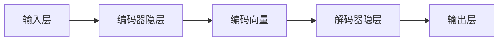

# 自编码器(Autoencoders) - 原理与代码实例讲解

关键词：自编码器, 无监督学习, 深度学习, 降维, 特征提取, 图像去噪, 异常检测

## 1. 背景介绍
### 1.1  问题的由来
在大数据时代,我们面临着海量高维数据的挑战。传统的机器学习算法在处理高维数据时往往会遇到"维度灾难"的问题,即随着维度的增加,计算复杂度呈指数级增长。如何从高维数据中学习到低维的信息表示,成为了机器学习和数据挖掘领域的一个重要课题。
### 1.2  研究现状
自编码器(Autoencoder)作为一种无监督学习算法,通过学习数据的压缩表示来实现降维和特征提取。自上世纪80年代提出以来,自编码器经历了从浅层到深层,从线性到非线性,从欠完备到过完备等一系列的发展和演进。近年来,随着深度学习的兴起,各种改进型自编码器如变分自编码器(VAE)、去噪自编码器(DAE)、稀疏自编码器(SAE)等被相继提出,并在图像、语音、自然语言处理等领域取得了广泛应用。
### 1.3  研究意义 
自编码器作为一种数据驱动的特征学习方法,可以自动从数据中学习到高层次、更加抽象的特征表示。与传统的人工设计特征不同,自编码器学习到的特征可以更好地刻画数据的内在结构和规律。同时,自编码器作为一种降维方法,可以将高维数据映射到低维空间,在一定程度上缓解维度灾难问题。此外,自编码器还可以用于数据去噪、数据生成、异常检测等多种任务。因此,深入研究自编码器的原理和应用,对于推动人工智能的发展具有重要意义。
### 1.4  本文结构
本文将从以下几个方面对自编码器进行详细阐述：第2部分介绍自编码器的核心概念；第3部分讲解自编码器的基本原理和算法步骤；第4部分给出自编码器的数学模型和公式推导过程；第5部分通过代码实例演示自编码器的具体实现；第6部分总结自编码器的实际应用场景；第7部分推荐自编码器相关的学习资源；第8部分对自编码器的研究现状进行总结,并展望其未来发展方向；第9部分列举了一些常见问题解答。

## 2. 核心概念与联系
自编码器本质上是一种特殊类型的前馈神经网络,由编码器(Encoder)和解码器(Decoder)两部分组成。其中,编码器将输入数据映射为低维的隐变量表示,解码器则将隐变量还原为与输入数据尺寸相同的输出。自编码器的目标是使还原后的输出与原始输入尽可能相似,通过这种方式来学习数据的压缩表示。

从结构上看,编码器和解码器可以是对称的,即它们具有相同的网络层数和节点数；也可以是非对称的,即编码器的网络规模小于解码器。一般来说,隐变量的维度小于输入数据的维度,这样自编码器就起到了降维的作用。但有时候,隐变量的维度也可以大于输入维度,这种过完备的自编码器主要用于特征学习而非降维。

自编码器可以看作是一种自监督学习,因为它不需要人工标注的数据,而是通过输入数据的重构来定义监督信号。但与一般的监督学习不同,自编码器的重点不在于输出的类别或数值,而在于学习输入数据的高阶特征表示。因此,自编码器学习到的特征可以用于后续的分类、聚类等任务。

自编码器与PCA等传统降维方法的主要区别在于：PCA是一种线性降维方法,只能刻画数据的线性结构；而自编码器通过引入非线性激活函数,可以学习到数据的非线性结构。此外,PCA是一种解析的特征提取方法,而自编码器是一种基于梯度下降的迭代优化方法。

总的来说,自编码器的核心思想是通过自我重构来学习数据的内在表示,其优势在于能够自动学习层次化的特征,可以刻画数据的非线性结构,具有较强的特征提取和降维能力。下图给出了自编码器的基本架构示意：

## 3. 核心算法原理 & 具体操作步骤
### 3.1  算法原理概述
自编码器的核心是通过无监督的方式学习输入数据的低维表示。具体来说,给定输入样本$x$,自编码器的目标是找到一个映射函数$f(x)$和逆映射函数$g(f(x))$,使得重构样本$g(f(x))$尽可能逼近原始样本$x$。其中,$f(x)$对应编码器,$g(f(x))$对应解码器。

自编码器的损失函数定义为重构误差,即原始输入和重构输出之间的差异。一般采用均方误差(MSE)或交叉熵作为重构误差的度量。以MSE为例,自编码器的优化目标可以表示为:

$$
\min_{f,g} \frac{1}{n} \sum_{i=1}^n ||x^{(i)} - g(f(x^{(i)}))||^2
$$

其中,$x^{(i)}$表示第$i$个输入样本,$n$为样本总数。

为了防止自编码器学习到一个平凡的恒等映射,即$g(f(x))=x$,需要对自编码器施加一定的约束和正则化。常见的约束方式包括:

- 欠完备:将隐变量的维度设置为小于输入维度,迫使自编码器学习到数据的压缩表示。
- 稀疏性:在隐层引入稀疏正则项,使得隐层节点趋向于被稀疏激活,从而学习到更加紧凑的特征表示。 
- 噪声:在输入数据中加入噪声,训练自编码器去除噪声,提高自编码器的鲁棒性。
- 约束:对重构误差以外的信息施加约束,如迫使隐变量服从某种先验分布等。

### 3.2  算法步骤详解
自编码器的训练过程可以分为以下几个步骤:

1. 构建编码器和解码器网络。根据任务需求设置网络的层数、每层节点数以及激活函数。一般使用对称结构,即编码器和解码器的结构相同。
2. 初始化模型参数。一般采用Xavier初始化或者He初始化的方式随机初始化编码器和解码器的权重矩阵及偏置向量。
3. 数据预处理。对输入数据进行归一化、标准化等预处理操作,使其分布在合适的范围内。如果需要加入噪声,可以在这一步对输入数据添加噪声。
4. 前向传播。将输入数据$x$传入编码器,计算隐变量$h=f(x)$。再将隐变量传入解码器,计算重构输出$\hat{x}=g(h)$。
5. 计算重构误差。将原始输入$x$与重构输出$\hat{x}$进行比较,计算重构误差$L(x,\hat{x})$。
6. 反向传播。根据重构误差计算损失函数对各参数的梯度,并利用优化算法(如Adam)更新编码器和解码器的参数。重复第4-6步,直到重构误差收敛或达到预设的迭代次数。
7. 微调与应用。训练完成后,可以利用编码器提取数据的低维特征表示,用于后续的分类、聚类等任务。如有需要,也可以对编码器进行微调,使其更适应具体任务。

### 3.3  算法优缺点
自编码器的主要优点包括:
- 无监督学习,不需要人工标注数据
- 可以学习数据的层次化特征表示
- 具有非线性降维和特征提取能力
- 模型灵活,可以加入各种约束和正则项

自编码器的缺点包括: 
- 对数据的分布和质量比较敏感
- 训练时间较长,调参较为困难  
- 解释性不强,学习到的特征不够直观
- 容易过拟合,泛化能力有待提高

### 3.4  算法应用领域
自编码器在很多领域都有广泛应用,主要包括:
- 数据降维与可视化:利用自编码器将高维数据映射到二维或三维空间进行可视化分析
- 特征学习:利用自编码器学习数据的高阶特征,用于后续的分类、聚类等任务 
- 图像去噪与修复:训练自编码器对含噪或残缺的图像数据进行去噪和修复
- 异常检测:训练自编码器重构正常数据,当重构误差超过阈值时判定为异常
- 数据生成:训练自编码器生成与训练数据分布相近的新样本数据
- 跨模态学习:利用自编码器在不同模态(如图像和文本)之间建立联系,实现跨模态检索、生成等任务

## 4. 数学模型和公式 & 详细讲解 & 举例说明
### 4.1  数学模型构建
给定输入样本$\boldsymbol{x} \in \mathbb{R}^d$,自编码器的数学模型可以表示为:

$$
\begin{aligned}
\boldsymbol{h} &= f(\boldsymbol{x}) = s_f(\boldsymbol{W}_1\boldsymbol{x} + \boldsymbol{b}_1) \\
\boldsymbol{\hat{x}} &= g(\boldsymbol{h}) = s_g(\boldsymbol{W}_2\boldsymbol{h} + \boldsymbol{b}_2)
\end{aligned}
$$

其中,$\boldsymbol{h} \in \mathbb{R}^m$为隐变量,$\boldsymbol{\hat{x}} \in \mathbb{R}^d$为重构输出。$\boldsymbol{W}_1 \in \mathbb{R}^{m \times d}$和$\boldsymbol{b}_1 \in \mathbb{R}^m$分别为编码器的权重矩阵和偏置向量,$\boldsymbol{W}_2 \in \mathbb{R}^{d \times m}$和$\boldsymbol{b}_2 \in \mathbb{R}^d$分别为解码器的权重矩阵和偏置向量。$s_f$和$s_g$为编码器和解码器的激活函数,常用的有sigmoid、tanh、ReLU等。

自编码器的目标是最小化重构误差,以均方误差为例,其损失函数为:

$$
J(\boldsymbol{W}_1, \boldsymbol{b}_1, \boldsymbol{W}_2, \boldsymbol{b}_2) = \frac{1}{n} \sum_{i=1}^n ||\boldsymbol{x}^{(i)} - \boldsymbol{\hat{x}}^{(i)}||^2
$$

其中,$\boldsymbol{x}^{(i)}$和$\boldsymbol{\hat{x}}^{(i)}$分别表示第$i$个样本的输入和重构输出。

为了学习更加鲁棒的特征表示,可以在损失函数中加入正则项:

$$
J(\boldsymbol{W}_1, \boldsymbol{b}_1, \boldsymbol{W}_2, \boldsymbol{b}_2) = \frac{1}{n} \sum_{i=1}^n ||\boldsymbol{x}^{(i)} - \boldsymbol{\hat{x}}^{(i)}||^2 + \lambda \cdot R(\boldsymbol{h})
$$

其中,$R(\boldsymbol{h})$为正则项,$\lambda$为平衡因子。常用的正则项有L1范数、L2范数、KL散度等,用于控制隐变量的稀疏性、平滑性等属性。

### 4.2  公式推导过程
以单隐层自编码器为例,对其前向传播和反向传播过程进行推导。

前向传播:
$$
\begin{aligned}
\boldsymbol{h} &= s_f(\boldsymbol{W}_1\boldsymbol{x} + \boldsymbol{b}_1) \\
\boldsymbol{\hat{x}} &= s_g(\boldsymbol{W}_2\boldsymbol{h} + \