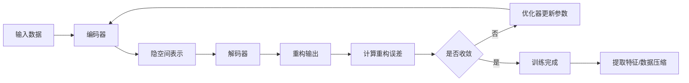

# 自编码器原理与代码实战案例讲解

关键词：自编码器、无监督学习、数据压缩、降维、特征提取、神经网络

## 1. 背景介绍
### 1.1 问题的由来
在大数据时代,我们面临着海量高维数据的处理和分析问题。传统的数据处理方法在应对高维数据时往往力不从心。如何从高维数据中学习到数据的本质特征,去除冗余信息,实现数据压缩和降维,是机器学习和数据挖掘领域的一个重要课题。
### 1.2 研究现状
自编码器(Autoencoder)作为一种无监督学习算法,通过数据重构的方式来学习数据的内在特征和结构,在数据压缩、降维、特征提取等任务中展现出色的性能。近年来,自编码器及其变体被广泛应用于计算机视觉、自然语言处理、语音识别等领域,取得了显著的研究成果。
### 1.3 研究意义 
深入理解自编码器的原理,掌握其算法实现,对于我们利用好这一强大的工具,挖掘数据价值,解决实际问题具有重要意义。同时,自编码器思想启发我们从数据重构的角度思考问题,对于创新算法设计和模型优化具有一定的借鉴意义。
### 1.4 本文结构
本文将从以下几个方面对自编码器进行详细阐述：首先介绍自编码器的核心概念和数学原理；然后讲解自编码器的网络结构和学习算法；接着通过实例代码演示自编码器的具体实现；最后总结自编码器的应用场景,并展望其未来的研究方向。

## 2. 核心概念与联系
自编码器本质上是一种特殊的前馈神经网络,由编码器(Encoder)和解码器(Decoder)两部分组成。其核心思想是通过网络将输入数据编码为低维特征表示,再由特征重构出原始数据。通过优化重构误差,使得编码器能够提取数据的本质特征。  

自编码器可以看作是一种有损压缩过程,压缩和解压缩通过神经网络实现。其与传统降维方法如PCA的联系和区别在于:  
- 传统方法多为线性变换,而自编码器可以通过非线性激活函数学习复杂的非线性变换。
- 传统方法侧重于保持数据的原有结构,如最大可分性、最小均方误差等,而自编码器通过重构误差来学习数据的内在规律。
- 自编码器具有更好的表达能力和灵活性,可以根据具体任务设计网络结构。

自编码器与其他无监督学习算法如限制玻尔兹曼机、生成对抗网络等也有密切联系,它们都通过学习数据分布来挖掘数据的内在规律和特征。

## 3. 核心算法原理 & 具体操作步骤
### 3.1 算法原理概述
自编码器由编码器和解码器两部分组成,形成一个对称的沙漏型结构。前半部分为编码器,将输入数据 $x$ 映射为隐空间表示 $z$（一般为低维）；后半部分为解码器,将 $z$ 重构为 $\hat{x}$,使其尽可能逼近原输入 $x$。

编码器和解码器一般采用多层神经网络实现,公式如下：

$$
\begin{aligned}
Encoder: z &= f(Wx+b) \\
Decoder: \hat{x} &= g(W'z+b') 
\end{aligned}
$$

其中 $f$ 和 $g$ 为激活函数,如 sigmoid、tanh、ReLU 等。$W,b$ 为网络参数,通过最小化重构误差进行优化学习：

$$
\mathop{\arg\min}\limits_{W,b} \mathcal{L}(x, \hat{x}) = \mathop{\arg\min}\limits_{W,b} \|x - \hat{x}\|^2
$$

即最小化输入 $x$ 与重构输出 $\hat{x}$ 的均方误差。

### 3.2 算法步骤详解
自编码器的训练过程可分为以下步骤：
1. 构建编码器和解码器网络,设定网络层数和神经元数目。一般编码器层数逐渐减少,解码器对称增加。
2. 初始化网络参数 $W$ 和 $b$,采用 Xavier 或 He 初始化方法。
3. 选择优化算法,计算重构误差关于参数的梯度。一般采用 SGD、Adam 等优化器。  
4. 迭代优化参数,直到重构误差收敛或达到预设的epochs。
5. 训练完成后,可使用编码器部分提取数据特征,或用整个网络进行数据压缩和复原。

以下是基于 Python 和 Tensorflow 2.0 实现的一个简单的自编码器训练流程图：



### 3.3 算法优缺点
自编码器相比传统降维方法的优点在于:
- 可以学习非线性变换,提取更加抽象和高级的特征。
- 模型灵活,可以根据任务需求设计不同的网络结构。
- 可以用于数据降噪,通过重构误差可以过滤数据中的噪声。

但是,自编码器也存在一些局限性：
- 模型训练需要大量数据和计算资源,训练时间较长。
- 容易过拟合,需要采用正则化手段如L1/L2正则化、Dropout等。
- 对参数初始化和优化算法敏感,需要进行反复调参。
- 学习到的特征可解释性不强,一般需要进行后续分析。

### 3.4 算法应用领域
自编码器在很多领域都有广泛应用,如：
- 计算机视觉：图像压缩、去噪、超分辨率重构、语义分割等。
- 自然语言处理：词向量压缩、文本生成、机器翻译等。
- 语音识别：语音降噪、说话人识别、语音合成等。
- 推荐系统：用户行为特征提取,构建用户画像。
- 异常检测：通过重构误差检测样本是否异常。

此外,自编码器还可以作为其他任务的预训练模型,如分类、聚类等,通过自编码器学习数据的高阶特征,再用于下游任务,可以提升模型性能。

## 4. 数学模型和公式 & 详细讲解 & 举例说明
### 4.1 数学模型构建
自编码器可以表示为如下数学模型：

给定训练集 $D = \{x^{(1)}, x^{(2)}, \cdots, x^{(m)}\}$,其中 $x^{(i)} \in \mathbb{R}^n$,自编码器的目标是学习一个编码函数 $f(x)$ 和解码函数 $g(z)$,使得:

$$
\begin{aligned}
z &= f(x) = \sigma(Wx+b) \\
\hat{x} &= g(z) = \sigma(W'z+b') 
\end{aligned}
$$

其中 $\sigma$ 为激活函数,$W,b$ 为权重矩阵和偏置向量。$f$ 和 $g$ 可以为多层网络。

自编码器的优化目标为最小化重构误差:

$$
\mathcal{L}(x, \hat{x}) = \frac{1}{m} \sum_{i=1}^m \|x^{(i)} - \hat{x}^{(i)}\|^2
$$

即最小化原始输入 $x$ 与重构输出 $\hat{x}$ 的均方误差。

### 4.2 公式推导过程
对于单个样本 $x$,其重构误差为:

$$
\mathcal{L}(x, \hat{x}) = \|x - \hat{x}\|^2 = \|x - g(f(x))\|^2
$$

对于整个训练集,重构误差为:

$$
\mathcal{J}(W,b) = \frac{1}{m} \sum_{i=1}^m \|x^{(i)} - g(f(x^{(i)}))\|^2
$$

我们需要求解损失函数 $\mathcal{J}$ 关于参数 $W,b$ 的梯度,并用梯度下降法进行优化。

假设编码器和解码器都是单层网络,激活函数为 $\sigma$,则损失函数的梯度为:

$$
\begin{aligned}
\frac{\partial \mathcal{J}}{\partial W'} &= \frac{1}{m} \sum_{i=1}^m (g(z^{(i)}) - x^{(i)}) \cdot \sigma'(z^{(i)})^T \\
\frac{\partial \mathcal{J}}{\partial b'} &= \frac{1}{m} \sum_{i=1}^m (g(z^{(i)}) - x^{(i)}) \cdot \sigma'(z^{(i)}) \\
\frac{\partial \mathcal{J}}{\partial W} &= \frac{1}{m} \sum_{i=1}^m W'^T(g(z^{(i)}) - x^{(i)}) \cdot \sigma'(z^{(i)}) \cdot x^{(i)T}\\
\frac{\partial \mathcal{J}}{\partial b} &= \frac{1}{m} \sum_{i=1}^m W'^T(g(z^{(i)}) - x^{(i)}) \cdot \sigma'(z^{(i)})
\end{aligned}
$$

其中 $\sigma'$ 为激活函数的导数。将梯度代入优化器中进行迭代更新,即可得到自编码器的最优参数。

### 4.3 案例分析与讲解
下面我们以 MNIST 手写数字数据集为例,演示如何用自编码器进行图像压缩和复原。

MNIST 数据集由 0~9 十个手写数字组成,每张图片大小为 28x28,可以展开为 784 维向量。我们构建一个自编码器,将图片压缩为 64 维,再还原为原始的 784 维。

网络结构如下:
- 编码器：Input(784) -> Dense(128) -> ReLU -> Dense(64)
- 解码器：Input(64) -> Dense(128) -> ReLU -> Dense(784) -> Sigmoid

损失函数为二元交叉熵,优化器为 Adam,学习率为 0.001,批大小为 128,训练 50 个 epoch。

训练完成后,我们可以可视化部分测试图片的重构效果:


可以看到,自编码器在保留图片主要特征的同时,将图片压缩到了更低的维度。我们还可以提取编码器的输出作为图片的特征,用于其他下游任务。

### 4.4 常见问题解答
1. 问：自编码器学习到的特征有什么物理意义吗？
   答：自编码器学习到的特征一般是数据的高阶抽象,没有明确的物理意义,需要通过可视化或后续分析来解释。但是特征蕴含了数据的内在结构和规律。
2. 问：自编码器的隐藏层维度如何设置？
   答：隐藏层维度一般根据任务需求和经验设置。如果目的是数据压缩,则设置为小于输入维度；如果是特征提取,则可以设置得更高。需要通过实验调整。
3. 问：自编码器可以处理什么类型的数据？   
   答：自编码器可以处理连续型数值数据,包括图像、音频、文本向量化等。对于离散型数据如文本,需要先进行向量化如 one-hot 编码。
4. 问：自编码器是否可以用于监督学习？
   答：自编码器本质上是无监督学习,但是可以用于监督学习的预训练。通过自编码器学习数据的高阶特征,再用于分类、回归等任务,可以加速模型收敛和提高性能。

## 5. 项目实践：代码实例和详细解释说明
### 5.1 开发环境搭建
本项目使用 Python 3 和 Tensorflow 2.0 进行开发,需要安装以下依赖库：
- tensorflow==2.0
- numpy
- matplotlib

可以使用 pip 进行安装：

```bash
pip install tensorflow numpy matplotlib
```

### 5.2 源代码详细实现
下面是自编码器模