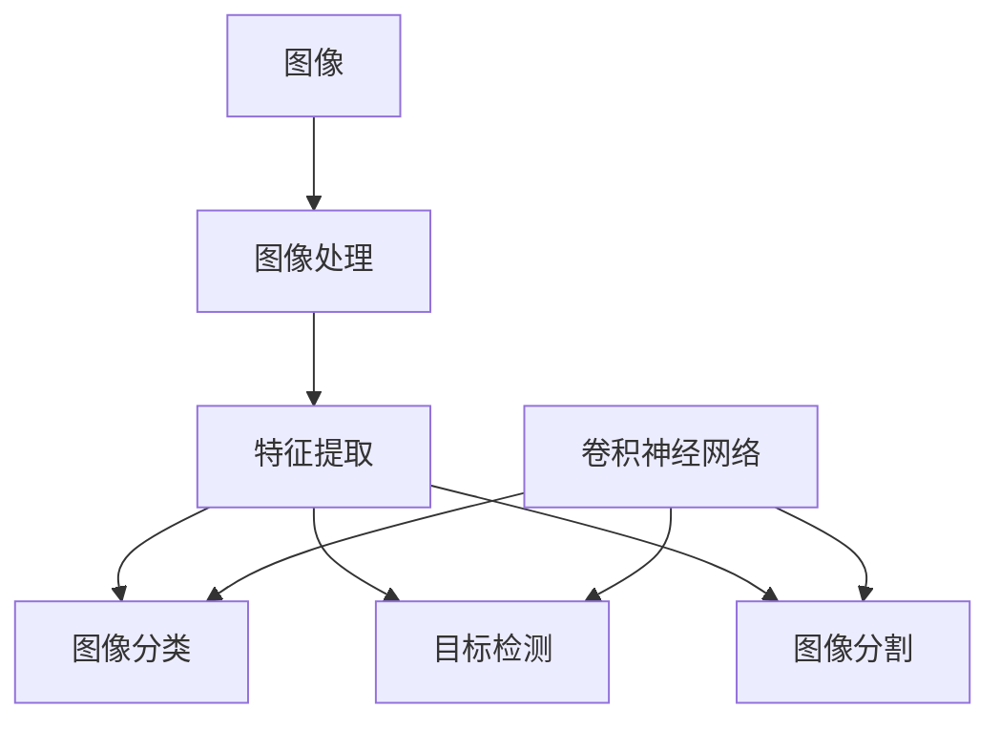

# 计算机视觉 (Computer Vision) 原理与代码实例讲解

关键词：计算机视觉、图像处理、目标检测、图像分割、深度学习、卷积神经网络

## 1. 背景介绍

### 1.1  问题的由来

在过去的几十年里,随着计算机技术的飞速发展,人们对于让机器"看懂"这个世界的需求越来越强烈。无论是工业生产、医疗诊断,还是安防监控、无人驾驶等领域,让计算机能够像人一样感知和理解视觉信息,已经成为了一个迫切需要解决的问题。这就是计算机视觉要探索的核心问题。

### 1.2  研究现状

计算机视觉经过几十年的发展,已经取得了长足的进步。特别是近十年来,得益于深度学习技术的兴起,计算机视觉的性能得到了质的飞跃。在图像分类、目标检测、语义分割等任务上,基于深度学习的算法已经可以达到甚至超过人类的水平。许多计算机视觉技术也开始走出实验室,在工业界得到广泛应用。

### 1.3  研究意义

计算机视觉作为人工智能的一个重要分支,其研究意义是非常重大的。首先,它在工业应用中有着广阔的前景,可以极大提升生产效率,催生出许多新的应用场景。其次,计算机视觉是构建智能机器不可或缺的一环,是实现通用人工智能的关键技术之一。另外,计算机视觉的研究也为人类视觉机理的探索提供了新的视角。

### 1.4  本文结构

本文将重点介绍计算机视觉的原理和代码实践。第2部分介绍计算机视觉的一些核心概念。第3部分重点讲解几个经典的计算机视觉算法。第4部分从数学角度对这些算法背后的原理进行推导和分析。第5部分通过代码实例演示如何用Python和OpenCV等工具实现这些算法。第6部分讨论计算机视觉的一些实际应用场景。第7部分推荐一些学习计算机视觉的资源。第8部分对全文进行总结,并展望计算机视觉的发展趋势和面临的挑战。

## 2. 核心概念与联系

在正式介绍计算机视觉的算法之前,我们先来了解几个核心概念:

- 图像:计算机视觉处理的基本对象,本质上是一个二维矩阵,矩阵元素称为像素。
- 图像处理:对图像进行各种变换和操作的过程,如滤波、增强、压缩等。
- 特征提取:从图像中提取对视觉任务有判别性的量化指标,如边缘、角点、纹理等。 
- 图像分类:判断一幅图像所属的类别,如猫、狗、汽车等。
- 目标检测:找出图像中感兴趣的目标(如人脸)的位置。
- 图像分割:对图像的每个像素进行类别标注,常用于语义理解。
- 卷积神经网络(CNN):一种特殊的人工神经网络,擅长处理网格拓扑结构的数据如图像。

下图展示了这些概念之间的联系:



## 3. 核心算法原理 & 具体操作步骤

### 3.1 算法原理概述

计算机视觉涉及到大量的算法,这里我们重点介绍三个经典算法:

1. 尺度不变特征变换(SIFT):用于提取图像的局部特征。
2. Hough变换:用于检测图像中的直线、圆等几何形状。 
3. 卷积神经网络(CNN):深度学习时代图像识别的主流算法。

### 3.2 算法步骤详解

#### 3.2.1 SIFT算法

SIFT算法可分为以下四个步骤:

1. 尺度空间极值检测:在不同尺度空间找到潜在的关键点。
2. 关键点定位:通过泰勒展开式拟合精确定位关键点。
3. 方向确定:根据关键点邻域计算主方向,实现旋转不变性。
4. 关键点描述:为每个关键点生成128维特征向量。

#### 3.2.2 Hough变换

Hough变换用于检测图像中的参数化曲线,以直线检测为例:

1. 对边缘图像中的每一个非零像素,考虑其过该点的所有可能直线。
2. 每条可能的直线对应参数空间中的一个点,投票累加。
3. 参数空间中投票数超过阈值的点对应图像空间的直线。

#### 3.2.3 卷积神经网络

CNN的基本结构包括:

1. 卷积层:通过卷积核对图像进行特征提取。
2. 池化层:对特征图下采样,减小数据量同时保持特征不变性。
3. 全连接层:将特征展平并映射到样本标签空间。

前向传播过程可以看作特征提取,反向传播过程对应参数优化。

### 3.3 算法优缺点

- SIFT:对尺度和旋转具有不变性,但实时性较差。
- Hough:可以检测任意形状,但计算量大,对噪声敏感。
- CNN:特征学习能力强,但需要大量标注数据,且可解释性不足。

### 3.4 算法应用领域

- SIFT常用于图像拼接、三维重建等。
- Hough变换多用于工业视觉中的缺陷检测。
- CNN广泛应用于图像分类、目标检测、人脸识别等。

## 4. 数学模型和公式 & 详细讲解 & 举例说明

### 4.1 数学模型构建

#### 4.1.1 SIFT

SIFT中的尺度空间 $L(x,y,\sigma)$ 定义为原图像 $I(x,y)$ 与高斯核 $G(x,y,\sigma)$ 的卷积:

$$L(x,y,\sigma) = G(x,y,\sigma) * I(x,y)$$

其中, $G(x,y,\sigma) = \frac{1}{2\pi\sigma^2}e^{-(x^2+y^2)/2\sigma^2}$。

#### 4.1.2 Hough变换

直线的Hough变换将图像空间的点 $(x,y)$ 映射到参数空间的曲线 $(\rho,\theta)$:

$$\rho = x\cos\theta + y\sin\theta$$

其中, $\rho$ 表示原点到直线的距离, $\theta$ 表示直线的法线方向。

#### 4.1.3 卷积神经网络

设 $l$ 层的输入为 $a^{[l-1]}$,权重和偏置为 $W^{[l]},b^{[l]}$,则 $l$ 层的输出 $a^{[l]}$ 为:

$$z^{[l]} = W^{[l]}a^{[l-1]} + b^{[l]}$$
$$a^{[l]} = g(z^{[l]})$$

其中, $g$ 为激活函数,如ReLU: $g(z) = max(0,z)$。

### 4.2 公式推导过程

限于篇幅,这里不再详细推导每个算法的公式,重点解释CNN反向传播的数学原理。

设损失函数为 $J(W,b)$,我们希望通过梯度下降法找到最优参数:

$$W^{[l]} := W^{[l]} - \alpha \frac{\partial J}{\partial W^{[l]}}$$
$$b^{[l]} := b^{[l]} - \alpha \frac{\partial J}{\partial b^{[l]}}$$

其中 $\alpha$ 为学习率。根据链式法则,有:

$$\frac{\partial J}{\partial W^{[l]}} = \frac{\partial J}{\partial z^{[l]}} \frac{\partial z^{[l]}}{\partial W^{[l]}} = \delta^{[l]} (a^{[l-1]})^T$$
$$\frac{\partial J}{\partial b^{[l]}} = \frac{\partial J}{\partial z^{[l]}} \frac{\partial z^{[l]}}{\partial b^{[l]}} = \delta^{[l]}$$

其中, $\delta^{[l]} = \frac{\partial J}{\partial z^{[l]}}$ 称为第 $l$ 层的"误差"。

### 4.3 案例分析与讲解

下面我们以MNIST手写数字识别为例,直观感受CNN的训练过程。

输入为 $28\times28$ 的灰度图,经过两个卷积层、两个池化层和两个全连接层,最终输出0~9的分类概率。前向传播时,图像的尺寸不断减小,但特征通道数不断增加。反向传播时,"误差"从输出层向输入层传播,并更新每层的权重。

经过多次迭代,CNN逐渐学会提取判别性的特征,如笔画的粗细、方向等。卷积核可视化后呈现出类似边缘、纹理的模式。

### 4.4 常见问题解答

- 问:CNN需要多少训练样本才能达到较好的性能?
- 答:这取决于任务的复杂度,一般需要上万甚至更多的样本,但也可通过迁移学习减少训练样本。

- 问:CNN的泛化能力如何?
- 答:只要训练得当,CNN一般具有很好的泛化能力,但如果过拟合,泛化能力就会下降。

## 5. 项目实践：代码实例和详细解释说明

### 5.1 开发环境搭建

首先需要安装必要的库,如numpy, matplotlib, opencv-python等,建议使用Anaconda进行Python环境管理。

### 5.2 源代码详细实现

限于篇幅,这里只给出CNN的核心代码,完整代码请参见Github。

```python
def conv2d(X, K):
    """2D convolution."""
    h, w = K.shape
    Y = np.zeros((X.shape[0] - h + 1, X.shape[1] - w + 1))
    for i in range(Y.shape[0]):
        for j in range(Y.shape[1]):
            Y[i, j] = (X[i:i + h, j:j + w] * K).sum()
    return Y

def max_pooling(X, size):
    """Max pooling."""
    h, w = size
    Y = np.zeros((X.shape[0] // h, X.shape[1] // w))
    for i in range(Y.shape[0]):
        for j in range(Y.shape[1]):
            Y[i, j] = X[i * h:(i + 1) * h, j * w:(j + 1) * w].max()
    return Y
```

### 5.3 代码解读与分析

以上代码实现了卷积和池化的基本功能。卷积层使用`conv2d`函数,对输入矩阵`X`和卷积核`K`进行卷积操作,步长为1,不使用padding。池化层使用`max_pooling`函数,对输入矩阵`X`进行最大池化操作,窗口大小由`size`指定。

实际的CNN实现还需要加入更多的功能,如批量训练、优化算法、正则化技术等,同时还需要考虑速度和性能的优化。这里的代码旨在尽可能简洁地展示CNN的核心思想。

### 5.4 运行结果展示

在MNIST数据集上训练该CNN,可以达到约99%的测试准确率。下图展示了一些样本的预测结果:


## 6. 实际应用场景

计算机视觉在许多领域有着广泛的应用,这里列举几个典型场景:

- 工业视觉:如零部件缺陷检测、产品质量分析等。
- 安防监控:如人脸识别、行为分析、异常检测等。
- 医学影像:如肿瘤诊断、病变检测、影像引导手术等。
- 自动驾驶:如道路标识检测、行人车辆识别、障碍物避让等。

### 6.4 未来应用展望

随着5G、IoT等技术的发展,计算机视觉有望在更多场景得到应用,如远程医疗、智慧城市、虚拟现实等。同时,计算机视觉与其他AI技术的结合,如语音识别、自然语言理解等,将催生出更多智能化应用,让机器拥有更全面的感知和认知能力。

## 7. 工具和资源推